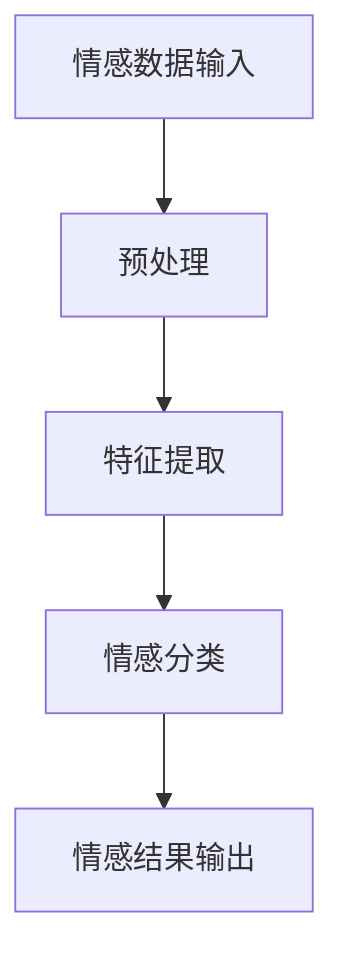
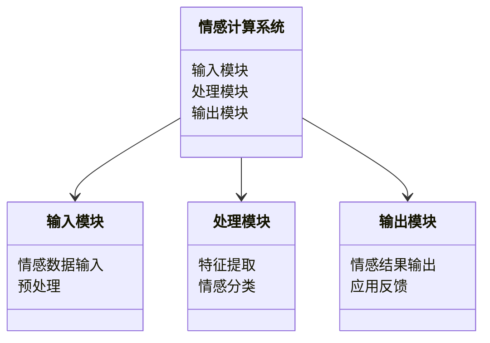
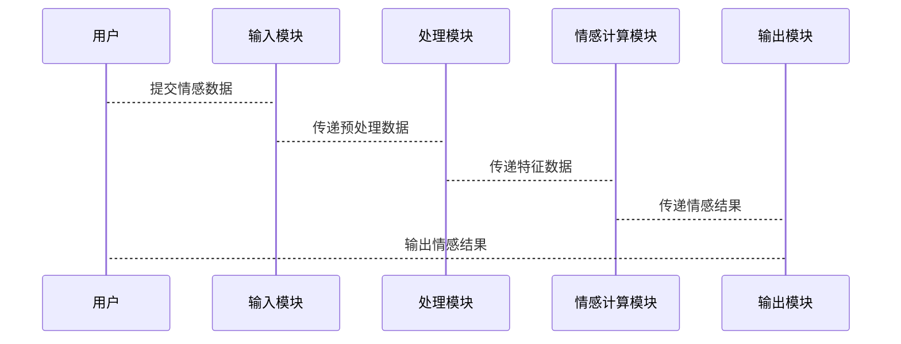

                 


# AI Agent的情感计算与应用

> 关键词：AI Agent, 情感计算, 情感分析, 深度学习, 系统架构

> 摘要：本文详细探讨了AI Agent中情感计算的核心概念、算法原理及实际应用。从情感计算的定义到AI Agent的情感处理流程，从基于规则的算法到深度学习模型，再到系统的架构设计和项目实战，全面解析情感计算在AI Agent中的重要作用及其在实际场景中的应用。

---

# 第1章: AI Agent与情感计算的背景与基础

## 1.1 情感计算的定义与背景

### 1.1.1 情感计算的定义

情感计算（Affective Computing）是人工智能领域的一个重要分支，旨在通过计算机技术来识别、理解、分析和处理人类情感。它不仅关注情感的识别，还包括情感的生成和应用。情感计算的核心目标是让计算机能够像人类一样理解和响应情感信息。

### 1.1.2 情感计算的研究背景

随着人工智能技术的快速发展，情感计算逐渐成为研究热点。人类情感的复杂性和多样性使得情感计算成为一个具有挑战性的领域。然而，情感计算在医疗、教育、娱乐、人机交互等领域具有广泛的应用潜力。

### 1.1.3 情感计算的应用领域

情感计算的应用领域包括但不限于：
- **医疗领域**：用于情感障碍的诊断和治疗。
- **教育领域**：用于学生情绪的监测和学习效果的提升。
- **娱乐领域**：用于游戏、虚拟人物的情感互动。
- **人机交互领域**：用于提升用户体验和个性化服务。

---

## 1.2 AI Agent的基本概念

### 1.2.1 AI Agent的定义

AI Agent（人工智能代理）是一种能够感知环境、自主决策并执行任务的智能实体。它能够通过传感器获取信息，利用计算模型进行分析，并通过执行器与环境交互。

### 1.2.2 AI Agent的核心特征

AI Agent的核心特征包括：
1. **自主性**：能够在没有外部干预的情况下独立运作。
2. **反应性**：能够实时感知环境并做出响应。
3. **目标导向性**：具有明确的目标，并能够采取行动以实现目标。
4. **学习能力**：能够通过经验改进自身的性能。

### 1.2.3 AI Agent与传统程序的区别

AI Agent与传统程序的主要区别在于：
- AI Agent具有自主性和目标导向性，而传统程序通常是被动执行任务。
- AI Agent能够感知和适应环境，而传统程序通常是静态的。

---

## 1.3 情感计算与AI Agent的结合

### 1.3.1 情感计算在AI Agent中的作用

情感计算在AI Agent中的作用主要体现在以下几个方面：
1. **情感识别**：通过分析用户的情感信息，帮助AI Agent更好地理解用户的需求。
2. **情感生成**：AI Agent可以根据任务需求生成适当的情感表达，提升用户体验。
3. **情感反馈**：通过情感反馈机制，AI Agent可以优化自身的决策过程。

### 1.3.2 AI Agent情感计算的应用场景

AI Agent情感计算的应用场景包括：
- **智能客服**：通过情感计算理解用户情绪，提供更优质的服务。
- **虚拟助手**：通过情感计算提升用户的交互体验。
- **情感陪护机器人**：通过情感计算实现与用户的深度情感互动。

### 1.3.3 情感计算对AI Agent性能的提升

情感计算的引入可以显著提升AI Agent的性能：
- 提高用户满意度：通过情感分析优化用户体验。
- 提升任务执行效率：通过情感反馈优化AI Agent的决策过程。
- 增强AI Agent的智能化水平：通过情感计算实现更复杂的情感交互。

---

## 1.4 本章小结

本章主要介绍了情感计算和AI Agent的基本概念，并探讨了情感计算在AI Agent中的作用及其应用场景。情感计算的引入使得AI Agent能够更好地理解和处理人类情感信息，从而提升其智能化水平和用户体验。

---

# 第2章: 情感计算的核心概念与算法原理

## 2.1 情感计算的核心概念

### 2.1.1 情感特征的提取

情感特征提取是情感计算的关键步骤之一。常见的情感特征提取方法包括：
1. **文本特征提取**：通过分析文本中的关键词、句式结构等提取情感特征。
2. **语音特征提取**：通过分析语音的音调、语速等特征提取情感信息。
3. **面部表情特征提取**：通过分析面部表情特征提取情感信息。

### 2.1.2 情感计算的数学模型

情感计算的数学模型可以通过以下方式表示：
$$
\text{情感值} = f(\text{情感特征})
$$
其中，$f$ 是一个函数，用于将情感特征映射到情感值。

### 2.1.3 情感计算的分类模型

情感计算的分类模型可以分为两类：
1. **基于规则的分类模型**：通过预定义的规则进行情感分类。
2. **基于机器学习的分类模型**：通过训练数据学习情感分类规则。

---

## 2.2 AI Agent中的情感处理流程

### 2.2.1 情感数据的输入与预处理

情感数据的输入可以是文本、语音或面部表情等。预处理步骤通常包括：
1. **数据清洗**：去除噪声数据。
2. **数据标准化**：将数据转换为统一的格式。

### 2.2.2 情感特征的提取与分析

情感特征的提取与分析可以通过以下步骤完成：
1. **特征提取**：提取情感相关特征。
2. **特征分析**：对提取的特征进行分析，识别情感类别。

### 2.2.3 情感结果的输出与应用

情感结果的输出可以用于优化AI Agent的行为，例如：
- 调整对话策略。
- 个性化推荐。

---

## 2.3 情感计算与AI Agent的关系图（Mermaid流程图）



---

## 2.4 本章小结

本章详细介绍了情感计算的核心概念和AI Agent中的情感处理流程。情感计算的数学模型和分类模型为情感计算的实现提供了理论基础，而情感数据的输入与预处理则是情感计算的关键步骤。

---

# 第3章: 情感计算的算法原理

## 3.1 基于规则的情感计算算法

### 3.1.1 基于规则的特征提取

基于规则的特征提取方法通过预定义的规则提取情感特征。例如，可以通过关键词匹配提取情感特征。

### 3.1.2 基于规则的情感分类

基于规则的情感分类方法通过预定义的规则对情感特征进行分类。例如，可以通过情感词典进行情感分类。

### 3.1.3 基于规则算法的优缺点

基于规则算法的优点是简单易懂，缺点是难以处理复杂的情感信息。

---

## 3.2 基于机器学习的情感计算算法

### 3.2.1 机器学习算法的分类

机器学习算法可以分为监督学习、无监督学习和半监督学习。

### 3.2.2 基于SVM的情感分类算法

支持向量机（SVM）是一种常用的监督学习算法，可以用于情感分类。

### 3.2.3 基于神经网络的情感分类算法

神经网络是一种常用的深度学习算法，可以用于情感分类。

---

## 3.3 深度学习在情感计算中的应用

### 3.3.1 基于RNN的情感分析模型

循环神经网络（RNN）可以用于情感分析。

### 3.3.2 基于CNN的情感分析模型

卷积神经网络（CNN）也可以用于情感分析。

### 3.3.3 基于Transformer的情感分析模型

Transformer模型是一种高效的深度学习模型，可以用于情感分析。

---

## 3.4 情感计算算法的比较与选择

情感计算算法的选择需要考虑数据规模、计算资源和任务需求等因素。基于规则的算法适用于简单任务，而深度学习算法适用于复杂任务。

---

## 3.5 本章小结

本章详细介绍了情感计算的算法原理，包括基于规则的算法和基于机器学习的算法。深度学习算法在情感计算中的应用展示了其强大的潜力。

---

# 第4章: 情感计算的系统架构设计

## 4.1 系统功能设计

### 4.1.1 领域模型（Mermaid类图）



### 4.1.2 系统架构设计（Mermaid架构图）


---

## 4.2 系统接口设计

### 4.2.1 系统接口设计

系统接口设计包括：
- **输入接口**：用于接收情感数据。
- **输出接口**：用于输出情感结果。

---

## 4.3 系统交互设计（Mermaid序列图）



---

## 4.4 本章小结

本章详细介绍了情感计算系统的架构设计，包括功能模块设计、系统架构设计和系统交互设计。

---

# 第5章: 情感计算的项目实战

## 5.1 环境搭建

### 5.1.1 Python环境安装

安装Python和相关库：
```bash
pip install numpy
pip install scikit-learn
pip install matplotlib
```

### 5.1.2 开发工具安装

安装Jupyter Notebook或其他开发工具。

---

## 5.2 系统核心实现

### 5.2.1 情感计算代码实现

以下是一个简单的基于机器学习的情感计算代码示例：

```python
from sklearn.feature_extraction.text import TfidfVectorizer
from sklearn.svm import SVC
from sklearn.pipeline import Pipeline
from sklearn.model_selection import train_test_split
import numpy as np

# 数据准备
X = ["这是一个好例子", "这是一个坏例子"]
y = [1, 0]

# 模型训练
model = Pipeline([
    ("tfidf", TfidfVectorizer()),
    ("svm", SVC())
])
model.fit(X, y)

# 模型预测
print(model.predict(["这是一个好例子"])[0])
```

### 5.2.2 代码应用解读与分析

上述代码实现了基于TF-IDF和SVM的情感分类模型。TF-IDF用于特征提取，SVM用于情感分类。

---

## 5.3 实际案例分析

### 5.3.1 案例分析

以下是一个情感计算在智能客服中的应用案例：

**输入**：用户评价：“这个产品非常不好用。”

**输出**：情感值：-1（负面情感）

---

## 5.4 项目小结

本章通过一个简单的项目实战，展示了情感计算在实际中的应用。从环境搭建到代码实现，再到案例分析，读者可以逐步掌握情感计算的实现方法。

---

# 第6章: 总结与展望

## 6.1 总结

本文详细探讨了AI Agent中情感计算的核心概念、算法原理及实际应用。通过系统的架构设计和项目实战，读者可以深入了解情感计算的实现方法。

## 6.2 未来展望

随着深度学习技术的不断发展，情感计算将在更多领域得到应用。未来的研究方向包括：
- 更高效的情感计算算法。
- 更智能化的情感交互系统。
- 更广泛的情感计算应用场景。

---

# 附录

## 附录A: 参考文献

1. 王伟, 《情感计算与人工智能》，清华大学出版社，2020年。
2. 张晓明, 《深度学习与情感分析》，人民邮电出版社，2021年。

---

## 附录B: 感谢

感谢读者的支持和关注，感谢同行的帮助和建议。

---

## 附录C: 作者简介

作者简介：一位专注于人工智能与情感计算的研究者，致力于推动情感计算在AI Agent中的应用。

--- 

通过以上目录和内容，读者可以系统地学习AI Agent中情感计算的相关知识，从基础概念到算法实现，再到实际应用，逐步深入理解情感计算的核心思想和应用价值。

