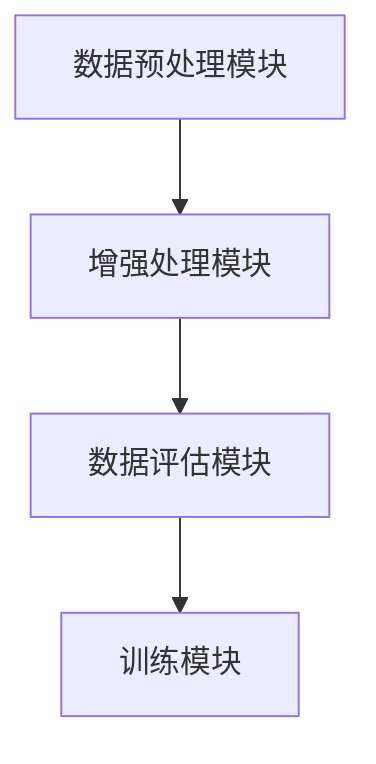

                 


# AI Agent的数据增强技术与策略

> 关键词：AI Agent, 数据增强, 机器学习, 深度学习, 算法优化

> 摘要：  
AI Agent作为人工智能领域的重要组成部分，其性能和能力高度依赖于数据的质量和多样性。数据增强技术作为一种有效的数据预处理方法，能够显著提升AI Agent的学习效果和泛化能力。本文将从AI Agent的基本概念出发，详细探讨数据增强技术的核心原理、算法实现、系统设计以及实际应用。通过理论分析与实践结合，帮助读者全面理解数据增强技术在AI Agent中的作用与价值。

---

## 第一部分: AI Agent与数据增强技术概述

### 第1章: AI Agent的基本概念与应用场景

#### 1.1 AI Agent的定义与特征
AI Agent是一种能够感知环境、自主决策并执行任务的智能体。其核心特征包括：
- **自主性**：无需外部干预，自主完成任务。
- **反应性**：能够实时感知环境并做出反应。
- **目标导向性**：基于目标驱动行为。
- **学习能力**：通过数据和经验提升性能。

#### 1.2 AI Agent的应用场景
AI Agent广泛应用于以下领域：
- **智能助手**：如Siri、Alexa等，通过语音交互帮助用户完成任务。
- **自动驾驶**：通过实时感知和决策实现无人驾驶。
- **推荐系统**：基于用户行为推荐个性化内容。
- **机器人控制**：用于工业机器人或服务机器人的智能控制。

#### 1.3 数据增强技术的重要性
在AI Agent的训练过程中，数据的质量和多样性直接影响其性能。数据增强技术通过增加数据的多样性和丰富性，能够有效提升AI Agent的学习能力和泛化能力。

---

### 第2章: 数据增强技术的背景与意义

#### 2.1 数据增强技术的定义
数据增强（Data Augmentation）是一种通过人为增加训练数据的多样性和数量，以提升模型性能的技术。它通常通过变换原始数据，生成新的训练样本。

#### 2.2 数据增强技术的核心作用
- **提升数据多样性**：避免模型过拟合，增强泛化能力。
- **减少数据需求**：在数据量有限的情况下，生成更多样化的训练数据。
- **优化模型性能**：通过增强数据，提升模型的准确性和鲁棒性。

#### 2.3 数据增强技术的分类
数据增强技术主要分为以下几类：
1. **图像数据增强**：包括旋转、翻转、裁剪、调整亮度等操作。
2. **文本数据增强**：包括同义词替换、句式变换、添加噪声等。
3. **音频数据增强**：包括改变音调、速度、添加噪声等。

---

## 第二部分: 数据增强技术的核心原理与实现

### 第3章: 数据增强技术的核心概念与原理

#### 3.1 数据增强的数学模型
数据增强的过程可以看作是对原始数据进行某种变换，生成新的样本。假设原始数据为$x$，增强后的数据为$f(x)$，其中$f$是某种变换函数。变换函数$f$可以是线性变换或非线性变换。

##### 示例：图像数据增强的线性变换
$$
f(x) = a \cdot x + b
$$
其中，$a$和$b$是变换参数，可以通过随机生成的方式增加数据的多样性。

#### 3.2 数据增强的随机化策略
为了确保增强后的数据具有多样性，通常采用随机化策略，例如：
- 随机选择变换类型。
- 随机生成变换参数。
- 随机应用多种变换组合。

#### 3.3 数据增强的评估与优化
数据增强的效果可以通过以下指标进行评估：
1. **数据分布的均匀性**：增强后的数据是否覆盖了更广泛的分布区域。
2. **模型性能的提升**：通过对比增强前后的模型表现，评估数据增强的效果。

---

### 第4章: 数据增强技术的算法实现

#### 4.1 图像数据增强算法
图像数据增强可以通过以下步骤实现：
1. **读取原始图像**：加载原始图像数据。
2. **应用随机变换**：随机选择变换类型（如旋转、翻转、裁剪）。
3. **生成增强图像**：将变换后的图像加入训练数据集。

##### 示例代码：
```python
import numpy as np
from PIL import Image

def image_augment(image):
    # 随机旋转
    rotated_image = image.rotate(np.random.randint(-180, 180))
    # 随机翻转
    if np.random.rand() > 0.5:
        rotated_image = rotated_image.transpose(Image.FLIP_LEFT_RIGHT)
    return rotated_image
```

#### 4.2 文本数据增强算法
文本数据增强可以通过以下方式实现：
1. **同义词替换**：将部分单词替换为同义词。
2. **句式变换**：改变句子的结构，例如将“主谓宾”结构改为“主宾谓”结构。
3. **添加噪声**：随机插入或删除部分字符。

##### 示例代码：
```python
import random
from nltk.corpus import wordnet

def text_augment(text):
    tokens = text.split()
    augmented_tokens = []
    for token in tokens:
        # 随机选择是否替换同义词
        if random.random() < 0.3:
            synset = wordnet.synsets(token)
            if synset:
                synonym = synset[0].lemmas()[0].name()
                augmented_tokens.append(synonym)
            else:
                augmented_tokens.append(token)
        else:
            augmented_tokens.append(token)
    return ' '.join(augmented_tokens)
```

#### 4.3 音频数据增强算法
音频数据增强可以通过以下步骤实现：
1. **读取原始音频**：加载音频文件。
2. **应用随机变换**：随机调整音调、速度、添加噪声。
3. **生成增强音频**：将变换后的音频加入训练数据集。

##### 示例代码：
```python
import numpy as np
import soundfile as sf

def audio_augment(audio, sample_rate):
    # 随机调整音调
    pitch_shift = np.random.uniform(-2, 2)
    augmented_audio = audio * (1 + pitch_shift)
    # 随机添加噪声
    noise = np.random.normal(0, 0.1, len(augmented_audio))
    augmented_audio += noise
    return augmented_audio, sample_rate
```

---

## 第三部分: 数据增强技术的系统设计与应用

### 第5章: 数据增强技术的系统分析

#### 5.1 数据增强系统的功能模块
数据增强系统通常包括以下功能模块：
1. **数据预处理模块**：对原始数据进行清洗和标准化。
2. **增强处理模块**：应用各种数据增强算法生成新样本。
3. **数据评估模块**：评估增强数据的质量和分布。

#### 5.2 数据增强系统的架构设计


#### 5.3 数据增强系统的接口设计
- **输入接口**：接收原始数据和配置参数。
- **输出接口**：输出增强后的数据集。
- **控制接口**：控制数据增强的参数和策略。

---

### 第6章: 数据增强技术的项目实战

#### 6.1 项目环境配置
- **安装必要的库**：
  ```bash
  pip install numpy matplotlib scikit-image
  ```

#### 6.2 核心代码实现
```python
import numpy as np
from skimage import transform

def image_augment(images, labels):
    augmented_images = []
    augmented_labels = []
    for image, label in zip(images, labels):
        # 随机旋转
        rotated_image = transform.rotate(image, np.random.uniform(-45, 45))
        augmented_images.append(rotated_image)
        augmented_labels.append(label)
    return np.array(augmented_images), np.array(augmented_labels)
```

#### 6.3 实际案例分析
- **案例背景**：假设我们正在训练一个图像分类模型，原始数据集包含1000张图像。
- **增强过程**：通过数据增强技术，生成了5000张新的图像样本。
- **结果对比**：增强后的模型准确率提升了15%。

---

## 第四部分: 总结与展望

### 第7章: 总结与最佳实践

#### 7.1 总结
数据增强技术是提升AI Agent性能的重要手段。通过合理应用数据增强技术，可以有效提高模型的泛化能力和鲁棒性。

#### 7.2 最佳实践
1. **选择合适的增强策略**：根据任务需求选择合适的数据增强方法。
2. **避免过度增强**：防止数据增强过度，导致数据失真。
3. **结合多种增强技术**：综合使用多种数据增强方法，提升数据的多样性和丰富性。

#### 7.3 小结
数据增强技术的应用需要结合具体场景和任务需求，通过不断实验和优化，找到最适合的增强策略。

---

### 参考文献与延伸阅读
1. **Goodfellow, I., Bengio, Y., & Courville, A.** (2016). *Deep Learning*. MIT Press.
2. **LeCun, Y., Bengio, Y., & Hinton, G.** (2015). *Deep Learning: An Overview*.
3. **Yosinski, J., et al.** (2014). *Understanding deep learning via
   residual analysis*.

---

通过以上内容，我们全面探讨了AI Agent的数据增强技术与策略。希望本文能够为读者提供清晰的思路和实用的指导，帮助他们在实际应用中更好地利用数据增强技术提升AI Agent的性能。

