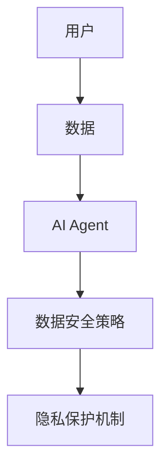
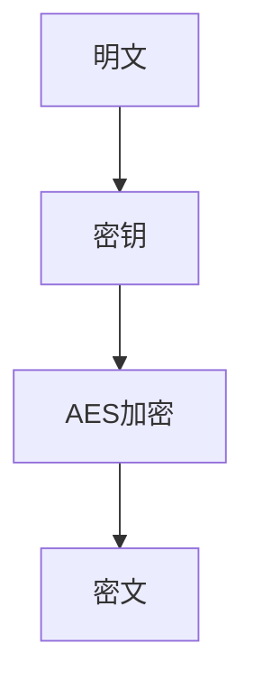
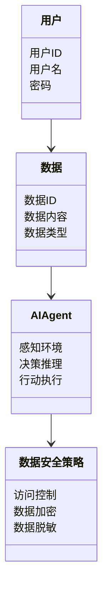
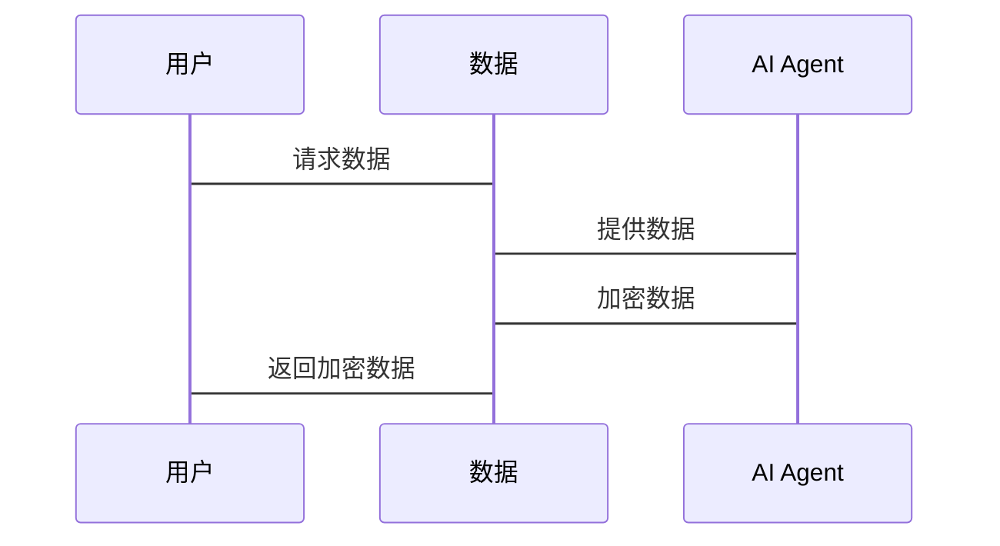

                 


# AI Agent的数据安全与隐私保护措施

> 关键词：AI Agent, 数据安全, 隐私保护, 加密算法, 数据分类, 访问控制

> 摘要：随着人工智能技术的快速发展，AI Agent在各个领域的应用越来越广泛。然而，AI Agent在处理数据时，面临着数据安全和隐私保护的双重挑战。本文将详细探讨AI Agent的数据安全与隐私保护措施，包括数据分类、访问控制、加密算法、系统架构设计等方面，旨在为技术人员和相关领域研究者提供理论依据和实践指导。

---

# 第1章: AI Agent与数据安全概述

## 1.1 AI Agent的基本概念

### 1.1.1 AI Agent的定义与分类

AI Agent（人工智能代理）是指能够感知环境并采取行动以实现目标的智能实体。AI Agent可以分为以下几类：

- **简单反射型Agent**：基于当前感知直接采取行动，不依赖历史信息。
- **基于模型的反射型Agent**：利用内部模型和历史信息进行决策。
- **目标驱动型Agent**：根据目标选择最优行动。
- **实用驱动型Agent**：通过效用函数优化决策。

### 1.1.2 AI Agent的核心功能与特点

AI Agent的核心功能包括数据感知、决策推理、行动执行和反馈优化。其特点体现在自主性、反应性、目标导向和学习能力。

### 1.1.3 AI Agent的应用场景与发展趋势

AI Agent广泛应用于自动驾驶、智能助手、推荐系统等领域。随着技术进步，AI Agent将更加智能化、网络化和人机协作化。

---

## 1.2 数据安全与隐私保护的重要性

### 1.2.1 数据安全的基本概念

数据安全是指保护数据的机密性、完整性和可用性。AI Agent在处理数据时，需防止数据泄露、篡改和破坏。

### 1.2.2 隐私保护的核心原则

隐私保护强调保护个人隐私，防止未经授权的数据访问和滥用。AI Agent需遵循最小权限原则和数据最小化原则。

### 1.2.3 AI Agent中数据安全与隐私保护的特殊性

AI Agent的数据处理涉及大量敏感信息，需结合数据分类和访问控制策略，确保数据在传输、存储和处理过程中的安全性。

---

## 1.3 本章小结

本章介绍了AI Agent的基本概念和应用场景，并重点阐述了数据安全与隐私保护的重要性。接下来将深入探讨数据安全与隐私保护的核心概念和技术措施。

---

# 第2章: 数据安全与隐私保护的核心概念

## 2.1 数据安全的基本原理

### 2.1.1 数据安全的三要素模型

数据安全的三要素包括：

1. **机密性**：确保数据仅被授权访问。
2. **完整性**：保证数据的准确性和一致性。
3. **可用性**：确保数据在需要时可访问。

### 2.1.2 数据安全的分类与层次结构

数据安全可以分为物理安全、网络安全、应用安全和数据本身安全。层次结构包括网络层、系统层和数据层。

### 2.1.3 数据安全与隐私保护的关系

数据安全是隐私保护的基础，隐私保护是数据安全的目标之一。隐私保护更注重个人数据的保护，而数据安全涵盖更广泛的内容。

---

## 2.2 隐私保护的核心原则

### 2.2.1 隐私保护的定义与目标

隐私保护旨在防止未经授权的个人或组织访问和使用个人数据。其目标是确保数据仅用于授权目的，并保护个人隐私。

### 2.2.2 隐私保护的法律框架与伦理规范

隐私保护需遵循相关法律法规，如欧盟的GDPR和美国的CCPA。伦理规范强调数据处理的透明性和用户同意。

### 2.2.3 隐私保护的技术手段与实现方式

常用技术手段包括数据加密、匿名化处理和访问控制。匿名化处理是通过去除或加密数据标识，确保无法追溯到个人。

---

## 2.3 AI Agent中的数据分类与访问控制

### 2.3.1 数据分类的基本方法

数据分类方法包括基于数据敏感性、数据类型和数据用途的分类。敏感数据需严格控制访问权限。

### 2.3.2 数据访问控制的策略与实现

访问控制策略包括基于角色的访问控制（RBAC）和基于属性的访问控制（ABAC）。RBAC通过角色分配权限，ABAC通过属性动态决定访问权限。

### 2.3.3 数据脱敏技术与应用场景

数据脱敏是将敏感数据转化为不可逆的格式，常用于数据共享和备份。例如，将姓名脱敏为“XXX”。

---

## 2.4 核心概念对比表

| 对比维度 | 数据安全 | 隐私保护 |
|----------|----------|----------|
| 目标     | 保护数据不被非法访问 | 保护个人隐私不被泄露 |
| 实现手段 | 加密、防火墙、访问控制 | 数据脱敏、匿名化、加密 |
| 关注点   | 机密性、完整性、可用性 | 数据标识、数据用途 |

---

## 2.5 ER实体关系图



---

# 第3章: 数据安全与隐私保护的算法原理

## 3.1 数据加密算法

### 3.1.1 对称加密算法

对称加密算法使用相同的密钥进行加密和解密。AES（高级加密标准）是常用的对称加密算法。

#### AES加密算法原理

AES加密算法分为多个步骤，包括初始轮、中间轮和最后一轮。每一轮包括字节代换、行移位、列混淆和轮密钥加。

#### Python代码实现

```python
from cryptography.hazmat.primitives import hashes
from cryptography.hazmat.primitives.kdf import pbkdf2
from cryptography.hazmat.primitives.ciphers import Cipher, algorithms, modes
from cryptography.hazmat.backends import default_backend

# 生成密钥
password = b"secret_key"
salt = b"salt_123"
kdf = pbkdf2.PBKDF2HMAC(
    algorithm=hashes.SHA256(),
    salt=salt,
    iterations=100000,
    backend=default_backend()
)
key = kdf.derive(password)

# 定义AES加密
cipher = Cipher(algorithms.AES(key), modes.ECB(), backend=default_backend())
encryptor = cipher.encryptor()

# 加密明文
plaintext = b"Hello, World!"
ciphertext = encryptor.update(plaintext) + encryptor.finalize()
print(ciphertext)
```

#### 加密过程的mermaid图



#### 加密算法的数学模型

AES加密算法的数学模型涉及多个代数运算，例如：

$$ y = \text{AES加密}(x, k) $$

其中，$x$是明文，$k$是密钥，$y$是密文。

---

## 3.2 其他加密算法

### 3.2.1 非对称加密算法

非对称加密算法使用公钥和私钥进行加密和解密。RSA算法是常用的非对称加密算法。

### 3.2.2 摘要算法

摘要算法用于生成数据的哈希值，确保数据完整性。常用算法包括MD5、SHA-1和SHA-256。

---

## 3.3 数据脱敏算法

### 3.3.1 数据脱敏的基本原理

数据脱敏通过替换、加密或删除敏感信息，确保数据无法被还原。

### 3.3.2 数据脱敏的实现方法

常用方法包括：

- **替换法**：将敏感数据替换为虚拟值。
- **加密法**：对敏感数据进行加密处理。
- **删除法**：永久删除敏感数据。

### 3.3.3 数据脱敏的数学模型

数据脱敏可以表示为：

$$ f(x) = \text{脱敏}(x) $$

其中，$x$是原始数据，$f(x)$是脱敏后的数据。

---

## 3.4 隐私保护算法

### 3.4.1 基于概率的隐私保护算法

基于概率的隐私保护算法通过随机化技术，确保数据在一定概率下无法被识别。

### 3.4.2 基于同态加密的隐私保护算法

同态加密允许在加密状态下进行数据运算，保护数据隐私。

---

# 第4章: 系统架构设计

## 4.1 问题场景介绍

AI Agent的数据安全与隐私保护系统需要应对数据泄露、篡改和未授权访问等风险。

## 4.2 系统功能设计

### 4.2.1 领域模型mermaid类图



### 4.2.2 系统架构设计mermaid架构图


### 4.2.3 系统接口设计

系统接口包括数据输入接口、数据处理接口和数据输出接口。

### 4.2.4 系统交互mermaid序列图



---

# 第5章: 项目实战

## 5.1 环境配置

### 5.1.1 安装Python和相关库

```bash
pip install cryptography
pip install mermaid
```

## 5.2 系统核心实现

### 5.2.1 数据加密实现

```python
from cryptography.hazmat.primitives import hashes
from cryptography.hazmat.primitives.kdf import pbkdf2
from cryptography.hazmat.primitives.ciphers import Cipher, algorithms, modes
from cryptography.hazmat.backends import default_backend

def aes_encrypt(plaintext, password, salt):
    kdf = pbkdf2.PBKDF2HMAC(
        algorithm=hashes.SHA256(),
        salt=salt,
        iterations=100000,
        backend=default_backend()
    )
    key = kdf.derive(password)
    cipher = Cipher(algorithms.AES(key), modes.ECB(), backend=default_backend())
    encryptor = cipher.encryptor()
    return encryptor.update(plaintext) + encryptor.finalize()

# 示例
plaintext = b"Hello, World!"
password = b"secret_key"
salt = b"salt_123"
ciphertext = aes_encrypt(plaintext, password, salt)
print(ciphertext)
```

### 5.2.2 数据脱敏实现

```python
def data_masking(data):
    import random
    masked_data = []
    for item in data:
        if isinstance(item, str):
            masked_item = item[0] + 'X' * (len(item) - 2) + item[-1]
        elif isinstance(item, int):
            masked_item = item // 10 * 10
        else:
            masked_item = item
        masked_data.append(masked_item)
    return masked_data

# 示例
data = ["张三", 123456, "李四"]
masked_data = data_masking(data)
print(masked_data)
```

## 5.3 案例分析

### 5.3.1 某AI Agent系统数据脱敏案例

某AI Agent系统处理用户姓名和身份证号，使用数据脱敏技术将身份证号部分脱敏。

---

# 第6章: 最佳实践、总结与展望

## 6.1 最佳实践

1. **数据分类与访问控制**：根据数据敏感性进行分类，实施严格的访问控制策略。
2. **数据加密与脱敏**：对敏感数据进行加密存储，使用脱敏技术处理共享数据。
3. **隐私保护技术**：采用匿名化和同态加密等技术，保护用户隐私。
4. **系统架构优化**：设计合理的系统架构，确保数据安全与隐私保护机制的有效实施。

---

## 6.2 总结

本文详细探讨了AI Agent的数据安全与隐私保护措施，包括数据分类、访问控制、加密算法、系统架构设计等方面，并通过实际案例分析和技术实现，为AI Agent的安全应用提供了理论依据和实践指导。

---

## 6.3 展望

未来，随着AI Agent技术的不断发展，数据安全与隐私保护将面临更多挑战。需要进一步研究和优化现有的数据保护技术，探索新的隐私保护算法，确保AI Agent的安全可靠运行。

---

# 结语

AI Agent作为人工智能的重要组成部分，在数据安全与隐私保护方面具有重要意义。通过合理的数据分类、严格的访问控制、先进的加密算法和科学的系统架构设计，可以有效保护AI Agent中的数据安全与用户隐私。希望本文能为相关领域的研究和实践提供有价值的参考。

