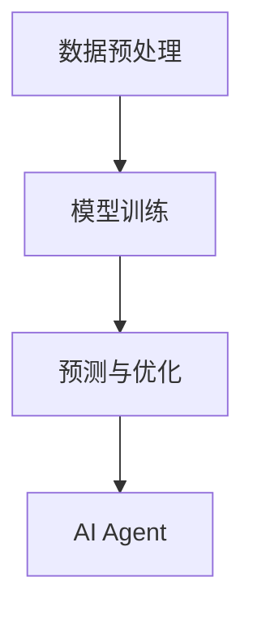

                 


# AI Agent的时序数据处理与预测

## 关键词：
- AI Agent
- 时序数据
- 时间序列分析
- 深度学习
- 预测模型

## 摘要：
本文详细探讨了AI Agent在处理时序数据和预测方面的应用。首先，介绍了时序数据的基本概念和AI Agent的核心功能，分析了时序数据的特征。然后，讲解了经典的时序预测算法和基于深度学习的模型，如ARIMA和LSTM。接着，通过系统架构设计和项目实战，展示了如何将这些算法应用于实际场景。最后，总结了最佳实践和未来的研究方向。

---

# 第一部分: 背景介绍

## 第1章: 时序数据的基本概念与特征

### 1.1 时序数据的定义与特点

#### 1.1.1 时序数据的定义
时序数据是指按时间顺序排列的数据，通常具有时间依赖性，例如股票价格、气温记录和销售数据。

#### 1.1.2 时序数据的核心特征
- 时间依赖性：数据点之间的关系随时间变化。
- 趋势性：数据随时间呈现上升或下降趋势。
- 季节性：数据在特定时间段内重复出现的模式。
- 周期性：数据在固定周期内重复的特征。
- 随机性：数据中不可预测的部分。

#### 1.1.3 时序数据与横截面数据的区别
| 特征 | 时序数据 | 横截面数据 |
|------|----------|------------|
| 时间顺序 | 有 | 无 |
| 变化趋势 | 有 | 无 |
| 预测能力 | 强 | 弱 |

### 1.2 AI Agent的定义与功能

#### 1.2.1 AI Agent的基本概念
AI Agent是一种智能体，能够感知环境、做出决策并采取行动，以实现目标。

#### 1.2.2 AI Agent的核心功能
- 感知环境：通过传感器或数据输入获取信息。
- 判断与决策：基于当前状态和目标做出决策。
- 行动执行：执行决策，影响环境或系统。

#### 1.2.3 AI Agent与传统程序的区别
- 自适应性：AI Agent能根据环境变化调整行为。
- 学习能力：能通过经验改进性能。
- 社会能力：能与其他实体或AI Agent交互协作。

### 1.3 时序数据在AI Agent中的应用

#### 1.3.1 时序数据在AI Agent中的重要性
时序数据帮助AI Agent理解环境变化，做出更准确的预测和决策。

#### 1.3.2 时序数据处理的基本流程
1. 数据收集：从传感器或数据库获取数据。
2. 数据预处理：清洗、转换和归一化数据。
3. 模型训练：训练预测模型。
4. 预测与反馈：生成预测结果并优化模型。

#### 1.3.3 时序数据预测的典型场景
- 股票价格预测：帮助投资者做出决策。
- 天气预报：提供准确的气象信息。
- 设备故障预测：预防设备损坏。

---

## 第2章: 时序数据的特征分析与预处理

### 2.1 时序数据的特征分析

#### 2.1.1 趋势性分解
趋势性是数据随时间的长期变化趋势，可以通过线性回归或指数平滑法提取。

#### 2.1.2 季节性分解
季节性是数据在固定周期内的重复模式，例如日、周、月周期。

#### 2.1.3 周期性分解
周期性是指数据在更长周期内的重复模式，可能与经济周期或自然现象相关。

### 2.2 时序数据的预处理方法

#### 2.2.1 数据清洗
- 处理缺失值：使用均值、插值或删除异常数据。
- 处理噪声：通过滤波或平滑技术减少噪声。

#### 2.2.2 数据转换
- 对数变换：适用于指数增长的数据。
- 差分：消除趋势性，使数据平稳化。

#### 2.2.3 数据标准化/归一化
标准化：将数据缩放到均值为0，方差为1。
归一化：将数据缩放到0-1范围。

#### 2.2.4 数据分割
将数据分为训练集、验证集和测试集，通常按时间顺序分割。

---

## 第3章: 时间序列分析的核心概念与数学模型

### 3.1 时间序列分析的基本原理

#### 3.1.1 时间序列分析的定义
时间序列分析是通过统计方法分析数据随时间的变化模式。

#### 3.1.2 时间序列分析的分类
- 平稳时间序列：数据具有恒定的均值和方差。
- 非平稳时间序列：数据均值或方差随时间变化。

#### 3.1.3 时间序列分析的步骤
1. 数据可视化：绘制折线图观察趋势和周期性。
2. 数据分解：分解为趋势、季节性和随机成分。
3. 模型选择：选择合适的预测模型。
4. 模型评估：验证模型的准确性和稳定性。

### 3.2 时间序列分析的数学模型

#### 3.2.1 平稳时间序列模型
- 自回归模型（AR）：基于过去值预测当前值。
- 移动平均模型（MA）：基于过去误差预测当前值。
- 自回归移动平均模型（ARMA）：结合AR和MA的模型。

#### 3.2.2 非平稳时间序列模型
- 自回归积分滑动平均模型（ARIMA）：适用于有趋势或季节性的数据。

### 3.3 时间序列分析的特征分解

#### 3.3.1 趋势分解
使用线性回归或多项式拟合提取趋势成分。

#### 3.3.2 季节性分解
使用傅里叶变换或X-13ARIMA方法提取季节性成分。

---

## 第4章: 常见的时间序列预测算法

### 4.1 经典的时间序列预测方法

#### 4.1.1 移动平均法（MA）
通过计算过去k期的平均值预测未来值。

#### 4.1.2 指数平滑法（ES）
使用加权平均预测未来值，适用于数据变化较快的情况。

#### 4.1.3 自回归积分滑动平均模型（ARIMA）
结合自回归和移动平均的模型，适用于非平稳数据。

### 4.2 基于机器学习的时间序列预测

#### 4.2.1 支持向量回归（SVR）
通过支持向量机进行非线性回归，适用于复杂的数据关系。

#### 4.2.2 长短期记忆网络（LSTM）
一种循环神经网络，能够捕捉长期依赖关系，适合处理序列数据。

#### 4.2.3 径向基函数网络（RBF）
通过径向基函数进行插值和逼近，适用于局部预测。

### 4.3 基于深度学习的时间序列预测

#### 4.3.1 Transformer模型
使用自注意力机制，适合捕捉全局依赖关系。

#### 4.3.2 图神经网络（GNN）
通过图结构建模时序数据，适合复杂依赖关系的预测。

#### 4.3.3 混合模型
结合LSTM和Transformer的优势，构建更强大的预测模型。

---

## 第5章: AI Agent中的时序数据预测应用

### 5.1 问题场景介绍
考虑一个智能交通系统，AI Agent需要根据交通流量数据预测未来流量，以优化信号灯控制。

### 5.2 系统功能设计

#### 5.2.1 数据预处理模块
- 数据清洗和归一化处理。
- 分解趋势、季节性和随机成分。

#### 5.2.2 模型训练模块
- 选择合适的预测模型，如ARIMA或LSTM。
- 训练模型并保存模型参数。

#### 5.2.3 预测与优化模块
- 使用训练好的模型进行预测。
- 根据预测结果优化AI Agent的行为。

### 5.3 系统架构设计

#### 5.3.1 系统架构图


#### 5.3.2 系统接口设计
- 数据预处理接口：接收原始数据，返回预处理后的数据。
- 模型训练接口：接收训练数据，返回训练好的模型。
- 预测接口：接收当前状态，返回预测结果。

#### 5.3.3 系统交互流程
1. 数据预处理模块接收原始数据并清洗。
2. 模型训练模块训练预测模型。
3. 预测与优化模块根据模型预测结果优化AI Agent的行为。

---

## 第6章: 项目实战

### 6.1 环境安装
- 安装Python、TensorFlow、Keras和相关库。

### 6.2 核心代码实现

#### 6.2.1 数据预处理
```python
import pandas as pd
import numpy as np

# 数据加载
data = pd.read_csv('time_series.csv')

# 数据清洗
data = data.dropna()

# 标准化
from sklearn.preprocessing import StandardScaler
scaler = StandardScaler()
data_scaled = scaler.fit_transform(data)
```

#### 6.2.2 模型训练
```python
from keras.models import Sequential
from keras.layers import LSTM, Dense

# LSTM模型构建
model = Sequential()
model.add(LSTM(64, input_shape=(timesteps, features)))
model.add(Dense(1))
model.compile(optimizer='adam', loss='mean_squared_error')

# 模型训练
model.fit(x_train, y_train, epochs=100, batch_size=32)
```

#### 6.2.3 预测与分析
```python
# 预测
y_pred = model.predict(x_test)

# 结果分析
from sklearn.metrics import mean_squared_error
rmse = np.sqrt(mean_squared_error(y_test, y_pred))
print(f'RMSE: {rmse}')
```

### 6.3 案例分析
以股票价格预测为例，展示如何训练LSTM模型并进行预测。

---

## 第7章: 最佳实践

### 7.1 小结
- 明确时序数据的特征和预处理方法。
- 根据数据特性选择合适的预测模型。
- 结合实际场景优化AI Agent的行为。

### 7.2 注意事项
- 数据预处理是关键，确保数据质量。
- 模型选择要考虑计算资源和预测精度。
- 模型部署后需定期更新和优化。

### 7.3 拓展阅读
- 《Deep Learning》—— Ian Goodfellow
- 《Time Series Analysis: Forecasting and Control》—— George E. P. Box

---

通过以上步骤，我们详细探讨了AI Agent处理时序数据和预测的方法，从理论到实践，帮助读者全面掌握相关知识。

