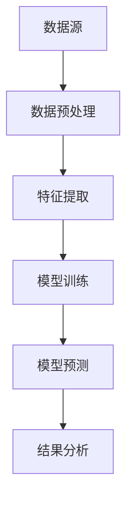
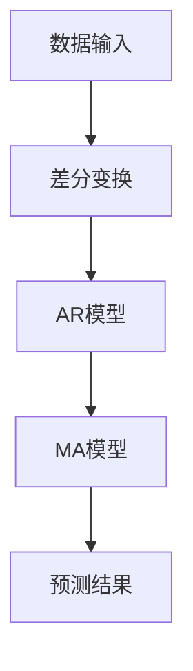
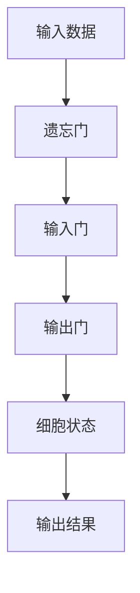
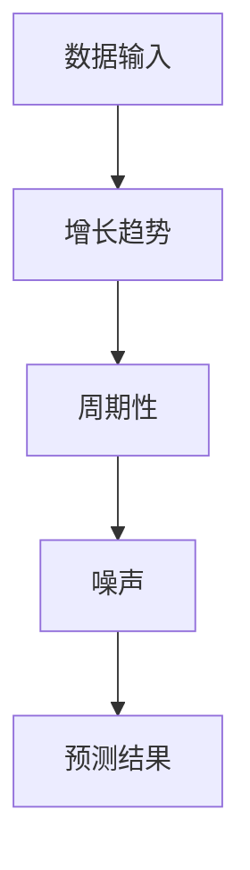
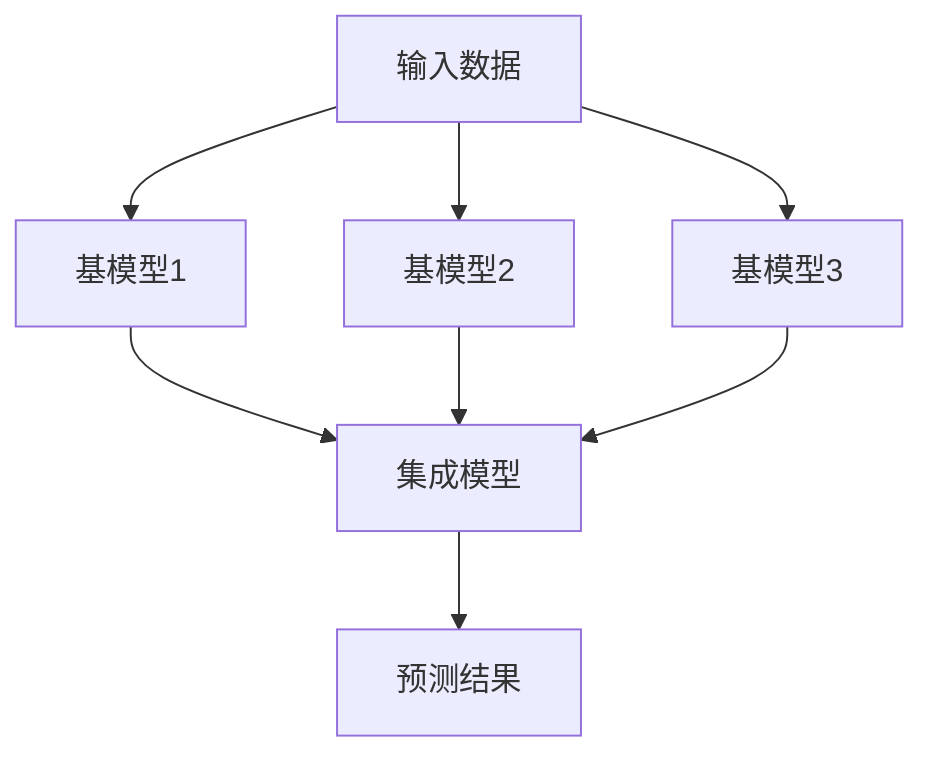
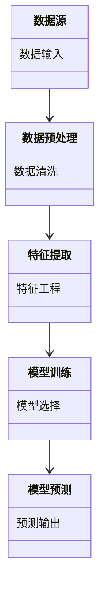
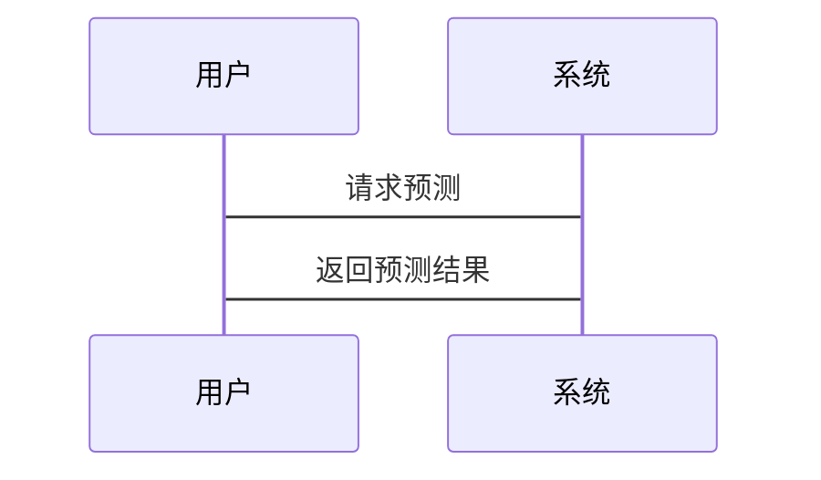

                 


# AI Agent的时序预测：理解和预测时间序列

> 关键词：AI Agent，时序预测，时间序列，机器学习，深度学习，算法原理

> 摘要：本文详细探讨了AI Agent在时间序列预测中的应用，从基本概念到算法原理，再到系统架构和项目实战，帮助读者全面理解和掌握时序预测的核心技术。

---

# 第1章: 时序预测的基本概念与背景

## 1.1 时间序列的基本概念

### 1.1.1 时间序列的定义与特征
时间序列是指按时间顺序排列的数据点组成的序列，例如股票价格、天气温度、销售数据等。时间序列具有以下特征：
- **趋势**：数据整体呈现上升或下降的趋势。
- **周期性**：数据在固定周期内重复出现的模式。
- **季节性**：数据在特定时间段内呈现的规律性变化。
- **随机性**：数据中无法预测的部分。

### 1.1.2 时间序列的常见类型
时间序列可以分为以下几类：
- **平稳时间序列**：均值和方差在时间上保持不变。
- **非平稳时间序列**：均值或方差随时间变化。
- **线性时间序列**：趋势是线性的。
- **非线性时间序列**：趋势是非线性的。

### 1.1.3 时序预测的定义与目标
时序预测是指利用历史数据预测未来数据点的值。其目标是通过模型捕捉时间序列中的模式，并基于这些模式对未来进行预测。

---

## 1.2 AI Agent与时序预测的关系

### 1.2.1 AI Agent的基本概念
AI Agent（智能体）是指能够感知环境、做出决策并采取行动的智能系统。AI Agent的核心能力包括感知、决策和执行。

### 1.2.2 AI Agent在时序预测中的作用
AI Agent可以通过以下方式在时序预测中发挥作用：
- **数据采集**：从环境中采集时间序列数据。
- **特征提取**：从时间序列中提取有用的特征。
- **模型训练**：训练模型以捕捉时间序列的模式。
- **预测与决策**：基于模型预测未来值并做出决策。

### 1.2.3 时序预测与AI Agent的核心联系
时序预测是AI Agent的重要任务之一，AI Agent通过时序预测能力可以实现对未来的智能决策。

---

## 1.3 时序预测的应用场景

### 1.3.1 金融领域的时序预测
在金融领域，时序预测用于股票价格预测、汇率预测等。

### 1.3.2 零售与供应链的时序预测
在零售和供应链领域，时序预测用于销售预测、库存管理等。

### 1.3.3 其他领域的应用案例
时序预测还可应用于能源需求预测、交通流量预测、医疗数据预测等领域。

---

## 1.4 时序预测的挑战与研究现状

### 1.4.1 时序预测的主要挑战
- 数据的非平稳性。
- 数据的噪声干扰。
- 长期预测的不确定性。

### 1.4.2 当前研究的热点与趋势
当前研究热点包括深度学习在时序预测中的应用、多模态时间序列预测、在线时序预测等。

### 1.4.3 未来研究方向
未来的研究方向可能包括更高效的时间序列建模方法、结合外部知识的时序预测、实时时序预测等。

---

## 1.5 本书的结构安排

### 1.5.1 本书的主要内容
本书将从时序预测的基本概念出发，逐步深入讲解AI Agent在时序预测中的应用，包括算法原理、系统架构和项目实战。

### 1.5.2 各章节的逻辑关系
本书的内容按照从基础到应用的逻辑顺序展开，帮助读者逐步掌握时序预测的核心技术。

### 1.5.3 学习本书的建议
建议读者在阅读本书时，结合实际案例进行实践，以更好地理解和掌握相关知识。

---

# 第2章: 时序预测的核心概念与联系

## 2.1 时序预测的核心原理

### 2.1.1 时间序列的分解方法
时间序列可以分解为趋势、周期、季节性和随机性四部分。

### 2.1.2 时间序列的平稳性与非平稳性
平稳时间序列的均值和方差在时间上保持不变，而非平稳时间序列则随时间变化。

### 2.1.3 时序预测的误差分析
预测误差是实际值与预测值之间的差异，可以通过误差分析来评估模型的性能。

---

## 2.2 AI Agent在时序预测中的角色

### 2.2.1 AI Agent的感知能力
AI Agent可以通过传感器、数据库等渠道采集时间序列数据。

### 2.2.2 AI Agent的数据处理能力
AI Agent能够对时间序列数据进行清洗、特征提取和数据增强。

### 2.2.3 AI Agent的预测能力
AI Agent通过训练模型对时间序列进行预测，并根据预测结果做出决策。

---

## 2.3 时序预测的核心概念对比表

| 概念         | 特征                     |
|--------------|--------------------------|
| 时间序列     | 按时间顺序排列的数据点   |
| 平稳序列     | 均值和方差保持不变       |
| 非平稳序列   | 均值或方差随时间变化     |

---

## 2.4 时序预测的ER实体关系图

```mermaid
er
    顾客(顾客ID, 姓名, 联系方式)
    订单(订单ID, 顾客ID, 订单时间, 订单金额)
    产品(产品ID, 产品名称, 产品价格)
    供应商(供应商ID, 供应商名称, 联系方式)
    购物车(购物车ID, 顾客ID, 产品ID, 数量)
```

---

## 2.5 时序预测的系统架构图



---

# 第3章: 时序预测的算法原理

## 3.1 ARIMA算法原理

### 3.1.1 ARIMA算法的基本原理
ARIMA（自回归积分滑动平均模型）是一种广泛应用于时间序列预测的统计模型。

### 3.1.2 ARIMA算法的数学公式

$$ ARIMA(p, d, q) = y_t = \phi_1 y_{t-1} + \phi_2 y_{t-2} + \dots + \phi_p y_{t-p} + \theta_1 \epsilon_{t-1} + \dots + \theta_q \epsilon_{t-q} + \epsilon_t $$

### 3.1.3 ARIMA算法的mermaid流程图



### 3.1.4 ARIMA算法的Python代码示例

```python
from statsmodels.tsa.arima.model import ARIMA

# 数据准备
data = [...]  # 时间序列数据

# 模型训练
model = ARIMA(data, order=(p, d, q))
model_fit = model.fit()

# 预测
forecast = model_fit.forecast(steps=5)
print(forecast)
```

---

## 3.2 LSTM算法原理

### 3.2.1 LSTM算法的基本原理
LSTM（长短期记忆网络）是一种基于深度学习的时间序列预测模型。

### 3.2.2 LSTM算法的数学公式

$$ f_t = \sigma(W_f [h_{t-1}, x_t]) $$
$$ i_t = \sigma(W_i [h_{t-1}, x_t]) $$
$$ o_t = \sigma(W_o [h_{t-1}, x_t]) $$
$$ g_t = \tanh(W_g [h_{t-1}, x_t]) $$
$$ h_t = f_t \cdot c_{t-1} + i_t \cdot g_t $$
$$ c_t = h_t $$

### 3.2.3 LSTM算法的mermaid流程图



### 3.2.4 LSTM算法的Python代码示例

```python
import keras
from keras.layers import LSTM, Dense

# 数据准备
X = [...]  # 输入数据
y = [...]  # 输出数据

# 模型训练
model = keras.Sequential()
model.add(LSTM(units=50, input_shape=(timesteps, features)))
model.add(Dense(1))
model.compile(loss='mean_squared_error', optimizer='adam')
model.fit(X, y, epochs=50, batch_size=32)

# 预测
forecast = model.predict(X_test)
print(forecast)
```

---

## 3.3 Prophet算法原理

### 3.3.1 Prophet算法的基本原理
Prophet是由Facebook开源的时间序列预测算法，基于非参数回归方法。

### 3.3.2 Prophet算法的数学公式

$$ y_t = g(t) + s(t) + \epsilon_t $$

### 3.3.3 Prophet算法的mermaid流程图



### 3.3.4 Prophet算法的Python代码示例

```python
from prophet import Prophet

# 数据准备
data = [...]  # 时间序列数据

# 模型训练
model = Prophet()
model.fit(data)

# 预测
future = model.make_future_dataframe(periods=30)
forecast = model.predict(future)
print(forecast)
```

---

## 3.4 集成方法的时序预测

### 3.4.1 集成方法的基本原理
集成方法通过组合多个基模型的结果来提高预测性能。

### 3.4.2 集成方法的数学公式

$$ f(x) = \sum_{i=1}^n w_i h_i(x) $$

### 3.4.3 集成方法的mermaid流程图



### 3.4.4 集成方法的Python代码示例

```python
import numpy as np
from sklearn.ensemble import VotingRegressor

# 数据准备
X = [...]  # 输入数据
y = [...]  # 输出数据

# 基模型训练
model1 = ARIMA(...)
model2 = LSTM(...)
model3 = Prophet(...)

# 集成模型训练
model = VotingRegressor(estimators=[('arima', model1), ('lstm', model2), ('prophet', model3)])
model.fit(X, y)

# 预测
forecast = model.predict(X_test)
print(forecast)
```

---

# 第4章: 时序预测的数学模型

## 4.1 ARIMA模型的数学公式

$$ ARIMA(p, d, q) = y_t = \phi_1 y_{t-1} + \phi_2 y_{t-2} + \dots + \phi_p y_{t-p} + \theta_1 \epsilon_{t-1} + \dots + \theta_q \epsilon_{t-q} + \epsilon_t $$

---

## 4.2 LSTM模型的数学公式

$$ f_t = \sigma(W_f [h_{t-1}, x_t]) $$
$$ i_t = \sigma(W_i [h_{t-1}, x_t]) $$
$$ o_t = \sigma(W_o [h_{t-1}, x_t]) $$
$$ g_t = \tanh(W_g [h_{t-1}, x_t]) $$
$$ h_t = f_t \cdot c_{t-1} + i_t \cdot g_t $$
$$ c_t = h_t $$

---

## 4.3 Prophet模型的数学公式

$$ y_t = g(t) + s(t) + \epsilon_t $$

---

## 4.4 集成方法的数学公式

$$ f(x) = \sum_{i=1}^n w_i h_i(x) $$

---

# 第5章: 时序预测的系统分析与架构设计

## 5.1 系统功能设计

### 5.1.1 领域模型设计



### 5.1.2 系统架构设计


---

## 5.2 系统交互设计

### 5.2.1 系统交互序列图



---

## 5.3 系统接口设计

### 5.3.1 API接口设计

```python
class System:
    def predict(self, input_data):
        # 预测逻辑
        pass
```

---

# 第6章: 时序预测的项目实战

## 6.1 环境安装与配置

### 6.1.1 Python环境安装
使用Anaconda或virtualenv创建虚拟环境，并安装所需库。

### 6.1.2 数据集准备
获取时间序列数据，例如股票价格数据。

### 6.1.3 开发工具配置
安装Jupyter Notebook、PyCharm等开发工具。

---

## 6.2 项目核心实现

### 6.2.1 数据预处理代码

```python
import pandas as pd
import numpy as np

# 数据加载
data = pd.read_csv('data.csv')

# 数据清洗
data.dropna(inplace=True)

# 特征工程
data['log_return'] = np.log(data['price'].pct_change() + 1)
```

### 6.2.2 模型训练代码

```python
from statsmodels.tsa.arima.model import ARIMA

# 模型训练
model = ARIMA(data['log_return'], order=(1, 1, 1))
model_fit = model.fit()

# 模型预测
forecast = model_fit.forecast(steps=5)
print(forecast)
```

---

## 6.3 项目结果分析

### 6.3.1 预测结果可视化

```python
import matplotlib.pyplot as plt

plt.plot(data.index, data['log_return'])
plt.plot(forecast.index, forecast)
plt.xlabel('Time')
plt.ylabel('Log Return')
plt.show()
```

### 6.3.2 模型性能评估

```python
from sklearn.metrics import mean_squared_error

mse = mean_squared_error(y_true, y_pred)
print(f'MSE: {mse}')
```

---

## 6.4 项目小结

通过本项目，我们实现了从数据预处理到模型训练再到结果分析的完整流程，验证了AI Agent在时序预测中的实际应用。

---

# 第7章: 最佳实践与小结

## 7.1 最佳实践

### 7.1.1 数据预处理的重要性
数据预处理是时序预测的关键步骤，包括数据清洗、特征提取等。

### 7.1.2 模型选择的注意事项
选择合适的模型需要考虑数据的特性、预测的精度和计算资源。

### 7.1.3 结果分析的重要性
通过对预测结果的分析，可以验证模型的性能并进行优化。

---

## 7.2 小结

本文全面介绍了AI Agent在时序预测中的应用，从基本概念到算法原理，再到系统架构和项目实战，帮助读者系统地掌握时序预测的核心技术。

---

## 7.3 注意事项

- 数据预处理要细致，避免噪声干扰。
- 模型选择要结合实际场景，避免过度复杂。
- 结果分析要全面，及时调整模型参数。

---

## 7.4 拓展阅读

- 《Deep Learning for Time Series Forecasting》
- 《Prophet: A Simple, Scalable, and Accurate Time Series Forecasting Algorithm》

---

通过以上内容，读者可以系统地学习AI Agent在时序预测中的应用，并能够在实际项目中灵活运用这些知识。

