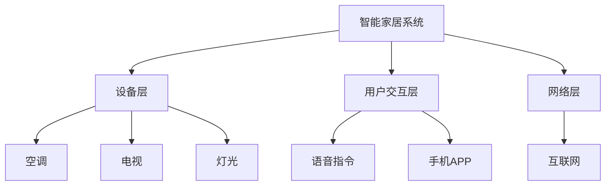
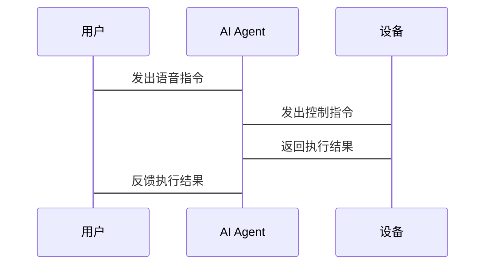

                 


# AI Agent的未来：趋势预测与展望

## 关键词：AI Agent, 人工智能, 机器学习, 智能决策, 自主学习, 人机协作

## 摘要：AI Agent作为人工智能领域的重要分支，正逐渐改变我们的生活方式和工作方式。本文将从AI Agent的核心概念、技术原理、系统设计、项目实战等多个角度进行详细分析，并对未来的发展趋势进行预测。通过本文，读者将能够全面了解AI Agent的现状与未来发展方向。

---

## 第1章: 引言

### 1.1 AI Agent的基本概念
AI Agent（人工智能代理）是指能够感知环境、自主决策并采取行动以实现特定目标的智能体。它结合了机器学习、自然语言处理和计算机视觉等多种技术，能够在复杂环境中完成任务。

### 1.2 AI Agent的重要性
随着人工智能技术的快速发展，AI Agent在多个领域展现出巨大潜力，如智能家居、自动驾驶、智能客服等。它能够通过自主学习和人机协作，提高效率并降低成本。

### 1.3 本文结构
本文将从AI Agent的核心概念、技术原理、系统设计、项目实战和未来展望等方面展开，全面探讨AI Agent的发展趋势与应用前景。

---

## 第2章: AI Agent的核心概念

### 2.1 智能决策
智能决策是AI Agent的核心能力之一。它通过分析环境信息，选择最优行动方案。例如，在自动驾驶中，AI Agent需要根据实时路况做出转向或加速的决策。

#### 2.1.1 决策模型
AI Agent的决策模型通常包括状态、动作和奖励三个核心要素。状态表示当前环境信息，动作是AI Agent的决策结果，奖励用于评估决策的优劣。

#### 2.1.2 决策算法
常用的决策算法包括强化学习（Reinforcement Learning）和生成式模型（Generative Models）。强化学习通过试错优化策略，而生成式模型则用于模拟可能的决策结果。

### 2.2 自主学习
自主学习是AI Agent实现持续进化的重要途径。通过与环境的交互，AI Agent能够不断优化自身的知识库和决策模型。

#### 2.2.1 学习方法
AI Agent可以采用监督学习、无监督学习和强化学习等多种学习方法。监督学习需要大量标注数据，而无监督学习则能够从无标签数据中提取特征。

#### 2.2.2 学习策略
学习策略包括贪心策略和探索策略。贪心策略追求短期利益，而探索策略则注重长期收益，以避免陷入局部最优。

### 2.3 人机协作
人机协作是指AI Agent与人类共同完成任务的过程。它能够提高工作效率，同时弥补人类在复杂任务中的不足。

#### 2.3.1 协作模式
人机协作模式主要包括并行协作和串行协作。并行协作强调人机同时行动，而串行协作则注重任务分解与协同。

#### 2.3.2 协作效果
协作效果的好坏取决于AI Agent的自然语言处理能力和对人类意图的理解程度。优秀的协作系统能够实现无缝配合，提升整体效率。

---

## 第3章: AI Agent的技术原理

### 3.1 强化学习
强化学习是AI Agent实现智能决策的核心算法之一。通过与环境的交互，AI Agent能够学习最优策略。

#### 3.1.1 算法流程
以下是强化学习的基本流程：

1. 状态感知：AI Agent感知当前环境状态。
2. 动作选择：基于当前状态选择一个动作。
3. 状态转移：执行动作后，环境进入新的状态。
4. 奖励计算：计算执行该动作后的奖励值。
5. 策略优化：根据奖励值优化策略。

#### 3.1.2 数学模型
强化学习的核心是Q-learning算法，其数学模型如下：

$$ Q(s, a) = max_{a'} [ Q(s', a') + \gamma r(s, a) ] $$

其中，$Q(s, a)$表示在状态$s$下采取动作$a$的期望奖励，$\gamma$是折扣因子。

### 3.2 生成式模型
生成式模型能够模拟各种可能的决策结果，为AI Agent提供丰富的决策参考。

#### 3.2.1 常见模型
常见的生成式模型包括生成对抗网络（GAN）和变分自编码器（VAE）。这些模型能够生成高质量的数据样本，帮助AI Agent进行决策。

#### 3.2.2 应用场景
生成式模型在图像生成、自然语言处理等领域有广泛应用。例如，在自动驾驶中，生成式模型可以模拟不同的驾驶场景，帮助AI Agent进行决策训练。

---

## 第4章: 系统分析与架构设计

### 4.1 应用场景
AI Agent的应用场景包括智能家居、自动驾驶、智能客服等。以智能家居为例，AI Agent需要协调各种智能设备，实现无缝连接与协同工作。

### 4.2 系统功能设计
以下是智能家居系统的功能设计：

1. 设备管理：管理家中的智能设备，如空调、电视等。
2. 用户交互：通过语音或触控方式与用户进行交互。
3. 状态监测：实时监测设备的运行状态，如温度、湿度等。
4. 事件处理：根据用户指令或环境变化，触发相应的设备动作。

### 4.3 系统架构设计
以下是智能家居系统的架构图：



### 4.4 系统接口设计
系统接口设计需要考虑设备之间的通信协议和用户交互的接口规范。例如，设备层采用MQTT协议进行通信，用户交互层通过REST API与系统进行交互。

### 4.5 系统交互流程
以下是系统的交互流程图：



---

## 第5章: 项目实战

### 5.1 智能家居项目
以下是智能家居项目的开发步骤：

1. 环境搭建：安装Python、TensorFlow等开发工具。
2. 设备接入：将空调、电视等设备接入网络，配置MQTT协议。
3. 模型训练：使用强化学习算法训练AI Agent的决策模型。
4. 系统集成：将AI Agent与设备进行集成，实现智能控制。
5. 测试优化：通过实际测试优化系统的响应速度和准确性。

### 5.2 核心代码实现
以下是AI Agent的核心代码实现：

```python
import numpy as np
import gym

# 初始化环境
env = gym.make('CartPole-v0')
env.seed(1)

# 初始化策略参数
theta = np.random.randn(4, 1)

# 定义价值函数
def value_function(state):
    return np.dot(theta.T, state)

# 定义策略函数
def policy(state):
    value = value_function(state)
    action_prob = np.exp(value) / (1 + np.exp(value))
    action = 1 if np.random.random() < action_prob else 0
    return action

# 强化学习算法
for episode in range(1000):
    state = env.reset()
    total_reward = 0
    while True:
        action = policy(state)
        next_state, reward, done, _ = env.step(action)
        total_reward += reward
        if done:
            break
        state = next_state
    print(f"Episode {episode}: Total Reward = {total_reward}")
```

### 5.3 代码功能解读
上述代码实现了强化学习算法，用于训练AI Agent在CartPole环境中的决策能力。通过不断试错，AI Agent能够掌握如何通过摆动杆子保持平衡。

---

## 第6章: 未来展望

### 6.1 技术进步
随着算法的优化和计算能力的提升，AI Agent的智能水平将不断提高。未来，AI Agent将具备更强的自主学习和决策能力。

### 6.2 行业应用
AI Agent将在更多领域得到应用，如医疗、金融、教育等。例如，在医疗领域，AI Agent可以辅助医生进行诊断和治疗方案的制定。

### 6.3 伦理挑战
AI Agent的广泛应用也将带来伦理挑战，如隐私保护和责任归属。如何在技术发展与伦理规范之间找到平衡，是未来需要解决的重要问题。

---

## 第7章: 结论与建议

### 7.1 小结
本文全面分析了AI Agent的核心概念、技术原理和系统设计，并对未来的发展趋势进行了展望。AI Agent作为人工智能的重要组成部分，将在未来发挥越来越重要的作用。

### 7.2 最佳实践
1. 在开发AI Agent时，应注重算法的可解释性和透明性。
2. 加强对AI Agent的伦理研究，确保技术的健康发展。
3. 多领域协作，推动AI Agent技术的创新与应用。

### 7.3 注意事项
- AI Agent的开发需要结合具体应用场景，避免技术与实际需求脱节。
- 在实际应用中，应注重数据安全和隐私保护。

### 7.4 拓展阅读
- 《强化学习入门》
- 《生成式模型实战》
- 《人工智能伦理与社会影响》

---

## 关键词：AI Agent, 人工智能, 机器学习, 智能决策, 自主学习, 人机协作

## 摘要：AI Agent作为人工智能领域的重要分支，正逐渐改变我们的生活方式和工作方式。本文将从AI Agent的核心概念、技术原理、系统设计、项目实战等多个角度进行详细分析，并对未来的发展趋势进行预测。通过本文，读者将能够全面了解AI Agent的现状与未来发展方向。

