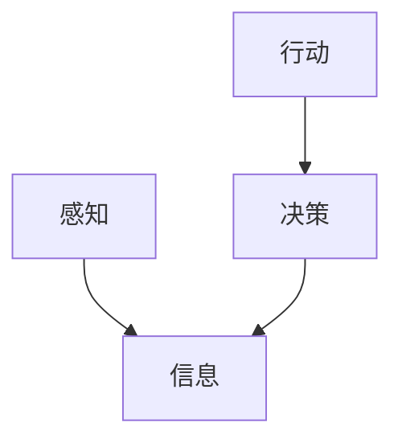
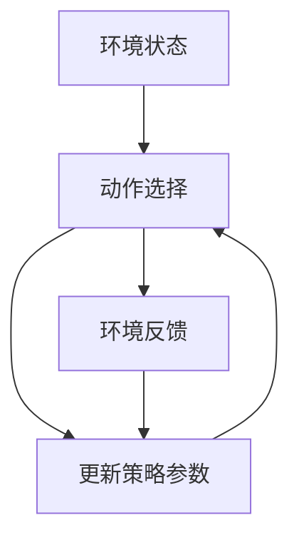
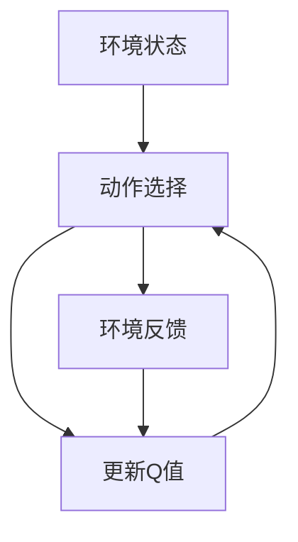
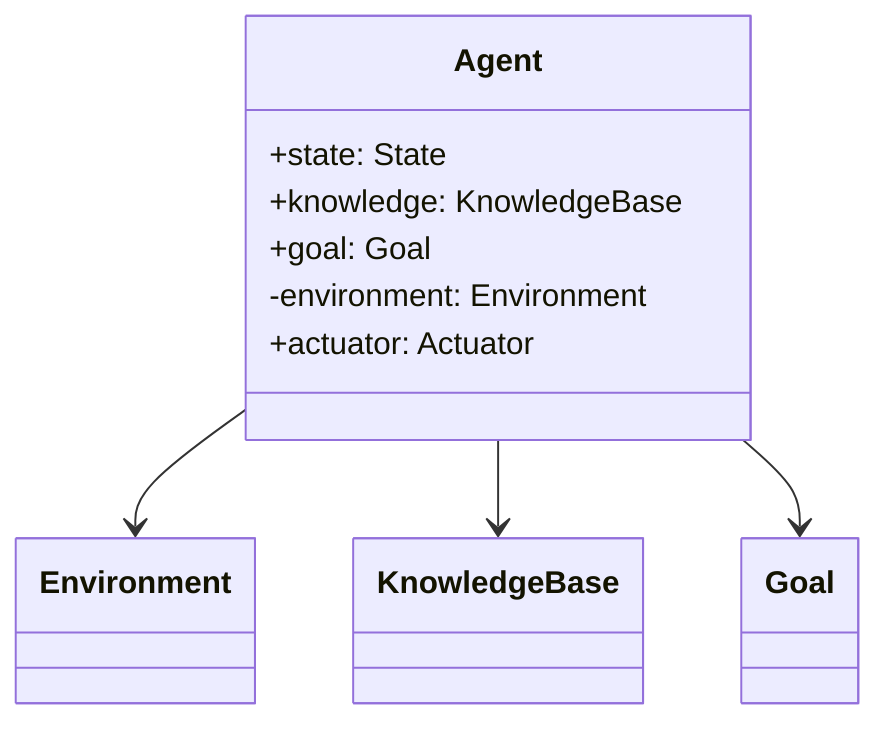
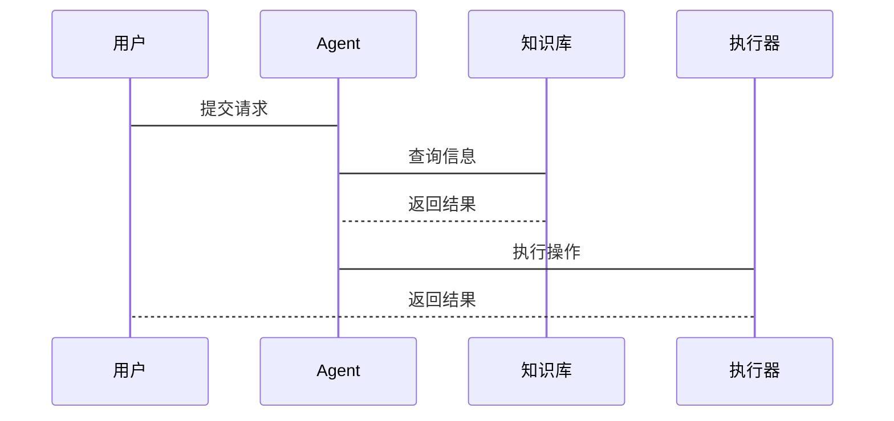

                 


# AI Agent的架构设计：从概念到实现

## 关键词
- AI Agent
- 架构设计
- 强化学习
- 系统架构
- 项目实战

## 摘要
AI Agent作为人工智能领域的核心概念，其架构设计涵盖了从问题建模到算法实现的全过程。本文将详细探讨AI Agent的基本概念、核心算法、系统架构设计以及实际项目实现，帮助读者全面理解AI Agent的构建过程。

---

# 第1章: AI Agent 的概述

## 1.1 AI Agent 的基本概念
### 1.1.1 什么是 AI Agent
AI Agent（人工智能代理）是指能够感知环境并采取行动以实现目标的智能体。它能够通过传感器获取信息，利用计算模型做出决策，并通过执行器与环境交互。

### 1.1.2 AI Agent 的历史与发展
AI Agent的概念起源于20世纪60年代，随着机器学习和深度学习的发展，AI Agent在近年来取得了显著进步，特别是在游戏AI、自动驾驶和智能助手领域。

### 1.1.3 AI Agent 的核心要素
AI Agent的核心要素包括感知、决策、行动和学习能力。感知是获取环境信息，决策是基于信息做出选择，行动是执行决策，学习是优化模型。

## 1.2 AI Agent 的问题背景与描述
### 1.2.1 传统 AI 与 AI Agent 的区别
传统AI注重特定任务的解决，而AI Agent强调自主性和适应性，能够在动态环境中完成任务。

### 1.2.2 AI Agent 的应用场景
AI Agent广泛应用于自动驾驶、智能助手、机器人和博弈论等领域。

### 1.2.3 AI Agent 的边界与外延
AI Agent的边界包括感知、决策和行动能力，外延则涉及与其他系统的协作。

## 1.3 AI Agent 的概念结构与核心要素
### 1.3.1 AI Agent 的概念结构
AI Agent由感知、决策、行动和学习模块组成，形成一个闭环系统。

### 1.3.2 核心要素的详细分析
- **感知**：通过传感器获取数据，如视觉、听觉等。
- **决策**：基于感知数据进行推理，做出决策。
- **行动**：通过执行器将决策转化为行动。
- **学习**：通过反馈优化模型，提升性能。

## 1.4 本章小结
本章介绍了AI Agent的基本概念、历史发展和核心要素，为后续章节奠定了基础。

---

# 第2章: AI Agent 的核心概念与联系

## 2.1 AI Agent 的核心概念原理
### 2.1.1 问题建模的原理
问题建模是将实际问题转化为数学模型的过程，帮助AI Agent理解任务。

### 2.1.2 知识表示的原理
知识表示是将信息以结构化形式存储，便于AI Agent理解和推理。

### 2.1.3 决策推理的原理
决策推理基于知识和环境信息，通过计算模型做出最优选择。

## 2.2 核心概念的属性特征对比
### 2.2.1 不同 AI Agent 类型的对比
- **反应式AI Agent**：基于当前感知做出反应。
- **认知式AI Agent**：具备复杂推理和规划能力。

### 2.2.2 核心概念的特征表格
| 概念 | 输入 | 输出 | 功能 |
|------|------|------|------|
| 感知 | 环境数据 | 信息 | 获取环境信息 |
| 决策 | 信息 | 行动 | 做出决策 |

### 2.2.3 属性对比的 Mermaid 图


## 2.3 ER 实体关系图架构
### 2.3.1 实体关系图的定义
ER图用于描述系统中的实体及其关系，帮助设计数据库结构。

### 2.3.2 实体关系图的构建
AI Agent系统中的实体包括环境、传感器、执行器和决策模块。

### 2.3.3 实体关系图的 Mermaid 代码
```mermaid
erd
actor1(Agent) --> environment(Environment)
actor2(Sensor) --> environment
actor3(Actuator) --> environment
```

## 2.4 本章小结
本章详细探讨了AI Agent的核心概念及其之间的联系，为后续的算法设计奠定了基础。

---

# 第3章: AI Agent 的算法原理讲解

## 3.1 基于强化学习的 AI Agent 算法
### 3.1.1 强化学习的基本原理
强化学习通过奖励机制训练AI Agent，使其在环境中做出最优决策。

### 3.1.2 DQN 算法的实现
DQN算法使用深度神经网络近似Q值函数，通过经验回放和目标网络优化。

### 3.1.3 DQN 算法的 Mermaid 流程图


## 3.2 基于策略梯度的 AI Agent 算法
### 3.2.1 策略梯度的基本原理
策略梯度通过优化策略参数，直接在动作空间中寻找最优策略。

### 3.2.2 PG 算法的实现
PG算法使用概率模型表示策略，通过梯度下降优化参数。

### 3.2.3 PG 算法的 Mermaid 流程图


## 3.3 基于价值函数的 AI Agent 算法
### 3.3.1 价值函数的基本原理
价值函数通过估计状态的价值，帮助AI Agent做出决策。

### 3.3.2 Q-Learning 算法的实现
Q-Learning算法通过更新Q表，学习状态-动作对的价值。

### 3.3.3 Q-Learning 算法的 Mermaid 流程图


## 3.4 算法实现的 Python 源代码
### 3.4.1 DQN 算法的代码实现
```python
class DQN:
    def __init__(self, state_space, action_space, lr=0.01):
        self.state_space = state_space
        self.action_space = action_space
        self.lr = lr
        self.model = self.build_model()
    
    def build_model(self):
        # 网络结构
        pass
    
    def remember(self, state, action, reward, next_state):
        # 记忆存储
        pass
    
    def replay(self, batch_size):
        # 经验回放
        pass
    
    def act(self, state):
        # 动作选择
        pass
```

## 3.5 本章小结
本章详细讲解了AI Agent的三种典型算法，包括DQN、PG和Q-Learning，及其数学模型和实现代码。

---

# 第4章: AI Agent 的系统架构设计

## 4.1 问题场景介绍
### 4.1.1 项目背景
假设我们正在设计一个智能助手AI Agent，用于处理用户请求。

## 4.2 系统功能设计
### 4.2.1 领域模型的 mermaid 类图


## 4.3 系统架构设计
### 4.3.1 系统架构的 mermaid 架构图
```mermaid
container AI Agent {
    component 知识库
    component 决策模块
    component 执行器
}
AI Agent --> 环境
```

## 4.4 系统接口设计
### 4.4.1 接口设计
- **输入接口**：接收用户请求。
- **输出接口**：返回处理结果。

## 4.5 系统交互的 mermaid 序列图


## 4.6 本章小结
本章通过实际场景，详细设计了AI Agent的系统架构，包括功能模块和接口设计。

---

# 第5章: AI Agent 的项目实战

## 5.1 环境安装与配置
### 5.1.1 安装依赖
- 安装Python和必要的库，如TensorFlow、Keras。

## 5.2 系统核心实现源代码
### 5.2.1 AI Agent 的核心代码
```python
class Agent:
    def __init__(self, env):
        self.env = env
        self.model = self.build_model()
    
    def build_model(self):
        # 网络结构
        pass
    
    def act(self, state):
        # 动作选择
        pass
    
    def learn(self, state, action, reward, next_state):
        # 学习算法
        pass
```

## 5.3 代码应用解读与分析
### 5.3.1 代码结构分析
AI Agent的核心代码包括模型构建、动作选择和学习算法三部分。

## 5.4 实际案例分析
### 5.4.1 案例分析
以智能助手为例，详细分析其处理流程。

## 5.5 本章小结
本章通过实际项目，详细指导了AI Agent的环境搭建和代码实现。

---

# 第6章: AI Agent 的高级主题与实践

## 6.1 多智能体协作
### 6.1.1 多智能体协作的概念
多智能体协作是指多个AI Agent协同完成任务。

## 6.2 强化学习中的人机协作
### 6.2.1 人机协作的机制
人机协作通过结合人类决策和AI Agent的自主决策，提升系统性能。

## 6.3 AI Agent 的伦理与安全
### 6.3.1 伦理问题
AI Agent的决策可能引发伦理问题，需谨慎设计。

## 6.4 本章小结
本章扩展了AI Agent的知识，探讨了多智能体协作和人机协作，并讨论了伦理和安全问题。

---

# 第7章: 总结与展望

## 7.1 全书总结
本文详细介绍了AI Agent的架构设计，从概念到实现，涵盖了算法和系统架构设计。

## 7.2 未来展望
未来，AI Agent将在更多领域应用，如边缘计算和分布式系统。

---

# 附录

## 附录A: 常用工具与库
- Python库：TensorFlow、Keras。
- 其他工具：OpenAI Gym、Mermaid。

## 附录B: 常见问题解答
- Q: 如何选择算法？
- A: 根据任务需求选择合适的算法。

---

通过以上目录和内容，读者可以系统地学习AI Agent的架构设计，从基础概念到实际应用，逐步掌握相关知识。

