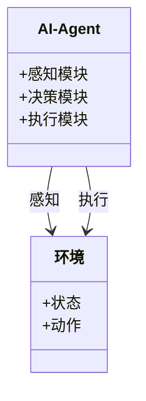
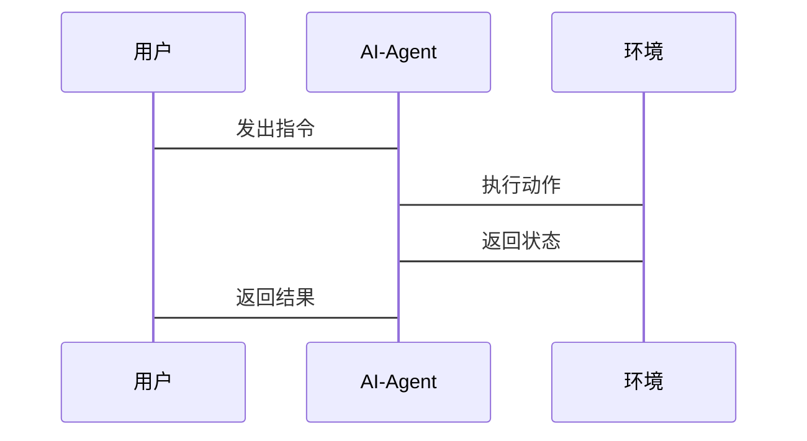

                 


# AI Agent的架构设计：从需求分析到系统规划

## 关键词：AI Agent，架构设计，需求分析，系统规划，强化学习，知识表示，系统架构

## 摘要：  
本文详细探讨AI Agent的架构设计过程，从需求分析到系统规划，涵盖核心概念、算法实现、系统架构、项目实战等多个方面。通过理论分析与实践案例结合，帮助读者理解AI Agent的设计与实现。内容包括AI Agent的基本概念、强化学习原理、系统架构设计、项目实战等，帮助读者掌握AI Agent的开发与应用。

---

## 第1章: AI Agent概述

### 1.1 AI Agent的基本概念

AI Agent（人工智能代理）是一种能够感知环境并采取行动以实现目标的智能实体。它能够自主决策、执行任务，并与环境和其他Agent进行交互。AI Agent的设计目标是模拟人类或其他智能体的行为模式，以解决复杂问题。

#### 1.1.1 什么是AI Agent  
AI Agent是具备自主性、反应性、目标导向和社交能力的智能体。它能够感知环境信息，基于感知做出决策，并通过执行动作与环境互动。例如，智能助手、自动驾驶系统等都是典型的AI Agent应用。

#### 1.1.2 AI Agent的类型  
AI Agent可以分为以下几类：
1. **简单反射型Agent**：基于当前感知直接做出反应，适用于简单任务。
2. **基于模型的反射型Agent**：利用内部模型和知识进行决策，适用于复杂任务。
3. **目标驱动型Agent**：以实现特定目标为导向，动态调整行为。
4. **效用驱动型Agent**：通过最大化效用函数来优化决策。

#### 1.1.3 AI Agent的核心特征  
AI Agent的核心特征包括：
- **自主性**：无需外部干预，自主决策。
- **反应性**：能够实时感知环境并做出反应。
- **目标导向**：具备明确的目标，并采取行动实现目标。
- **学习能力**：通过经验改进性能，具备自适应能力。

### 1.2 AI Agent的技术背景

AI Agent的发展与人工智能技术的进步密不可分。随着深度学习、强化学习等技术的成熟，AI Agent在多个领域得到了广泛应用。

#### 1.2.1 人工智能的发展历程  
人工智能（AI）的发展经历了多个阶段：
1. **符号AI阶段**：基于逻辑推理和知识表示，代表人物有艾伦·纽厄尔。
2. **机器学习阶段**：基于数据驱动的模式识别，如神经网络和决策树。
3. **深度学习阶段**：基于深度神经网络的特征提取，如卷积神经网络（CNN）和循环神经网络（RNN）。
4. **强化学习阶段**：基于策略优化和价值函数，如Q-learning和Deep Q-Network（DQN）。

#### 1.2.2 代理技术在AI中的应用  
代理技术广泛应用于以下领域：
1. **智能助手**：如Siri、Alexa，能够执行语音指令。
2. **自动驾驶**：如特斯拉、Waymo，能够自主导航和决策。
3. **智能推荐系统**：如Netflix、Amazon，基于用户行为推荐内容。

#### 1.2.3 当前AI Agent的主要技术特点  
当前AI Agent的主要技术特点包括：
- **强化学习**：基于奖励机制优化决策策略。
- **深度学习**：利用深度神经网络进行特征提取和模式识别。
- **知识图谱**：基于语义网络进行知识表示和推理。

### 1.3 AI Agent的架构模型

AI Agent的架构设计决定了其功能和性能。常见的架构模型包括单智能体架构和多智能体架构。

#### 1.3.1 单智能体架构  
单智能体架构适用于简单任务，如智能助手。其架构包括感知模块、决策模块和执行模块。

#### 1.3.2 多智能体架构  
多智能体架构适用于复杂任务，如自动驾驶。多个智能体协同工作，共同完成任务。

#### 1.3.3 基于强化学习的架构  
基于强化学习的架构通过奖励机制优化决策策略，适用于动态环境。

### 1.4 AI Agent的应用场景

AI Agent的应用场景广泛，包括智能助手、自动交易、智能推荐系统等。

#### 1.4.1 智能助手  
智能助手通过语音交互帮助用户完成日常任务，如设置提醒、查询天气等。

#### 1.4.2 自动交易  
自动交易系统通过算法交易股票，基于市场数据做出买卖决策。

#### 1.4.3 智能推荐系统  
智能推荐系统基于用户行为推荐个性化内容，如电影、音乐等。

### 1.5 AI Agent的需求分析方法

需求分析是AI Agent设计的第一步，包括需求收集、分析和优先级排序。

#### 1.5.1 需求收集与整理  
通过访谈、问卷等方式收集需求，并进行整理和分类。

#### 1.5.2 需求分析与分解  
将需求分解为功能需求和非功能需求，并进行优先级排序。

#### 1.5.3 需求优先级排序  
根据业务目标和用户需求，对需求进行优先级排序，确保关键需求优先实现。

---

## 第2章: AI Agent的核心原理

AI Agent的核心原理包括感知、决策、执行和强化学习等。

### 2.1 AI Agent的感知机制

感知是AI Agent获取环境信息的关键步骤。

#### 2.1.1 感知的定义与作用  
感知是AI Agent获取环境信息的过程，包括数据采集、特征提取和信息处理。

#### 2.1.2 常见的感知方法  
常用的感知方法包括传感器数据、摄像头图像和用户输入。

#### 2.1.3 感知数据的处理与分析  
感知数据的处理包括数据清洗、特征提取和数据转换。

### 2.2 AI Agent的决策机制

决策是AI Agent做出行动的关键步骤。

#### 2.2.1 决策的定义与作用  
决策是AI Agent基于感知信息做出行动的过程，包括策略选择和行动规划。

#### 2.2.2 常见的决策算法  
常用的决策算法包括Q-learning、Deep Q-Network（DQN）和策略梯度（Policy Gradient）。

#### 2.2.3 决策模型的构建与优化  
决策模型的构建包括状态空间、动作空间和奖励函数的设计。

### 2.3 AI Agent的执行机制

执行是AI Agent将决策转化为行动的关键步骤。

#### 2.3.1 执行的定义与作用  
执行是AI Agent将决策转化为具体行动的过程，包括动作选择和动作执行。

#### 2.3.2 执行过程中的关键问题  
执行过程中的关键问题包括动作选择、环境交互和反馈处理。

#### 2.3.3 执行结果的反馈与优化  
通过反馈机制优化决策模型，提高AI Agent的性能。

### 2.4 AI Agent的强化学习原理

强化学习是AI Agent优化决策策略的核心技术。

#### 2.4.1 强化学习的基本概念  
强化学习是一种基于奖励机制的机器学习方法，通过与环境互动优化策略。

#### 2.4.2 常见的强化学习算法  
常用的强化学习算法包括Q-learning、DQN和PPO。

#### 2.4.3 强化学习在AI Agent中的应用  
强化学习广泛应用于游戏AI、机器人控制和自动驾驶等领域。

### 2.5 AI Agent的知识表示与推理

知识表示是AI Agent理解环境信息的基础。

#### 2.5.1 知识表示的定义与方法  
知识表示是将知识以某种形式表示的过程，常用方法包括语义网络和知识图谱。

#### 2.5.2 常见的知识推理算法  
常用的推理算法包括逻辑推理和概率推理。

#### 2.5.3 知识图谱在AI Agent中的应用  
知识图谱用于构建语义网络，帮助AI Agent理解复杂关系。

---

## 第3章: AI Agent的算法实现

AI Agent的算法实现是其核心部分，包括感知、决策和执行的算法实现。

### 3.1 基于DQN的AI Agent算法

DQN算法是一种基于深度神经网络的强化学习算法，广泛应用于AI Agent的设计。

#### 3.1.1 DQN算法的基本原理  
DQN算法通过两个神经网络（主网络和目标网络）近似Q值函数，实现离线学习。

#### 3.1.2 DQN算法的实现步骤  
DQN算法的实现步骤包括环境交互、经验回放、网络更新和策略选择。

#### 3.1.3 DQN算法的数学模型  
DQN算法的数学模型包括Q值更新公式和损失函数。

$$ Q(s,a) = Q(s,a) + \alpha [r + \gamma \max Q(s',a') - Q(s,a)] $$

#### 3.1.4 DQN算法的代码实现  
以下是DQN算法的Python代码实现：

```python
import numpy as np
import gym
from collections import deque

class DQNAgent:
    def __init__(self, state_space, action_space, lr=0.01, gamma=0.99):
        self.state_space = state_space
        self.action_space = action_space
        self.lr = lr
        self.gamma = gamma
        self.memory = deque(maxlen=1000)
        self.model = self._build_model()

    def _build_model(self):
        # 构建神经网络模型
        pass

    def remember(self, state, action, reward, next_state, done):
        self.memory.append((state, action, reward, next_state, done))

    def act(self, state):
        # 选择动作
        pass

    def replay(self, batch_size):
        # 回放记忆并更新模型
        pass

    def update_model(self):
        # 更新目标网络
        pass
```

---

## 第4章: AI Agent的系统架构设计

AI Agent的系统架构设计决定了其功能和性能。

### 4.1 系统架构设计的背景介绍

系统架构设计是AI Agent开发的关键步骤，需要考虑功能需求、性能需求和扩展性需求。

### 4.2 系统架构设计的核心概念

系统架构设计的核心概念包括领域模型、架构图、接口设计和交互流程。

#### 4.2.1 领域模型  
领域模型是AI Agent的核心业务逻辑模型，用于描述系统的功能和流程。

#### 4.2.2 架构图  
架构图是AI Agent的系统架构设计图，包括各个模块的交互关系。

#### 4.2.3 接口设计  
接口设计是AI Agent与其他系统或模块之间的接口规范，包括输入输出接口和通信协议。

#### 4.2.4 交互流程  
交互流程是AI Agent与用户或其他系统的交互步骤，包括用户请求、处理和反馈。

### 4.3 系统架构设计的详细步骤

系统架构设计的详细步骤包括需求分析、架构设计、接口设计和交互设计。

#### 4.3.1 领域模型设计  
领域模型设计包括业务流程设计和数据流设计。

#### 4.3.2 架构图设计  
架构图设计包括模块划分和交互关系设计。

#### 4.3.3 接口设计  
接口设计包括API设计和通信协议设计。

#### 4.3.4 交互流程设计  
交互流程设计包括用户请求处理、任务分配和结果反馈。

### 4.4 系统架构设计的案例分析

以下是一个AI Agent的系统架构设计案例：



---

## 第5章: AI Agent的项目实战

项目实战是AI Agent开发的重要部分，包括环境配置、代码实现和案例分析。

### 5.1 项目实战的背景介绍

项目实战是AI Agent开发的重要部分，需要考虑实际应用场景和开发工具。

### 5.2 项目实战的详细步骤

项目实战的详细步骤包括环境配置、代码实现、测试和优化。

#### 5.2.1 环境配置  
环境配置包括安装Python、TensorFlow和OpenAI Gym等工具。

#### 5.2.2 代码实现  
代码实现包括感知模块、决策模块和执行模块的实现。

#### 5.2.3 项目测试  
项目测试包括单元测试和集成测试。

#### 5.2.4 项目优化  
项目优化包括算法优化和性能优化。

### 5.3 项目实战的代码实现

以下是一个简单的AI Agent代码实现：

```python
import gym
import numpy as np

env = gym.make('CartPole-v1')
env.seed(42)

# 初始化参数
state_space = env.observation_space.shape[0]
action_space = env.action_space.n
lr = 0.01
gamma = 0.99

# 初始化DQN Agent
agent = DQNAgent(state_space, action_space, lr, gamma)

# 训练过程
for episode in range(1000):
    state = env.reset()
    for _ in range(200):
        action = agent.act(state)
        next_state, reward, done, _ = env.step(action)
        agent.remember(state, action, reward, next_state, done)
        agent.replay(32)
        state = next_state
        if done:
            break
```

### 5.4 项目实战的案例分析

以下是一个AI Agent在CartPole环境中的训练案例：



---

## 第6章: AI Agent的最佳实践与未来展望

### 6.1 最佳实践

AI Agent开发的最佳实践包括模块化设计、日志记录和异常处理。

#### 6.1.1 模块化设计  
模块化设计有助于提高代码的可维护性和扩展性。

#### 6.1.2 日志记录  
日志记录有助于调试和优化。

#### 6.1.3 异常处理  
异常处理有助于提高系统的健壮性。

### 6.2 未来展望

AI Agent的未来展望包括多智能体协同、边缘计算和人机协作。

#### 6.2.1 多智能体协同  
多智能体协同是未来AI Agent研究的重要方向。

#### 6.2.2 边缘计算  
边缘计算将AI Agent部署在边缘设备，提高响应速度。

#### 6.2.3 人机协作  
人机协作将增强AI Agent与人类的协作能力。

---

## 附录: AI Agent开发工具与资源

### 附录A: 常用开发工具

AI Agent开发常用的工具包括Python、TensorFlow、PyTorch和OpenAI Gym。

### 附录B: 开发资源

开发资源包括书籍、在线课程和开源项目。

---

以上是《AI Agent的架构设计：从需求分析到系统规划》的技术博客文章，涵盖了从理论到实践的各个方面，帮助读者全面理解AI Agent的设计与实现。

