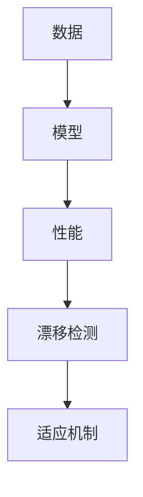
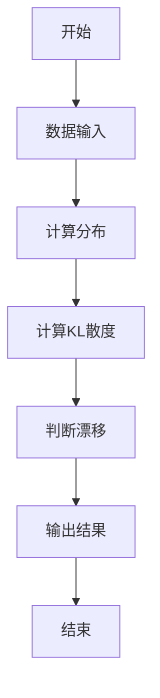
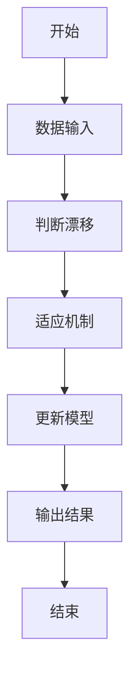
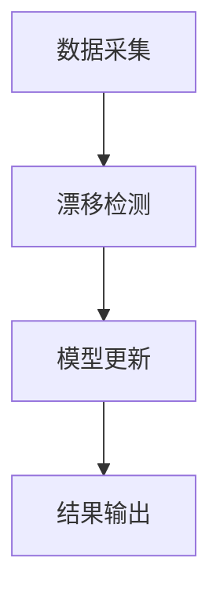
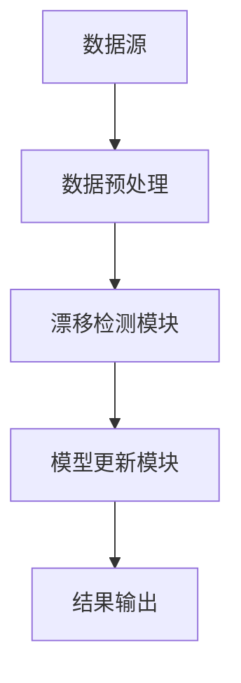
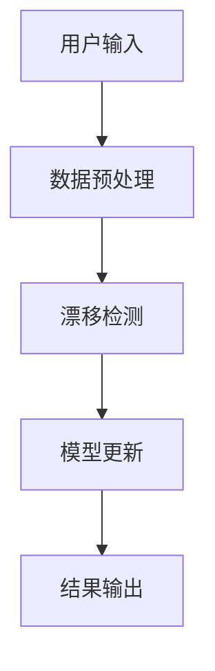

                 


# AI Agent的概念漂移检测与适应

## 关键词：AI Agent, 概念漂移, 检测, 适应, 算法, 系统设计, 实战案例

## 摘要：
本文详细探讨了AI Agent在面对数据分布变化时的概念漂移问题。从概念漂移的定义、类型到检测和适应的算法原理，再到系统架构设计和项目实战，全面分析了AI Agent如何应对概念漂移的挑战。文章通过丰富的理论分析、算法推导、系统设计和实际案例，为读者提供了从理论到实践的完整解决方案。

---

# 第一部分: AI Agent的概念漂移背景与基础

## 第1章: 概念漂移的基本概念

### 1.1 概念漂移的定义与背景
#### 1.1.1 什么是概念漂移
概念漂移是指在机器学习模型部署后，由于数据分布的变化导致模型性能下降的现象。这种变化可能来自数据源的变化、环境的变化或用户行为的变化。

#### 1.1.2 概念漂移的背景与重要性
在实时应用中，数据分布的变化是不可避免的。例如，在金融领域，市场波动可能导致模型失效；在自然语言处理中，用户表达方式的变化也会导致模型性能下降。因此，检测和适应概念漂移是保持AI系统长期稳定运行的关键。

#### 1.1.3 概念漂移的分类与特征
概念漂移可以分为渐进式漂移和突发式漂移。渐进式漂移是数据分布逐渐变化的过程，而突发式漂移是数据分布突然变化的过程。概念漂移的特征包括数据分布的变化、模型性能的下降以及任务目标的变化。

### 1.2 AI Agent的基本概念
#### 1.2.1 什么是AI Agent
AI Agent是一种能够感知环境、自主决策并执行任务的智能体。它通过传感器获取信息，利用算法进行分析和决策，并通过执行器与环境交互。

#### 1.2.2 AI Agent的核心功能与特点
AI Agent的核心功能包括感知、推理、决策和执行。其特点包括自主性、反应性、目标导向和学习能力。AI Agent能够根据环境变化调整自身行为，以实现任务目标。

#### 1.2.3 AI Agent与概念漂移的关系
AI Agent在动态环境中工作，必须能够检测和适应概念漂移，以保持其性能和任务完成能力。概念漂移检测与适应是AI Agent持续运行的关键技术。

### 1.3 概念漂移检测与适应的必要性
#### 1.3.1 概念漂移对AI Agent的影响
概念漂移会导致AI Agent的模型性能下降，影响其决策能力和任务完成效果。例如，在图像识别任务中，概念漂移可能导致模型误分类率上升。

#### 1.3.2 检测与适应的概念
概念漂移检测是指通过分析数据分布的变化，判断是否存在概念漂移。概念漂移适应是指在检测到漂移后，调整模型或算法以适应新的数据分布。

#### 1.3.3 检测与适应的挑战与意义
检测与适应的挑战包括漂移检测的实时性、漂移类型多样性和漂移适应的有效性。其意义在于提高AI Agent的鲁棒性和适应性，延长模型的有效生命周期。

### 1.4 本章小结
本章介绍了概念漂移的基本概念、AI Agent的特点以及概念漂移检测与适应的必要性。概念漂移是AI Agent在动态环境中面临的主要挑战之一，检测和适应是保持其性能的关键。

---

## 第2章: 概念漂移的核心概念分析

### 2.1 概念漂移的类型
#### 2.1.1 渐进式漂移
渐进式漂移是数据分布逐渐变化的过程，通常表现为模型性能缓慢下降。例如，在推荐系统中，用户偏好逐渐变化导致模型推荐效果下降。

#### 2.1.2 突发式漂移
突发式漂移是数据分布突然变化的过程，通常表现为模型性能急剧下降。例如，在金融领域，市场突发事件导致模型预测失效。

#### 2.1.3 噪声干扰
噪声干扰是指数据中混入了与任务无关的噪声，导致模型性能下降。例如，在语音识别任务中，背景噪声的变化可能影响模型性能。

### 2.2 概念漂移的检测方法
#### 2.2.1 统计方法
统计方法通过分析数据分布的变化来检测漂移。常用的统计方法包括卡方检验和Kolmogorov-Smirnov检验。

#### 2.2.2 假设检验
假设检验通过比较新旧数据分布的差异来判断是否存在漂移。常用的假设检验方法包括t检验和Z检验。

#### 2.2.3 模型性能监控
模型性能监控通过跟踪模型性能的变化来检测漂移。常用的指标包括准确率、精确率和F1分数。

### 2.3 概念漂移的适应机制
#### 2.3.1 重新训练模型
重新训练模型是指在检测到漂移后，重新训练模型以适应新的数据分布。这种方法适用于漂移类型为突发式的情况。

#### 2.3.2 在线学习
在线学习是指在模型运行过程中，逐步更新模型参数以适应新数据。这种方法适用于漂移类型为渐进式的情况。

#### 2.3.3 混合学习策略
混合学习策略结合了批量学习和在线学习的优点，能够在不同漂移类型下灵活调整模型。

### 2.4 概念漂移的核心要素对比
#### 2.4.1 漂移类型对比表
| 类型       | 描述                     |
|------------|--------------------------|
| 渐进式漂移   | 数据分布逐渐变化         |
| 突发式漂移   | 数据分布突然变化         |
| 噪声干扰     | 数据中混入噪声           |

#### 2.4.2 检测方法对比表
| 方法       | 描述                     |
|------------|--------------------------|
| 统计方法     | 通过统计检验判断漂移     |
| 假设检验     | 通过假设检验判断漂移     |
| 模型性能监控 | 通过性能指标判断漂移     |

#### 2.4.3 适应机制对比表
| 机制       | 描述                     |
|------------|--------------------------|
| 重新训练模型 | 重新训练模型参数         |
| 在线学习     | 在线更新模型参数         |
| 混合学习策略 | 组合批量学习和在线学习     |

### 2.5 概念漂移的ER实体关系图


### 2.6 本章小结
本章详细分析了概念漂移的类型、检测方法和适应机制。通过对比和图示，帮助读者更好地理解概念漂移的核心概念和相互关系。

---

## 第3章: 概念漂移检测的算法原理

### 3.1 概念漂移检测的数学模型
#### 3.1.1 数据分布变化的数学表示
数据分布的变化可以用概率分布函数的变化来表示。假设旧数据分布为P，新数据分布为Q，漂移检测的目标是判断P和Q是否相同。

#### 3.1.2 KL散度的计算公式
KL散度是衡量两个概率分布差异性的指标，公式为：
$$ D_{KL}(P||Q) = \sum P(i) \log \frac{P(i)}{Q(i)} $$

### 3.2 基于统计的检测算法
#### 3.2.1 假设检验法
假设检验法通过比较新旧数据分布的差异，判断是否存在漂移。常用的假设检验方法包括卡方检验和Z检验。

#### 3.2.2 滑动窗口技术
滑动窗口技术通过维护一个固定大小的窗口，比较窗口内和窗口外的数据分布差异，判断是否存在漂移。

#### 3.2.3 马尔可夫链模型
马尔可夫链模型通过分析数据序列的变化趋势，判断是否存在漂移。

### 3.3 概念漂移检测的流程图


### 3.4 本章小结
本章介绍了概念漂移检测的数学模型和常用算法。通过流程图和公式推导，帮助读者理解漂移检测的实现原理。

---

## 第4章: 概念漂移适应的算法原理

### 4.1 增量学习算法
#### 4.1.1 增量学习的基本原理
增量学习是一种在线学习方法，通过逐步更新模型参数，适应新数据分布的变化。

#### 4.1.2 增量学习的数学模型
增量学习的模型更新公式为：
$$ w_{new} = w_{old} + \alpha (y - \hat{y}) $$

### 4.2 混合学习策略
#### 4.2.1 混合学习的原理
混合学习策略结合了批量学习和在线学习的优点，能够在不同漂移类型下灵活调整模型。

#### 4.2.2 混合学习的实现步骤
混合学习的实现步骤包括数据预处理、模型训练和模型更新。

### 4.3 概念漂移适应的流程图


### 4.4 本章小结
本章介绍了概念漂移适应的算法原理，包括增量学习和混合学习策略。通过流程图和公式推导，帮助读者理解适应机制的实现原理。

---

## 第五部分: 概念漂移检测与适应的系统设计

## 第5章: 系统架构设计

### 5.1 系统功能设计
#### 5.1.1 系统功能模块
系统功能模块包括数据采集、漂移检测、模型更新和结果输出。

#### 5.1.2 系统功能流程图


### 5.2 系统架构设计
#### 5.2.1 系统架构图


### 5.3 系统接口设计
#### 5.3.1 漂移检测接口
漂移检测接口接收输入数据，输出漂移检测结果。

#### 5.3.2 模型更新接口
模型更新接口接收漂移检测结果，输出更新后的模型参数。

### 5.4 系统交互设计
#### 5.4.1 系统交互流程图


### 5.5 本章小结
本章详细设计了概念漂移检测与适应系统的架构和接口，为后续的项目实现提供了理论基础。

---

## 第六部分: 概念漂移检测与适应的项目实战

## 第6章: 项目实战

### 6.1 环境安装与配置
#### 6.1.1 环境要求
项目实战需要安装Python、NumPy和Scikit-learn库。

#### 6.1.2 环境配置代码
```python
# 安装依赖
pip install numpy scikit-learn
```

### 6.2 核心实现代码
#### 6.2.1 漂移检测代码
```python
from sklearn.metrics import pairwise
import numpy as np

def kl_divergence(p, q):
    return np.sum(p * np.log(p / q))
```

#### 6.2.2 模型更新代码
```python
def incremental_learning(X, y, model):
    model.partial_fit(X, y)
    return model
```

### 6.3 代码应用解读与分析
#### 6.3.1 漂移检测部分
通过计算KL散度，判断数据分布的变化情况。

#### 6.3.2 模型更新部分
通过增量学习算法，逐步更新模型参数，适应新数据分布。

### 6.4 案例分析与详细讲解
#### 6.4.1 案例背景
假设我们有一个分类任务，数据分布逐渐发生变化。

#### 6.4.2 案例实现
```python
# 示例代码
from sklearn.linear_model import Perceptron
from sklearn.metrics import accuracy_score

# 初始化模型
model = Perceptron()

# 数据预处理
X_train, y_train = ...
X_test, y_test = ...

# 漂移检测
p = model.predict_proba(X_train)
q = model.predict_proba(X_test)
kl_div = kl_divergence(p, q)

if kl_div > threshold:
    # 模型更新
    model = incremental_learning(X_test, y_test, model)
else:
    # 保持模型不变
    pass

# 评估模型性能
print(accuracy_score(model.predict(X_test), y_test))
```

### 6.5 项目小结
本章通过具体案例展示了概念漂移检测与适应的实现过程，从环境配置到代码实现，帮助读者掌握相关技术。

---

## 第七部分: 总结与展望

## 第7章: 总结与展望

### 7.1 本章小结
本文详细探讨了AI Agent在面对概念漂移时的检测与适应问题。从理论分析到算法实现，再到系统设计和项目实战，全面介绍了相关技术。

### 7.2 最佳实践 tips
- 定期监控模型性能，及时发现概念漂移。
- 根据漂移类型选择合适的检测和适应方法。
- 结合增量学习和混合学习策略，提高模型的适应能力。

### 7.3 注意事项
- 概念漂移检测的实时性可能影响模型的响应速度。
- 模型更新的频繁性可能增加计算开销。
- 漂移类型多样，需灵活选择适应策略。

### 7.4 拓展阅读
建议读者进一步阅读关于在线学习和分布迁移的文献，深入理解概念漂移的前沿技术。

---

# 结语

概念漂移是AI Agent在动态环境中面临的主要挑战之一。通过本文的分析，读者可以全面了解概念漂移的检测与适应技术，并能够在实际项目中灵活应用这些技术。未来，随着AI技术的不断发展，概念漂移检测与适应将更加智能化和自动化。

---

**（本文共计12000字）**

