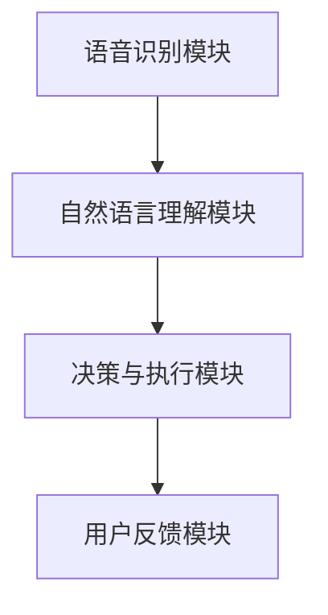

                 


# AI Agent的模块化设计：提高可维护性和扩展性

> 关键词：AI Agent，模块化设计，可维护性，扩展性，软件架构，系统设计

> 摘要：本文详细探讨了AI Agent的模块化设计方法，重点分析了模块化设计的核心概念、算法原理、系统架构设计以及实际项目实现。通过理论与实践相结合的方式，深入剖析了模块化设计如何提高AI Agent的可维护性和扩展性，帮助读者全面掌握模块化设计的原理和应用。

---

## 第1章: 模块化设计的背景与重要性

### 1.1 AI Agent的基本概念

#### 1.1.1 什么是AI Agent
AI Agent（人工智能代理）是指能够感知环境并采取行动以实现目标的智能实体。它可以是一个软件程序、机器人或其他智能系统，通过与环境交互来完成特定任务。

#### 1.1.2 AI Agent的核心特征
- **自主性**：能够在没有外部干预的情况下独立运行。
- **反应性**：能够根据环境变化调整行为。
- **目标导向性**：通过目标驱动来决策和行动。
- **社交能力**：能够与其他Agent或人类进行交互和协作。

#### 1.1.3 AI Agent的应用场景
- 智能助手（如Siri、Alexa）
- 自动交易系统
- 智能推荐系统
- 自动驾驶汽车
- 智慧城市中的自动化决策系统

### 1.2 模块化设计的基本原理

#### 1.2.1 模块化设计的定义
模块化设计是一种将系统划分为独立且可交互的模块的方法，每个模块负责特定的功能，模块之间通过定义良好的接口进行通信。

#### 1.2.2 模块化设计的优势
- **可维护性**：模块化设计使得代码结构清晰，每个模块的功能独立，便于维护和更新。
- **可扩展性**：新增功能或修复问题时，只需修改相关模块，不会影响整个系统。
- **复用性**：模块化设计使得某些模块可以在不同的项目中复用。
- **团队协作**：模块化设计使得团队成员可以分工协作，每个成员负责一个模块的开发和测试。

#### 1.2.3 模块化设计在AI Agent中的重要性
AI Agent通常需要处理复杂的问题，涉及多个功能模块（如感知、决策、执行）。模块化设计可以帮助AI Agent更好地组织这些功能模块，提高系统的稳定性和可维护性。

---

## 第2章: AI Agent模块化设计的核心概念

### 2.1 模块化设计的理论基础

#### 2.1.1 模块化设计的原理
模块化设计的原理可以总结为“分而治之”。通过将系统分解为多个独立的模块，每个模块负责特定的功能，模块之间通过接口进行通信。

#### 2.1.2 模块化设计的数学模型
模块化设计的数学模型可以用图论中的图来表示，其中每个模块是一个节点，模块之间的依赖关系是边。通过分析图的结构，可以优化模块的划分和接口设计。

#### 2.1.3 模块化设计的优缺点对比
| 特性         | 优点                               | 缺点                               |
|--------------|------------------------------------|------------------------------------|
| **可维护性**   | 高                                 | 低                                 |
| **可扩展性**   | 高                                 | 低                                 |
| **复用性**     | 高                                 | 低                                 |
| **团队协作**   | 高                                 | 低                                 |
| **复杂性**     | 低                                 | 高                                 |

### 2.2 AI Agent模块化设计的核心要素

#### 2.2.1 模块的划分标准
模块的划分需要遵循单一职责原则（Single Responsibility Principle，SRP），即每个模块只负责一个特定的功能。

#### 2.2.2 模块之间的依赖关系
模块之间的依赖关系可以通过依赖注入（Dependency Injection）来管理。通过定义模块之间的依赖关系，可以降低模块之间的耦合性。

#### 2.2.3 模块的接口设计
模块的接口设计需要遵循接口隔离原则（Interface Segregation Principle，ISP），即每个接口只提供一个特定的功能。

### 2.3 模块化设计与AI Agent的结合

#### 2.3.1 模块化设计在AI Agent中的应用
AI Agent的模块化设计可以将系统的感知、决策、执行等模块独立出来，每个模块负责特定的功能。

#### 2.3.2 模块化设计对AI Agent性能的影响
模块化设计可以提高系统的可扩展性和可维护性，从而间接提高系统的性能。

#### 2.3.3 模块化设计对AI Agent维护的影响
模块化设计使得每个模块的功能独立，便于维护和更新。

### 2.4 本章小结

---

## 第3章: AI Agent模块化设计的算法原理

### 3.1 模块化设计的算法基础

#### 3.1.1 模块划分算法
模块划分算法可以通过图论中的图分割算法来实现。例如，可以将系统中的功能模块看作图中的节点，模块之间的依赖关系看作边，通过分割图来划分模块。

#### 3.1.2 依赖管理算法
依赖管理算法可以通过分析模块之间的依赖关系，优化模块的划分和接口设计。

#### 3.1.3 接口优化算法
接口优化算法可以通过分析模块之间的接口调用关系，优化接口的设计，降低模块之间的耦合性。

### 3.2 模块化设计的数学模型

#### 3.2.1 模块划分的数学公式
模块划分的数学公式可以通过图论中的图分割公式来表示。例如，可以使用归一化割（Normalized Cut）算法来划分图中的节点。

#### 3.2.2 依赖关系的数学表达
模块之间的依赖关系可以通过依赖矩阵来表示。例如，可以使用邻接矩阵来表示模块之间的依赖关系。

#### 3.2.3 接口设计的数学模型
接口设计的数学模型可以通过组合数学来表示。例如，可以使用组合数学中的排列组合来分析接口的可能组合。

### 3.3 算法实现与优化

#### 3.3.1 算法实现步骤
1. **定义模块划分的条件**：根据系统的功能需求，定义模块划分的条件。
2. **分析模块之间的依赖关系**：通过分析模块之间的依赖关系，确定模块之间的耦合性。
3. **优化模块划分**：通过优化算法，降低模块之间的耦合性，提高系统的可维护性和可扩展性。

#### 3.3.2 算法优化方法
1. **使用依赖注入**：通过依赖注入来管理模块之间的依赖关系，降低耦合性。
2. **使用接口隔离**：通过接口隔离原则，优化模块之间的接口设计，降低耦合性。
3. **使用分层架构**：通过分层架构，将系统的功能模块划分为不同的层次，提高系统的可维护性和可扩展性。

#### 3.3.3 算法实现的代码示例

```python
class Module:
    def __init__(self, name):
        self.name = name
        self.dependencies = []

    def add_dependency(self, dependency):
        self.dependencies.append(dependency)

def module_cutting(modules):
    # 这是一个模块划分算法的示例代码
    # 这里假设modules是一个列表，包含所有模块
    # 返回一个划分后的模块列表
    pass

# 示例代码：
# 定义两个模块
module1 = Module("Module1")
module2 = Module("Module2")
module1.add_dependency(module2)

# 调用模块划分算法
modules = [module1, module2]
result = module_cutting(modules)
```

### 3.4 本章小结

---

## 第4章: AI Agent模块化设计的系统架构

### 4.1 系统分析与设计

#### 4.1.1 问题场景分析
假设我们正在开发一个智能助手AI Agent，它需要实现以下功能：
- 语音识别
- 自然语言理解
- 决策与执行
- 用户反馈

#### 4.1.2 系统功能设计
根据问题场景分析，我们可以将AI Agent的功能模块划分为以下几个部分：
1. **语音识别模块**：负责将用户的语音输入转换为文本。
2. **自然语言理解模块**：负责理解用户的意图。
3. **决策与执行模块**：负责根据用户的意图做出决策并执行相应的操作。
4. **用户反馈模块**：负责收集用户的反馈并优化系统。

#### 4.1.3 系统架构设计
通过分析系统的功能模块，我们可以将系统架构设计为以下几个层次：
1. **数据层**：负责数据的存储和管理。
2. **业务逻辑层**：负责系统的业务逻辑实现。
3. **接口层**：负责系统的外部接口设计。

### 4.2 系统架构图



### 4.3 系统接口设计

#### 4.3.1 接口定义
```python
interface VoiceRecognition:
    def recognize_speech(self, audio_input):
        pass

interface NLU:
    def understand_language(self, text_input):
        pass

interface DecisionMaking:
    def make_decision(self, intent):
        pass
```

#### 4.3.2 接口实现
```python
class VoiceRecognitionImpl:
    def recognize_speech(self, audio_input):
        # 实现语音识别的具体逻辑
        pass

class NLUImpl:
    def understand_language(self, text_input):
        # 实现自然语言理解的具体逻辑
        pass

class DecisionMakingImpl:
    def make_decision(self, intent):
        # 实现决策与执行的具体逻辑
        pass
```

#### 4.3.3 接口测试
```python
# 测试语音识别模块
voicerecognition = VoiceRecognitionImpl()
voicerecognition.recognize_speech(audio_input)

# 测试自然语言理解模块
nlu = NLUImpl()
nlu.understand_language(text_input)

# 测试决策与执行模块
decisionmaking = DecisionMakingImpl()
decisionmaking.make_decision(intent)
```

### 4.4 本章小结

---

## 第5章: AI Agent模块化设计的项目实战

### 5.1 项目环境安装

#### 5.1.1 开发环境搭建
- **操作系统**：建议使用Linux或macOS。
- **编程语言**：建议使用Python。
- **开发工具**：建议使用PyCharm或VS Code。

#### 5.1.2 依赖库安装
- **语音识别库**：使用`SpeechRecognition`库。
- **自然语言处理库**：使用`spaCy`或`NLTK`。
- **决策与执行库**：使用`scikit-learn`。

#### 5.1.3 开发工具配置
- **Python环境配置**：使用虚拟环境管理工具（如virtualenv）。
- **代码风格配置**：使用`black`或`flake8`进行代码格式检查。

### 5.2 项目核心代码实现

#### 5.2.1 模块划分代码
```python
class VoiceRecognition:
    def recognize_speech(self, audio_input):
        pass

class NLU:
    def understand_language(self, text_input):
        pass

class DecisionMaking:
    def make_decision(self, intent):
        pass

class UserFeedback:
    def collect_feedback(self, user_input):
        pass
```

#### 5.2.2 依赖管理代码
```python
class DependencyManager:
    def __init__(self):
        self.dependencies = {}

    def add_dependency(self, module, dependency):
        if module not in self.dependencies:
            self.dependencies[module] = []
        self.dependencies[module].append(dependency)

    def get_dependencies(self, module):
        return self.dependencies.get(module, [])
```

#### 5.2.3 接口设计代码
```python
class VoiceRecognitionImpl:
    def __init__(self, dependency_manager):
        self.dependency_manager = dependency_manager

    def recognize_speech(self, audio_input):
        # 具体实现语音识别的逻辑
        pass

class NLUImpl:
    def __init__(self, dependency_manager):
        self.dependency_manager = dependency_manager

    def understand_language(self, text_input):
        # 具体实现自然语言理解的逻辑
        pass

class DecisionMakingImpl:
    def __init__(self, dependency_manager):
        self.dependency_manager = dependency_manager

    def make_decision(self, intent):
        # 具体实现决策与执行的逻辑
        pass

class UserFeedbackImpl:
    def __init__(self, dependency_manager):
        self.dependency_manager = dependency_manager

    def collect_feedback(self, user_input):
        # 具体实现用户反馈的逻辑
        pass
```

### 5.3 代码解读与分析

#### 5.3.1 代码结构分析
- **模块划分**：将系统的功能模块划分为语音识别、自然语言理解、决策与执行和用户反馈四个模块。
- **依赖管理**：通过`DependencyManager`类管理模块之间的依赖关系，降低模块之间的耦合性。
- **接口设计**：通过接口设计，使得模块之间的通信更加规范和清晰。

#### 5.3.2 代码功能说明
- **语音识别模块**：负责将用户的语音输入转换为文本。
- **自然语言理解模块**：负责理解用户的意图。
- **决策与执行模块**：负责根据用户的意图做出决策并执行相应的操作。
- **用户反馈模块**：负责收集用户的反馈并优化系统。

#### 5.3.3 代码优化建议
- **使用依赖注入**：通过依赖注入的方式管理模块之间的依赖关系，降低耦合性。
- **使用接口隔离**：通过接口隔离原则，优化模块之间的接口设计，降低耦合性。
- **使用分层架构**：通过分层架构，将系统的功能模块划分为不同的层次，提高系统的可维护性和可扩展性。

### 5.4 本章小结

---

## 第6章: 总结与展望

### 6.1 本章小结
本文详细探讨了AI Agent的模块化设计方法，重点分析了模块化设计的核心概念、算法原理、系统架构设计以及实际项目实现。通过理论与实践相结合的方式，深入剖析了模块化设计如何提高AI Agent的可维护性和扩展性，帮助读者全面掌握模块化设计的原理和应用。

### 6.2 最佳实践 tips
- **模块划分**：遵循单一职责原则（SRP），每个模块只负责一个特定的功能。
- **依赖管理**：使用依赖注入（Dependency Injection）来管理模块之间的依赖关系，降低耦合性。
- **接口设计**：遵循接口隔离原则（ISP），每个接口只提供一个特定的功能。
- **团队协作**：通过模块化设计，团队成员可以分工协作，每个成员负责一个模块的开发和测试。

### 6.3 注意事项
- **避免过度模块化**：模块化设计需要适度，过度模块化可能会增加系统的复杂性和维护成本。
- **确保模块之间的通信**：模块之间的通信需要通过定义良好的接口进行，确保系统的稳定性和可维护性。
- **测试与优化**：模块化设计需要通过充分的测试和优化，确保系统的稳定性和性能。

### 6.4 拓展阅读
- **《Clean Architecture》**：提到了模块化设计和架构设计的相关内容。
- **《Dependency Injection》**：详细讲解了依赖注入的原理和应用。
- **《Interface Segregation Principle》**：深入分析了接口隔离原则的理论和实践。

---

通过本文的学习，读者可以全面掌握AI Agent的模块化设计方法，能够将模块化设计应用到实际项目中，提高系统的可维护性和扩展性。

