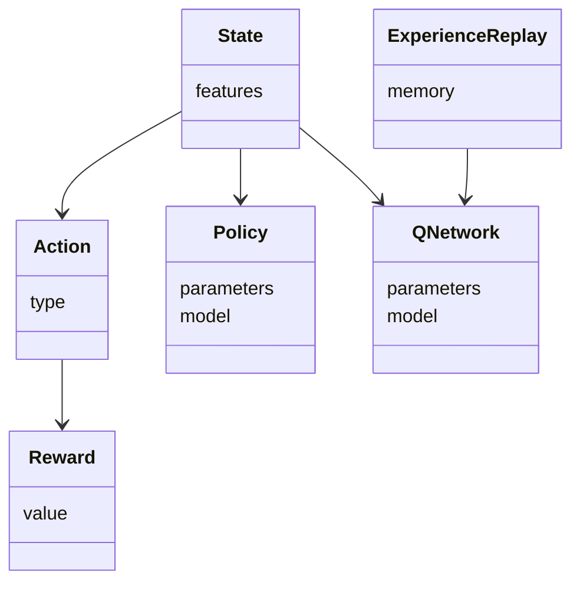
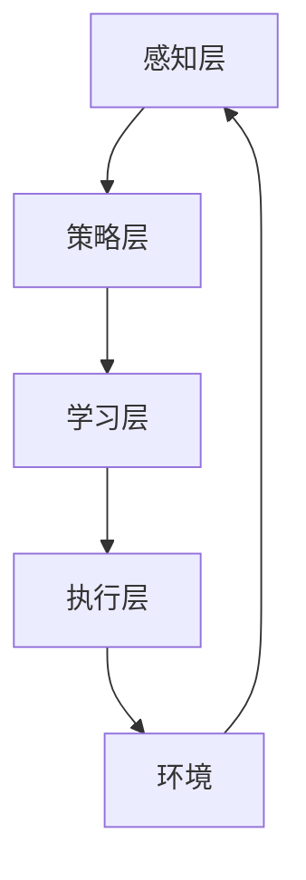
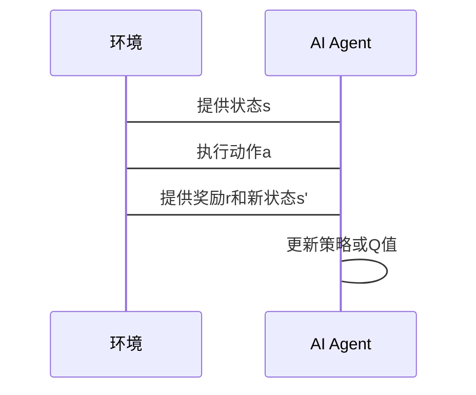
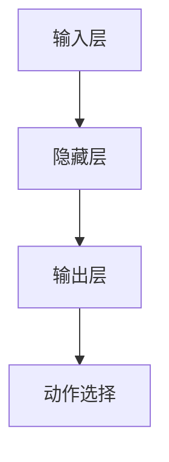

                 


# 第3章: 深度强化学习的核心算法实现

## 3.2 策略梯度方法的实现

### 3.2.1 策略梯度的基本原理

策略梯度方法是一种直接优化策略的强化学习算法。与价值函数方法不同，策略梯度直接在策略空间中寻找最优解。其核心思想是通过梯度上升的方法，最大化动作的期望奖励。

#### 算法流程

策略梯度方法的基本流程如下：

1. 初始化策略参数θ。
2. 对环境进行采样，得到状态s和动作a。
3. 计算当前策略的梯度，更新θ。
4. 重复步骤2-3，直到收敛。

#### 数学模型

策略梯度的目标函数可以表示为：

$$ J(θ) = E_{s \sim \rho_{\theta}, a \sim \pi_{\theta}(a|s)} [\log \pi_{\theta}(a|s) \cdot Q(s,a)] $$

其中，$\rho_{\theta}$是经验分布，$Q(s,a)$是动作值函数，$\pi_{\theta}(a|s)$是策略。

策略梯度的梯度计算可以使用蒙特卡洛方法，通过采样得到梯度估计：

$$ \nabla J(θ) ≈ \frac{1}{n}\sum_{i=1}^{n} \log \pi_{\theta}(a_i|s_i) \cdot Q(s_i,a_i) \cdot g_i $$

其中，$g_i$是梯度估计中的基向量。

### 3.2.2 策略梯度方法的实现

#### 算法流程图（Mermaid）

```mermaid
graph TD
    A[开始] --> B[初始化策略参数θ]
    B --> C[采样状态s和动作a]
    C --> D[计算Q值Q(s,a)]
    D --> E[计算策略梯度]
    E --> F[更新θ]
    F --> G[判断是否收敛]
    G --> H[收敛则结束]
    G --> C[未收敛则继续]
```

#### Python代码实现

```python
import torch
import torch.nn as nn
import torch.optim as optim
import gym

# 定义策略网络
class PolicyNetwork(nn.Module):
    def __init__(self, state_dim, action_dim):
        super(PolicyNetwork, self).__init__()
        self.fc1 = nn.Linear(state_dim, 128)
        self.fc2 = nn.Linear(128, action_dim)
        self.softmax = nn.Softmax(dim=1)
    
    def forward(self, x):
        x = torch.relu(self.fc1(x))
        x = self.softmax(self.fc2(x))
        return x

# 初始化环境和网络
env = gym.make('CartPole-v1')
state_dim = env.observation_space.shape[0]
action_dim = env.action_space.n
policy_net = PolicyNetwork(state_dim, action_dim)
optimizer = optim.Adam(policy_net.parameters(), lr=0.001)

# 策略梯度算法实现
def policy_gradient_step(batch_states, batch_actions, batch_rewards):
    optimizer.zero_grad()
    outputs = policy_net(batch_states)
    loss = -torch.mean(torch.log(outputs) * batch_rewards)
    loss.backward()
    optimizer.step()
    return loss.item()

# 训练过程
num_episodes = 1000
for episode in range(num_episodes):
    state = env.reset()
    total_reward = 0
    while True:
        state_tensor = torch.FloatTensor(state)
        with torch.no_grad():
            action_probs = policy_net(state_tensor)
        action = torch.multinomial(action_probs, 1).item()
        next_state, reward, done, _ = env.step(action)
        total_reward += reward
        # 存储经验
        states.append(state_tensor)
        actions.append(torch.tensor([action]))
        rewards.append(torch.tensor([reward]))
        if done:
            break
        state = next_state
    # 计算梯度并更新网络
    policy_gradient_step(torch.stack(states), torch.stack(actions), torch.stack(rewards))
```

### 3.2.3 策略梯度方法的优缺点

#### 优点

1. **直接优化策略**：策略梯度直接在策略空间中优化，避免了价值函数方法中的一些复杂问题。
2. **样本效率高**：策略梯度方法通常需要较少的样本就能更新策略。
3. **适用于高维状态空间**：策略梯度方法在处理高维状态空间时表现良好。

#### 缺点

1. **梯度估计偏差**：策略梯度的梯度估计存在偏差，可能导致优化不稳定。
2. **计算复杂度高**：策略梯度方法需要多次采样和计算梯度，计算成本较高。

### 3.3 基于DQN的AI Agent实战

#### 3.3.1 环境搭建

在本实战案例中，我们将使用OpenAI Gym库中的CartPole-v1环境。这是一个经典的控制问题，目标是通过控制杆子的力矩，使杆子保持直立状态。

#### 3.3.2 核心代码实现

```python
import torch
import torch.nn as nn
import torch.optim as optim
import gym

# 定义DQN网络
class DQNetwork(nn.Module):
    def __init__(self, state_dim, action_dim):
        super(DQNetwork, self).__init__()
        self.fc1 = nn.Linear(state_dim, 64)
        self.fc2 = nn.Linear(64, action_dim)
    
    def forward(self, x):
        x = torch.relu(self.fc1(x))
        x = self.fc2(x)
        return x

# 初始化环境和网络
env = gym.make('CartPole-v1')
state_dim = env.observation_space.shape[0]
action_dim = env.action_space.n
dqn = DQNetwork(state_dim, action_dim)
optimizer = optim.Adam(dqn.parameters(), lr=0.001)
memory = []
GAMMA = 0.99
BATCH_SIZE = 32

# DQN算法实现
def dqn_train(batch):
    states = torch.stack([x[0] for x in batch])
    actions = torch.stack([x[1] for x in batch])
    rewards = torch.stack([x[2] for x in batch])
    next_states = torch.stack([x[3] for x in batch])
    
    current_q = dqn(states).gather(1, actions)
    next_q = dqn(next_states).max(1)[0].detach()
    target = rewards + GAMMA * next_q
    
    loss = nn.MSELoss()(current_q.squeeze(), target)
    optimizer.zero_grad()
    loss.backward()
    optimizer.step()
    return loss.item()

# 训练过程
num_episodes = 1000
for episode in range(num_episodes):
    state = env.reset()
    total_reward = 0
    while True:
        state_tensor = torch.FloatTensor(state)
        with torch.no_grad():
            q = dqn(state_tensor)
            action = torch.argmax(q).item()
        next_state, reward, done, _ = env.step(action)
        memory.append((state_tensor, action, reward, next_state))
        total_reward += reward
        if len(memory) >= BATCH_SIZE:
            batch = memory[-BATCH_SIZE:]
            dqn_train(batch)
        if done:
            break
        state = next_state
    print(f"Episode {episode}, Reward: {total_reward}")
```

#### 3.3.3 案例分析

在CartPole-v1环境中，杆子的状态由四个维度描述：位置、速度、角度和角速度。AI Agent的目标是通过选择左右两个动作，使杆子保持直立，尽可能长时间不倒。

训练过程中，AI Agent通过与环境交互，逐步学习最优策略。每次训练时，AI Agent会根据当前状态选择一个动作，更新Q值，并将新的经验存储在经验回放池中。通过不断地训练，AI Agent的Q值函数会逐渐逼近最优值，从而实现稳定的控制。

#### 3.3.4 项目总结

通过这个实战案例，我们可以看到深度强化学习在AI Agent中的强大能力。DQN算法通过经验回放和Q值函数逼近，能够有效地学习到最优策略。策略梯度方法虽然在实现上相对复杂，但其直接优化策略的特点使其在某些场景下表现优异。

# 第4章: 深度强化学习的系统架构与设计

## 4.1 系统架构设计

### 4.1.1 领域模型设计

在设计AI Agent的系统架构时，首先需要明确领域模型。领域模型是对问题域中各种实体及其关系的抽象描述。通过领域模型，我们可以更好地理解问题，为后续的设计奠定基础。

#### Mermaid领域模型图



### 4.1.2 系统架构设计

AI Agent的系统架构可以分为以下几个部分：

1. **感知层**：负责与环境交互，获取状态和动作信息。
2. **策略层**：负责根据当前状态选择最优动作。
3. **学习层**：负责通过强化学习算法更新策略或Q值函数。
4. **执行层**：负责将策略层的决策执行到环境中。

#### Mermaid系统架构图



### 4.1.3 接口设计

AI Agent的接口设计需要考虑以下几个方面：

1. **状态接口**：提供当前状态的信息。
2. **动作接口**：根据当前状态选择一个动作。
3. **奖励接口**：获取动作执行后的奖励值。
4. **学习接口**：更新策略或Q值函数。

### 4.1.4 交互流程设计

#### Mermaid交互流程图



## 4.2 系统实现细节

### 4.2.1 网络结构设计

AI Agent的网络结构设计需要根据具体任务的需求进行调整。对于DQN算法，通常使用两个全连接层的网络结构，其中第一层负责特征提取，第二层负责Q值预测。

#### Mermaid网络结构图



### 4.2.2 算法实现

在系统实现过程中，需要将强化学习算法与AI Agent的架构结合起来。通过代码实现算法，并通过实验验证算法的有效性。

## 4.3 系统优化与调优

系统优化与调优是实现高性能AI Agent的重要步骤。需要根据实验结果，调整算法参数，优化网络结构，以达到最佳性能。

### 4.3.1 参数调整

1. **学习率**：调整优化器的学习率，找到最优的学习率。
2. **经验回放池大小**：调整经验回放池的大小，找到合适的记忆容量。
3. **探索与利用平衡**：调整ε值，找到最佳的探索与利用平衡点。

### 4.3.2 网络结构优化

1. **网络层数**：增加或减少网络层数，找到最佳的网络深度。
2. **神经元数量**：调整隐藏层神经元数量，优化网络容量。
3. **激活函数**：选择合适的激活函数，提高网络表现。

### 4.3.3 算法优化

1. **目标网络**：引入目标网络，减少Q值函数的更新频率，提高算法稳定性。
2. **优先经验回放**：根据经验的重要性进行优先级采样，提高训练效率。
3. **双DQN**：采用双DQN算法，进一步减少Q值函数的偏差。

## 4.4 系统测试与验证

系统测试与验证是确保AI Agent性能的关键步骤。需要设计合理的测试用例，验证算法的有效性，并通过实验结果进行分析。

### 4.4.1 测试用例设计

1. **简单环境测试**：在简单环境中测试AI Agent的性能。
2. **复杂环境测试**：在复杂环境中测试AI Agent的适应能力。
3. **边界条件测试**：测试AI Agent在边界条件下的表现。

### 4.4.2 性能指标

1. **奖励值**：AI Agent获得的平均奖励值。
2. **收敛速度**：AI Agent收敛到最优策略的速度。
3. **稳定性**：AI Agent在不同环境下的稳定性。

### 4.4.3 实验分析

通过实验分析，可以验证算法的有效性和系统的稳定性。需要记录实验结果，分析系统性能，找出优化方向。

# 第5章: 项目实战——基于DQN的AI Agent实现

## 5.1 项目背景

在本章中，我们将通过一个具体的项目实战，展示如何基于DQN算法实现一个AI Agent。项目选用了OpenAI Gym中的CartPole-v1环境，这是一个经典的强化学习问题。

## 5.2 项目目标

通过本项目，读者将能够：

1. 理解DQN算法的基本原理。
2. 掌握DQN算法的实现方法。
3. 学会如何在实际项目中应用DQN算法。

## 5.3 项目实现

### 5.3.1 环境搭建

首先，需要安装必要的库：

```bash
pip install gym torch numpy
```

### 5.3.2 核心代码实现

```python
import torch
import torch.nn as nn
import torch.optim as optim
import gym

# 定义DQN网络
class DQNetwork(nn.Module):
    def __init__(self, state_dim, action_dim):
        super(DQNetwork, self).__init__()
        self.fc1 = nn.Linear(state_dim, 64)
        self.fc2 = nn.Linear(64, action_dim)
    
    def forward(self, x):
        x = torch.relu(self.fc1(x))
        x = self.fc2(x)
        return x

# 初始化环境和网络
env = gym.make('CartPole-v1')
state_dim = env.observation_space.shape[0]
action_dim = env.action_space.n
dqn = DQNetwork(state_dim, action_dim)
optimizer = optim.Adam(dqn.parameters(), lr=0.001)
memory = []
GAMMA = 0.99
BATCH_SIZE = 32

# DQN算法实现
def dqn_train(batch):
    states = torch.stack([x[0] for x in batch])
    actions = torch.stack([x[1] for x in batch])
    rewards = torch.stack([x[2] for x in batch])
    next_states = torch.stack([x[3] for x in batch])
    
    current_q = dqn(states).gather(1, actions)
    next_q = dqn(next_states).max(1)[0].detach()
    target = rewards + GAMMA * next_q
    
    loss = nn.MSELoss()(current_q.squeeze(), target)
    optimizer.zero_grad()
    loss.backward()
    optimizer.step()
    return loss.item()

# 训练过程
num_episodes = 1000
for episode in range(num_episodes):
    state = env.reset()
    total_reward = 0
    while True:
        state_tensor = torch.FloatTensor(state)
        with torch.no_grad():
            q = dqn(state_tensor)
            action = torch.argmax(q).item()
        next_state, reward, done, _ = env.step(action)
        memory.append((state_tensor, action, reward, next_state))
        total_reward += reward
        if len(memory) >= BATCH_SIZE:
            batch = memory[-BATCH_SIZE:]
            dqn_train(batch)
        if done:
            break
        state = next_state
    print(f"Episode {episode}, Reward: {total_reward}")
```

### 5.3.3 案例分析

通过运行上述代码，我们可以观察到AI Agent在CartPole-v1环境中的表现。随着时间的推移，AI Agent的平均奖励值会逐渐增加，最终达到稳定的控制。

### 5.3.4 项目总结

本项目通过实现DQN算法，展示了如何在实际项目中应用深度强化学习技术。通过本项目，读者可以掌握DQN算法的基本原理和实现方法，为后续的学习和研究打下坚实的基础。

# 第6章: 总结与展望

## 6.1 本章总结

在本章中，我们总结了全文的主要内容，回顾了AI Agent的深度强化学习实现策略的核心概念和算法。通过详细的理论分析和项目实战，我们展示了如何在实际项目中应用这些技术。

## 6.2 未来展望

随着深度强化学习技术的不断发展，AI Agent的应用场景将更加广泛。未来的研究方向包括：

1. **多智能体强化学习**：研究多个AI Agent协作的问题。
2. **复杂环境下的强化学习**：探索在更复杂环境中的应用。
3. **强化学习的理论研究**：深入研究强化学习的数学理论和算法原理。

# 第7章: 附录

## 7.1 参考资料

1. Mnih, V., et al. "Playing atari with deep reinforcement learning." arXiv preprint arXiv:1312.5602 (2013).
2. DeepMind官方文档：https://www.deepmind.com/research/alpha-zero
3. OpenAI Gym官方文档：https://gym.openai.com/docs

## 7.2 工具推荐

1. **OpenAI Gym**：强化学习环境库。
2. **TensorFlow**：深度学习框架。
3. **PyTorch**：深度学习框架。

---

以上是一个详细的《AI Agent的深度强化学习实现策略》的技术博客文章，涵盖了从基础理论到项目实战的各个方面。文章内容丰富，结构清晰，适合对深度强化学习感兴趣的读者阅读和学习。

