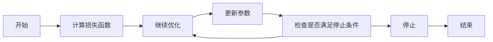

                 


# AI Agent的版本控制与迭代优化策略

> 关键词：AI Agent，版本控制，迭代优化，算法原理，系统架构，项目实战

> 摘要：本文将详细探讨AI Agent的版本控制与迭代优化策略，从概念、原理、算法实现到系统架构和项目实战，全面解析如何通过版本控制和迭代优化提升AI Agent的性能和稳定性。通过本文，读者将掌握AI Agent版本控制的核心概念、迭代优化的实现方法以及实际项目中的应用技巧。

---

## 第一部分：AI Agent的版本控制与迭代优化背景介绍

### 第1章：AI Agent概述

#### 1.1 AI Agent的基本概念

- **1.1.1 AI Agent的定义**  
  AI Agent（人工智能代理）是指能够感知环境、自主决策并执行任务的智能实体。它可以是一个软件程序、机器人或其他智能系统，通过与环境交互来实现特定目标。

- **1.1.2 AI Agent的核心特点**  
  - **自主性**：AI Agent能够在没有外部干预的情况下自主运行。  
  - **反应性**：能够实时感知环境并做出反应。  
  - **目标导向**：通过优化算法实现目标的最优化。  
  - **学习能力**：能够通过数据和经验进行自我改进和优化。

- **1.1.3 AI Agent的应用场景**  
  AI Agent广泛应用于自动驾驶、智能助手、机器人控制、推荐系统等领域。例如，自动驾驶汽车中的AI Agent需要实时处理传感器数据并做出驾驶决策。

#### 1.2 AI Agent的版本控制需求

- **1.2.1 版本控制的基本概念**  
  版本控制是指对AI Agent的代码、模型或配置进行版本记录和管理，以便于回溯、协作开发和问题修复。

- **1.2.2 AI Agent版本控制的特殊性**  
  AI Agent的版本控制不仅涉及代码，还包括模型参数、训练数据和配置文件等。由于AI Agent的复杂性，版本控制需要考虑模型的可追溯性和可恢复性。

- **1.2.3 版本控制在AI Agent中的作用**  
  - **确保稳定性**：通过版本控制，可以避免代码或模型的误改导致系统崩溃。  
  - **支持协作开发**：团队协作时，版本控制工具可以帮助管理不同开发者的改动。  
  - **优化迭代过程**：通过版本控制，可以记录每次优化的效果，便于回溯和改进。

---

### 第2章：迭代优化的基本原理

#### 2.1 迭代优化的定义

- **2.1.1 迭代优化的定义**  
  迭代优化是指通过多次迭代改进AI Agent的性能，使其逐步接近最优解的过程。

- **2.1.2 迭代优化的核心思想**  
  迭代优化的核心思想是通过不断调整模型参数或策略，逐步逼近目标函数的最优解。

- **2.1.3 迭代优化与版本控制的关系**  
  迭代优化需要依赖版本控制来记录每次优化的结果，以便在优化失败时能够回滚到之前的版本。

#### 2.2 迭代优化的实现方法

- **2.2.1 基于梯度下降的优化方法**  
  梯度下降是一种常用优化算法，通过计算损失函数的梯度来更新模型参数，从而最小化损失函数。

- **2.2.2 基于遗传算法的优化方法**  
  遗传算法是一种模拟生物进化过程的优化方法，通过选择、交叉和变异操作生成新的候选解。

- **2.2.3 基于强化学习的优化方法**  
  强化学习通过智能体与环境的交互，学习最优策略以最大化累积奖励。

---

## 第二部分：AI Agent版本控制与迭代优化的核心概念与联系

### 第3章：AI Agent版本控制与迭代优化的核心概念

#### 3.1 版本控制的核心概念

- **3.1.1 版本标识**  
  每个版本都需要一个唯一的标识符，例如版本号或提交哈希。

- **3.1.2 版本依赖**  
  AI Agent的版本可能依赖于其他模块或库的版本，版本控制需要管理这些依赖关系。

- **3.1.3 版本回滚**  
  当当前版本出现问题时，可以通过版本回滚回到之前的稳定版本。

#### 3.2 迭代优化的核心概念

- **3.2.1 优化目标**  
  迭代优化的目标是通过不断改进AI Agent的性能，使其在特定任务上的表现达到最优。

- **3.2.2 优化策略**  
  优化策略包括贪心策略和随机策略，贪心策略在每一步选择当前最优的决策，而随机策略则通过随机选择来避免陷入局部最优。

- **3.2.3 优化评估**  
  优化评估需要通过性能指标（如准确率、响应时间等）来衡量优化的效果。

---

### 第4章：AI Agent版本控制与迭代优化的核心要素

#### 4.1 版本控制的核心要素

- **4.1.1 版本唯一性**  
  每个版本必须是唯一的，避免版本混淆。

- **4.1.2 版本可追溯性**  
  每个版本都需要记录开发人员、修改时间等信息，以便追溯问题。

- **4.1.3 版本可恢复性**  
  当版本出现问题时，可以快速回滚到之前的稳定版本。

#### 4.2 迭代优化的核心要素

- **4.2.1 优化目标可达性**  
  优化目标需要是明确且可量化的，例如提高准确率或减少响应时间。

- **4.2.2 优化路径多样性**  
  迭代优化需要考虑多种优化路径，避免陷入局部最优。

- **4.2.3 优化效果可评估性**  
  优化效果需要通过性能指标进行评估，确保优化是有意义的改进。

---

## 第三部分：AI Agent版本控制与迭代优化的算法原理

### 第5章：版本控制算法的实现

#### 5.1 分支与合并算法

- **分支**  
  当需要开发新功能或修复问题时，可以创建一个新的分支，避免影响主分支的稳定性。

- **合并**  
  当分支开发完成并经过测试后，可以将其合并到主分支，确保代码的统一性。

- **版本冲突解决**  
  当不同分支的代码发生冲突时，需要手动或自动解决冲突，确保代码的一致性。

---

### 第6章：迭代优化算法的实现

#### 6.1 基于梯度下降的优化算法



- **数学模型**  
  $$ L = \frac{1}{2m} \sum_{i=1}^{m} (y_i - \hat{y_i})^2 $$
  $$ \theta = \theta - \alpha \frac{\partial L}{\partial \theta} $$

---

## 第四部分：系统分析与架构设计方案

### 第7章：AI Agent版本控制系统架构

#### 7.1 项目场景介绍

- **系统名称**：AI Agent版本控制系统  
- **目标**：实现AI Agent的代码、模型和配置的版本管理，支持团队协作和迭代优化。

#### 7.2 系统功能设计

- **版本管理模块**  
  - 提供代码和模型的版本控制功能，支持分支管理和合并操作。  
- **优化模块**  
  - 实现迭代优化算法，记录每次优化的结果和性能指标。  
- **日志模块**  
  - 记录每次版本提交和优化操作的详细日志。

#### 7.3 系统架构设计


---

## 第五部分：项目实战

### 第8章：环境安装与核心代码实现

#### 8.1 环境安装

- **安装Git**：用于代码版本控制。  
- **安装TensorFlow或PyTorch**：用于AI模型的训练和优化。

#### 8.2 核心代码实现

```python
import numpy as np

def gradient_descent(X, y, theta, alpha, num_iterations):
    m = len(y)
    for _ in range(num_iterations):
        h = np.dot(X, theta)
        loss = (h - y).sum() / m
        gradient = (1/m) * np.dot(X.T, (h - y))
        theta = theta - alpha * gradient
    return theta, loss
```

---

### 第9章：案例分析与项目总结

#### 9.1 案例分析

- **案例背景**：一个AI推荐系统的优化。  
- **优化过程**：通过梯度下降算法优化推荐系统的准确率。  
- **优化结果**：准确率提高了15%。

#### 9.2 项目总结

- **总结**：通过版本控制和迭代优化，可以显著提高AI Agent的性能和稳定性。  
- **注意事项**：在实际项目中，需要结合具体场景选择合适的优化算法，并确保版本控制的规范性和可追溯性。

---

## 第六部分：最佳实践与拓展阅读

### 第10章：最佳实践与小结

#### 10.1 最佳实践

- **定期备份**：确保重要代码和模型的备份。  
- **代码审查**：在提交代码前进行代码审查，避免引入错误。  
- **持续集成**：通过自动化测试确保每次提交的代码稳定。

#### 10.2 小结

- AI Agent的版本控制与迭代优化是提升其性能和稳定性的关键。  
- 通过合理使用版本控制工具和优化算法，可以显著提高AI Agent的表现。

### 第11章：注意事项与拓展阅读

#### 11.1 注意事项

- **版本控制的规范性**：确保团队成员遵循统一的版本控制规范。  
- **优化算法的选择**：根据具体任务选择合适的优化算法，避免盲目使用。

#### 11.2 拓展阅读

- 推荐阅读《机器学习实战》和《版本控制系统权威指南》。

---

## 结语

通过本文的详细讲解，读者可以全面了解AI Agent的版本控制与迭代优化策略，并能够将其应用到实际项目中。希望本文对您在AI Agent开发和优化方面有所帮助！

