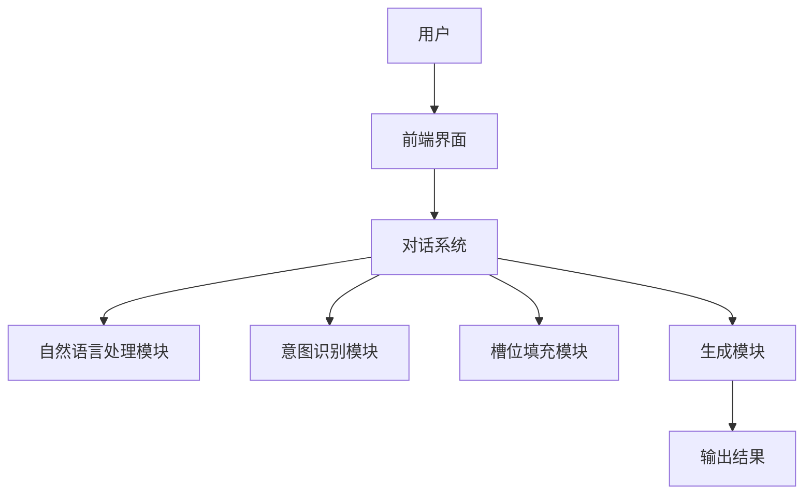
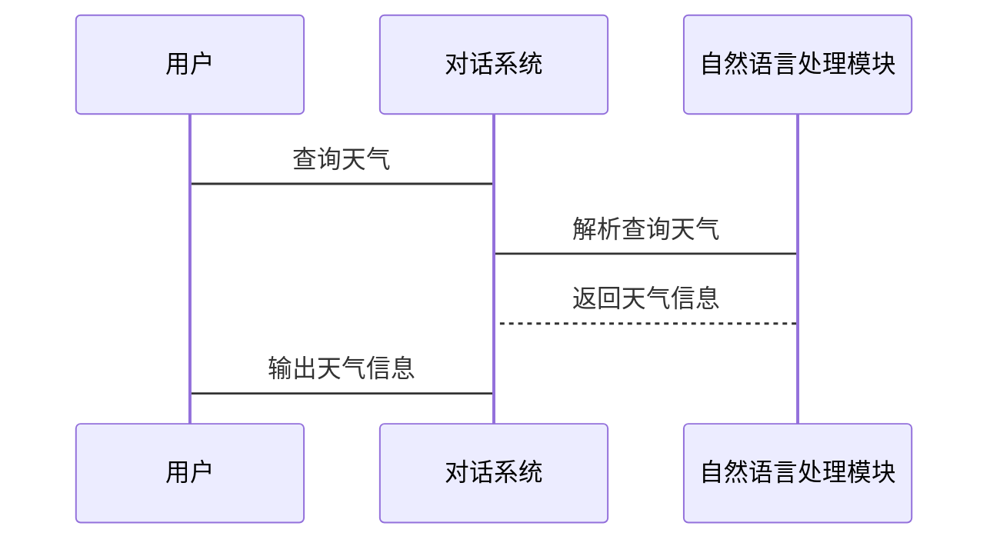

                 

# AI Agent的用户体验设计：提升交互效率与满意度

## 关键词：AI Agent，用户体验设计，交互效率，用户满意度，自然语言处理，对话系统，用户需求分析

## 摘要：  
本文深入探讨了AI Agent的用户体验设计，从理论到实践，详细分析了如何通过用户需求分析、交互设计优化、自然语言处理技术等手段，提升AI Agent的交互效率与用户满意度。文章结合实际案例，展示了如何通过系统架构设计和数据驱动的方法，打造高效、智能且符合用户期望的AI Agent。

---

# 第1章 AI Agent的基本概念与背景

## 1.1 AI Agent的定义与特点

### 1.1.1 什么是AI Agent  
AI Agent（人工智能代理）是指能够感知环境、自主决策并执行任务的智能系统。它通过算法和数据处理，为用户提供智能化的服务。  

### 1.1.2 AI Agent的核心特点  
- **自主性**：无需人工干预，自主完成任务。  
- **反应性**：能够实时感知环境并做出反应。  
- **目标导向**：以用户需求为导向，优化交互流程。  
- **可扩展性**：能够适应不同场景和用户需求的变化。  

### 1.1.3 AI Agent与传统软件的区别  
| 属性       | AI Agent                          | 传统软件                          |  
|------------|-----------------------------------|-----------------------------------|  
| 智能性     | 高                                | 低                                |  
| 自主性     | 高                                | 低                                |  
| 学习能力   | 强                                | 无                                |  

---

## 1.2 AI Agent的发展背景

### 1.2.1 人工智能的演进历程  
从早期的专家系统到现在的深度学习，人工智能技术的不断进步为AI Agent的发展奠定了基础。  

### 1.2.2 当前AI Agent的应用现状  
AI Agent已广泛应用于智能客服、智能家居、自动驾驶等领域，极大地提升了用户体验。  

### 1.2.3 AI Agent的未来趋势  
随着技术的进步，AI Agent将更加智能化、个性化，能够更好地满足用户的多样化需求。  

---

## 1.3 AI Agent的用户需求分析

### 1.3.1 用户需求的层次划分  
- **显性需求**：用户明确表达的需求，如“查询天气”。  
- **隐性需求**：用户未明确表达的需求，如“快速获取信息”。  

### 1.3.2 用户痛点与需求挖掘  
通过用户调研、数据分析等方法，挖掘用户在使用AI Agent过程中的痛点。  

### 1.3.3 用户画像与场景分析  
- **用户画像**：基于用户数据，构建用户画像，如“年轻白领用户”。  
- **场景分析**：分析用户在不同场景下的需求，如“通勤场景下的天气查询”。  

---

# 第2章 用户体验设计的核心理论

## 2.1 用户体验设计的基本原则

### 2.1.1 用户中心设计  
用户体验设计的核心是以用户为中心，确保系统的设计满足用户的需求和期望。  

### 2.1.2 用户体验的核心要素  
- **可用性**：系统易于使用，用户能够快速完成任务。  
- **可学习性**：用户能够快速掌握系统的使用方法。  
- **可容错性**：系统能够帮助用户避免错误，并在错误发生时提供帮助。  

### 2.1.3 用户情感与行为的设计  
通过设计界面、交互流程等，激发用户的情感共鸣，提升用户满意度。  

---

## 2.2 交互设计的五大原则

### 2.2.1 可用性原则  
确保用户能够轻松完成任务，减少操作步骤。  

### 2.2.2 可学习性原则  
通过引导和反馈，帮助用户快速掌握系统的使用方法。  

### 2.2.3 可容错性原则  
在用户操作过程中，提供纠错机制，避免用户误操作。  

### 2.2.4 可扩展性原则  
系统能够适应未来用户需求的变化，支持功能扩展。  

### 2.2.5 可持续性原则  
系统设计具有良好的性能和稳定性，能够长期稳定运行。  

---

## 2.3 用户体验的度量与评估

### 2.3.1 用户满意度指标  
通过问卷调查、用户反馈等方式，评估用户对系统满意度。  

### 2.3.2 任务完成度指标  
通过任务完成率、任务时间等指标，评估用户体验。  

### 2.3.3 系统性能指标  
通过响应时间、系统稳定性等指标，评估系统的性能。  

---

# 第3章 AI Agent的交互设计

## 3.1 自然语言处理与对话设计

### 3.1.1 自然语言处理的基础  
- **语言理解**：通过NLP技术，理解用户的输入内容。  
- **语言生成**：通过生成模型，生成符合用户需求的输出内容。  

### 3.1.2 对话系统的工作原理  
对话系统通过用户输入，解析用户意图，并生成相应的回应。  

### 3.1.3 对话树的设计与优化  
对话树是对话系统的核心，通过树状结构，定义对话流程。  

---

## 3.2 用户意图识别与需求匹配

### 3.2.1 用户意图识别  
通过NLP技术，识别用户的意图，如“查询天气”、“预订机票”等。  

### 3.2.2 用户需求匹配  
根据用户意图，匹配相应的服务和功能，确保用户需求得到满足。  

### 3.2.3 对话流程优化  
通过优化对话流程，提升用户体验，减少用户等待时间。  

---

# 第4章 技术实现与系统架构

## 4.1 自然语言处理技术

### 4.1.1 分词与词性标注  
通过分词和词性标注，理解用户输入的内容。  

### 4.1.2 意图识别与槽位填充  
通过意图识别和槽位填充，提取用户需求的关键信息。  

### 4.1.3 对话生成与优化  
通过生成模型，生成符合用户需求的对话内容，并进行优化。  

---

## 4.2 对话系统设计

### 4.2.1 系统架构设计  
- **前端**：用户与系统交互的界面，如语音助手。  
- **后端**：处理用户输入，生成回应。  
- **数据库**：存储用户数据和系统配置。  

### 4.2.2 对话树的实现  
通过编写对话树，定义对话流程，确保系统能够正确响应用户输入。  

### 4.2.3 系统接口设计  
通过API接口，实现与第三方服务的集成，如天气查询、新闻推送等。  

---

## 4.3 数据驱动的优化设计

### 4.3.1 数据收集与分析  
通过收集用户数据，分析用户行为，优化系统设计。  

### 4.3.2 模型训练与优化  
通过机器学习模型，优化系统的意图识别和对话生成能力。  

### 4.3.3 A/B测试与迭代优化  
通过A/B测试，评估不同设计的优劣，进行迭代优化。  

---

# 第5章 项目实战与案例分析

## 5.1 项目介绍

### 5.1.1 项目背景  
本项目旨在设计一个智能客服AI Agent，提升用户体验。  

### 5.1.2 项目目标  
通过优化对话流程，提升用户满意度和任务完成效率。  

---

## 5.2 系统功能设计

### 5.2.1 用户需求分析  
通过用户调研，明确用户需求和痛点。  

### 5.2.2 对话树设计  
根据用户需求，设计对话树，优化对话流程。  

---

## 5.3 系统架构设计

### 5.3.1 系统架构图  

---

## 5.4 系统交互设计

### 5.4.1 交互流程图  

---

## 5.5 实际案例分析

### 5.5.1 案例分析  
通过实际案例，分析对话树设计、系统优化等对用户体验的影响。  

### 5.5.2 经验总结  
总结项目中的经验教训，为后续设计提供参考。  

---

# 第6章 未来趋势与挑战

## 6.1 AI Agent的未来趋势

### 6.1.1 技术趋势  
随着NLP和机器学习技术的不断进步，AI Agent将更加智能化和个性化。  

### 6.1.2 用户需求变化  
用户需求将更加多样化，AI Agent需要不断适应变化。  

---

## 6.2 用户体验设计的挑战

### 6.2.1 技术挑战  
如何在技术上实现更高效的对话系统，是未来的主要挑战之一。  

### 6.2.2 用户需求的复杂性  
用户需求的多样性和复杂性，增加了用户体验设计的难度。  

---

## 6.3 应对策略

### 6.3.1 技术创新  
通过技术创新，不断提升系统的性能和用户体验。  

### 6.3.2 用户研究  
通过深入的用户研究，更好地理解用户需求，优化系统设计。  

---

# 第7章 总结与展望

## 7.1 总结  
本文从理论到实践，全面探讨了AI Agent的用户体验设计，提出了提升交互效率与用户满意度的方法和策略。  

## 7.2 展望  
随着技术的不断进步，AI Agent的用户体验设计将更加智能化和个性化，为用户带来更好的体验。  

---

# 附录

## 附录A: 工具推荐

### A.1 NLP工具  
- spaCy  
- NLTK  

### A.2 对话系统框架  
- Rasa  
- Dialogflow  

---

## 附录B: 参考文献  
- [1] 王某某. 《人工智能入门》. 北京: 清华大学出版社, 2020.  
- [2] 李某某. 《用户体验设计实战》. 北京: 人民邮电出版社, 2019.  

--- 

以上是《AI Agent的用户体验设计：提升交互效率与满意度》的完整目录大纲，涵盖了从理论到实践的各个方面，结合实际案例和系统架构设计，为读者提供了全面的指导和参考。

