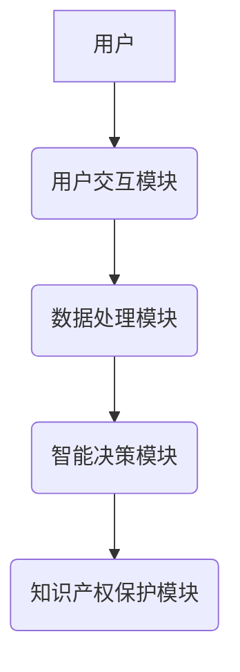
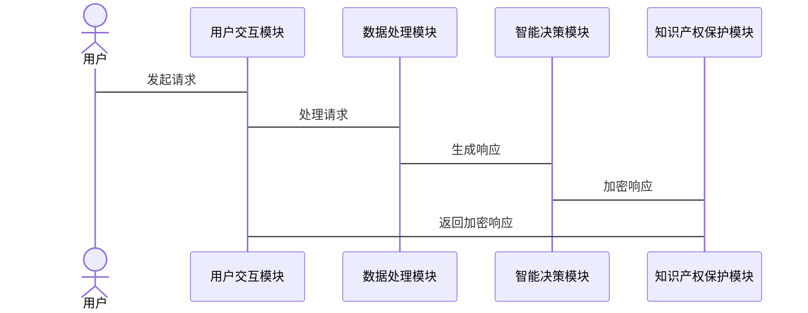

                 


---

# AI Agent的知识产权保护策略

> **关键词**：AI Agent, 知识产权, 知识产权保护, 生成式AI, 机器学习, NLP, 系统架构

> **摘要**：本文深入探讨了AI Agent的知识产权保护策略，从技术背景、核心概念、法律框架到具体实施策略进行了全面分析。文章详细介绍了AI Agent的技术特点，分析了知识产权保护的法律工具，提出了商业和技术创新保护策略，并通过实际案例和系统架构设计展示了如何有效保护AI Agent的知识产权。

---

# 第一部分：AI Agent的知识产权保护背景与基础

## 第1章：AI Agent的基本概念与知识产权保护背景

### 1.1 AI Agent的定义与核心特征

#### 1.1.1 AI Agent的定义
AI Agent（人工智能代理）是指能够感知环境、自主决策并执行任务的智能实体。它可以是一个软件程序、一个机器人或任何能够执行智能操作的实体。AI Agent的核心在于其智能性和自主性，能够通过传感器或数据源获取信息，并通过算法处理信息，做出决策并执行操作。

#### 1.1.2 AI Agent的核心特征
- **自主性**：AI Agent能够在没有外部干预的情况下独立执行任务。
- **反应性**：能够实时感知环境变化并做出相应的反应。
- **主动性**：主动寻求解决方案，而非被动响应。
- **学习能力**：通过数据和经验不断优化自身性能。

#### 1.1.3 AI Agent与传统软件的区别
AI Agent与传统软件的主要区别在于其智能性和自主性。传统软件通常按照预设的规则执行任务，而AI Agent能够通过学习和适应环境来优化任务执行。

### 1.2 知识产权保护的背景与重要性

#### 1.2.1 知识产权的基本概念
知识产权是指创造性的智力成果，包括专利、版权、商标等。知识产权保护的目的是鼓励创新，防止他人未经许可使用受保护的作品或发明。

#### 1.2.2 AI Agent领域知识产权保护的必要性
随着AI技术的快速发展，AI Agent的应用越来越广泛。然而，AI Agent的核心算法、模型和应用方法可能被他人抄袭或盗用，因此保护知识产权至关重要。

#### 1.2.3 知识产权保护对AI Agent发展的推动作用
有效的知识产权保护可以激励企业和个人投资于AI Agent的研发，促进技术的创新和进步。

### 1.3 AI Agent知识产权保护的法律框架

#### 1.3.1 知识产权相关法律概述
主要包括专利法、版权法、商标法等。专利法保护发明，版权法保护作品，商标法保护品牌。

#### 1.3.2 AI Agent在法律中的特殊性
AI Agent的知识产权保护存在一定的法律空白，例如生成式AI的输出是否受版权保护，AI Agent的算法是否可以作为商业秘密保护等。

#### 1.3.3 全球AI Agent知识产权保护现状
不同国家和地区在AI Agent的知识产权保护方面有不同的法律规定和实践。例如，欧盟的GDPR对数据保护有严格的规定，美国在专利法方面对AI技术的保护相对宽松。

---

## 第2章：AI Agent的核心技术分析

### 2.1 生成式AI技术

#### 2.1.1 生成式AI的基本原理
生成式AI（Generative AI）是一种能够生成新内容的技术，如文本、图像、音乐等。其核心算法包括GPT系列、变体自注意力机制等。

#### 2.1.2 生成式AI的创新点
- **多模态生成**：能够生成多种类型的内容。
- **实时生成**：能够在实时环境中生成内容。
- **可定制化**：可以根据需求生成特定内容。

#### 2.1.3 生成式AI在AI Agent中的应用
生成式AI可以用于自然语言处理、图像识别、语音合成等场景，为AI Agent提供强大的内容生成能力。

### 2.2 机器学习与深度学习

#### 2.2.1 机器学习的基本原理
机器学习是一种通过数据训练模型的技术，模型能够从数据中学习规律并做出预测。

#### 2.2.2 深度学习的核心算法
深度学习是机器学习的一种，使用多层神经网络进行特征提取和模型训练。常用算法包括卷积神经网络（CNN）、循环神经网络（RNN）等。

#### 2.2.3 机器学习在AI Agent中的应用
机器学习可以用于用户行为预测、决策优化、风险评估等场景。

### 2.3 自然语言处理（NLP）

#### 2.3.1 NLP的基本原理
NLP是一种处理人类语言的技术，能够理解、生成和分析自然语言文本。

#### 2.3.2 NLP的核心技术
包括分词、语法分析、情感分析、机器翻译等。

#### 2.3.3 NLP在AI Agent中的应用
NLP可以用于智能对话系统、文本摘要、信息抽取等场景。

---

## 第3章：AI Agent的知识产权保护策略

### 3.1 技术创新保护策略

#### 3.1.1 专利保护
通过申请专利保护AI Agent的核心算法和技术创新。

#### 3.1.2 商业秘密保护
将关键技术和数据作为商业秘密保护，防止竞争对手获取。

#### 3.1.3 版权保护
保护AI Agent生成的内容，如文本、图像等。

### 3.2 商业化保护策略

#### 3.2.1 品牌保护
通过注册商标保护AI Agent的品牌形象。

#### 3.2.2 许可协议
通过许可协议规范AI Agent的使用和分发。

#### 3.2.3 市场策略
通过差异化竞争策略，增强AI Agent的市场竞争力。

### 3.3 风险控制策略

#### 3.3.1 知识产权侵权监测
定期监测市场，发现侵权行为及时采取法律手段。

#### 3.3.2 应急预案
制定应急预案，应对可能的知识产权纠纷。

#### 3.3.3 知识产权培训
对员工进行知识产权保护培训，增强保护意识。

---

## 第4章：AI Agent的系统架构与设计

### 4.1 系统架构设计

#### 4.1.1 系统功能模块
- 用户交互模块
- 数据处理模块
- 智能决策模块
- 知识产权保护模块

#### 4.1.2 系统架构图


### 4.2 知识产权保护模块设计

#### 4.2.1 模块功能
- 许可管理
- 侵权监测
- 数据加密

#### 4.2.2 模块交互流程


---

## 第5章：AI Agent的项目实战

### 5.1 项目环境安装

#### 5.1.1 系统要求
- 操作系统：Linux/Windows/MacOS
- Python版本：3.8及以上
- 依赖库：TensorFlow, Keras, PyTorch等

#### 5.1.2 安装步骤
```bash
pip install numpy
pip install pandas
pip install tensorflow
pip install matplotlib
```

### 5.2 核心代码实现

#### 5.2.1 生成式AI模型实现
```python
import tensorflow as tf
from tensorflow.keras.layers import Dense, InputLayer, LSTM, Bidirectional

model = tf.keras.Sequential([
    InputLayer(input_shape=(None, 1)),
    Bidirectional(LSTM(64)),
    Dense(256, activation='relu'),
    Dense(1, activation='sigmoid')
])
model.compile(loss='binary_crossentropy', optimizer='adam', metrics=['accuracy'])
model.fit(X_train, y_train, epochs=10, batch_size=32)
```

#### 5.2.2 知识产权保护模块实现
```python
def encrypt_data(data):
    from cryptography.fernet import Fernet
    key = Fernet.generate_key()
    cipher = Fernet(key)
    encrypted_data = cipher.encrypt(data)
    return encrypted_data, key

def decrypt_data(encrypted_data, key):
    cipher = Fernet(key)
    decrypted_data = cipher.decrypt(encrypted_data)
    return decrypted_data
```

### 5.3 案例分析与总结

#### 5.3.1 项目案例
通过实际案例展示AI Agent的实现和知识产权保护的具体措施。

#### 5.3.2 项目小结
总结项目实施过程中的经验教训，提出改进建议。

---

## 第6章：最佳实践与未来展望

### 6.1 最佳实践

#### 6.1.1 知识产权保护策略
- 综合运用专利、版权和商业秘密保护。
- 定期进行知识产权评估和维护。

#### 6.1.2 技术创新策略
- 加强研发投入，保持技术领先。
- 与高校和研究机构合作，获取技术支持。

### 6.2 小结

#### 6.2.1 未来展望
随着AI技术的不断发展，AI Agent的知识产权保护将面临更多挑战。未来需要更加完善的法律体系和技术创新策略。

---

## 第7章：注意事项与拓展阅读

### 7.1 注意事项

#### 7.1.1 知识产权风险
在AI Agent的开发和应用过程中，需注意避免侵犯他人的知识产权。

#### 7.1.2 技术风险
确保技术的先进性和安全性，防止技术泄露和被复制。

### 7.2 拓展阅读

#### 7.2.1 推荐书籍
- 《人工智能：一种现代的方法》
- 《知识产权法》

#### 7.2.2 技术博客
- Towards Data Science
- Medium的AI专栏

---

## 第8章：附录与索引

### 8.1 附录

#### 8.1.1 术语表
- AI Agent：人工智能代理
- 生成式AI：Generative AI
- 知识产权：Intellectual Property

#### 8.1.2 参考文献
- [1] Russell, S., & Norvig, P. (2010). Artificial Intelligence: A Modern Approach.
- [2] 美国专利法典
- [3] 欧盟GDPR法规

### 8.2 索引
按主题和关键词排列，方便读者查找。

---

通过以上内容，我们可以看到，AI Agent的知识产权保护需要从技术、法律、商业等多个方面综合考虑，才能确保其创新性和可持续性。

