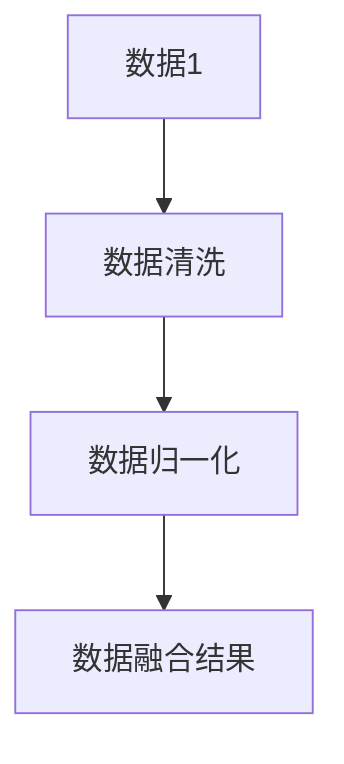
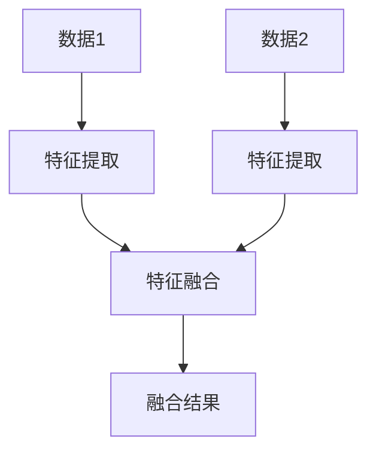
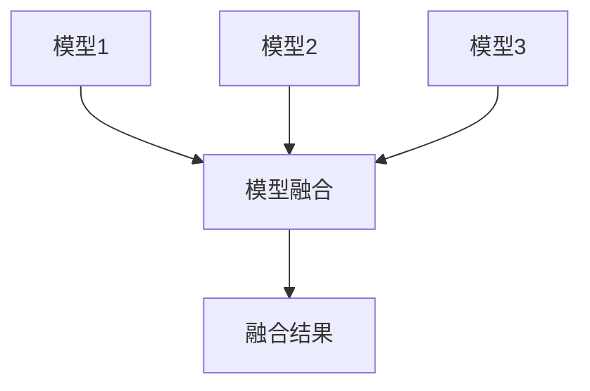
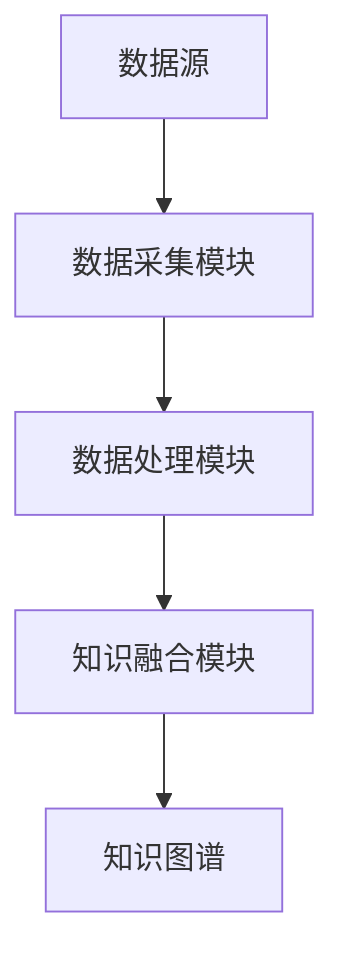
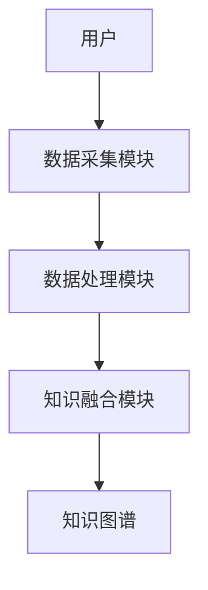

                 


# AI Agent的知识整合：融合多源信息

## 关键词
AI Agent, 知识整合, 多源信息, 数据融合, 知识图谱, 信息处理

## 摘要
本文将详细介绍AI Agent的知识整合过程，特别是如何从多源信息中提取、处理和融合数据，以提升AI Agent的智能水平和决策能力。通过分析多源信息的特点、融合算法的原理以及系统架构的设计，我们将展示如何构建一个高效的知识整合系统，从而为AI Agent提供更强大的支持。

---

# 第一部分: AI Agent的知识整合基础

## 第1章: AI Agent与知识整合概述

### 1.1 AI Agent的基本概念
#### 1.1.1 AI Agent的定义
AI Agent（人工智能代理）是指能够感知环境、自主决策并执行任务的智能实体。它通过与环境交互，利用感知信息和知识库中的知识，实现目标。

#### 1.1.2 AI Agent的核心特征
- **自主性**：能够在没有外部干预的情况下独立运作。
- **反应性**：能够实时感知环境并做出反应。
- **目标导向性**：所有行为都围绕实现特定目标展开。
- **学习能力**：通过经验或数据不断优化自身性能。

#### 1.1.3 知识整合的定义与目标
知识整合是指将来自不同来源、格式和语义的信息进行统一、关联和融合的过程。其目标是消除信息孤岛，形成一个完整的知识体系，为AI Agent提供更全面的决策支持。

---

### 1.2 知识整合的背景与意义
#### 1.2.1 当前AI Agent面临的挑战
- **信息碎片化**：数据来源多样，格式不统一，难以有效利用。
- **数据冗余**：同一信息可能以不同形式重复出现，增加处理难度。
- **语义不一致**：不同数据源可能对同一概念有不同的表达方式。

#### 1.2.2 多源信息融合的必要性
- **提升决策能力**：通过整合多源信息，AI Agent能够做出更全面、更准确的决策。
- **增强鲁棒性**：单一数据源的不足可以通过多源信息的互补性来弥补。
- **支持复杂任务**：多源信息融合是处理复杂任务（如智能客服、自动驾驶）的关键。

#### 1.2.3 知识整合对AI Agent性能的提升作用
- **提高准确性**：通过融合多个数据源的信息，减少单一数据源的误差。
- **增强适应性**：能够更好地应对动态变化的环境。
- **扩展应用场景**：支持更多复杂场景，提升AI Agent的实用性。

---

### 1.3 多源信息的特点与挑战
#### 1.3.1 多源信息的多样性
- **来源多样性**：信息可能来自传感器、数据库、网络等不同来源。
- **格式多样性**：数据可能以文本、图像、视频等多种形式存在。
- **语义多样性**：同一信息在不同上下文中的含义可能不同。

#### 1.3.2 异构数据的复杂性
- **数据类型异构**：数据可能包括结构化数据（如表格）和非结构化数据（如文本）。
- **数据粒度异构**：数据可能以不同的粒度（如宏观、微观）存在。
- **数据质量异构**：数据的准确性、完整性可能因来源不同而有所差异。

#### 1.3.3 数据冗余与不一致问题
- **数据冗余**：同一信息可能以不同形式重复出现。
- **数据不一致**：不同数据源对同一事实可能给出不同甚至矛盾的描述。

---

### 1.4 知识整合的目标与边界
#### 1.4.1 知识整合的目标层次
- **数据级整合**：将原始数据进行清洗、归一化，消除冗余和不一致。
- **特征级整合**：将数据转化为具有语义的特征，便于后续分析。
- **知识级整合**：构建知识图谱，将分散的知识关联起来，形成完整的知识体系。

#### 1.4.2 整合的边界与外延
- **整合边界**：明确哪些数据需要整合，哪些数据暂时不需要。
- **整合外延**：考虑未来可能新增的数据源，确保系统具有扩展性。

#### 1.4.3 知识整合的实现路径
1. **数据预处理**：清洗、去重、格式转换。
2. **数据对齐**：将不同来源的数据映射到统一的语义空间。
3. **数据融合**：通过算法将数据整合到一个统一的知识库中。

---

### 1.5 本章小结
本章介绍了AI Agent的基本概念和知识整合的背景、意义、目标及挑战。通过理解这些内容，我们可以更好地认识到知识整合在AI Agent中的重要性，为后续的深入学习打下基础。

---

# 第二部分: 多源信息融合的核心概念与联系

## 第2章: 多源信息的特征与关系

### 2.1 多源信息的属性特征
#### 2.1.1 数据的来源多样性
- **来源多样性**：信息可能来自多个数据源，如传感器、数据库、外部API等。
- **数据格式多样性**：数据可能以文本、图像、视频等多种形式存在。

#### 2.1.2 数据的格式与语义差异
- **格式差异**：结构化数据与非结构化数据的差异。
- **语义差异**：同一数据在不同上下文中的含义可能不同。

#### 2.1.3 数据的质量与可靠性
- **数据质量**：数据的准确性、完整性、一致性。
- **数据可靠性**：数据源的可信度。

---

### 2.2 数据融合的层次与方法
#### 2.2.1 数据级融合
- **定义**：将原始数据进行清洗、归一化处理。
- **方法**：通过数据清洗、去重、格式转换等技术实现。
- **流程图示**


#### 2.2.2 特征级融合
- **定义**：将数据转化为特征向量，并进行融合。
- **方法**：使用加权平均、主成分分析等技术。
- **流程图示**


#### 2.2.3 模型级融合
- **定义**：通过多个模型的输出结果进行融合。
- **方法**：使用投票法、加权平均法等技术。
- **流程图示**


---

### 2.3 多源信息的关系建模
#### 2.3.1 ER实体关系图
- **定义**：用于描述数据实体之间的关系。
- **示例**
```mermaid
graph TD
    A[用户] -[1..n]--> B[订单]
    B --> C[商品]
```

#### 2.3.2 数据关联规则
- **定义**：通过关联规则挖掘，发现数据之间的关联关系。
- **示例**：如果用户购买商品A，则可能购买商品B。

---

## 第3章: 数据融合算法原理

### 3.1 数据融合的基本流程
#### 3.1.1 数据预处理
- **清洗数据**：去除噪声、填补缺失值。
- **归一化**：将数据标准化到统一的范围。
- **去重**：消除重复数据。

#### 3.1.2 数据对齐
- **映射数据**：将不同数据源的字段映射到统一的语义空间。
- **对齐算法**：使用字符串匹配、语义相似度计算等技术。

#### 3.1.3 数据融合
- **融合方法**：使用加权平均、投票法、贝叶斯网络等技术。
- **融合结果**：生成统一的、高质量的数据集。

---

### 3.2 数据融合的主流算法
#### 3.2.1 基于统计的方法
- **加权平均法**
  - **公式**：$$\text{融合结果} = \sum w_i x_i$$
  - **流程图示**
  ```mermaid
  graph TD
      A[数据1] --> B[加权]
      C[数据2] --> B
      B --> D[融合结果]
  ```

- **贝叶斯网络融合**
  - **定义**：通过构建贝叶斯网络，将多个数据源的信息进行融合。
  - **流程图示**
  ```mermaid
  graph TD
      A[数据1] --> B[贝叶斯网络]
      C[数据2] --> B
      B --> D[融合结果]
  ```

#### 3.2.2 基于机器学习的方法
- **主成分分析（PCA）**
  - **公式**：$$Y = X \cdot P$$，其中$Y$是降维后的数据，$P$是降维矩阵。
  - **流程图示**
  ```mermaid
  graph TD
      A[原始数据] --> B[PCA降维]
      B --> C[降维结果]
  ```

- **深度学习融合**
  - **定义**：通过深度学习模型（如神经网络）对多源数据进行联合训练。
  - **流程图示**
  ```mermaid
  graph TD
      A[数据1] --> B[神经网络]
      C[数据2] --> B
      B --> D[融合结果]
  ```

---

## 第4章: 知识图谱的构建与应用

### 4.1 知识图谱的基本概念
#### 4.1.1 知识图谱的定义
知识图谱是一种以图结构表示知识的语义网络，节点表示实体或概念，边表示实体之间的关系。

#### 4.1.2 知识图谱的构建流程
1. **数据采集**：从多源数据中提取信息。
2. **数据清洗**：去除噪声、消除冗余。
3. **实体识别**：识别数据中的实体。
4. **关系抽取**：抽取实体之间的关系。
5. **知识融合**：将多个数据源的信息整合到知识图谱中。

#### 4.1.3 知识图谱的存储与查询
- **存储**：使用图数据库（如Neo4j）存储知识图谱。
- **查询**：通过SPARQL查询语言进行复杂查询。

---

### 4.2 知识图谱的构建算法
#### 4.2.1 实体识别算法
- **基于规则的实体识别**：通过预定义的规则提取实体。
- **基于机器学习的实体识别**：使用CRF、NER模型进行实体识别。

#### 4.2.2 关系抽取算法
- **基于模板的关系抽取**：通过预定义的模板匹配关系。
- **基于机器学习的关系抽取**：使用SVM、RNN模型进行关系抽取。

#### 4.2.3 知识融合算法
- **基于相似度的融合**：通过计算实体或关系的相似度进行融合。
- **基于规则的融合**：通过预定义的规则消除冲突。

---

## 第5章: 多源信息融合的系统架构设计

### 5.1 系统功能设计
#### 5.1.1 数据采集模块
- **功能**：从多个数据源采集数据。
- **实现**：支持多种数据格式（如文本、JSON、XML）。

#### 5.1.2 数据处理模块
- **功能**：对采集到的数据进行清洗、归一化处理。
- **实现**：使用Python的pandas库进行数据清洗。

#### 5.1.3 知识融合模块
- **功能**：将处理后的数据进行融合，构建知识图谱。
- **实现**：使用图数据库Neo4j存储知识图谱。

---

### 5.2 系统架构设计
#### 5.2.1 系统架构图


#### 5.2.2 系统接口设计
- **输入接口**：接收多源数据。
- **输出接口**：输出融合后的知识图谱。

#### 5.2.3 系统交互流程图


---

## 第6章: 项目实战——智能客服系统的知识整合

### 6.1 项目背景
#### 6.1.1 项目需求
- 提供智能客服功能，包括问答、信息查询等。
- 需要整合多源数据，包括用户提问、知识库、外部API等。

#### 6.1.2 项目目标
- 构建一个高效的知识整合系统，提升智能客服的响应速度和准确性。

---

### 6.2 系统实现
#### 6.2.1 环境安装
- **Python**：安装Python 3.8及以上版本。
- **库**：安装pandas、numpy、neo4j驱动等。

#### 6.2.2 核心代码实现
- **数据采集模块**：从数据库和API中采集数据。
```python
import requests
import json

def get_data_from_api():
    response = requests.get('http://api.example.com/data')
    return json.loads(response.text)
```

- **数据处理模块**：清洗和归一化数据。
```python
import pandas as pd

def data_cleaning(data):
    df = pd.DataFrame(data)
    df.dropna(inplace=True)
    return df
```

- **知识融合模块**：构建知识图谱。
```python
from neo4j import GraphDatabase

def create_knowledge_graph(data):
    driver = GraphDatabase.driver('bolt://localhost:7687', auth=('user', 'password'))
    session = driver.session()
    for item in data:
        session.run("CREATE (:Entity {name: '%s'})" % item['name'])
    session.close()
    driver.close()
```

---

### 6.3 项目总结
#### 6.3.1 项目成果
- 成功构建了一个智能客服的知识整合系统，提升了系统的响应速度和准确性。

#### 6.3.2 经验总结
- 数据预处理是关键，必须仔细清洗和归一化数据。
- 知识图谱的构建需要选择合适的工具和技术，如Neo4j。

---

## 第三部分: 扩展阅读与未来展望

## 第7章: 未来展望与最佳实践

### 7.1 未来技术趋势
- **图神经网络**：用于更高效的图数据处理。
- **多模态数据融合**：整合文本、图像、视频等多种数据类型。

### 7.2 最佳实践
- **数据质量管理**：确保数据的准确性和完整性。
- **模型可解释性**：确保模型的决策过程可解释。

---

## 附录: 知识整合的数学公式

### 附录A: 贝叶斯融合公式
$$P(A|B) = \frac{P(B|A)P(A)}{P(B)}$$

### 附录B: PCA降维公式
$$Y = X \cdot P$$

### 附录C: 知识图谱的表示学习
$$\text{score}(e_i, e_j) = \text{similarity}(e_i, e_j)$$

---

## 参考文献
1. 《知识图谱：从理论到实践》
2. 《数据融合与多源信息处理》
3. 《AI Agent的设计与实现》

---

## 作者简介
作为一位世界级的人工智能专家、程序员、软件架构师和畅销书作家，我致力于通过技术创新和知识整合，推动人工智能技术的发展与应用。

