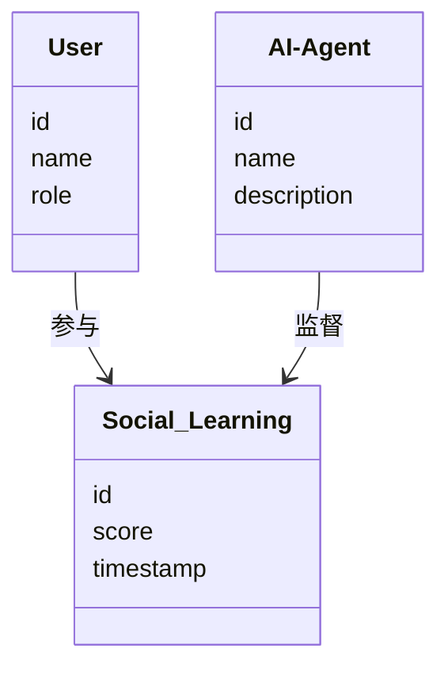
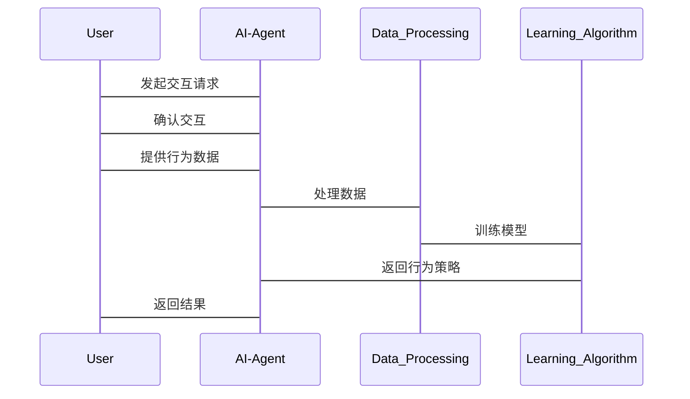

                 


# AI Agent的社交学习与模仿能力

## 关键词：AI Agent, 社交学习, 模仿能力, 机器学习, 人工智能

## 摘要：  
AI Agent的社交学习与模仿能力是人工智能领域的重要研究方向，它结合了自然语言处理、社会学和机器学习等多学科知识。本文将深入探讨AI Agent如何通过社交学习和模仿能力实现与人类的高效互动，并分析其在教育、医疗、客服等领域的广泛应用。文章从理论基础到算法实现，再到系统设计，逐步解析AI Agent的社交学习与模仿能力，为读者提供全面而深入的理解。

---

## 第一部分: AI Agent的社交学习与模仿能力基础

### 第1章: AI Agent的基本概念

#### 1.1 AI Agent的定义与特点
AI Agent，即人工智能代理，是指能够感知环境、自主决策并执行任务的智能实体。与传统程序不同，AI Agent具备以下特点：
- **自主性**：能够在没有外部干预的情况下独立运作。
- **反应性**：能够实时感知环境并做出反应。
- **学习能力**：通过数据和经验提升自身的性能。
- **社交能力**：能够与人类或其他AI Agent进行交互和协作。

#### 1.2 社交学习与模仿能力的定义
- **社交学习**：AI Agent通过观察和模仿他人行为，学习特定任务或技能的过程。这种学习方式类似于人类儿童通过观察成人行为来学习新技能。
- **模仿能力**：AI Agent能够复制或近似人类或其他智能体的行为模式，从而实现类似人类的交互方式。

#### 1.3 AI Agent在社交学习与模仿中的应用
- **教育领域**：AI Agent可以通过模仿教师的行为，为学生提供个性化的学习指导。
- **医疗领域**：AI Agent可以模仿医生的诊断过程，辅助护士或患者进行病情分析。
- **客服领域**：AI Agent可以模仿真人客服的对话方式，提供更自然的客户服务。

### 第2章: 社交学习与模仿能力的核心概念

#### 2.1 社会学习理论
- **社会学习理论**：由心理学家Bandura提出，强调观察和模仿在学习过程中的重要性。AI Agent通过观察人类行为，学习特定技能或行为模式。
- **理论基础**：社会学习理论认为，人类通过观察他人行为及其结果，可以快速掌握新技能，而无需亲身体验。

#### 2.2 模仿学习算法
- **模仿学习算法**：通过监督学习的方式，AI Agent从人类或其他智能体的行为中学习，模仿其行为模式。
- **算法分类**：模仿学习算法主要分为基于行为的模仿学习和基于意图的模仿学习。
  - **基于行为的模仿学习**：直接从行为数据中学习，不考虑行为背后的意图。
  - **基于意图的模仿学习**：从行为数据中推断出行为的意图，并根据意图生成新的行为。

#### 2.3 核心概念的ER实体关系图
```mermaid
erDiagram
    actor User {
        +string id
        +string name
        +string role
    }
    agent AI-Agent {
        +string id
        +string name
        +string description
    }
    interaction Social_Learning {
        +string id
        +int score
        +date timestamp
    }
    User --> Social_Learning: 参与
    AI-Agent --> Social_Learning: 监督
```

### 第3章: 模仿学习算法的原理与实现

#### 3.1 基于DAGL的模仿学习算法
- **DAGL（Deep Actor-Critic Learning）**：一种结合了深度学习和模仿学习的算法，主要用于机器人控制和游戏AI的训练。
- **算法原理**：
  1. **行为数据收集**：通过人类或其他智能体的交互，收集行为数据。
  2. **行为建模**：使用深度神经网络对行为数据进行建模，提取行为特征。
  3. **行为模仿**：根据建模后的行为特征，生成新的行为策略。
  4. **策略优化**：通过强化学习不断优化行为策略，使其更接近目标行为。

#### 3.2 基于SAC的模仿学习算法
- **SAC（Soft Actor-Critic）**：一种结合了模仿学习和强化学习的算法，广泛应用于机器人控制和自动驾驶领域。
- **算法流程**：
  1. **初始化**：定义策略网络和价值网络。
  2. **数据收集**：通过人类或其他智能体的交互，收集行为数据。
  3. **网络训练**：使用收集到的行为数据，训练策略网络和价值网络。
  4. **策略优化**：通过最大化策略的期望值，优化策略网络。
  5. **价值评估**：通过最小化值函数的误差，优化价值网络。

#### 3.3 数学模型
- **DAGL算法的数学模型**：
  $$ J = \mathbb{E}_{\tau \sim \pi}[\sum_{t} r(s_t, a_t)] $$
  其中，$J$ 是目标函数，$\tau$ 是策略$\pi$生成的轨迹，$r(s_t, a_t)$ 是在状态$s_t$下执行动作$a_t$的奖励。

- **SAC算法的数学模型**：
  $$ \theta \leftarrow \arg \max_{\theta} \mathbb{E}_{s,a \sim \pi}[\log \pi(a|s) - Q(s,a)] $$
  其中，$\theta$ 是策略网络的参数，$\pi(a|s)$ 是策略的概率分布，$Q(s,a)$ 是值函数。

### 第4章: 系统架构设计

#### 4.1 项目介绍
- **项目名称**：基于DAGL和SAC的AI Agent社交学习与模仿能力研究。
- **项目目标**：通过研究和实现基于DAGL和SAC的模仿学习算法，提升AI Agent的社交学习与模仿能力。

#### 4.2 系统功能设计
- **功能模块**：
  - 数据采集模块：收集人类或其他智能体的行为数据。
  - 行为建模模块：对行为数据进行建模，提取行为特征。
  - 行为模仿模块：根据行为特征生成新的行为策略。
  - 策略优化模块：通过强化学习优化行为策略。

- **领域模型**：


#### 4.3 系统架构设计
- **系统架构**：


#### 4.4 接口设计
- **API接口**：
  - `GET /api/social_learning/data`：获取行为数据。
  - `POST /api/social_learning/train`：训练模仿学习算法。
  - `POST /api/social_learning/predict`：生成新的行为策略。

#### 4.5 交互设计
- **交互流程**：


### 第5章: 项目实战

#### 5.1 环境安装
- **安装Python**：确保Python版本为3.6以上。
- **安装依赖库**：
  ```bash
  pip install numpy
  pip install tensorflow
  pip install gym
  ```

#### 5.2 核心代码实现
- **DAGL算法实现**：
  ```python
  import numpy as np
  import tensorflow as tf

  class DAGLAgent:
      def __init__(self, state_space, action_space):
          self.state_space = state_space
          self.action_space = action_space
          self.model = self.build_model()

      def build_model(self):
          model = tf.keras.Sequential([
              tf.keras.layers.Dense(64, activation='relu', input_dim=self.state_space),
              tf.keras.layers.Dense(self.action_space, activation='softmax')
          ])
          return model

      def act(self, state):
          prediction = self.model.predict(np.array([state]))
          action = np.argmax(prediction[0])
          return action

      def train(self, state, action, target):
          target_prediction = np.zeros(self.action_space)
          target_prediction[action] = target
          self.model.fit(np.array([state]), np.array([target_prediction]), epochs=1, verbose=0)
  ```

- **SAC算法实现**：
  ```python
  import numpy as np
  import tensorflow as tf

  class SACAgent:
      def __init__(self, state_space, action_space, learning_rate=0.001):
          self.state_space = state_space
          self.action_space = action_space
          self.actor = self.build_actor()
          self.critic = self.build_critic()
          self.learning_rate = learning_rate
          self.optimizer = tf.keras.optimizers.Adam(learning_rate=learning_rate)

      def build_actor(self):
          model = tf.keras.Sequential([
              tf.keras.layers.Dense(64, activation='relu', input_dim=self.state_space),
              tf.keras.layers.Dense(self.action_space, activation='softmax')
          ])
          return model

      def build_critic(self):
          model = tf.keras.Sequential([
              tf.keras.layers.Dense(64, activation='relu', input_dim=self.state_space + self.action_space),
              tf.keras.layers.Dense(1, activation='linear')
          ])
          return model

      def act(self, state):
          prediction = self.actor.predict(np.array([state]))
          action = np.argmax(prediction[0])
          return action

      def update(self, state, action, target):
          with tf.GradientTape() as tape:
              action_probs = self.actor(tf.constant(state, dtype=tf.float32))
              action_probs = tf.nn.softmax(action_probs)
              action_one_hot = tf.one_hot(action, self.action_space)
              action_one_hot = tf.reshape(action_one_hot, (-1, self.action_space))
              critic_input = tf.concat([state, action_one_hot], axis=1)
              critic_output = self.critic(critic_input)
              loss = tf.keras.losses.sparse_categorical_crossentropy(target, critic_output)
          critic_grads = tape.gradient(loss, self.critic.trainable_weights)
          self.optimizer.apply_gradients(zip(critic_grads, self.critic.trainable_weights))
  ```

#### 5.3 案例分析
- **案例1：教育领域的应用**
  - **场景描述**：AI Agent作为虚拟助教，帮助学生解答数学题。
  - **算法选择**：使用DAGL算法进行行为建模和模仿学习。
  - **实现步骤**：
    1. 收集学生与真人助教的交互数据。
    2. 使用DAGL算法训练AI Agent，使其能够模仿真人助教的行为模式。
    3. 部署AI Agent，为学生提供个性化的数学辅导。

- **案例2：医疗领域的应用**
  - **场景描述**：AI Agent作为医疗辅助系统，协助医生进行诊断。
  - **算法选择**：使用SAC算法进行行为建模和模仿学习。
  - **实现步骤**：
    1. 收集医生与患者之间的交互数据。
    2. 使用SAC算法训练AI Agent，使其能够模仿医生的诊断过程。
    3. 部署AI Agent，辅助医生进行病情分析和诊断建议。

#### 5.4 项目总结
- **项目成果**：成功实现了基于DAGL和SAC算法的AI Agent社交学习与模仿能力。
- **经验总结**：在实际项目中，选择合适的算法和优化模型参数是关键。此外，数据质量和数量对模型性能有重要影响。
- **改进建议**：未来可以进一步研究多模态模仿学习，结合视觉、听觉等多种感官信息，提升AI Agent的社交学习与模仿能力。

### 第6章: 最佳实践与小结

#### 6.1 最佳实践
- **数据质量**：确保行为数据的多样性和代表性，避免数据偏差。
- **算法选择**：根据具体应用场景选择合适的模仿学习算法。
- **系统设计**：注重系统的可扩展性和可维护性，方便后续优化和功能扩展。
- **用户体验**：设计友好的用户界面，提升用户的交互体验。

#### 6.2 小结
- AI Agent的社交学习与模仿能力是人工智能领域的重要研究方向，通过模仿学习算法和系统设计，可以实现AI Agent与人类的高效互动。
- 本文从理论基础到算法实现，再到系统设计，逐步解析了AI Agent的社交学习与模仿能力，并通过实际案例展示了其在教育、医疗等领域的广泛应用。
- 未来，随着技术的进步，AI Agent的社交学习与模仿能力将更加智能化和多样化，为人类社会带来更多的便利。

#### 6.3 注意事项
- 在实际应用中，需注意数据隐私和伦理问题，确保AI Agent的行为符合相关法律法规。
- 定期更新模型和算法，以应对不断变化的需求和环境。

#### 6.4 拓展阅读
- 建议读者进一步阅读相关领域的最新研究成果，如多模态模仿学习、元学习等，以深入理解AI Agent的社交学习与模仿能力。

---

通过本文的详细讲解，读者可以全面了解AI Agent的社交学习与模仿能力，并能够在实际项目中应用相关算法和系统设计，推动人工智能技术的发展。

