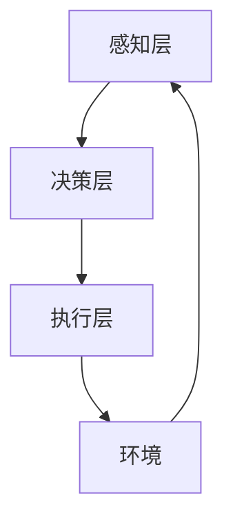
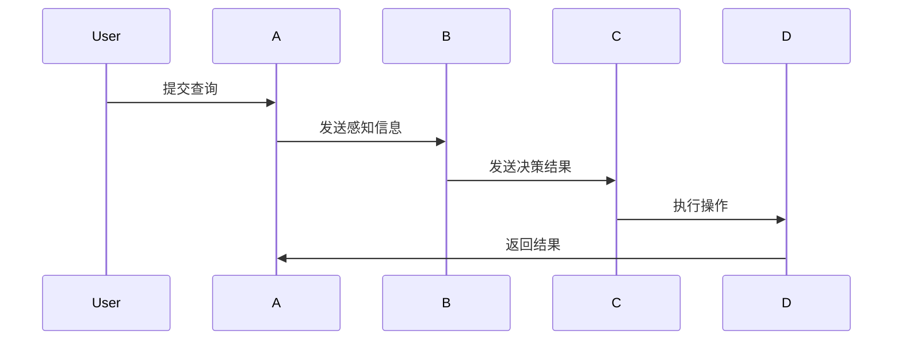

                 


# AI Agent的系统架构设计与实现

## 关键词：AI Agent、系统架构、算法原理、项目实战、系统设计

## 摘要：  
本文将详细探讨AI Agent的系统架构设计与实现，从基础概念到实际应用，结合算法原理和系统架构设计，通过具体案例分析，深入解析AI Agent的核心技术与实现方法。本文旨在为AI Agent的开发人员提供一份全面的技术指南，帮助他们理解并掌握AI Agent的设计与实现。

---

# 第一部分: AI Agent的系统架构设计与实现基础

## 第1章: AI Agent的基本概念与背景

### 1.1 AI Agent的定义与核心概念
#### 1.1.1 什么是AI Agent
AI Agent（人工智能代理）是指能够感知环境、自主决策并执行任务的智能实体。它能够通过传感器获取信息，利用算法进行分析和决策，并通过执行器与环境交互。AI Agent的核心在于其智能性和自主性。

#### 1.1.2 AI Agent的核心特征
- **自主性**：能够在没有外部干预的情况下自主运行。
- **反应性**：能够实时感知环境并做出反应。
- **目标导向性**：基于目标进行决策和行动。
- **学习能力**：能够通过经验优化自身行为。

#### 1.1.3 AI Agent与传统程序的区别
传统的程序依赖于预设的规则和逻辑，而AI Agent能够通过学习和适应环境来优化自身行为。AI Agent的核心在于其智能性和自主性，而传统程序则是基于固定的逻辑执行任务。

### 1.2 AI Agent的类型与应用场景
#### 1.2.1 知识型AI Agent
知识型AI Agent依赖于预设的知识库进行推理和决策。例如，基于规则的专家系统。

#### 1.2.2 数据驱动型AI Agent
数据驱动型AI Agent通过大量数据进行训练，利用机器学习算法进行决策。例如，基于深度学习的自然语言处理模型。

#### 1.2.3 混合型AI Agent
混合型AI Agent结合了知识型和数据驱动型的优势，能够在不同场景下灵活切换。

### 1.3 AI Agent的发展现状与挑战
#### 1.3.1 当前AI Agent技术的发展趋势
随着深度学习和强化学习的快速发展，AI Agent在自动驾驶、智能机器人、智能助手等领域得到了广泛应用。

#### 1.3.2 AI Agent在实际应用中的主要挑战
- **复杂环境的适应性**：AI Agent需要能够应对复杂多变的环境。
- **决策的不确定性**：在不确定环境下，AI Agent需要做出最优决策。
- **计算资源的限制**：AI Agent的实时性和计算效率需要平衡。

#### 1.3.3 未来AI Agent技术的潜在方向
未来，AI Agent将更加注重人机协作、多智能体协同以及自适应学习能力。

### 1.4 本章小结
本章介绍了AI Agent的基本概念、核心特征、类型及其应用场景，并分析了当前的发展现状与未来趋势。

---

## 第2章: AI Agent的核心概念与系统架构

### 2.1 AI Agent的系统架构原理
#### 2.1.1 AI Agent的组成模块
AI Agent的系统架构通常包括以下模块：
- **感知层**：负责获取环境信息。
- **决策层**：负责分析信息并做出决策。
- **执行层**：负责执行决策并输出结果。

#### 2.1.2 感知层、决策层与执行层的定义
- **感知层**：通过传感器或其他数据源获取环境信息。
- **决策层**：基于感知信息，利用算法进行决策。
- **执行层**：根据决策结果，通过执行器与环境交互。

#### 2.1.3 各层之间的关系与数据流
感知层将环境信息传递给决策层，决策层根据信息做出决策并传递给执行层，执行层将结果反馈给感知层，形成一个闭环。

### 2.2 AI Agent的功能模块设计
#### 2.2.1 感知模块的功能与实现
感知模块负责获取环境信息，例如图像、语音、文本等。常见的感知技术包括计算机视觉、自然语言处理等。

#### 2.2.2 决策模块的算法选择
决策模块需要选择合适的算法，例如基于规则的决策算法、机器学习算法或强化学习算法。

#### 2.2.3 执行模块的实现方式
执行模块负责将决策结果转化为具体行动，例如控制机器人运动、发送指令等。

### 2.3 AI Agent的系统架构图
以下是一个典型的AI Agent系统架构图：



### 2.4 本章小结
本章详细介绍了AI Agent的系统架构，包括各层的功能与实现方式，并通过架构图展示了各模块之间的关系。

---

## 第3章: AI Agent的算法原理与实现

### 3.1 AI Agent的决策算法概述
#### 3.1.1 基于规则的决策算法
基于规则的决策算法通过预设的规则进行决策，适用于简单、确定性环境。

#### 3.1.2 基于机器学习的决策算法
基于机器学习的决策算法通过训练数据进行模型训练，适用于复杂、不确定环境。

#### 3.1.3 基于强化学习的决策算法
基于强化学习的决策算法通过与环境交互，通过奖励机制优化决策策略。

### 3.2 基于Q-Learning的决策算法实现
#### 3.2.1 Q-Learning算法的原理
Q-Learning是一种基于强化学习的算法，通过Q值表记录状态-动作对的期望奖励，通过不断更新Q值表来优化决策策略。

#### 3.2.2 Q-Learning算法的数学模型
Q-Learning的更新公式为：
$$ Q(s, a) = Q(s, a) + \alpha \left( r + \gamma \max_{a'} Q(s', a') - Q(s, a) \right) $$
其中：
- \( \alpha \) 是学习率
- \( \gamma \) 是折扣因子
- \( r \) 是奖励
- \( s' \) 是下一状态

#### 3.2.3 Q-Learning算法的实现代码
以下是一个简单的Q-Learning算法实现：

```python
class QLearning:
    def __init__(self, state_space, action_space, learning_rate=0.1, gamma=0.9):
        self.state_space = state_space
        self.action_space = action_space
        self.lr = learning_rate
        self.gamma = gamma
        self.q_table = np.zeros((state_space, action_space))
    
    def choose_action(self, state):
        return np.argmax(self.q_table[state])
    
    def update(self, state, action, reward, next_state):
        self.q_table[state, action] += self.lr * (reward + self.gamma * np.max(self.q_table[next_state]) - self.q_table[state, action])
```

### 3.3 基于DQN的复杂决策算法
#### 3.3.1 DQN算法的基本原理
DQN（Deep Q-Network）是一种基于深度学习的强化学习算法，通过神经网络近似Q值函数。

#### 3.3.2 DQN算法的数学模型
DQN的损失函数为：
$$ L = \mathbb{E}[ (r + \gamma Q(s', a') - Q(s, a))^2 ] $$
其中，\( Q(s, a) \) 是当前网络的输出，\( Q'(s', a') \) 是目标网络的输出。

#### 3.3.3 DQN算法的实现代码
以下是一个简单的DQN算法实现：

```python
import torch
import torch.nn as nn
import torch.optim as optim

class DQN:
    def __init__(self, input_size, output_size, learning_rate=0.01, gamma=0.9):
        self.net = nn.Linear(input_size, output_size)
        self.gamma = gamma
        self.optimizer = optim.Adam(self.net.parameters(), lr=learning_rate)
    
    def forward(self, x):
        return self.net(x)
    
    def backward(self, current_state, action, reward, next_state):
        current_q = self.net(current_state).gather(1, action.unsqueeze(1))
        next_q = self.net(next_state).max(1)[0].detach()
        target = reward + self.gamma * next_q
        loss = nn.MSELoss()(current_q.squeeze(), target)
        self.optimizer.zero_grad()
        loss.backward()
        self.optimizer.step()
```

### 3.4 本章小结
本章详细介绍了AI Agent的决策算法，包括基于规则的算法、Q-Learning算法和DQN算法的原理、数学模型和实现代码。

---

## 第4章: AI Agent的系统分析与架构设计

### 4.1 问题场景与需求分析
假设我们正在设计一个智能客服AI Agent，其主要功能包括：
- 感知用户需求
- 决策回复内容
- 执行回复操作

### 4.2 系统功能设计
#### 4.2.1 领域模型设计
以下是一个简单的领域模型类图：

```mermaid
classDiagram
    class User:
        +name: str
        +query: str
    class Agent:
        +state: str
        +action: str
        +reward: float
    class Environment:
        +response: str
    User --> Agent
    Agent --> Environment
    Environment --> User
```

#### 4.2.2 系统架构设计
以下是一个典型的AI Agent系统架构图：


#### 4.2.3 系统接口设计
系统接口包括：
- 感知层接口：获取环境信息
- 决策层接口：接收感知信息并返回决策结果
- 执行层接口：接收决策结果并执行操作

#### 4.2.4 系统交互流程
以下是一个系统交互流程图：



### 4.3 本章小结
本章通过具体案例分析，详细介绍了AI Agent的系统分析与架构设计，包括问题场景分析、系统功能设计、系统架构设计和系统交互流程。

---

## 第5章: AI Agent的项目实战

### 5.1 环境安装与配置
- **Python**：安装Python 3.8+
- **深度学习框架**：安装TensorFlow或PyTorch
- **其他依赖**：安装NumPy、Matplotlib等

### 5.2 核心代码实现
#### 5.2.1 感知层实现
```python
import numpy as np

class Sensor:
    def __init__(self, environment):
        self.environment = environment
    
    def perceive(self):
        # 返回环境感知信息
        return self.environment.get_state()
```

#### 5.2.2 决策层实现
```python
class DecisionMaker:
    def __init__(self, q_table):
        self.q_table = q_table
    
    def decide(self, state):
        # 返回动作
        return np.argmax(self.q_table[state])
```

#### 5.2.3 执行层实现
```python
class Actuator:
    def __init__(self, environment):
        self.environment = environment
    
    def execute(self, action):
        # 执行动作并返回结果
        return self.environment.execute_action(action)
```

### 5.3 代码应用解读与分析
通过具体代码实现，展示了AI Agent的感知、决策和执行过程。

### 5.4 实际案例分析
以智能客服AI Agent为例，详细分析了系统的设计与实现。

### 5.5 本章小结
本章通过具体项目实战，详细展示了AI Agent的实现过程，包括环境配置、核心代码实现和案例分析。

---

## 第6章: AI Agent的最佳实践与优化

### 6.1 系统设计的优化建议
- **模块化设计**：将系统划分为独立的模块，便于维护和扩展。
- **数据处理优化**：采用高效的算法和数据结构进行数据处理。
- **算法优化**：选择合适的算法并进行调优，提高系统性能。

### 6.2 性能优化技巧
- **并行计算**：利用多线程或多进程提高计算效率。
- **缓存机制**：采用缓存技术减少重复计算。

### 6.3 开发中的注意事项
- **错误处理**：确保系统具有良好的错误处理机制。
- **日志记录**：记录系统运行日志，便于调试和优化。

### 6.4 拓展阅读
推荐一些AI Agent相关的书籍和论文，供读者深入学习。

### 6.5 本章小结
本章总结了AI Agent开发中的最佳实践与优化技巧，并提供了拓展阅读建议。

---

## 总结
本文详细探讨了AI Agent的系统架构设计与实现，从基础概念到实际应用，结合算法原理和系统架构设计，通过具体案例分析，深入解析了AI Agent的核心技术与实现方法。希望本文能够为AI Agent的开发人员提供一份全面的技术指南，帮助他们理解并掌握AI Agent的设计与实现。

