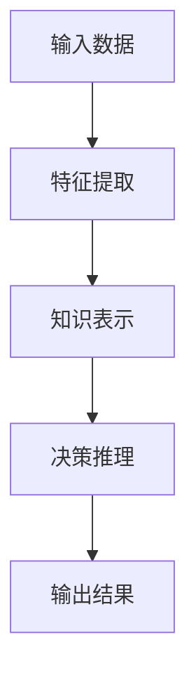
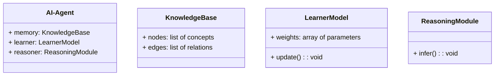

                 


# AI Agent的终身学习系统实现

## 关键词：AI Agent、终身学习、连续学习、机器学习、深度学习、知识表示

## 摘要：  
本文详细探讨了AI Agent的终身学习系统实现，从理论基础到算法原理，再到系统架构设计，结合实际案例分析，全面解析了如何构建一个具备持续学习和自适应能力的AI Agent系统。文章内容涵盖终身学习系统的定义、核心概念、算法实现、系统架构、项目实战及最佳实践，为读者提供了一个全面的技术视角。

---

# 第1章: AI Agent的终身学习系统概述

## 1.1 问题背景与定义  
AI Agent（智能体）是一种能够感知环境、自主决策并执行任务的智能系统。传统的AI系统在面对新任务或新数据时往往需要重新训练或依赖固定的规则，这限制了其灵活性和适应性。终身学习（Continuous Learning）是一种能够让AI Agent在不断变化的环境中持续学习和优化的技术。  

### 1.1.1 终身学习的定义与目标  
终身学习系统的核心目标是让AI Agent能够：  
1. 处理动态环境中的新任务和新数据。  
2. 逐步积累知识，避免遗忘已学习的内容。  
3. 在新旧任务之间找到平衡，实现高效的迁移学习。  

### 1.1.2 终身学习与传统机器学习的区别  
| **传统机器学习**       | **终身学习**          |  
|-------------------------|-----------------------|  
| 数据来源                | 数据是在线的、动态的   |  
| 模型更新                | 模型能够持续更新     |  
| 知识积累                | 知识不能积累         |  
| 适应性                  | 适应性有限           |  

---

## 1.2 终身学习系统的核心要素  
终身学习系统的关键要素包括：  
1. **记忆机制**：用于存储和检索已学习的知识。  
2. **学习策略**：决定如何分配学习资源以平衡新旧任务。  
3. **推理能力**：基于现有知识和新数据进行推理。  

### 1.2.1 记忆机制的类型  
- ** episodic 记忆**：记录具体的事件和经验，适用于需要精确回溯的任务。  
- ** semantic 记忆**：存储抽象的知识和概念，适用于通用推理任务。  

### 1.2.2 知识表示与推理  
知识可以通过图结构表示，其中节点表示概念，边表示关系。知识图谱的构建和推理是终身学习系统的核心能力。  

---

# 第2章: 终身学习系统的算法原理

## 2.1 算法概述  
终身学习系统的核心算法通常基于神经网络，尤其是深度学习模型。以下是一个简化的算法流程：  



## 2.2 数学模型  
### 2.2.1 基本公式  
$$f(x) = \sigma(w \cdot x + b)$$  
其中，$w$是权重，$b$是偏置，$\sigma$是激活函数。  

### 2.2.2 参数更新  
终身学习系统通过在线更新参数来实现持续优化：  
$$w_{t+1} = w_t + \alpha (y_t - y_t') \cdot x_t$$  
其中，$\alpha$是学习率，$y_t$是真实输出，$y_t'$是预测输出。  

## 2.3 算法实现  
以下是一个简单的终身学习算法的Python实现：  

```python  
class LifeLongLearner:  
    def __init__(self, input_dim, hidden_dim, output_dim):  
        self.w1 = np.random.randn(input_dim, hidden_dim)  
        self.w2 = np.random.randn(hidden_dim, output_dim)  
        self.alpha = 0.01  

    def forward(self, x):  
        self.z1 = np.dot(x, self.w1)  
        self.z2 = np.dot(self.z1, self.w2)  
        return self.z2  

    def backward(self, x, y, prediction):  
        delta3 = (y - prediction) * self.z2 * (1 - self.z2)  
        delta2 = np.dot(delta3, self.w2.T) * (1 - self.z1 * (1 - self.z1))  
        self.w2 += self.alpha * np.dot(self.z1.T, delta3)  
        self.w1 += self.alpha * np.dot(x.T, delta2)  

    def update(self, x, y):  
        prediction = self.forward(x)  
        self.backward(x, y, prediction)  
```

---

# 第3章: 终身学习系统的系统架构设计

## 3.1 系统功能设计  
### 3.1.1 领域模型设计  


## 3.2 系统架构设计  


---

# 第4章: 终身学习系统的项目实战

## 4.1 项目环境安装与配置  
```bash  
pip install numpy  
pip install matplotlib  
pip install scikit-learn  
```

## 4.2 核心代码实现  
```python  
def train_agent(agent, X, y):  
    for x, y_true in zip(X, y):  
        y_pred = agent.forward(x)  
        agent.update(x, y_true)  
```

## 4.3 实际案例分析  
### 4.3.1 案例背景  
假设我们有一个分类任务，类别会随着时间推移不断增加。终身学习系统需要能够动态适应新类别的加入。  

### 4.3.2 案例实现  
使用上述代码训练一个简单的AI Agent，测试其在新任务中的表现。  

---

# 第5章: 终身学习系统的最佳实践

## 5.1 实践与注意事项  
1. **数据质量**：确保输入数据的多样性和代表性。  
2. **模型选择**：根据任务需求选择合适的模型架构。  
3. **在线学习**：实现高效的在线更新机制。  

## 5.2 项目总结  
通过本文的分析，我们了解了AI Agent的终身学习系统的实现方法，包括算法设计、系统架构和项目实战。  

## 5.3 拓展阅读  
- 《Continuous Learning in Neural Networks》  
- 《Knowledge Representation and Reasoning》  

---

# 第6章: 终身学习系统的未来展望  
终身学习技术将在未来的AI发展中扮演重要角色，尤其是在动态环境和多任务学习场景中。随着算法的优化和硬件的提升，AI Agent的终身学习能力将更加智能化和高效化。  

--- 

以上是《AI Agent的终身学习系统实现》的完整文章大纲和内容，您可以根据实际需求调整各部分的具体内容和详细程度。

