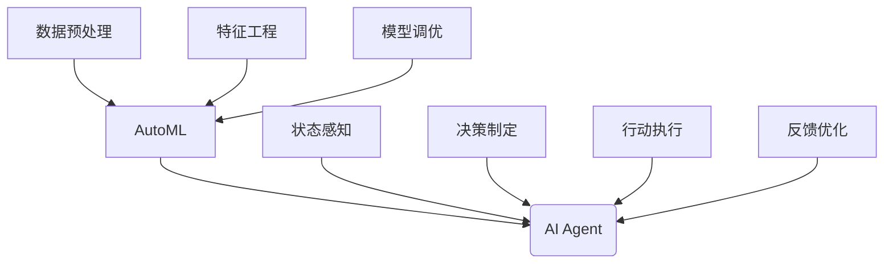
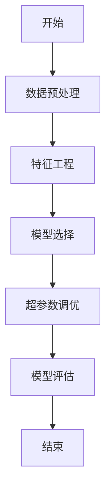
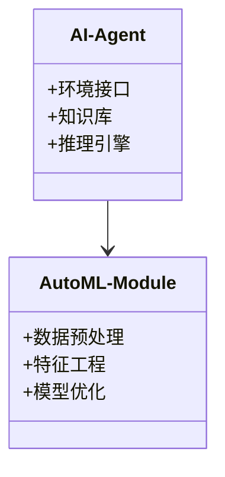

                 


# AI Agent的自动机器学习(AutoML)应用

## 关键词：AI Agent, AutoML, 机器学习, 自动化, 人工智能, 算法优化

## 摘要：本文深入探讨AI Agent与AutoML的结合，分析AutoML在AI Agent中的应用背景、核心概念、算法原理、系统架构及实际案例，帮助读者理解如何通过AutoML提升AI Agent的智能化和效率。

---

## 第1章: AI Agent与AutoML的背景介绍

### 1.1 AutoML的基本概念
- **定义**：AutoML指自动化机器学习，旨在自动完成数据预处理、特征工程、模型选择和调优等步骤。
- **目标**：提高机器学习模型的开发效率，降低技术门槛。
- **区别**：与传统机器学习相比，AutoML减少了人工干预，适合快速原型开发和部署。

### 1.2 AI Agent的基本概念
- **定义**：AI Agent是一种智能体，能够感知环境、做出决策并执行任务。
- **功能**：包括状态感知、决策制定、行动执行和反馈优化。
- **区别**：传统软件依赖固定逻辑，而AI Agent具备动态决策和自适应能力。

### 1.3 AutoML在AI Agent中的应用背景
- **痛点**：机器学习模型开发耗时，AI Agent需要实时反馈和优化。
- **需求**：AI Agent需要高效、自动化的机器学习能力来提升任务执行效率。
- **前景**：AutoML与AI Agent的结合将推动智能系统的自动化和智能化。

---

## 第2章: AutoML与AI Agent的核心概念与联系

### 2.1 AutoML的核心原理
- **数据预处理**：自动处理缺失值、标准化、特征提取等。
- **特征工程**：自动生成高价值特征，降低特征工程的复杂性。
- **模型选择与调优**：通过自动化搜索和优化算法选择最优模型和参数。

### 2.2 AI Agent的核心原理
- **状态感知**：通过传感器或API获取环境信息。
- **决策制定**：基于知识库和推理引擎做出最优决策。
- **行动执行**：通过API或执行模块完成任务。

### 2.3 AutoML与AI Agent的关系
- **AutoML为AI Agent提供机器学习能力**：通过自动化模型构建，提升AI Agent的决策准确性。
- **AI Agent为AutoML提供智能化决策**：通过实时反馈优化AutoML的搜索空间和策略。
- **结合场景**：例如，在推荐系统中，AutoML优化推荐模型，AI Agent根据用户反馈动态调整推荐策略。

### 2.4 核心概念对比表
| 概念 | AutoML | AI Agent |
|------|--------|----------|
| 核心任务 | 自动化机器学习流程 | 自动化决策与行动 |
| 主要目标 | 提高模型开发效率 | 提高任务执行效率 |
| 依赖技术 | 机器学习、优化算法 | 知识表示、推理、规划 |

### 2.5 实体关系图


---

## 第3章: AutoML的算法原理与实现

### 3.1 算法原理
- **数据预处理**：使用特征选择算法（如Lasso回归）自动提取关键特征。
- **模型选择**：通过遗传算法搜索最佳模型组合。
- **超参数调优**：采用贝叶斯优化或随机搜索优化模型参数。

### 3.2 算法流程图


### 3.3 数学模型与公式
- **遗传算法**：选择、交叉和变异操作用于搜索模型组合。
- **贝叶斯优化**：基于概率分布的优化方法，公式表示为：
  $$
  p(\theta | X) \propto p(X|\theta) p(\theta)
  $$

### 3.4 代码实现
```python
import autosklearn
from autosklearn import AutoSklearnRegressor

# 初始化AutoML模型
model = AutoSklearnRegressor(time_limit=3600)
# 拟合模型
model.fit(X_train, y_train)
# 预测
y_pred = model.predict(X_test)
```

---

## 第4章: AI Agent的系统架构与设计

### 4.1 系统架构图


### 4.2 系统功能设计
- **数据预处理**：自动清洗和转换数据。
- **特征工程**：生成高价值特征。
- **模型优化**：选择最优模型并调优参数。

### 4.3 接口设计
- **输入接口**：接收环境数据和任务需求。
- **输出接口**：返回优化后的模型和决策结果。

### 4.4 交互流程
```mermaid
sequenceDiagram
参与者: AI-Agent
AutoML-Module
参与者->AutoML-Module: 请求数据预处理
AutoML-Module->参与者: 返回处理后数据
参与者->AutoML-Module: 请求模型优化
AutoML-Module->参与者: 返回优化模型
```

---

## 第5章: 项目实战与案例分析

### 5.1 项目背景
- **场景**：优化一个推荐系统的AI Agent。
- **目标**：通过AutoML自动优化推荐模型，提升推荐准确率。

### 5.2 环境安装
```bash
pip install autosklearn scikit-learn
```

### 5.3 核心代码实现
```python
from autosklearn.regression import AutoSklearnRegressor
from sklearn.metrics import mean_absolute_error

# 初始化AutoML模型
model = AutoSklearnRegressor()
# 拟合模型
model.fit(X_train, y_train)
# 预测
y_pred = model.predict(X_test)
# 评估
score = mean_absolute_error(y_test, y_pred)
print(f"模型准确率: {score}")
```

### 5.4 案例分析
- **案例**：AI Agent结合AutoML优化推荐系统。
- **分析**：AutoML自动优化推荐模型，AI Agent根据用户反馈动态调整推荐策略，显著提升了推荐准确率和用户满意度。

---

## 第6章: 最佳实践与总结

### 6.1 最佳实践
- **数据质量**：确保数据的完整性和准确性。
- **模型解释性**：选择可解释的模型，便于分析和优化。
- **实时反馈**：及时收集用户反馈，优化AutoML的搜索空间。

### 6.2 小结
- AutoML与AI Agent的结合显著提升了机器学习模型的开发效率和智能系统的决策能力。
- 通过自动化处理和智能化决策，两者共同推动了人工智能应用的普及和发展。

### 6.3 注意事项
- 数据隐私和模型解释性是实际应用中的重要考虑因素。
- AutoML和AI Agent的结合需要根据具体场景进行定制化设计。

### 6.4 拓展阅读
- 《Hands-On Machine Learning with Scikit-Learn, Keras, and TensorFlow》
- 《Reinforcement Learning: Theory and Algorithms》

---

## 附录
- **术语表**：AutoML、AI Agent、特征工程、超参数调优。
- **参考文献**：相关技术论文和书籍。

---

通过本文的详细讲解和分析，读者可以深入理解AI Agent与AutoML的结合应用，掌握其核心概念、算法原理和系统架构，为实际项目提供有价值的参考和指导。

