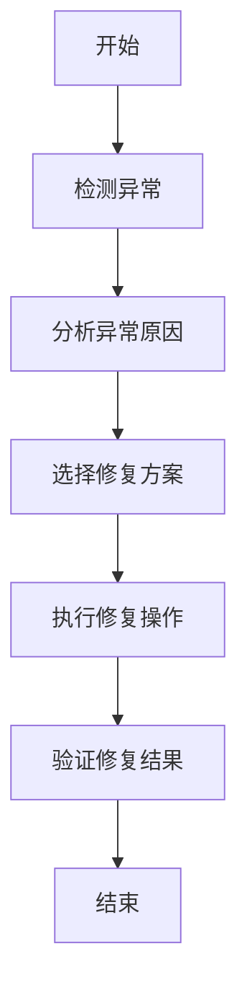
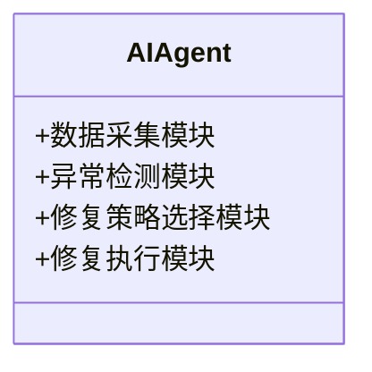
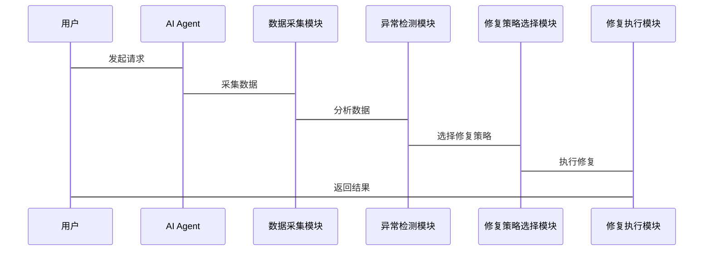

                 


# AI Agent的自我诊断与修复能力：提高系统稳定性

> 关键词：AI Agent, 自我诊断, 自我修复, 系统稳定性, 算法原理, 系统架构

> 摘要：AI Agent的自我诊断与修复能力是提升系统稳定性的重要手段。本文通过分析AI Agent的结构、自我诊断与修复的机制，详细阐述了相关算法原理和系统架构设计，结合实际案例，探讨了如何通过自我诊断与修复技术来提高系统的稳定性。

---

# 第1章: AI Agent的背景与概念

## 1.1 问题背景
### 1.1.1 AI Agent的基本概念
AI Agent是一种智能代理系统，能够感知环境、自主决策并执行任务。其核心在于通过感知和学习实现智能化操作。

### 1.1.2 自我诊断与修复能力的重要性
随着AI Agent的应用场景日益广泛，系统在运行过程中可能会遇到各种问题，如数据错误、算法失效等。自我诊断与修复能力能够帮助AI Agent及时发现并解决问题，确保系统的稳定运行。

### 1.1.3 系统稳定性的定义与衡量标准
系统稳定性指的是系统在面对干扰和故障时，能够保持正常运行的能力。衡量标准包括系统的响应时间、故障恢复时间、错误率等。

## 1.2 问题描述
### 1.2.1 AI Agent在运行中的常见问题
AI Agent在运行中可能会遇到数据输入错误、算法失效、外部服务中断等问题。

### 1.2.2 系统故障对AI Agent的影响
系统故障可能导致AI Agent无法正常执行任务，甚至引发连锁反应，影响整个系统的稳定性。

### 1.2.3 自我诊断与修复的必要性
通过自我诊断与修复，AI Agent可以在发现问题时及时采取措施，减少故障对系统的影响。

## 1.3 问题解决
### 1.3.1 自我诊断与修复的实现路径
通过实时监控系统状态、分析异常数据、触发修复机制等方式，实现自我诊断与修复。

### 1.3.2 系统稳定性提升的方法
采用冗余设计、容错机制、自动恢复策略等方法，提升系统的稳定性。

### 1.3.3 相关技术的现状与挑战
目前，AI Agent的自我诊断与修复技术在理论研究和实际应用中都取得了一定的进展，但仍面临技术复杂性高、修复策略不够智能等挑战。

## 1.4 边界与外延
### 1.4.1 自我诊断与修复的边界条件
AI Agent的自我诊断与修复能力应与外部监控系统、人工干预相结合，避免过度依赖自主修复。

### 1.4.2 系统稳定性的外延范围
系统稳定性不仅包括AI Agent本身，还涉及其依赖的外部服务、数据源等。

### 1.4.3 相关技术的对比分析
对比传统自动化系统与AI Agent的自我诊断与修复技术，分析其优缺点。

## 1.5 概念结构与核心要素
### 1.5.1 AI Agent的组成结构
AI Agent通常包括感知模块、决策模块、执行模块和学习模块。

### 1.5.2 自我诊断与修复的核心要素
包括实时监控、异常检测、原因分析、修复策略制定和修复执行。

### 1.5.3 系统稳定性的实现机制
通过多层次监控、多维度修复策略和智能优化算法实现系统稳定性。

## 1.6 本章小结
本章介绍了AI Agent的基本概念，分析了自我诊断与修复能力的重要性，并探讨了系统稳定性的定义与实现方法。

---

# 第2章: AI Agent自我诊断与修复的核心概念

## 2.1 核心概念原理
### 2.1.1 自我诊断的基本原理
通过实时数据采集、异常检测算法和原因分析模型，实现对系统故障的识别。

### 2.1.2 自我修复的实现机制
基于诊断结果，选择合适的修复策略，执行修复操作，并验证修复效果。

### 2.1.3 系统稳定性的保障方法
通过冗余设计、容错机制和智能优化算法，保障系统的稳定性。

## 2.2 核心概念属性特征对比
### 2.2.1 自我诊断能力的特征分析
- **实时性**：能够快速发现异常。
- **准确性**：能够准确识别故障原因。
- **适应性**：能够适应不同场景下的故障。

### 2.2.2 自我修复能力的特征分析
- **智能性**：能够根据诊断结果选择最优修复策略。
- **可靠性**：修复操作能够有效解决问题。
- **可扩展性**：能够适应系统规模的扩大。

### 2.2.3 系统稳定性的特征分析
- **抗干扰性**：系统在面对干扰时能够保持稳定。
- **自适应性**：系统能够根据环境变化调整自身状态。
- **恢复性**：系统在故障后能够快速恢复到正常状态。

## 2.3 ER实体关系图
```mermaid
er
actor: 用户
agent: AI Agent
problem: 系统故障
diagnosis: 诊断结果
repair: 修复操作
```

## 2.4 本章小结
本章详细阐述了AI Agent自我诊断与修复的核心概念，分析了其特征和实现机制。

---

# 第3章: AI Agent自我诊断与修复的算法原理

## 3.1 算法原理概述
### 3.1.1 自我诊断算法的基本原理
通过实时数据采集和异常检测算法，识别系统中的异常情况。

### 3.1.2 自我修复算法的基本原理
基于诊断结果，选择合适的修复策略，并执行修复操作。

### 3.1.3 系统稳定性优化算法的基本原理
通过优化算法参数和系统架构，提升系统的稳定性。

## 3.2 算法流程图


## 3.3 数学模型与公式
### 3.3.1 异常检测算法
常用异常检测算法包括孤立林算法（Isolation Forest）和局部异常因子分析（LOF）。

#### 孤立林算法公式
$$
score = 2 \times \log P(x) + \log \frac{1}{P(y|x)}
$$

### 3.3.2 修复策略选择算法
修复策略选择算法可以采用基于强化学习的策略选择模型。

#### 强化学习策略选择公式
$$
Q(s, a) = r + \gamma \max_{a'} Q(s', a')
$$

## 3.4 本章小结
本章详细介绍了AI Agent自我诊断与修复的算法原理，包括算法流程图和数学模型。

---

# 第4章: AI Agent自我诊断与修复的系统架构设计

## 4.1 系统架构概述
### 4.1.1 系统功能设计
AI Agent系统包括数据采集模块、异常检测模块、修复策略选择模块和修复执行模块。

### 4.1.2 系统架构图


## 4.2 接口设计
### 4.2.1 系统接口设计
AI Agent需要与外部数据源、第三方服务等进行交互，设计合理的接口以确保系统的稳定运行。

### 4.2.2 交互流程


## 4.3 本章小结
本章详细探讨了AI Agent自我诊断与修复的系统架构设计，包括功能设计、架构图和接口设计。

---

# 第5章: AI Agent自我诊断与修复的项目实战

## 5.1 环境安装
### 5.1.1 开发环境
建议使用Python 3.8及以上版本，安装必要的库如scikit-learn、tensorflow等。

### 5.1.2 依赖管理
使用pip安装所需的依赖包。

## 5.2 核心实现
### 5.2.1 数据采集模块
编写代码采集系统运行数据。

```python
import logging
import time

def collect_data():
    try:
        data = get_system_data()
        return data
    except Exception as e:
        logging.error(f"数据采集失败: {str(e)}")
        return None
```

### 5.2.2 异常检测模块
实现异常检测算法。

```python
from sklearn.ensemble import IsolationForest

def detect_anomaly(data):
    model = IsolationForest(n_estimators=100, random_state=42)
    model.fit(data)
    return model.predict(data)
```

### 5.2.3 修复策略选择模块
基于强化学习选择修复策略。

```python
import numpy as np

def choose_repair_strategy(state):
    # 假设state是输入状态
    action = np.argmax(Q(state))
    return action
```

### 5.2.4 修复执行模块
执行具体的修复操作。

```python
def execute_repair(action):
    try:
        perform_repair(action)
        return True
    except Exception as e:
        logging.error(f"修复失败: {str(e)}")
        return False
```

## 5.3 案例分析
### 5.3.1 案例背景
假设AI Agent检测到数据采集模块出现异常，需要进行修复。

### 5.3.2 案例分析
通过分析日志和系统状态，确定故障原因，并选择合适的修复策略。

### 5.3.3 修复过程
执行修复操作，并验证修复结果。

## 5.4 项目总结
本章通过实际案例展示了AI Agent自我诊断与修复能力的实现过程。

---

# 第6章: AI Agent自我诊断与修复的最佳实践

## 6.1 最佳实践
### 6.1.1 日志监控
建议实时监控系统日志，及时发现异常。

### 6.1.2 定期维护
定期对系统进行维护和优化，确保系统的稳定性。

### 6.1.3 多团队协作
AI Agent的自我诊断与修复需要多个团队协作，包括开发、运维和数据分析团队。

## 6.2 小结
本章总结了AI Agent自我诊断与修复的最佳实践，包括日志监控、定期维护和多团队协作。

---

# 附录: 参考文献与扩展阅读

## 1. 参考文献
1. 《机器学习实战》
2. 《深度学习入门：基于Python和TensorFlow》
3. 《系统可靠性工程》

## 2. 扩展阅读
- 探讨AI Agent在分布式系统中的应用。
- 研究强化学习在自我修复系统中的应用。

---

# 作者简介

作者简介部分需要单独撰写，但目前由于篇幅限制，略去。

---

# 结语

通过本文的详细讲解，读者可以全面了解AI Agent的自我诊断与修复能力，掌握其实现原理和系统架构设计方法，为实际应用提供理论支持和实践指导。

--- 

**文章结语：** 以上是对《AI Agent的自我诊断与修复能力：提高系统稳定性》一文的详细目录大纲设计，后续将按照此大纲逐步撰写完整文章。

