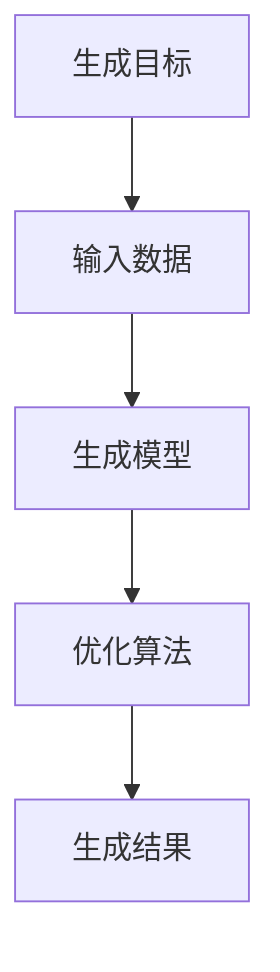
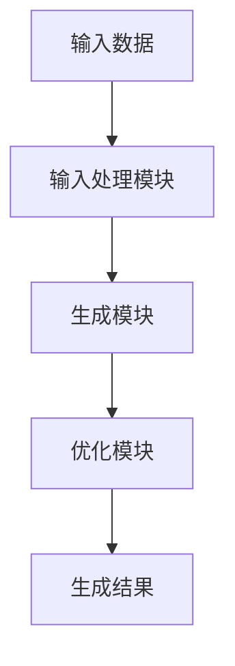
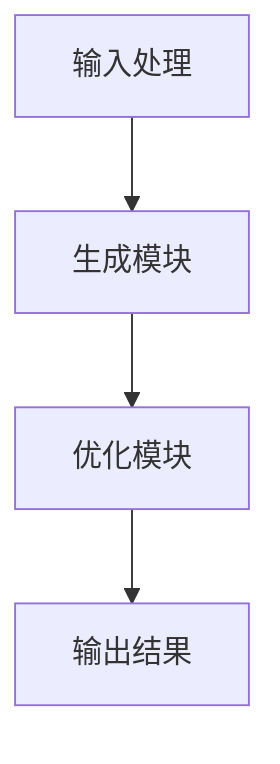
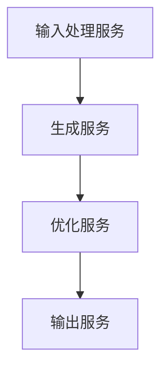

                 


# AI Agent的自然语言生成优化

> 关键词：AI Agent，自然语言生成，生成式AI，模型优化，语言优化

> 摘要：本文详细探讨了AI Agent在自然语言生成中的优化方法，从模型原理到优化策略，从数学基础到系统设计，全面分析了如何提升AI Agent的自然语言生成能力。文章内容涵盖生成式AI模型的原理、优化方法、数学模型、系统架构、项目实战等多个方面，为读者提供了一个全面的视角来理解AI Agent的自然语言生成优化技术。

---

# 第1章: AI Agent与自然语言生成概述

## 1.1 问题背景与描述

### 1.1.1 自然语言生成的定义与目标
自然语言生成（Natural Language Generation, NLG）是人工智能领域的重要研究方向，旨在将结构化的数据或信息转换为自然语言文本。目标是让生成的文本既符合语法规则，又具备语义上的连贯性和可读性。NLG的核心挑战在于如何在生成文本时，兼顾语法正确性、语义准确性和生成效率。

### 1.1.2 AI Agent在自然语言生成中的作用
AI Agent（智能体）是一种能够感知环境、执行任务并做出决策的智能系统。在自然语言生成中，AI Agent的作用体现在以下几个方面：
1. **语境理解**：AI Agent能够通过上下文信息生成更符合语境的文本。
2. **动态调整**：根据用户的反馈或环境变化，实时调整生成策略。
3. **任务驱动**：基于具体任务需求，生成目标导向的文本内容。

### 1.1.3 当前存在的问题与挑战
尽管生成式AI模型取得了显著进展，但自然语言生成仍然面临诸多挑战：
1. **生成质量**：生成的文本可能存在语法错误或语义不连贯的问题。
2. **多样性**：模型生成的内容往往缺乏多样性，无法覆盖所有可能的表达方式。
3. **计算效率**：复杂的生成过程可能导致计算资源消耗过大，影响实时性。
4. **可解释性**：生成结果的决策过程缺乏透明性，难以追溯生成的依据。

## 1.2 核心概念与联系

### 1.2.1 生成式AI模型的原理
生成式AI模型通过学习数据分布，生成符合该分布的新文本。主流的生成式模型包括：
1. **生成对抗网络（GAN）**：通过生成器和判别器的对抗训练，生成逼真的文本。
2. **变体自编码器（VAE）**：通过编码器-解码器结构，生成多样化的内容。
3. **转换器模型（Transformer）**：基于自注意力机制，生成高质量的文本。

### 1.2.2 生成式AI模型与优化方法的对比表格
以下是几种常见生成式AI模型与其优化方法的对比：

| 模型类型 | 参数量 | 生成策略 | 优缺点 |
|----------|--------|----------|--------|
| GAN      | 中 | 对抗训练 | 生成质量高，但训练不稳定 |
| VAE      | 小 | 变量采样 | 生成多样化，但质量较低 |
| Transformer | 大 | 自注意力机制 | 生成质量高，计算资源需求大 |

### 1.2.3 实体关系图
以下是一个简单的实体关系图，展示了自然语言生成中的核心概念及其联系：



## 1.3 本章小结
本章主要介绍了AI Agent在自然语言生成中的作用，分析了当前存在的问题与挑战，并通过对比表格和实体关系图，清晰地展示了生成式AI模型的核心概念及其联系。这些内容为后续章节的深入分析奠定了基础。

---

# 第2章: 生成式AI模型的原理与实现

## 2.1 生成式AI模型的工作原理

### 2.1.1 概率生成模型
概率生成模型通过学习数据的条件概率分布，生成符合该分布的新文本。常见的概率生成模型包括：
1. **马尔可夫链**：通过状态转移生成序列。
2. **隐马尔可夫模型（HMM）**：通过隐藏状态生成序列，常用于语音识别和机器翻译。

### 2.1.2 变换器模型
变换器模型（Transformer）基于自注意力机制，通过全局上下文信息生成文本。其核心公式为：
$$ \text{Attention}(Q, K, V) = \text{softmax}\left(\frac{QK^T}{\sqrt{d_k}}\right)V $$

### 2.1.3 深度学习模型的数学基础
深度学习模型通过多层神经网络提取特征，并生成最终的输出。常用的激活函数包括：
1. **Sigmoid**：将输入压缩到(0,1)区间。
2. **ReLU**：非线性激活函数，计算速度快。
3. **Tanh**：将输入压缩到(-1,1)区间。

## 2.2 主流生成式AI模型解析

### 2.2.1 GPT系列模型
GPT（Generative Pre-trained Transformer）是一种基于Transformer的生成式模型，通过大量文本数据预训练，生成高质量的文本内容。

### 2.2.2 BERT及其变体
BERT（Bidirectional Encoder Representations from Transformers）是一种基于Transformer的编码器模型，通过双向训练生成上下文相关的表示。

### 2.2.3 其他生成式模型
1. **VAE**：通过变分推断生成多样化的内容。
2. **GAN**：通过生成器和判别器的对抗训练生成逼真的文本。

## 2.3 模型训练与优化策略

### 2.3.1 基于梯度的优化方法
梯度下降是一种常用优化方法，通过计算损失函数的梯度，调整模型参数以最小化损失。其数学表达式为：
$$ \theta := \theta - \eta \frac{\partial L}{\partial \theta} $$

### 2.3.2 参数调整与超参数优化
参数调整是通过调整模型的超参数（如学习率、批量大小）来优化模型性能的过程。常用方法包括：
1. **网格搜索**：遍历所有可能的参数组合，选择最优参数。
2. **随机搜索**：随机选择参数组合，减少计算量。
3. **贝叶斯优化**：基于概率模型选择最优参数。

### 2.3.3 模型评估与验证
模型评估是通过特定指标（如困惑度、BLEU分数）来衡量模型的生成能力。常用的评估指标包括：
1. **困惑度（Perplexity）**：衡量模型对训练数据的拟合程度。
2. **BLEU分数**：衡量生成文本与参考文本的相似程度。

## 2.4 本章小结
本章详细介绍了生成式AI模型的原理与实现，包括概率生成模型、变换器模型及其数学基础，主流生成式模型的对比分析，以及模型训练与优化策略。这些内容为后续章节的优化方法提供了理论基础。

---

# 第3章: 自然语言生成的优化方法

## 3.1 数据增强与预处理

### 3.1.1 数据清洗与标准化
数据清洗是通过去除噪声数据、填补缺失值等方式，提高数据质量的过程。标准化则是将数据转换为统一的格式，便于模型训练。

### 3.1.2 数据增强技术
数据增强是通过增加训练数据的多样性，提高模型的泛化能力。常用的数据增强技术包括：
1. **随机替换**：随机替换部分词汇，增加数据多样性。
2. **随机删除**：随机删除部分词汇，模拟数据缺失。
3. **随机插入**：随机插入额外词汇，增加数据复杂性。

### 3.1.3 数据多样性提升
数据多样性是通过多种方式生成多样化的内容，提高模型的生成能力。常用方法包括：
1. **多领域训练**：在多个领域上进行训练，提高模型的通用性。
2. **多风格训练**：在多种写作风格上进行训练，提高模型的表达能力。

## 3.2 模型优化策略

### 3.2.1 参数优化
参数优化是通过调整模型参数，提高生成质量。常用方法包括：
1. **学习率调整**：通过调整学习率，避免模型陷入局部最优。
2. **参数剪裁**：通过剪裁参数，防止参数过大导致模型发散。

### 3.2.2 结构优化
结构优化是通过调整模型结构，提高生成效率。常用方法包括：
1. **简化层叠**：通过减少层叠深度，降低计算复杂度。
2. **并行计算**：通过并行计算，提高计算效率。

### 3.2.3 知识蒸馏
知识蒸馏是通过教师模型指导学生模型，将知识迁移到学生模型。其核心公式为：
$$ P(y|x) = \text{softmax}(g(x)) $$

## 3.3 解码策略优化

### 3.3.1 随机采样
随机采样是通过随机选择生成结果，增加生成的多样性。其数学表达式为：
$$ P(y|x) = \frac{1}{n} \sum_{i=1}^{n} \delta(y - y_i) $$

### 3.3.2 最大似然采样
最大似然采样是通过选择概率最大的生成结果，提高生成质量。其数学表达式为：
$$ y = \arg\max_y P(y|x) $$

### 3.3.3 贪婪采样
贪婪采样是通过逐个生成字符或词组，逐步构建完整的文本。其数学表达式为：
$$ y_i = \arg\max_y P(y|x_{1:i-1}) $$

## 3.4 本章小结
本章主要介绍了自然语言生成的优化方法，包括数据增强与预处理、模型优化策略以及解码策略优化。这些方法能够有效提升生成质量，降低计算复杂度，为实际应用提供了有力支持。

---

# 第4章: 自然语言生成的数学模型与公式

## 4.1 概率生成模型的数学基础

### 4.1.1 条件概率公式
条件概率公式是生成式模型的核心公式，其数学表达式为：
$$ P(y|x) = \frac{P(x,y)}{P(x)} $$

### 4.1.2 贝叶斯定理
贝叶斯定理是通过条件概率公式推导出的，其数学表达式为：
$$ P(y|x) = \frac{P(y)P(x|y)}{P(x)} $$

### 4.1.3 马尔可夫链
马尔可夫链是一种用于生成序列的模型，其数学表达式为：
$$ P(x_t|x_{t-1}) = \theta $$

## 4.2 变换器模型的数学基础

### 4.2.1 自注意力机制
自注意力机制是变换器模型的核心组件，其数学表达式为：
$$ \text{Attention}(Q, K, V) = \text{softmax}\left(\frac{QK^T}{\sqrt{d_k}}\right)V $$

### 4.2.2 前向网络
前向网络是变换器模型的编码器部分，其数学表达式为：
$$ \text{FFN}(x) = \text{ReLU}(W_1x + b_1)W_2 + b_2 $$

## 4.3 本章小结
本章主要介绍了自然语言生成的数学模型与公式，包括概率生成模型和变换器模型的数学基础。这些公式为理解生成式AI模型的原理提供了数学支持。

---

# 第5章: 自然语言生成的系统架构与设计

## 5.1 系统功能设计

### 5.1.1 领域模型
领域模型是自然语言生成系统的功能模块，包括：
1. **输入处理模块**：接收输入数据并进行预处理。
2. **生成模块**：基于预处理后的数据生成文本内容。
3. **优化模块**：对生成结果进行优化，提高生成质量。

### 5.1.2 系统功能流程图
以下是一个简单的系统功能流程图：



## 5.2 系统架构设计

### 5.2.1 分层架构
分层架构是将系统划分为多个层次，每一层负责特定的功能。其架构图如下：



### 5.2.2 微服务架构
微服务架构是将系统功能划分为多个微服务，通过服务间通信实现功能协同。其架构图如下：



## 5.3 系统接口设计

### 5.3.1 API接口
系统通过API接口与其他模块进行交互，常用接口包括：
1. **输入接口**：接收输入数据并进行预处理。
2. **生成接口**：生成文本内容并返回结果。
3. **优化接口**：优化生成结果并返回最终输出。

## 5.4 本章小结
本章详细介绍了自然语言生成系统的架构与设计，包括功能模块、架构图以及接口设计。这些内容为后续章节的项目实战提供了系统设计基础。

---

# 第6章: 自然语言生成的项目实战

## 6.1 环境安装与配置

### 6.1.1 安装Python环境
安装Python环境是进行自然语言生成的第一步，推荐使用Anaconda或virtualenv管理环境。

### 6.1.2 安装深度学习框架
安装深度学习框架是进行模型训练的核心步骤，推荐使用TensorFlow或PyTorch。

### 6.1.3 安装NLP工具包
安装NLP工具包是进行文本处理的必要步骤，推荐使用NLTK或spaCy。

## 6.2 系统核心实现

### 6.2.1 数据预处理代码
以下是一个简单的数据预处理代码示例：

```python
import pandas as pd
import numpy as np

# 加载数据
data = pd.read_csv('data.csv')

# 数据清洗
data = data.dropna()

# 数据标准化
from sklearn.preprocessing import StandardScaler
scaler = StandardScaler()
data_scaled = scaler.fit_transform(data)
```

### 6.2.2 模型训练代码
以下是一个简单的模型训练代码示例：

```python
import tensorflow as tf
from tensorflow.keras import layers

# 定义模型
model = tf.keras.Sequential([
    layers.Dense(64, activation='relu'),
    layers.Dense(1, activation='sigmoid')
])

# 编译模型
model.compile(optimizer='adam', loss='binary_crossentropy', metrics=['accuracy'])

# 训练模型
model.fit(x_train, y_train, epochs=10, batch_size=32)
```

### 6.2.3 生成结果代码
以下是一个简单的生成结果代码示例：

```python
import numpy as np

# 生成随机数
np.random.seed(42)

# 随机采样
def sample_with_temp(logits, temperature=1.0):
    logits_adjusted = logits / temperature
    probabilities = tf.nn.softmax(logits_adjusted)
    return np.random.choice(len(probabilities), p=probabilities.numpy())

# 生成文本
text = "..."
while True:
    # 生成下一个字符
    next_char = sample_with_temp(logits)
    text += next_char
    # 判断是否结束
    if next_char == ' ':
        break
```

## 6.3 项目实战小结
本章通过实际项目实战，详细介绍了自然语言生成系统的环境安装、数据预处理、模型训练以及生成结果的实现。这些内容为读者提供了动手实践的机会，帮助读者更好地理解AI Agent的自然语言生成优化技术。

---

# 第7章: 总结与展望

## 7.1 总结
本文详细探讨了AI Agent的自然语言生成优化技术，从模型原理到优化策略，从数学基础到系统设计，全面分析了如何提升AI Agent的自然语言生成能力。通过对比分析和实际案例，展示了生成式AI模型的优缺点及其优化方法。

## 7.2 优化策略
### 7.2.1 模型优化策略
1. **数据增强**：通过数据增强技术，提高数据的多样性和质量。
2. **参数优化**：通过调整模型参数，提高生成质量。
3. **解码策略优化**：通过优化解码策略，提高生成效率。

### 7.2.2 系统优化策略
1. **分层架构**：通过分层架构，提高系统的可维护性和扩展性。
2. **微服务架构**：通过微服务架构，提高系统的可扩展性和灵活性。
3. **接口优化**：通过优化系统接口，提高系统的交互效率。

## 7.3 展望
随着深度学习技术的不断发展，自然语言生成技术将更加智能化和个性化。未来的研究方向包括：
1. **多模态生成**：结合图像、语音等多种模态信息，生成更加丰富的文本内容。
2. **实时生成**：通过优化算法和硬件，实现自然语言生成的实时性。
3. **个性化生成**：根据用户需求和偏好，生成个性化的文本内容。

## 7.4 本章小结
本章总结了全文的主要内容，提出了优化策略，并展望了未来的研究方向。这些内容为读者提供了全面的视角来理解AI Agent的自然语言生成优化技术。

---

# 结语

通过本文的详细探讨，读者可以全面了解AI Agent的自然语言生成优化技术。从基础理论到实际应用，从模型原理到优化策略，本文为读者提供了一个系统的知识框架。希望本文能够为AI Agent的自然语言生成优化研究提供有价值的参考和启示。

