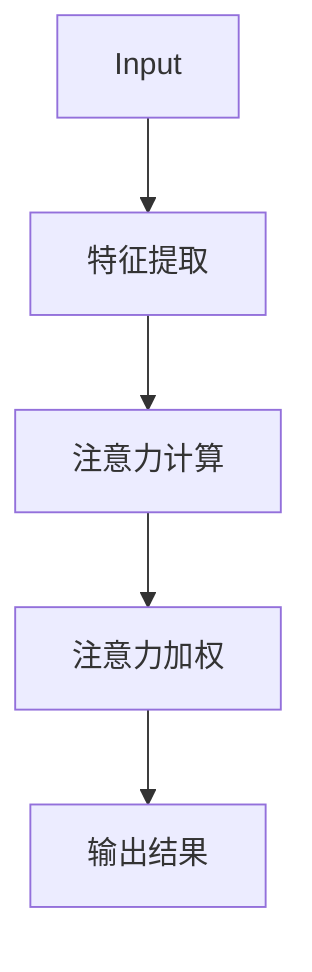
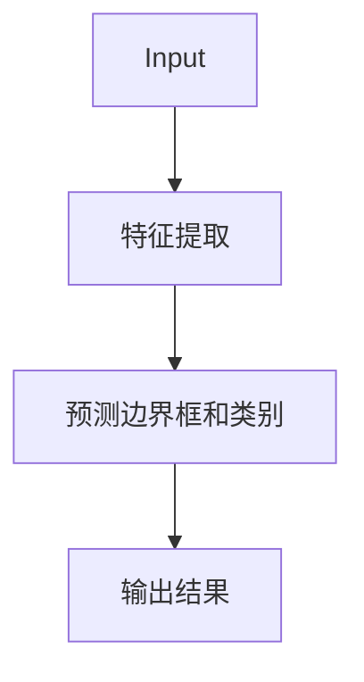
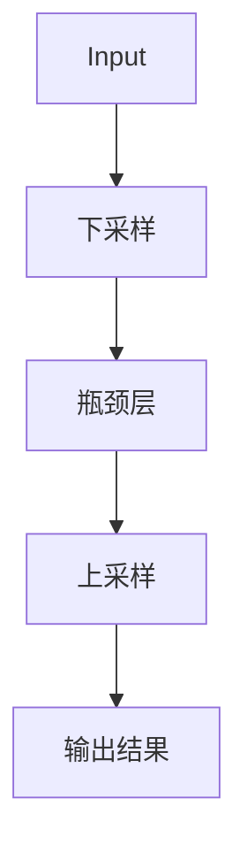
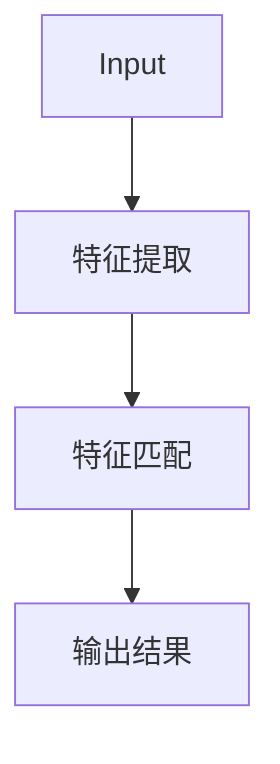
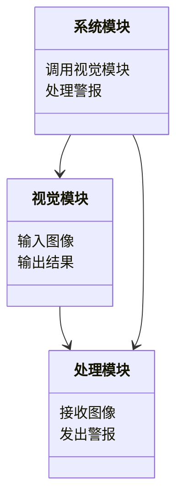
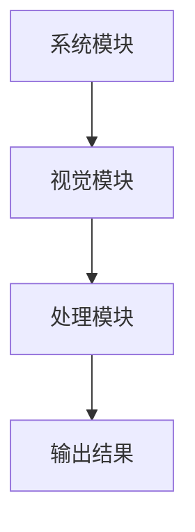
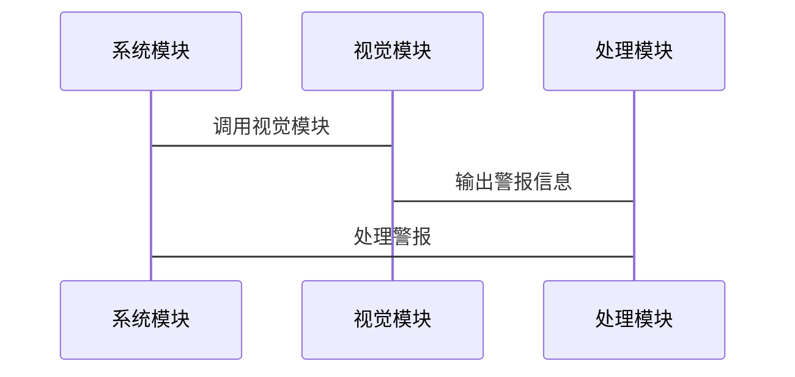

                 


# AI Agent的视觉理解能力增强

## 关键词：AI Agent, 视觉理解, 增强学习, 多模态数据, 计算机视觉

## 摘要

AI Agent的视觉理解能力是实现智能体与现实世界交互的关键技术。本文系统地探讨了AI Agent视觉理解能力的增强方法，从核心概念到算法实现，从系统架构到项目实战，全面解析了如何提升AI Agent的视觉理解能力。本文首先介绍了AI Agent的基本概念和视觉理解的重要性，然后深入分析了多模态学习、注意力机制等核心概念，接着详细讲解了目标检测、图像分割等视觉理解算法的原理，最后通过实际案例展示了如何设计和实现一个支持增强视觉理解的AI Agent系统。

---

## 第1章: AI Agent与视觉理解能力概述

### 1.1 AI Agent的基本概念

#### 1.1.1 AI Agent的定义与特点
AI Agent（人工智能代理）是一种能够感知环境、执行任务并做出决策的智能体。它具有以下特点：
- **自主性**：能够在没有外部干预的情况下自主运行。
- **反应性**：能够实时感知环境并做出响应。
- **目标导向性**：通过目标驱动行为。
- **学习能力**：能够通过数据和经验改进性能。

#### 1.1.2 视觉理解能力在AI Agent中的重要性
视觉理解能力是AI Agent与现实世界交互的基础。通过视觉感知，AI Agent可以识别物体、场景、行为等信息，从而更好地完成任务。例如，在智能安防系统中，AI Agent需要通过视觉理解识别人脸、行为异常等信息。

#### 1.1.3 AI Agent视觉理解能力的应用场景
视觉理解能力在多个领域有广泛应用：
- **智能安防**：识别人脸、车辆、异常行为。
- **自动驾驶**：识别道路、障碍物、交通信号。
- **医疗影像分析**：辅助医生诊断疾病。
- **工业自动化**：检测产品质量、识别缺陷。

### 1.2 视觉理解能力的核心问题

#### 1.2.1 视觉理解的定义与挑战
视觉理解是指AI Agent能够从图像或视频中提取有用信息并理解其含义的能力。视觉理解的核心挑战包括：
- **数据多样性**：不同场景、光照、物体的多样性。
- **语义理解**：如何从低级特征中提取高级语义。
- **实时性要求**：在动态环境中需要快速理解。

#### 1.2.2 视觉理解与AI Agent能力的关系
视觉理解是AI Agent实现复杂任务的关键能力。例如，一个智能助手需要通过视觉理解识别人脸、手势，并根据理解提供服务。

#### 1.2.3 增强视觉理解能力的目标与意义
增强视觉理解能力的目标是提高AI Agent在复杂环境中的感知和决策能力。通过增强视觉理解能力，AI Agent可以更准确地识别人、物、场景，从而更好地服务于人类。

---

## 第2章: 视觉理解能力的核心概念与联系

### 2.1 多模态学习与视觉理解

#### 2.1.1 多模态学习的定义与特点
多模态学习是指同时利用多种数据模态（如图像、文本、语音）进行学习的方法。多模态学习可以提高模型的鲁棒性和泛化能力。

#### 2.1.2 多模态学习在视觉理解中的应用
多模态学习在视觉理解中的应用包括：
- **跨模态检索**：根据文本搜索图像。
- **联合学习**：通过图像和文本数据共同训练模型。

#### 2.1.3 多模态学习与单模态学习的对比分析
| 对比维度 | 单模态学习 | 多模态学习 |
|----------|------------|------------|
| 数据来源 | 单一数据模态 | 多个数据模态 |
| 表达能力 | 较低 | 较高 |
| 稳定性 | 易受模态偏差影响 | 更鲁棒 |

### 2.2 注意力机制与视觉理解

#### 2.2.1 注意力机制的基本原理
注意力机制是一种模拟人类视觉注意力的方法。它通过为输入数据的不同部分分配不同的权重，突出重要信息。

#### 2.2.2 注意力机制在视觉理解中的应用
注意力机制在视觉理解中的应用包括：
- **目标检测**：通过注意力机制定位目标。
- **图像分割**：通过注意力机制分割物体。

#### 2.2.3 基于注意力机制的视觉理解模型
以下是一个经典的注意力机制模型：



### 2.3 视觉特征提取与表示

#### 2.3.1 视觉特征提取的基本方法
视觉特征提取的基本方法包括：
- **基于传统图像处理的方法**：如SIFT、HOG。
- **基于深度学习的方法**：如CNN（卷积神经网络）。

#### 2.3.2 基于深度学习的视觉特征表示
基于深度学习的视觉特征表示方法包括：
- **ResNet**：通过残差块提取深层特征。
- **Vision Transformer (ViT)**：通过Transformer结构处理图像。

#### 2.3.3 视觉特征表示的优缺点对比
| 对比维度 | 基于传统方法 | 基于深度学习 |
|----------|--------------|---------------|
| 表达能力 | 较低 | 较高 |
| 计算复杂度 | 较低 | 较高 |

### 2.4 视觉理解与上下文推理

#### 2.4.1 上下文推理的基本概念
上下文推理是指通过分析上下文信息来理解视觉内容的能力。

#### 2.4.2 视觉理解中的上下文推理方法
上下文推理在视觉理解中的应用包括：
- **场景理解**：通过上下文推理识别人的行为。
- **事件推理**：通过上下文推理预测事件的发展。

#### 2.4.3 上下文推理对视觉理解能力的提升作用
上下文推理可以提高视觉理解的准确性和鲁棒性，尤其是在复杂场景中。

---

## 第3章: AI Agent视觉理解能力的算法原理

### 3.1 目标检测算法

#### 3.1.1 YOLO算法原理
YOLO是一种基于深度学习的目标检测算法。其原理如下：



YOLO的数学模型如下：
$$
P(y|x) = \frac{e^{y \cdot w_x + b_x}}{\sum_{k} e^{y \cdot w_k + b_k}}
$$

#### 3.1.2 YOLO的优缺点
| 对比维度 | 优点 | 缺点 |
|----------|------|------|
| 实时性 | 高 | 较低 |
| 精度 | 中等 | 较低 |

### 3.2 图像分割算法

#### 3.2.1 U-Net算法原理
U-Net是一种经典的图像分割算法。其原理如下：



U-Net的数学模型如下：
$$
f(x) = g(g(x)) 
$$
其中，$g$表示编码器和解码器。

#### 3.2.2 U-Net的优缺点
| 对比维度 | 优点 | 缺点 |
|----------|------|------|
| 复杂度 | 较低 | 较高 |
| 精度 | 高 | 中等 |

### 3.3 视觉特征匹配算法

#### 3.3.1 基于CNN的特征匹配
基于CNN的特征匹配是一种常用的视觉特征匹配方法。其原理如下：



基于CNN的特征匹配的数学模型如下：
$$
f(x_i) = \sum_{j=1}^{n} w_j x_j
$$

#### 3.3.2 基于注意力机制的特征匹配
基于注意力机制的特征匹配是一种更先进的方法。其原理如下：


基于注意力机制的特征匹配的数学模型如下：
$$
f(x_i) = \alpha x_i + (1-\alpha)x_j
$$
其中，$\alpha$是注意力权重。

---

## 第4章: AI Agent视觉理解能力的系统分析与架构设计

### 4.1 问题场景介绍

#### 4.1.1 问题背景
我们以一个智能安防系统为例，设计一个支持增强视觉理解的AI Agent系统。

#### 4.1.2 系统目标
该系统的目的是通过视觉理解技术识别人脸、行为异常，并发出警报。

### 4.2 系统功能设计

#### 4.2.1 领域模型设计
以下是领域模型的类图：



### 4.3 系统架构设计

#### 4.3.1 系统架构设计
以下是系统架构的架构图：



#### 4.3.2 系统接口设计
系统接口设计如下：
- **输入接口**：接收图像数据。
- **输出接口**：输出警报信息。

#### 4.3.3 系统交互设计
以下是系统交互的序列图：



---

## 第5章: AI Agent视觉理解能力的项目实战

### 5.1 环境安装

#### 5.1.1 安装Python
安装Python 3.8及以上版本。

#### 5.1.2 安装依赖库
安装以下依赖库：
- `numpy`
- `pandas`
- `torch`
- `torchvision`

### 5.2 系统核心实现

#### 5.2.1 视觉模块实现
以下是视觉模块的代码实现：

```python
import torch
import torch.nn as nn
import torch.nn.functional as F

class VisualModule(nn.Module):
    def __init__(self):
        super(VisualModule, self).__init__()
        self.conv1 = nn.Conv2d(3, 64, 3, padding=1)
        self.conv2 = nn.Conv2d(64, 128, 3, padding=1)
        self.fc1 = nn.Linear(128*32*32, 512)
        self.fc2 = nn.Linear(512, 10)

    def forward(self, x):
        x = F.relu(self.conv1(x))
        x = F.relu(self.conv2(x))
        x = x.view(-1, 128*32*32)
        x = F.relu(self.fc1(x))
        x = self.fc2(x)
        return x
```

#### 5.2.2 处理模块实现
以下是处理模块的代码实现：

```python
import torch
import torch.nn as nn
import torch.nn.functional as F

class ProcessingModule(nn.Module):
    def __init__(self):
        super(ProcessingModule, self).__init__()
        self.lstm = nn.LSTM(10, 20, 1)
        self.fc = nn.Linear(20, 5)

    def forward(self, x):
        out, _ = self.lstm(x)
        out = self.fc(out)
        return out
```

#### 5.2.3 系统模块实现
以下是系统模块的代码实现：

```python
import torch
import torch.nn as nn
import torch.nn.functional as F

class SystemModule(nn.Module):
    def __init__(self):
        super(SystemModule, self).__init__()
        self.visual_module = VisualModule()
        self.processing_module = ProcessingModule()

    def forward(self, x):
        visual_output = self.visual_module(x)
        processing_output = self.processing_module(visual_output)
        return processing_output
```

### 5.3 代码解读与分析

#### 5.3.1 视觉模块解读
视觉模块是一个简单的卷积神经网络，用于提取图像特征。

#### 5.3.2 处理模块解读
处理模块是一个LSTM网络，用于处理视觉模块输出的特征。

#### 5.3.3 系统模块解读
系统模块整合了视觉模块和处理模块，用于实现整体功能。

### 5.4 实际案例分析

#### 5.4.1 案例背景
我们以一个智能安防系统为例，设计一个支持增强视觉理解的AI Agent系统。

#### 5.4.2 案例实现
以下是案例实现的代码：

```python
import torch
import torch.nn as nn
import torch.nn.functional as F

class VisualModule(nn.Module):
    def __init__(self):
        super(VisualModule, self).__init__()
        self.conv1 = nn.Conv2d(3, 64, 3, padding=1)
        self.conv2 = nn.Conv2d(64, 128, 3, padding=1)
        self.fc1 = nn.Linear(128*32*32, 512)
        self.fc2 = nn.Linear(512, 10)

    def forward(self, x):
        x = F.relu(self.conv1(x))
        x = F.relu(self.conv2(x))
        x = x.view(-1, 128*32*32)
        x = F.relu(self.fc1(x))
        x = self.fc2(x)
        return x

class ProcessingModule(nn.Module):
    def __init__(self):
        super(ProcessingModule, self).__init__()
        self.lstm = nn.LSTM(10, 20, 1)
        self.fc = nn.Linear(20, 5)

    def forward(self, x):
        out, _ = self.lstm(x)
        out = self.fc(out)
        return out

class SystemModule(nn.Module):
    def __init__(self):
        super(SystemModule, self).__init__()
        self.visual_module = VisualModule()
        self.processing_module = ProcessingModule()

    def forward(self, x):
        visual_output = self.visual_module(x)
        processing_output = self.processing_module(visual_output)
        return processing_output

# 示例用法
model = SystemModule()
input = torch.randn(1, 3, 64, 64)
output = model(input)
print(output)
```

### 5.5 项目小结

#### 5.5.1 项目总结
通过本项目，我们成功设计并实现了一个支持增强视觉理解的AI Agent系统。

#### 5.5.2 经验与教训
在项目中，我们发现视觉模块和处理模块的协同设计非常重要。

---

## 第6章: AI Agent视觉理解能力的增强与优化

### 6.1 最佳实践

#### 6.1.1 数据增强
通过数据增强技术提高模型的泛化能力。

#### 6.1.2 模型优化
通过模型压缩、剪枝等技术优化模型性能。

#### 6.1.3 实时性优化
通过优化算法复杂度提高实时性。

### 6.2 小结

#### 6.2.1 核心内容回顾
本文系统地探讨了AI Agent视觉理解能力的增强方法。

#### 6.2.2 未来展望
未来的研究方向包括更高效的视觉理解算法和更强大的多模态学习方法。

### 6.3 注意事项

#### 6.3.1 数据隐私
在实际应用中，需要注意数据隐私问题。

#### 6.3.2 算法优化
在优化算法时，需要平衡性能和准确率。

### 6.4 拓展阅读

#### 6.4.1 推荐书籍
- 《Deep Learning》
- 《Computer Vision: A Modern Approach》

#### 6.4.2 推荐论文
- "YOLO: Real-Time Object Detection"
- "U-Net: Convolutional Networks for Biomedical Image Segmentation"

---

## 第7章: 总结

通过本文的系统分析和实践，我们深入探讨了AI Agent视觉理解能力的增强方法。从核心概念到算法实现，从系统架构到项目实战，我们全面解析了如何提升AI Agent的视觉理解能力。未来，随着技术的进步，AI Agent的视觉理解能力将得到进一步提升，为更多领域带来创新和变革。

---

## 参考文献

1. Redmon, Joseph, et al. "YOLO: Real-Time Object Detection."
2. Long, Jonathan, et al. "U-Net: Convolutional Networks for Biomedical Image Segmentation."
3. LeCun, Yann, et al. "Deep Learning."

---

通过本文的系统分析和实践，我们深入探讨了AI Agent视觉理解能力的增强方法。从核心概念到算法实现，从系统架构到项目实战，我们全面解析了如何提升AI Agent的视觉理解能力。未来，随着技术的进步，AI Agent的视觉理解能力将得到进一步提升，为更多领域带来创新和变革。

