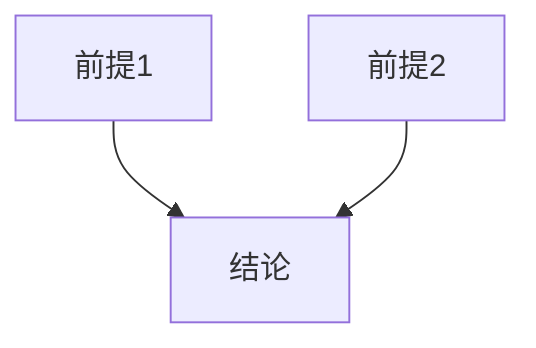
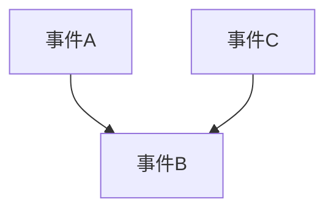
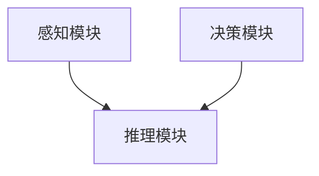
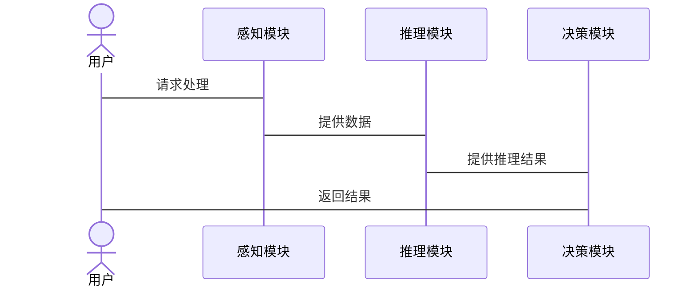

                 


# AI Agent的认知计算与推理框架

> 关键词：AI Agent，认知计算，推理框架，符号逻辑，概率推理，神经符号，系统架构

> 摘要：本文深入探讨AI Agent的认知计算与推理框架，分析其核心概念、算法原理、系统架构及实际应用。通过详细讲解符号逻辑、概率推理和神经符号推理等方法，结合系统设计和项目实战，为读者提供全面的理解和实践指导。

---

# 第1章: AI Agent的认知计算与推理框架概述

## 1.1 AI Agent的基本概念

### 1.1.1 AI Agent的定义
AI Agent（人工智能代理）是指能够感知环境、自主决策并执行任务的智能实体。它可以是一个软件程序、机器人或其他智能系统，具备以下核心属性：

- **自主性**：无需外部干预，自主决策。
- **反应性**：能感知环境变化并实时响应。
- **目标导向**：基于目标驱动行为。
- **学习能力**：通过经验改进性能。

### 1.1.2 AI Agent的核心属性
- **知识表示**：通过符号、概率或神经网络表示知识。
- **推理能力**：基于知识进行逻辑或概率推理。
- **决策能力**：根据推理结果做出最优决策。

### 1.1.3 AI Agent的分类与应用场景
- **简单反射型代理**：基于规则直接反应。
- **基于模型的反射型代理**：使用内部模型进行推理。
- **目标驱动型代理**：以目标为导向进行推理和决策。
- **效用驱动型代理**：通过最大化效用函数进行决策。

应用场景包括智能助手、自动驾驶、智能客服、机器人控制等。

## 1.2 认知计算与推理的基本原理

### 1.2.1 认知计算的定义
认知计算是模拟人类认知过程的计算方式，涉及感知、推理、学习和决策等环节。

### 1.2.2 推理框架的核心要素
- **知识表示**：如何表示问题中的知识。
- **推理规则**：根据知识进行推理的规则。
- **推理引擎**：执行推理的算法或框架。

### 1.2.3 认知计算与推理的关联
认知计算通过推理框架将感知到的信息转化为决策依据，是实现AI Agent智能行为的核心。

## 1.3 AI Agent在实际应用中的挑战

### 1.3.1 数据处理与计算效率问题
AI Agent需要处理大量数据，对计算效率要求高。

### 1.3.2 推理框架的可解释性
复杂的推理过程需具备可解释性，以便调试和改进。

### 1.3.3 多模态数据的处理难题
AI Agent需处理文本、图像等多种数据类型，增加处理难度。

## 1.4 本章小结
本章介绍了AI Agent的基本概念、核心属性和应用场景，分析了认知计算与推理的基本原理及实际应用中的挑战。

---

# 第2章: AI Agent的认知模型

## 2.1 符号逻辑推理模型

### 2.1.1 符号逻辑的基本概念
符号逻辑是用符号表示知识的逻辑系统，通过推理规则进行推理。

### 2.1.2 知识表示与推理规则
知识表示方法包括谓词逻辑、语义网络等，推理规则如命题逻辑和谓词逻辑。

### 2.1.3 逻辑推理的优缺点
优点：明确、可解释；缺点：难以处理模糊性和复杂性。

## 2.2 概率推理模型

### 2.2.1 概率推理的基本原理
基于概率论进行推理，考虑不确定性。

### 2.2.2 贝叶斯网络的应用
贝叶斯网络通过概率分布建模，用于表示变量之间的关系。

### 2.2.3 概率推理的数学模型
公式：
$$ P(A|B) = \frac{P(B|A)P(A)}{P(B)} $$

## 2.3 神经符号推理模型

### 2.3.1 神经符号推理的定义
结合神经网络和符号逻辑的推理方法，具有强大的表达能力。

### 2.3.2 神经符号推理的优势
结合了神经网络的学习能力和符号逻辑的可解释性。

### 2.3.3 神经符号推理的实现方法
通过训练神经网络和符号规则结合进行推理。

## 2.4 认知模型的对比分析

### 2.4.1 符号逻辑、概率推理与神经符号推理的对比
| 比较维度 | 符号逻辑 | 概率推理 | 神经符号 |
|----------|----------|----------|----------|
| 优缺点   | 明确但缺乏灵活性 | 处理不确定性但计算复杂 | 结合优点，但实现难度大 |

### 2.4.2 不同模型的适用场景
符号逻辑适合确定性问题，概率推理适合不确定性问题，神经符号适合复杂场景。

### 2.4.3 模型选择的策略
根据问题类型和数据特性选择模型。

## 2.5 本章小结
本章分析了符号逻辑、概率推理和神经符号推理模型，探讨了它们的优缺点及适用场景。

---

# 第3章: AI Agent的推理算法与实现

## 3.1 符号逻辑推理算法

### 3.1.1 知识表示
使用谓词逻辑表示知识，例如：
$$ \text{Student}(x) \rightarrow \text{Person}(x) $$

### 3.1.2 推理规则
通过自然演绎推理，从前提推出结论。

### 3.1.3 代码实现
```python
def symbolic_inference(rules, premises):
    # rules: list of tuples (antecedent, consequent)
    # premises: list of antecedents
    # Return: list of consequents
    for rule in rules:
        if all(p in premises for p in rule[0]):
            premises.append(rule[1])
    return premises
```

### 3.1.4 示例


## 3.2 概率推理算法

### 3.2.1 贝叶斯网络
构建贝叶斯网络模型，计算概率分布。

### 3.2.2 代码实现
```python
def bayesian_inference(variables, evidence, model):
    # variables: 列表，模型中涉及的变量
    # evidence: 字典，已知证据
    # model: 贝叶斯网络结构
    return probability_utils.inference(model, evidence)
```

### 3.2.3 示例


## 3.3 神经符号推理算法

### 3.3.1 神经网络训练
使用符号规则训练神经网络，使其具备推理能力。

### 3.3.2 代码实现
```python
def neural-symbolic_inference(model, input):
    # model: 神经符号模型
    # input: 输入数据
    return model(input)
```

### 3.3.3 示例
```mermaid
graph TD
A[输入] --> B[神经网络处理]
C[符号规则] --> B
D[输出] <-- B
```

## 3.4 本章小结
本章详细讲解了符号逻辑、概率推理和神经符号推理算法，展示了它们的代码实现和实际应用。

---

# 第4章: AI Agent的系统架构与设计

## 4.1 系统架构设计

### 4.1.1 模块化设计
AI Agent系统通常分为感知模块、推理模块和决策模块。

### 4.1.2 系统架构图


## 4.2 接口设计

### 4.2.1 接口定义
- 感知模块：提供数据获取接口。
- 推理模块：提供推理服务接口。
- 决策模块：提供决策结果接口。

## 4.3 交互设计

### 4.3.1 交互流程
用户请求 -> 感知模块处理 -> 推理模块推理 -> 决策模块输出结果。

### 4.3.2 序列图


## 4.4 本章小结
本章讨论了AI Agent的系统架构设计，展示了模块化设计和交互流程。

---

# 第5章: 项目实战——智能助手开发

## 5.1 项目概述

### 5.1.1 项目背景
开发一个基于符号逻辑推理的智能助手。

## 5.2 环境安装

### 5.2.1 安装Python
安装Python 3.x版本。

### 5.2.2 安装依赖
使用pip安装所需库，如numpy、scipy等。

## 5.3 核心代码实现

### 5.3.1 知识表示
```python
class KnowledgeBase:
    def __init__(self):
        self.knowledge = {}

    def add_rule(self, antecedent, consequent):
        if antecedent not in self.knowledge:
            self.knowledge[antecedent] = []
        self.knowledge[antecedent].append(consequent)
```

### 5.3.2 推理引擎
```python
def infer(knowledge_base, premises):
    new_conclusions = []
    while True:
        has_inference = False
        for rule in knowledge_base.knowledge.items():
            if all(p in premises for p in rule[0]):
                if rule[1] not in premises:
                    premises.append(rule[1])
                    new_conclusions.append(rule[1])
                    has_inference = True
        if not has_inference:
            break
    return premises
```

## 5.4 实际案例分析

### 5.4.1 案例描述
用户询问“今天天气如何？”，智能助手基于天气数据进行推理并返回结果。

### 5.4.2 案例分析
```mermaid
graph TD
A[用户查询] --> B[感知模块]
C[天气数据] --> B
D[推理结果] <-- B
```

## 5.5 本章小结
本章通过智能助手开发案例，展示了AI Agent的认知计算与推理框架的实际应用。

---

# 第6章: 最佳实践与展望

## 6.1 最佳实践

### 6.1.1 知识表示的选择
根据问题类型选择合适的知识表示方法。

### 6.1.2 推理框架的优化
结合多种推理方法提升性能。

### 6.1.3 系统架构的设计
模块化设计便于维护和扩展。

## 6.2 小结

### 6.2.1 核心要点回顾
- 符号逻辑、概率推理和神经符号推理各有优缺点。
- 系统架构设计需考虑模块化和交互流程。
- 项目实战中需结合具体需求选择合适的方法。

## 6.3 注意事项

### 6.3.1 数据质量
确保数据的准确性和完整性。

### 6.3.2 可解释性
复杂的推理过程需具备可解释性。

### 6.3.3 安全性
保护用户数据和隐私。

## 6.4 拓展阅读

### 6.4.1 推荐书籍
- 《人工智能：一种现代方法》
- 《机器学习实战》

### 6.4.2 推荐论文
- "Neural-Symbolic Logic Reasoning"
- "Probabilistic Graphical Models"

## 6.5 本章小结
本章总结了AI Agent认知计算与推理框架的核心内容，并提供了实际应用中的最佳实践建议。

---

# 结语

本文全面探讨了AI Agent的认知计算与推理框架，从基本概念到算法实现，再到系统设计和项目实战，为读者提供了深入的理论和实践指导。未来，随着技术的进步，AI Agent将在更多领域展现出强大的应用潜力。

--- 

感谢您的耐心阅读，希望这篇文章对您有所帮助！

