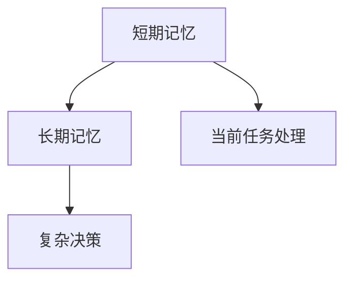

                 


# AI Agent的记忆机制：短期与长期记忆的实现

> 关键词：AI Agent，短期记忆，长期记忆，神经网络，记忆机制实现，记忆网络模型

> 摘要：本文详细探讨了AI Agent的短期记忆和长期记忆机制，从神经科学的基础概念到计算机科学的实现方法，分析了短期记忆与长期记忆的区别、实现原理及相互作用，最后通过具体案例展示了如何在AI系统中实现这些记忆机制。

---

## 第一部分: AI Agent记忆机制的背景与核心概念

### 第1章: AI Agent的记忆机制概述

#### 1.1 什么是AI Agent
- **AI Agent**：人工智能代理（Artificial Intelligence Agent）是指能够感知环境、自主决策并采取行动以实现目标的智能实体。
- **记忆机制**：AI Agent的核心能力之一，使得其能够存储和检索信息，支持连续的智能行为。

#### 1.2 AI Agent记忆机制的重要性
- **连续性与一致性**：记忆机制帮助AI Agent保持状态的连续性，确保在不同时间点的行为一致。
- **知识积累与复用**：通过记忆，AI Agent可以积累经验，避免重复错误，提高效率。

#### 1.3 短期记忆与长期记忆的定义与区别
- **短期记忆**：处理当前任务所需的信息，容量有限，保留时间较短。
- **长期记忆**：存储重要信息，容量较大，保留时间长，支持复杂决策。

---

## 第2章: 短期记忆与长期记忆的核心概念

### 2.1 短期记忆的核心原理
- **神经机制**：类似人类工作记忆，依赖前额叶皮层。
- **实现方式**：使用LSTM等模型，处理当前输入并存储临时信息。

### 2.2 长期记忆的核心原理
- **神经机制**：涉及海马体和内嗅皮层，将短期记忆巩固为长期记忆。
- **实现方式**：采用深度学习模型，如Transformer，存储大量信息。

### 2.3 短期记忆与长期记忆的对比分析
- **对比表格**：展示两者在存储时间、容量、遗忘机制等方面的差异。

| 特性          | 短期记忆             | 长期记忆             |
|---------------|----------------------|----------------------|
| 存储时间       | 短暂（几分钟到几小时） | 长期（数天到数年）    |
| 容量           | 有限                 | 较大                 |
| 忘记机制       | 易忘                 | 需主动遗忘           |
| 应用场景       | 当前任务处理         | 复杂决策与经验积累   |

- **Mermaid实体关系图**：


---

## 第3章: 短期记忆与长期记忆的实现原理

### 3.1 短期记忆的实现原理
- **神经网络模型**：LSTM网络，通过门控机制控制信息流动。
- **存储机制**：使用循环结构，保存当前状态信息。
- **遗忘机制**：通过遗忘门决定哪些信息需要清除。

### 3.2 长期记忆的实现原理
- **神经网络模型**：Transformer架构，利用自注意力机制处理序列数据。
- **存储机制**：采用多层网络结构，增强信息存储能力。
- **巩固机制**：通过训练模型，强化长期记忆的存储。

### 3.3 短期记忆与长期记忆的相互作用
- **协同工作**：短期记忆处理当前信息，长期记忆存储经验，共同支持AI Agent的智能行为。
- **转化机制**：短期记忆中的重要信息通过特定算法转移到长期记忆中。

---

## 第4章: 短期记忆与长期记忆的数学模型与公式

### 4.1 短期记忆的数学模型
- **LSTM门控机制**：
  - 遗忘门：$$ f_t = \sigma(W_f x_t + U_f h_{t-1}) $$
  - 输入门：$$ i_t = \sigma(W_i x_t + U_i h_{t-1}) $$
  - 输出门：$$ o_t = \sigma(W_o x_t + U_o h_{t-1}) $$
  - 状态更新：$$ c_t = f_t \cdot c_{t-1} + i_t \cdot tanh(W_c x_t + U_c h_{t-1}) $$
  - 输出：$$ h_t = o_t \cdot tanh(c_t) $$

### 4.2 长期记忆的数学模型
- **Transformer自注意力机制**：
  - 查询（Q）、键（K）、值（V）：$$ Q = xW_Q, K = xW_K, V = xW_V $$
  - 注意力权重：$$ a_{ij} = \frac{exp(q_i k_j^T / d_k)}{\sum_{l} exp(q_i k_l^T / d_k)} $$
  - 加权和：$$ output = \sum_{j} a_{ij} v_j $$

---

## 第5章: 系统分析与架构设计

### 5.1 系统架构设计
- **领域模型**：
  ```mermaid
  classDiagram
  class AI-Agent {
    - current_state:短期记忆
    -长期记忆库:长期记忆
    + access_memory(): 获取长期记忆
    + update_memory(): 更新短期记忆
  }
  ```
- **架构图**：
  ```mermaid
  graph TD
  AI-Agent --> 短期记忆
  AI-Agent --> 长期记忆库
  短期记忆 --> 当前任务处理
  长期记忆库 --> 复杂决策
  ```

### 5.2 接口设计与交互
- **接口设计**：定义访问和更新记忆的接口。
- **交互流程**：通过序列图展示AI Agent如何与记忆模块交互。

---

## 第6章: 项目实战

### 6.1 环境安装与依赖
- **Python 3.8+**
- **TensorFlow/PyTorch**
- **Mermaid CLI**

### 6.2 核心实现代码
#### 短期记忆实现（LSTM）：
```python
import tensorflow as tf
from tensorflow.keras.layers import LSTMCell, RNN

cell = LSTMCell(64)
rnn = RNN(cell)
input_sequences = tf.keras.Input(shape=(None, 64))
output, state = rnn(input_sequences)
```

#### 长期记忆实现（Transformer）：
```python
import tensorflow as tf
from tensorflow.keras.layers import MultiHeadAttention

q = tf.keras.Input(shape=(None, 64))
k = tf.keras.Input(shape=(None, 64))
v = tf.keras.Input(shape=(None, 64))
attention_layer = MultiHeadAttention(num_heads=8, key_dim=8)
output = attention_layer(q, k, v)
```

### 6.3 代码解读与案例分析
- **LSTM实现**：处理时间序列数据，适合短期记忆任务。
- **Transformer实现**：适用于长期记忆，处理复杂关系。

### 6.4 项目总结与经验分享
- **优势**：结合两种记忆机制，提升AI Agent的整体性能。
- **挑战**：模型复杂度高，训练时间长。

---

## 第7章: 总结与展望

### 7.1 最佳实践
- **小结**：短期记忆处理当前任务，长期记忆存储经验，两者结合提升AI Agent能力。
- **注意事项**：模型选择与数据量相关，需根据任务需求调整。
- **拓展阅读**：推荐学习记忆机制的最新研究，如可微记忆网络（Differentiable Memory Networks）。

### 7.2 结束语
AI Agent的记忆机制是实现智能系统的关键，未来的研究将更关注如何高效结合短期与长期记忆，提升AI Agent的自主学习与适应能力。

---

通过本文的详细讲解，读者可以系统地理解AI Agent的短期与长期记忆机制，并掌握其在实际应用中的实现方法。

