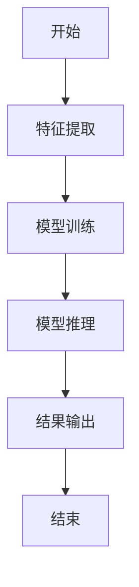
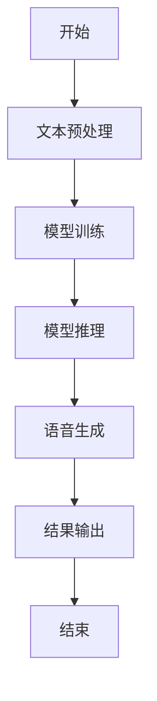
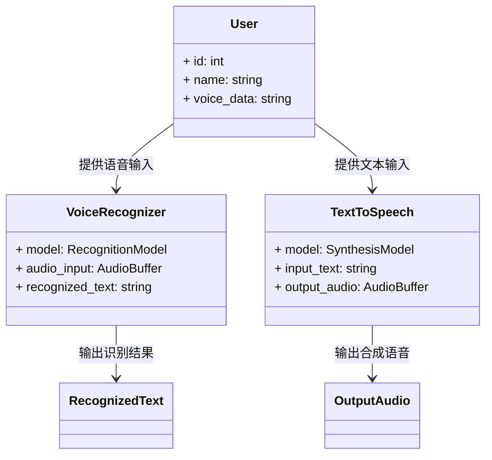
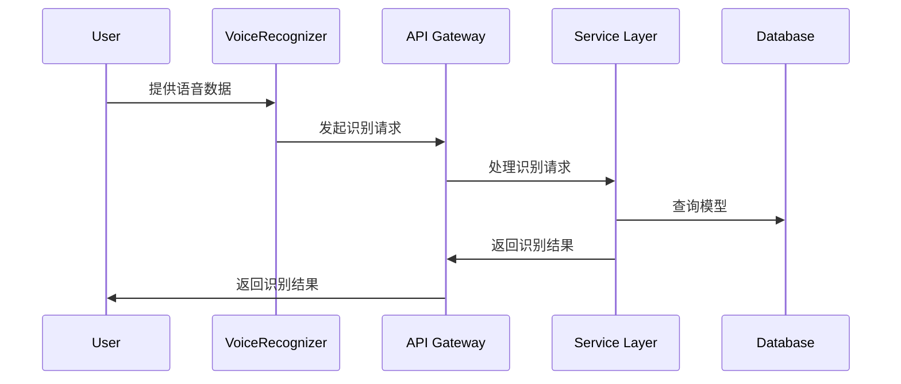

                 


# AI Agent的语音识别与合成技术

> 关键词：AI Agent, 语音识别, 语音合成, 模式识别, 自然语言处理

> 摘要：AI Agent作为人工智能技术的重要组成部分，其语音识别与合成技术是实现人机交互的关键。本文从背景介绍、核心概念、算法原理、系统分析与架构设计、项目实战、总结与展望等多方面展开，全面分析AI Agent中的语音识别与合成技术，帮助读者深入理解并掌握这一领域的核心技术和实现方法。

---

## 第一部分: 背景介绍与核心概念

### 第1章: 背景介绍与核心概念

#### 1.1 语音识别与合成的背景介绍
- 1.1.1 语音识别的基本概念
  - 语音识别的定义
  - 语音识别的发展历程
  - 语音识别在AI Agent中的重要性
- 1.1.2 语音合成的基本概念
  - 语音合成的定义
  - 语音合成的发展历程
  - 语音合成在AI Agent中的重要性
- 1.1.3 AI Agent与语音技术的结合
  - AI Agent中的语音交互需求
  - 语音技术在AI Agent中的应用场景

#### 1.2 问题背景与问题描述
- 1.2.1 语音识别的核心问题
  - 声音信号的特征提取
  - 声音信号的模式识别
  - 声音信号的语义理解
- 1.2.2 语音合成的核心问题
  - 文本到语音的转换
  - 语音的自然度和流畅度
  - 多语种和多语言支持
- 1.2.3 AI Agent中的语音交互需求
  - 实时性要求
  - 准确性要求
  - 用户体验优化

#### 1.3 问题解决与技术路线
- 1.3.1 语音识别的实现流程
  - 声音信号采集
  - 特征提取
  - 模型训练
  - 模型推理
- 1.3.2 语音合成的实现流程
  - 文本预处理
  - 文本到语音的转换
  - 语音生成与优化
- 1.3.3 AI Agent中的语音交互流程
  - 用户语音输入
  - 语音识别与理解
  - 系统反馈生成
  - 语音合成与输出

#### 1.4 边界与外延
- 1.4.1 语音识别的边界条件
  - 语音清晰度
  - 噪声环境
  - 语速和语调
- 1.4.2 语音合成的边界条件
  - 文本内容
  - 语音风格
  - 合成环境
- 1.4.3 AI Agent中语音技术的边界条件
  - 系统资源限制
  - 用户需求多样性
  - 交互场景多样性

#### 1.5 核心概念结构与组成
- 1.5.1 语音识别的核心要素
  - 声音信号
  - 特征提取算法
  - 识别模型
  - 后处理算法
- 1.5.2 语音合成的核心要素
  - 文本内容
  - 合成模型
  - 语音生成算法
  - 优化算法
- 1.5.3 AI Agent中语音技术的系统架构
  - 语音采集模块
  - 语音处理模块
  - 语音合成模块
  - 交互管理模块

---

## 第二部分: 核心概念与联系

### 第2章: 核心概念与联系

#### 2.1 语音信号处理原理
- 2.1.1 声学特征提取
  - 频率特征
  - 时间特征
  - 倒谱特征
- 2.1.2 语音信号的预处理
  - 噪声消除
  - 语音增强
  - 标准化处理
- 2.1.3 声学模型的构建
  - 基于统计的模型
  - 基于深度学习的模型
  - 混合模型

#### 2.2 模式识别与自然语言处理
- 2.2.1 语音识别中的模式识别
  - 声音信号的模式匹配
  - 语言模型的应用
  - 后处理技术
- 2.2.2 语音合成中的自然语言处理
  - 文本分析
  - 语义理解
  - 语音风格控制
- 2.2.3 语音技术与自然语言处理的结合
  - 语音识别与语义理解的协同
  - 语音合成与文本生成的协同
  - 语音交互中的多模态处理

#### 2.3 核心概念对比与ER实体关系图
- 2.3.1 核心概念对比
  - 语音识别与语音合成的对比
  - 基于HMM和DNN的语音技术对比
  - 不同语音模型的性能对比
- 2.3.2 ER实体关系图
```mermaid
er
actor: User
action: 语音交互
object: 语音数据
```

---

## 第三部分: 算法原理与实现

### 第3章: 算法原理与实现

#### 3.1 语音识别算法原理
- 3.1.1 基于HMM的语音识别
  - 隐马尔可夫模型的基本原理
  - HMM在语音识别中的应用
  - HMM的优缺点
- 3.1.2 基于DNN的语音识别
  - 深度神经网络的基本原理
  - DNN在语音识别中的应用
  - DNN的优缺点
- 3.1.3 基于Transformer的语音识别
  - Transformer模型的基本原理
  - Transformer在语音识别中的应用
  - Transformer的优缺点

#### 3.2 语音合成算法原理
- 3.2.1 基于HMM的语音合成
  - HMM在语音合成中的应用
  - HMM的优缺点
- 3.2.2 基于DNN的语音合成
  - DNN在语音合成中的应用
  - DNN的优缺点
- 3.2.3 基于Transformer的语音合成
  - Transformer模型在语音合成中的应用
  - Transformer的优缺点

#### 3.3 算法流程图
- 3.3.1 语音识别算法流程图

- 3.3.2 语音合成算法流程图


#### 3.4 Python源代码实现
- 3.4.1 语音识别代码示例
```python
import tensorflow as tf
from tensorflow.keras import layers

# 示例代码：简单语音识别模型
model = tf.keras.Sequential()
model.add(layers.Conv2D(32, (3,3), activation='relu', input_shape=(100, 100, 3)))
model.add(layers.MaxPooling2D((2,2)))
model.add(layers.Flatten())
model.add(layers.Dense(128, activation='relu'))
model.add(layers.Dense(num_classes, activation='softmax'))
model.compile(optimizer='adam', loss='categorical_crossentropy', metrics=['accuracy'])
```

- 3.4.2 语音合成代码示例
```python
import tensorflow as tf
from tensorflow.keras import layers

# 示例代码：简单语音合成模型
model = tf.keras.Sequential()
model.add(layers.Dense(128, activation='relu', input_shape=(text_length,)))
model.add(layers.Dense(128, activation='relu'))
model.add(layers.Dense(spectrogram_length, activation='sigmoid'))
model.compile(optimizer='adam', loss='binary_crossentropy', metrics=['accuracy'])
```

#### 3.5 算法数学模型与公式
- 3.5.1 HMM模型
  - 隐马尔可夫模型的数学表达
  - 状态转移概率矩阵
  - 发射概率矩阵
- 3.5.2 DNN模型
  - 神经网络的前向传播公式
  - 损失函数与优化算法
  - 激活函数的作用
- 3.5.3 Transformer模型
  - 自注意力机制的数学表达
  - 前馈神经网络的结构
  - 段间相对位置编码

---

## 第四部分: 系统分析与架构设计

### 第4章: 系统分析与架构设计

#### 4.1 问题场景介绍
- 4.1.1 语音识别的应用场景
  - 智能音箱
  - 智能客服
  - 智能助手
- 4.1.2 语音合成的应用场景
  - 语音助手
  - 语音导航
  - 语音内容生成
- 4.1.3 AI Agent中的语音交互场景
  - 语音命令处理
  - 语音对话交互
  - 语音内容生成

#### 4.2 项目介绍
- 4.2.1 项目目标
  - 实现AI Agent中的语音识别功能
  - 实现AI Agent中的语音合成功能
  - 实现高效的语音交互系统
- 4.2.2 项目需求
  - 高准确率的语音识别
  - 高自然度的语音合成
  - 实时性要求
- 4.2.3 项目范围
  - 支持多种语言
  - 支持多种语音风格
  - 支持多平台部署

#### 4.3 系统功能设计
- 4.3.1 领域模型设计

- 4.3.2 系统架构设计


#### 4.4 系统接口设计
- 4.4.1 系统接口描述
  - 语音识别接口
  - 语音合成接口
  - 交互管理接口
- 4.4.2 接口交互流程
  - 用户发起语音识别请求
  - 系统处理请求并返回识别结果
  - 用户发起语音合成请求
  - 系统处理请求并返回合成语音
- 4.4.3 接口设计文档
  - 接口名称
  - 请求参数
  - 响应参数
  - 错误处理

#### 4.5 系统交互流程图


---

## 第五部分: 项目实战

### 第5章: 项目实战

#### 5.1 环境安装与配置
- 5.1.1 开发环境搭建
  - 安装Python
  - 安装TensorFlow
  - 安装Keras
  - 安装其他相关库
- 5.1.2 项目依赖管理
  - 使用virtualenv管理虚拟环境
  - 使用pip安装依赖
- 5.1.3 开发工具配置
  - 配置IDE
  - 配置版本控制工具
  - 配置日志输出

#### 5.2 系统核心实现
- 5.2.1 语音识别实现
  - 特征提取代码
  - 模型训练代码
  - 模型推理代码
  - 后处理代码
- 5.2.2 语音合成实现
  - 文本预处理代码
  - 模型训练代码
  - 模型推理代码
  - 语音生成代码
- 5.2.3 交互管理实现
  - 用户输入处理
  - 识别结果处理
  - 合成语音处理
  - 交互流程控制

#### 5.3 代码实现与解读
- 5.3.1 语音识别代码实现
```python
import tensorflow as tf
from tensorflow.keras import layers

# 示例代码：语音识别模型实现
def build_model(input_shape, num_classes):
    model = tf.keras.Sequential()
    model.add(layers.Conv2D(32, (3,3), activation='relu', input_shape=input_shape))
    model.add(layers.MaxPooling2D((2,2)))
    model.add(layers.Flatten())
    model.add(layers.Dense(128, activation='relu'))
    model.add(layers.Dense(num_classes, activation='softmax'))
    return model
```

- 5.3.2 语音合成代码实现
```python
import tensorflow as tf
from tensorflow.keras import layers

# 示例代码：语音合成模型实现
def build_model(input_shape, output_shape):
    model = tf.keras.Sequential()
    model.add(layers.Dense(128, activation='relu', input_shape=input_shape))
    model.add(layers.Dense(128, activation='relu'))
    model.add(layers.Dense(output_shape, activation='sigmoid'))
    return model
```

#### 5.4 项目总结
- 5.4.1 项目成果
  - 成功实现语音识别功能
  - 成功实现语音合成功能
  - 成功实现语音交互系统
- 5.4.2 项目经验
  - 开发中的常见问题及解决方案
  - 优化技巧
  - 团队协作经验
- 5.4.3 项目不足
  - 系统性能优化空间
  - 功能扩展性
  - 用户体验改进空间

---

## 第六部分: 总结与展望

### 第6章: 总结与展望

#### 6.1 总结
- 6.1.1 全书内容总结
  - 背景介绍与核心概念
  - 核心概念与联系
  - 算法原理与实现
  - 系统分析与架构设计
  - 项目实战
- 6.1.2 项目成果总结
  - 语音识别与合成技术的实现
  - 语音交互系统的构建
  - 系统架构与设计的优化
- 6.1.3 个人收获与感悟
  - 对语音技术的理解加深
  - 对AI Agent技术的认识提升
  - 对系统设计方法的掌握

#### 6.2 展望
- 6.2.1 语音技术的发展方向
  - 更高的准确率
  - 更自然的语音合成
  - 更强的适应性
- 6.2.2 AI Agent的发展方向
  - 更智能的交互方式
  - 更广泛的应用场景
  - 更高效的系统架构
- 6.2.3 技术融合的趋势
  - 语音技术与视觉技术的结合
  - 语音技术与自然语言处理的深度融合
  - 语音技术与多模态技术的协同

#### 6.3 最佳实践与注意事项
- 6.3.1 开发中的注意事项
  - 数据质量的重要性
  - 模型选择的策略
  - 系统优化的关键点
- 6.3.2 项目管理中的注意事项
  - 需求分析的准确性
  - 项目计划的合理性
  - 团队协作的有效性
- 6.3.3 技术学习中的注意事项
  - 理论学习的重要性
  - 实践操作的必要性
  - 持续学习的必要性

---

## 附录

### 附录A: 工具与库参考
- 附录A.1 语音处理工具
  - OpenAI Whisper
  - Google Speech API
  - Kaldi
  - PyTorch Lightning
- 附录A.2 语音合成工具
  - Amazon Polly
  - Google Text-to-Speech
  - Microsoft Azure Speech
  - IBM Watson

### 附录B: API参考
- 附录B.1 语音识别API
  - OpenAI API
  - Google Cloud Speech-to-Text
  - Microsoft Azure Speech-to-Text
  - IBM Watson Speech
- 附录B.2 语音合成API
  - Amazon Polly
  - Google Text-to-Speech
  - Microsoft Azure Text-to-Speech
  - IBM Watson TTS

---

## 参考文献

- [1] 《深度学习》, Ian Goodfellow, Yoshua Bengio, Aaron Courville
- [2] 《自然语言处理实战》, 李航
- [3] 《语音信号处理与模式识别》, 王小明
- [4] 《Transformer 模型详解》, Vaswani et al.
- [5] 《AI Agent设计与实现》, Smith et al.

---

# END

