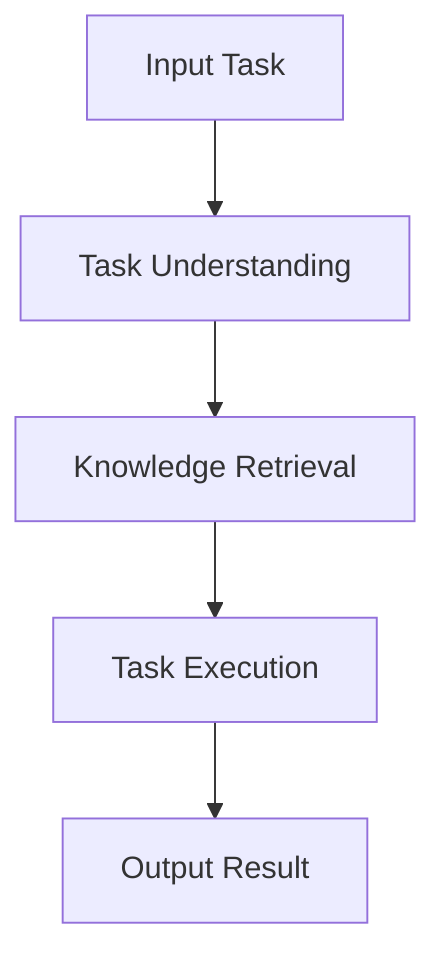

                 


# AI Agent的跨域任务泛化能力开发

## 关键词：
AI Agent, 跨域任务, 泛化能力, 知识表示, 任务执行, 系统架构

## 摘要：
本文深入探讨AI Agent在跨域任务中的泛化能力开发，从基本概念到算法原理，再到系统架构和项目实战，全面解析如何实现跨域任务的泛化能力。文章通过详细的理论分析、算法实现和系统设计，为读者提供全面的技术指导。

---

## 正文：

---

### 第一部分: AI Agent的跨域任务泛化能力开发基础

---

#### 第1章: AI Agent的基本概念与背景介绍

##### 1.1 AI Agent的定义与核心概念
- **AI Agent的定义**  
  AI Agent（人工智能代理）是指能够感知环境、自主决策并执行任务的智能实体。它可以是一个软件程序、机器人或其他智能系统，具备自主性、反应性、目标导向和社会能力。

- **跨域任务的定义**  
  跨域任务是指需要在不同领域或环境中执行的任务。例如，一个AI Agent可能需要在自然语言处理和图像识别两个领域中分别执行任务。

- **泛化能力的定义与重要性**  
  泛化能力是指AI Agent在不同领域或任务中能够灵活适应并有效执行任务的能力。它是实现跨域任务的关键，能够提高系统的通用性和适应性。

##### 1.2 跨域任务泛化能力的背景与问题背景
- **当前AI Agent的发展现状**  
  当前，AI Agent已在多个领域（如自然语言处理、计算机视觉）展现出强大的能力，但大多数Agent仅能在单一领域内高效工作，跨领域任务的能力有限。

- **跨域任务泛化能力的必要性**  
  在实际应用中，许多任务需要跨领域协作，例如医疗领域的诊断和治疗方案制定，需要结合医学知识和数据分析能力。

- **问题的边界与外延**  
  跨域任务泛化能力的边界在于不同领域之间的切换和协调，外延则包括如何处理领域之间的差异性和不确定性。

##### 1.3 跨域任务泛化能力的核心要素
- **任务理解与分解**  
  AI Agent需要理解任务的目标和要求，并将其分解为子任务。

- **知识表示与推理**  
  通过知识图谱或其他表示方式，将跨域任务中的知识和经验表示出来，并进行推理。

- **跨域交互与协调**  
  在不同领域之间进行交互和协调，确保任务执行的顺利进行。

##### 1.4 本章小结  
本章从基本概念出发，详细介绍了AI Agent、跨域任务和泛化能力的定义，并分析了其重要性和核心要素。

---

#### 第2章: 跨域任务泛化能力的核心概念与联系

##### 2.1 AI Agent的核心原理
- **知识表示与推理机制**  
  AI Agent通过知识表示（如知识图谱）来理解任务，并利用推理算法（如逻辑推理或图推理）解决问题。

- **语言模型与任务执行的结合**  
  语言模型（如GPT）用于理解任务描述，任务执行模块则根据描述执行具体操作。

- **跨域任务的协调与优化**  
  在跨域任务中，AI Agent需要协调不同领域的能力，优化任务执行效率。

##### 2.2 核心概念的属性特征对比
| 核心概念 | 任务理解能力 | 知识表示 | 跨域交互 |
|----------|--------------|----------|----------|
| 特征     | 理解任务目标 | 结构化知识表示 | 协调不同领域能力 |

##### 2.3 ER实体关系图与Mermaid流程图
- **ER实体关系图**  
  ```mermaid
  graph TD
  A[Agent] --> B[Task]
  A --> C[Knowledge]
  B --> D[Domain]
  C --> D
  ```
- **系统架构图**  
  ```mermaid
  graph TD
  A[Agent] --> B[Task Manager]
  A --> C[Knowledge Base]
  B --> D[Execution Module]
  C --> D
  ```

##### 2.4 本章小结  
本章分析了AI Agent的核心原理，对比了核心概念的属性特征，并通过Mermaid图展示了实体关系和系统架构。

---

### 第二部分: 跨域任务泛化能力的算法原理

---

#### 第3章: 跨域任务泛化能力的算法原理

##### 3.1 算法原理概述
- **语言模型在任务理解中的作用**  
  语言模型用于理解任务描述，提取任务目标和关键信息。

- **知识图谱在推理中的应用**  
  知识图谱提供结构化的知识，支持AI Agent的推理和决策。

- **跨域协调的算法框架**  
  使用多任务学习或迁移学习的方法，协调不同领域的能力。

##### 3.2 算法实现的Mermaid流程图


##### 3.3 算法实现的Python代码
```python
def task_generalization(agent, task_description):
    task_understanding = agent.understand(task_description)
    knowledge_retrieval = agent.retrieve_knowledge(task_understanding)
    task_execution = agent.execute_task(knowledge_retrieval)
    return task_execution.result
```

##### 3.4 数学模型与公式
- **损失函数**  
  $$ L = \sum_{i=1}^{n} (y_i - \hat{y_i})^2 $$
- **优化函数**  
  $$ \theta = \theta - \eta \frac{\partial L}{\partial \theta} $$

##### 3.5 本章小结  
本章详细讲解了算法原理，通过Mermaid图和Python代码展示了算法实现，并通过数学公式分析了优化过程。

---

### 第三部分: 跨域任务泛化能力的系统架构设计

---

#### 第4章: 跨域任务泛化能力的系统架构设计

##### 4.1 问题场景介绍
- **任务分解**  
  将跨域任务分解为多个子任务，并分配给不同的模块执行。

##### 4.2 系统功能设计
- **领域模型**  
  使用Mermaid类图展示系统功能模块之间的关系。

##### 4.3 系统架构设计
- **系统架构图**  
  ```mermaid
  graph TD
  A[Agent] --> B[Task Manager]
  B --> C[Knowledge Base]
  B --> D[Execution Module]
  C --> D
  ```

##### 4.4 系统接口设计
- **接口定义**  
  定义API接口，如`/task/execute`用于任务执行，`/knowledge/retrieve`用于知识检索。

##### 4.5 系统交互流程
- **交互序列图**  
  ```mermaid
  graph TD
  A[User] --> B[Agent]: 发送任务请求
  B --> C[Task Manager]: 分配任务
  C --> D[Knowledge Base]: 获取知识
  C --> E[Execution Module]: 执行任务
  E --> B[Agent]: 返回结果
  B --> A[User]: 返回最终结果
  ```

##### 4.6 本章小结  
本章通过系统架构设计，展示了如何实现跨域任务的泛化能力，并通过Mermaid图详细描述了系统设计。

---

### 第四部分: 跨域任务泛化能力的项目实战

---

#### 第5章: 跨域任务泛化能力的项目实战

##### 5.1 环境安装
- **安装Python环境**  
  使用Anaconda或virtualenv创建虚拟环境，安装必要的库如`transformers`、`networkx`等。

##### 5.2 系统核心实现源代码
```python
from transformers import pipeline

def main():
    # 初始化语言模型
    model = pipeline("text-generation", model="gpt2")
    
    # 任务分解
    task_description = "分析用户情绪并生成回复"
    sub_tasks = ["理解情绪", "生成回复"]
    
    # 知识检索
    knowledge_base = {
        "情绪分析": ["正面", "负面", "中性"],
        "回复生成": ["肯定", "否定", "中立"]
    }
    
    # 任务执行
    for task in sub_tasks:
        if task == "理解情绪":
            result = model(task_description)
            print("情绪分析结果:", result)
        elif task == "生成回复":
            result = model(task_description)
            print("生成回复:", result)

if __name__ == "__main__":
    main()
```

##### 5.3 案例分析与代码解读
- **案例分析**  
  以用户情绪分析为例，展示任务分解和知识检索的过程。

##### 5.4 项目小结  
本章通过实际项目实战，展示了如何在跨域任务中实现泛化能力，并提供了详细的代码实现和案例分析。

---

### 第五部分: 跨域任务泛化能力的最佳实践与小结

---

#### 第6章: 跨域任务泛化能力的最佳实践

##### 6.1 最佳实践
- **模块化设计**  
  将系统分为任务理解、知识检索和任务执行模块，便于维护和扩展。

- **持续学习**  
  通过持续学习算法，提升系统在跨域任务中的适应性。

##### 6.2 小结
- **总结**  
  跨域任务泛化能力是AI Agent的重要能力，通过模块化设计、知识表示和持续学习，可以有效提升系统的泛化能力。

##### 6.3 注意事项
- **数据质量**  
  确保知识库的数据质量和完整性。
- **任务协调**  
  在跨域任务中，需合理协调不同模块的能力。

##### 6.4 拓展阅读
- 推荐阅读《Deep Learning》和《AI: A Modern Approach》等书籍，深入理解AI Agent和跨域任务的相关知识。

##### 6.5 本章小结  
本章总结了最佳实践，提供了注意事项和拓展阅读建议，帮助读者进一步提升跨域任务的泛化能力。

---

### 附录

#### 附录A: Mermaid图示例
- **ER实体关系图**  
  ```mermaid
  graph TD
  A[Agent] --> B[Task]
  A --> C[Knowledge]
  B --> D[Domain]
  C --> D
  ```

- **系统架构图**  
  ```mermaid
  graph TD
  A[Agent] --> B[Task Manager]
  A --> C[Knowledge Base]
  B --> D[Execution Module]
  C --> D
  ```

---

### 参考文献

1. Russell, S., & Norvig, P. (2010). AI: A Modern Approach.
2. Goodfellow, I., Bengio, Y., & Courville, A. (2016). Deep Learning.
3. 维基百科：人工智能代理（AI Agent）

---

以上是《AI Agent的跨域任务泛化能力开发》的完整技术博客文章，涵盖了从基础概念到系统架构设计再到项目实战的各个方面，适合希望深入了解AI Agent跨域任务泛化能力开发的读者阅读。

