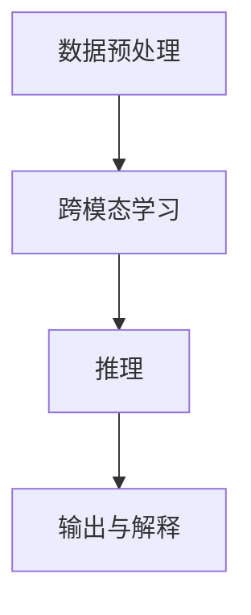
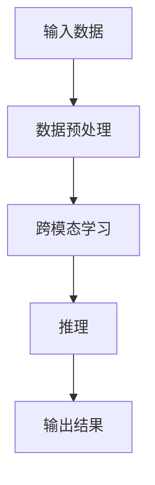

                 


# AI Agent的跨模态学习与推理实现

## 关键词
AI Agent, 跨模态学习, 推理, 多模态数据, 人工智能, 系统架构, 项目实战

## 摘要
AI Agent作为人工智能领域的重要组成部分，其跨模态学习与推理能力是实现智能体高效处理和理解多源异构数据的关键。本文系统地探讨了AI Agent的跨模态学习与推理的实现，从理论基础到算法原理，从系统设计到项目实战，层层深入，为读者提供全面的技术指导。

---

# 第二部分: 跨模态学习与推理的核心概念

## 第4章: 跨模态学习的核心原理

### 4.1 跨模态数据的特性与处理
#### 4.1.1 跨模态数据的多样性
#### 4.1.2 跨模态数据的异构性
#### 4.1.3 跨模态数据的融合方法

### 4.2 跨模态学习的主要方法
#### 4.2.1 多模态编码器
#### 4.2.2 多模态解码器
#### 4.2.3 对比学习与跨模态对齐

## 第5章: 推理的实现原理

### 5.1 推理的基本流程
#### 5.1.1 数据预处理
#### 5.1.2 特征提取
#### 5.1.3 推理模型的选择

### 5.2 推理算法的实现
#### 5.2.1 基于规则的推理
#### 5.2.2 基于符号逻辑的推理
#### 5.2.3 基于概率的推理

## 第6章: 跨模态学习与推理的结合

### 6.1 跨模态学习与推理的协同作用
#### 6.1.1 跨模态数据对推理的增强作用
#### 6.1.2 推理对跨模态学习的指导作用

### 6.2 跨模态学习与推理的统一框架
#### 6.2.1 统一输入处理
#### 6.2.2 统一特征表示
#### 6.2.3 统一推理与输出

---

# 第三部分: 跨模态学习与推理的算法实现

## 第7章: 跨模态学习算法的实现

### 7.1 多模态编码器的设计
#### 7.1.1 视觉模态编码
#### 7.1.2 语言模态编码
#### 7.1.3 跨模态对齐

### 7.2 多模态解码器的设计
#### 7.2.1 跨模态融合策略
#### 7.2.2 解码器的输出形式
#### 7.2.3 解码器的训练方法

## 第8章: 推理算法的实现

### 8.1 基于注意力机制的推理
#### 8.1.1 注意力机制的原理
#### 8.1.2 跨模态注意力的实现
#### 8.1.3 注意力权重的解释

### 8.2 基于图结构的推理
#### 8.2.1 图结构的构建
#### 8.2.2 图推理的算法实现
#### 8.2.3 图推理的结果解释

---

# 第四部分: 系统分析与架构设计

## 第9章: 系统分析与设计

### 9.1 项目背景与目标
#### 9.1.1 项目背景
#### 9.1.2 项目目标
#### 9.1.3 项目范围

### 9.2 系统功能设计
#### 9.2.1 数据预处理模块
#### 9.2.2 跨模态学习模块
#### 9.2.3 推理模块
#### 9.2.4 输出与解释模块

## 第10章: 系统架构设计

### 10.1 系统架构图


### 10.2 模块交互设计


---

# 第五部分: 项目实战

## 第11章: 项目实战

### 11.1 环境安装与配置
#### 11.1.1 Python环境的安装
#### 11.1.2 深度学习框架的安装（如TensorFlow、PyTorch）
#### 11.1.3 其他依赖库的安装

### 11.2 核心代码实现

#### 11.2.1 数据预处理代码
```python
import numpy as np
def preprocess(data):
    # 数据预处理逻辑
    return processed_data
```

#### 11.2.2 跨模态学习代码
```python
class MultimodalEncoder:
    def __init__(self, input_dims):
        self.encoders = [Encoder(d) for d in input_dims]
    
    def forward(self, inputs):
        # 多模态编码逻辑
        return encoded_features
```

#### 11.2.3 推理代码
```python
class Reasoner:
    def __init__(self, model):
        self.model = model
    
    def infer(self, inputs):
        # 推理逻辑
        return results
```

### 11.3 代码解读与分析
#### 11.3.1 数据预处理模块的实现细节
#### 11.3.2 跨模态学习模块的实现细节
#### 11.3.3 推理模块的实现细节

## 第12章: 案例分析与结果解读

### 12.1 案例分析
#### 12.1.1 数据集的选择与描述
#### 12.1.2 模型训练与评估
#### 12.1.3 推理结果的分析

### 12.2 结果解读
#### 12.2.1 正确推理案例
#### 12.2.2 错误推理案例
#### 12.2.3 边缘案例分析

---

# 第六部分: 总结与展望

## 第13章: 总结与展望

### 13.1 最佳实践
#### 13.1.1 数据预处理的关键点
#### 13.1.2 模型选择的建议
#### 13.1.3 推理优化的技巧

### 13.2 小结
#### 13.2.1 本文的主要内容回顾
#### 13.2.2 跨模态学习与推理的重要性和未来发展方向

### 13.3 注意事项
#### 13.3.1 数据质量问题
#### 13.3.2 模型泛化能力
#### 13.3.3 推理结果的解释性

### 13.4 拓展阅读
#### 13.4.1 推荐的相关书籍
#### 13.4.2 推荐的相关论文
#### 13.4.3 推荐的相关技术博客

---

# 结束语

通过本文的系统探讨，读者可以全面了解AI Agent的跨模态学习与推理的实现过程，从理论到实践，从算法到系统设计，逐步掌握相关技术的核心要点。希望本文能为读者在AI Agent领域的深入研究和实际应用提供有价值的参考和指导。

