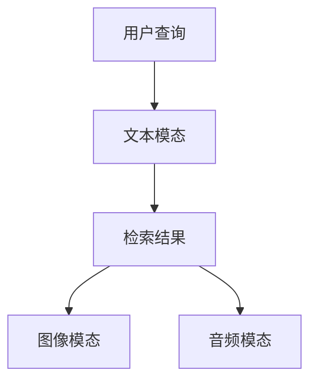

                 

---

# AI Agent的跨模态检索能力开发

**关键词**：AI Agent，跨模态检索，多模态数据，检索算法，系统架构

**摘要**：本文详细探讨了AI Agent在跨模态检索中的开发能力，从基础概念到算法实现，再到系统设计和项目实战，全面解析了跨模态检索的核心原理、系统架构和实际应用。通过具体案例和代码实现，帮助读者掌握AI Agent在跨模态检索中的开发技巧和最佳实践。

---

# 第1章: 跨模态檢索与AI Agent概述

## 1.1 跨模态檢索的基本概念

### 1.1.1 跨模态數據的定义
跨模态数据是指由不同感官或形式表示的信息，例如文本、图像、语音、视频和结构化数据等。这些数据形式各自具有独特的特征和语义信息，能够共同描述同一事物或场景。

### 1.1.2 跨模态檢索的定义
跨模态检索是指在多个数据模态之间进行信息检索的过程。用户可以通过一种模态的输入（如文本查询），在另一种模态中找到相关的结果（如图像或视频）。这种检索方式能够突破单一模态的限制，提供更全面和准确的检索结果。

### 1.1.3 跨模态檢索的核心要素
跨模态检索的核心要素包括：
1. **多模态数据表示**：将不同模态的数据转化为统一的表示形式，以便进行检索和对比。
2. **跨模态对齐**：通过某种方式将不同模态的数据对齐，以发现它们之间的语义关联。
3. **检索算法**：基于对齐后的数据，设计高效的检索算法，以快速找到最相关的结果。

---

## 1.2 AI Agent的定义与特点

### 1.2.1 AI Agent的基本概念
AI Agent（人工智能代理）是一种智能体，能够感知环境、理解用户需求，并通过自主决策和行动来满足用户的目标。AI Agent可以是软件程序、机器人或其他智能系统，具有学习、推理和自适应能力。

### 1.2.2 AI Agent的核心能力
AI Agent的核心能力包括：
1. **感知能力**：通过传感器或数据接口获取环境中的信息。
2. **推理能力**：基于获取的信息进行逻辑推理和决策。
3. **交互能力**：与用户或其他系统进行自然的交互。
4. **自适应能力**：根据环境变化和用户反馈调整自身行为。

### 1.2.3 跨模态檢索在AI Agent中的作用
在AI Agent中，跨模态检索能力使其能够理解并处理多种数据形式，从而提供更智能和多样化的服务。例如，一个AI Agent可以通过文本查询检索相关图像，或者通过图像识别生成文本描述。

---

## 1.3 跨模态檢索与AI Agent的结合

### 1.3.1 跨模态檢索的应用场景
跨模态检索在多个领域都有广泛的应用，例如：
- **智能客服**：通过文本查询检索相关的产品图像或视频。
- **推荐系统**：根据用户的文本描述推荐相关的视频或音乐。
- **智能助手**：通过语音指令检索相关的文本或图像信息。

### 1.3.2 AI Agent在跨模态檢索中的优势
AI Agent在跨模态檢索中的优势主要体现在以下几个方面：
1. **多模态数据处理能力**：AI Agent能够同时处理多种数据形式，实现跨模态检索。
2. **智能化检索**：通过机器学习和深度学习算法，AI Agent能够理解数据的语义，提高检索的准确性和相关性。
3. **实时性与交互性**：AI Agent能够实时响应用户的查询，并通过自然语言交互提供更便捷的服务。

### 1.3.3 跨模态檢索与AI Agent的未来发展
随着AI技术的不断发展，跨模态检索与AI Agent的结合将更加紧密。未来，AI Agent将具备更强的跨模态理解和检索能力，能够更好地满足用户在复杂场景中的需求。

---

## 1.4 本章小结
本章介绍了跨模态检索的基本概念和AI Agent的核心能力，阐述了跨模态检索在AI Agent中的作用和应用场景。通过本章的学习，读者可以理解跨模态检索与AI Agent结合的重要性和潜在价值。

---

# 第2章: 跨模态檢索的核心概念与联系

## 2.1 跨模态檢索的核心原理

### 2.1.1 多模态數據的表示方法
多模态数据的表示方法包括：
1. **向量表示**：将数据转化为向量形式，以便进行计算和对比。
2. **嵌入表示**：通过深度学习模型生成数据的语义嵌入。
3. **符号表示**：使用符号或标签表示数据的语义信息。

### 2.1.2 跨模态對比学习
跨模态对对比学习是一种通过对比不同模态的数据，学习它们之间的语义关联的方法。常用的对比学习方法包括：
1. **跨模态相似性度量**：计算不同模态数据之间的相似性。
2. **跨模态对齐**：将不同模态的数据对齐到相同的语义空间。

### 2.1.3 跨模态检索算法的分类
跨模态检索算法可以分为以下几类：
1. **基于相似性度量的算法**：如BM25、DPR等。
2. **基于深度学习的算法**：如BERT、CLIP等。
3. **基于图的算法**：如图嵌入和图神经网络。

---

## 2.2 跨模态檢索与AI Agent的关系

### 2.2.1 跨模态檢索如何增强AI Agent的能力
跨模态检索能够增强AI Agent的以下能力：
1. **多模态数据处理能力**：通过跨模态检索，AI Agent可以处理多种数据形式，提高信息处理的全面性。
2. **语义理解能力**：通过跨模态检索，AI Agent能够更好地理解数据的语义信息，提高检索的准确性。
3. **交互能力**：通过跨模态检索，AI Agent可以提供更丰富和多样化的交互方式，提升用户体验。

### 2.2.2 AI Agent实现跨模态检索的路径
AI Agent实现跨模态检索的路径包括：
1. **数据预处理**：将不同模态的数据转化为统一的表示形式。
2. **模型训练**：训练跨模态检索模型，学习不同模态之间的语义关联。
3. **检索服务**：基于训练好的模型，提供高效的跨模态检索服务。

---

## 2.3 跨模態檢索的核心概念对比表

| 概念 | 文本模态 | 图像模态 | 音频模态 |
|------|----------|----------|----------|
| 特征 | 字词、短语、句子 | 图像特征向量 | 音频特征向量 |
| 优势 | 精确性高，语义丰富 | 特征提取能力强 | 适用于语音识别 |
| 展示方式 | 文本形式 | 图片形式 | 音频播放 |

---

## 2.4 跨模态檢索的ER实体关系图

---

## 2.5 本章小结
本章详细讲解了跨模态检索的核心原理和AI Agent的关系，通过对比表和ER图展示了不同模态之间的关系和联系。通过本章的学习，读者可以更好地理解跨模态检索的核心概念和AI Agent在其中的作用。

---

（由于篇幅限制，后续章节的内容将逐步完善，涵盖算法原理、数学模型、系统架构设计、项目实战等内容。）

