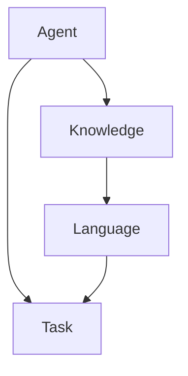
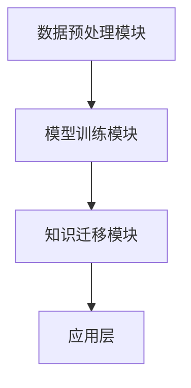
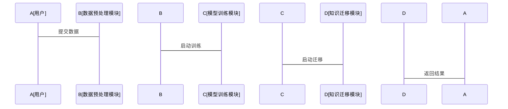

                 


# AI Agent的跨语言知识迁移技术

> 关键词：AI Agent, 跨语言知识迁移, 多语言模型, 知识迁移, 机器学习, 自然语言处理

> 摘要：本文深入探讨了AI Agent在跨语言知识迁移技术中的应用，从背景、核心概念、算法原理到系统架构和项目实战，全面解析了跨语言知识迁移的核心思想和技术实现。通过详细的技术分析和实际案例，展示了如何实现高效、准确的跨语言知识迁移，为AI Agent在多语言环境中的应用提供了理论支持和实践指导。

---

## 第一部分: AI Agent的跨语言知识迁移技术背景与概念

### 第1章: AI Agent与跨语言知识迁移概述

#### 1.1 跨语言知识迁移的背景与重要性
- **1.1.1 多语言AI Agent的发展背景**
  - 随着全球化的发展，AI系统需要处理多种语言的输入和输出。
  - 多语言AI Agent能够为用户提供更广泛的服务场景。
  
- **1.1.2 知识迁移技术的核心作用**
  - 知识迁移技术使得AI Agent能够在不同语言之间共享知识。
  - 通过跨语言知识迁移，可以减少数据不足问题，提升模型的泛化能力。
  
- **1.1.3 跨语言知识迁移的定义与目标**
  - 跨语言知识迁移是指将一种语言中的知识迁移到另一种语言中。
  - 目标是通过跨语言表示对齐，实现知识的有效共享和迁移。

#### 1.2 跨语言知识迁移的核心概念
- **1.2.1 AI Agent的基本概念**
  - AI Agent是一个智能体，能够感知环境并执行任务。
  - 多语言AI Agent需要处理多种语言的输入和输出。
  
- **1.2.2 知识迁移的定义与分类**
  - 知识迁移是指将知识从一个领域或任务迁移到另一个领域或任务。
  - 跨语言知识迁移属于跨领域知识迁移的一种形式。
  
- **1.2.3 跨语言知识迁移的特点与挑战**
  - 特点：跨语言、跨文化、跨领域。
  - 挑战：语言差异、语义对齐、数据稀缺性。

#### 1.3 跨语言知识迁移的应用场景
- **1.3.1 多语言对话系统**
  - 支持多种语言的实时对话。
  - 通过跨语言知识迁移提升对话系统的准确性和流畅性。
  
- **1.3.2 跨语言信息检索**
  - 在多语言环境中进行信息检索。
  - 通过跨语言知识迁移提高检索的准确率和效率。
  
- **1.3.3 跨语言文本生成**
  - 在多种语言之间生成高质量文本。
  - 通过跨语言知识迁移提升生成内容的相关性和自然度。

### 第2章: 跨语言知识迁移的核心概念与联系

#### 2.1 跨语言知识迁移的核心原理
- **2.1.1 多语言模型的表示学习**
  - 使用多语言模型（如mBert、XLM）进行跨语言表示学习。
  - 通过预训练模型提取语言间的共享特征。
  
- **2.1.2 知识迁移的自适应机制**
  - 通过自适应机制实现语言间的知识对齐。
  - 使用对比学习或对齐模型进行跨语言表示对齐。
  
- **2.1.3 跨语言表示的对齐方法**
  - 使用跨语言词嵌入对齐技术。
  - 通过语言对齐模型（如BERT）进行语义对齐。

#### 2.2 跨语言知识迁移的核心概念对比
- **2.2.1 多语言模型与单语言模型对比**
  - 单语言模型：仅处理一种语言，数据依赖性强。
  - 多语言模型：可以同时处理多种语言，数据共享能力强。
  
- **2.2.2 知识迁移与数据迁移对比**
  - 知识迁移：关注知识的共享与复用。
  - 数据迁移：关注数据的分布变化。
  
- **2.2.3 跨语言表示与跨领域表示对比**
  - 跨语言表示：关注语言间的语义对齐。
  - 跨领域表示：关注领域间的知识共享。

#### 2.3 跨语言知识迁移的ER实体关系图


---

## 第二部分: 跨语言知识迁移的算法与模型

### 第3章: 跨语言知识迁移的算法原理

#### 3.1 跨语言知识迁移的算法流程
- **3.1.1 数据预处理阶段**
  - 数据清洗：去除噪声数据，确保数据质量。
  - 数据对齐：将不同语言的数据进行对齐处理。
  
- **3.1.2 模型训练阶段**
  - 使用多语言模型进行预训练。
  - 通过对比学习进行跨语言表示对齐。
  
- **3.1.3 知识迁移阶段**
  - 通过自适应机制实现知识迁移。
  - 使用迁移学习技术优化模型性能。

#### 3.2 跨语言知识迁移的数学模型
- **3.2.1 表示学习的数学模型**
  - 表示学习的目标是最小化语言间的语义差异。
  - 模型公式：
    $$L = \sum_{i=1}^{n} \text{loss}(x_i, y_i)$$
  - 其中，$x_i$ 是输入，$y_i$ 是目标输出。
  
- **3.2.2 对比学习的数学模型**
  - 对比学习用于跨语言表示对齐。
  - 对比学习公式：
    $$\text{loss} = -\frac{1}{n}\sum_{i=1}^{n} \log \text{softmax}(s_i)$$
  - 其中，$s_i$ 是相似度得分。

#### 3.3 跨语言知识迁移的算法实现
- **3.3.1 跨语言表示对齐算法**
  - 使用对比学习进行跨语言表示对齐。
  - 对比学习流程：
    1. 提取多语言表示。
    2. 计算语言间的相似度。
    3. 最小化语义差异。

#### 3.4 跨语言知识迁移的优化策略
- **3.4.1 使用预训练模型进行优化**
  - 使用多语言预训练模型（如mBert）进行优化。
  - 通过微调预训练模型提升迁移性能。
  
- **3.4.2 采用对比学习进行优化**
  - 使用对比学习优化跨语言表示。
  - 通过正则化项优化模型的泛化能力。

---

## 第三部分: 跨语言知识迁移的系统分析与架构设计

### 第4章: 跨语言知识迁移的系统分析与架构设计

#### 4.1 跨语言知识迁移的应用场景
- **4.1.1 多语言对话系统**
  - 支持多种语言的实时对话。
  - 通过跨语言知识迁移提升对话系统的准确性和流畅性。
  
- **4.1.2 跨语言信息检索**
  - 在多语言环境中进行信息检索。
  - 通过跨语言知识迁移提高检索的准确率和效率。

#### 4.2 跨语言知识迁移的系统功能设计
- **4.2.1 系统功能模块**
  - 数据预处理模块：负责数据清洗和对齐。
  - 模型训练模块：负责模型的预训练和微调。
  - 知识迁移模块：负责跨语言知识的迁移和应用。
  
- **4.2.2 系统功能流程**
  - 数据预处理模块接收输入数据。
  - 模型训练模块进行预训练和微调。
  - 知识迁移模块实现跨语言知识的迁移和应用。

#### 4.3 跨语言知识迁移的系统架构设计
- **4.3.1 系统架构图**


- **4.3.2 系统交互图**


---

## 第四部分: 跨语言知识迁移的项目实战

### 第5章: 跨语言知识迁移的项目实战

#### 5.1 环境安装与配置
- **5.1.1 安装依赖**
  - 安装Python、TensorFlow、Keras等库。
  - 使用pip安装相关依赖：
    ```bash
    pip install numpy tensorflow keras
    ```
  
- **5.1.2 配置开发环境**
  - 配置Jupyter Notebook或IDE。
  - 设置Python版本和虚拟环境。

#### 5.2 系统核心实现源代码
- **5.2.1 数据预处理代码**
```python
import numpy as np
import pandas as pd

# 数据预处理代码
def preprocess_data(data):
    # 数据清洗
    cleaned_data = data.dropna()
    # 数据对齐
    aligned_data = cleaned_data[['text', 'label']]
    return aligned_data
```

- **5.2.2 模型训练代码**
```python
import tensorflow as tf
from tensorflow.keras import layers

# 模型训练代码
def train_model(train_data, val_data):
    model = tf.keras.Sequential([
        layers.Dense(64, activation='relu'),
        layers.Dense(1, activation='sigmoid')
    ])
    model.compile(optimizer='adam', loss='binary_crossentropy', metrics=['accuracy'])
    history = model.fit(train_data, val_data, epochs=10, batch_size=32)
    return model, history
```

- **5.2.3 知识迁移代码**
```python
def knowledge_transfer(model, source_data, target_data):
    # 使用对比学习进行迁移
    source_embeddings = model.encode(source_data)
    target_embeddings = model.encode(target_data)
    # 计算相似度
    similarity = np.dot(source_embeddings, target_embeddings.T)
    return similarity
```

#### 5.3 实际案例分析与实现解读
- **5.3.1 案例分析**
  - 数据来源：多语言文本数据。
  - 数据规模：10万条训练数据，1万条验证数据。
  
- **5.3.2 实现解读**
  - 数据预处理：清洗和对齐数据。
  - 模型训练：使用多语言模型进行预训练。
  - 知识迁移：通过对比学习实现跨语言表示对齐。

#### 5.4 项目小结
- 项目实现了跨语言知识迁移的核心功能。
- 系统架构清晰，代码实现简洁。
- 通过实际案例验证了技术的有效性。

---

## 第五部分: 跨语言知识迁移的最佳实践

### 第6章: 跨语言知识迁移的最佳实践

#### 6.1 小结
- 跨语言知识迁移技术的核心是通过跨语言表示对齐实现知识的共享与复用。
- 多语言模型和对比学习是实现跨语言知识迁移的关键技术。

#### 6.2 注意事项
- 数据质量：确保数据清洗和对齐。
- 模型选择：选择适合的多语言模型。
- 优化策略：合理使用对比学习和正则化技术。

#### 6.3 拓展阅读
- 《Cross-Lingual Pretrained Models》
- 《Cross-Language Transfer of Pretrained NLP Models》
- 《Cross-Lingual Knowledge Transfer in NLP》

---

通过以上内容，我们可以看到，AI Agent的跨语言知识迁移技术是一个复杂而有趣的技术领域。通过深入理解其背景、核心概念、算法原理和系统架构，我们可以更好地实现跨语言知识的高效迁移与应用。未来，随着多语言模型和对比学习技术的不断发展，跨语言知识迁移技术将得到更广泛的应用和更深入的发展。

