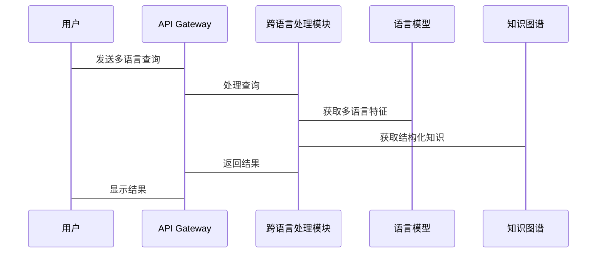

                 


# AI Agent的跨语言知识迁移技术

> 关键词：AI Agent, 跨语言知识迁移, 自然语言处理, 机器学习, 知识图谱

> 摘要：本文探讨了AI Agent在跨语言知识迁移技术中的应用，分析了其核心概念、算法原理、系统架构及项目实战。通过详细讲解，帮助读者理解如何实现跨语言知识迁移，提升AI Agent的多语言处理能力。

---

## 第一部分: AI Agent的跨语言知识迁移技术背景介绍

### 第1章: AI Agent与跨语言知识迁移概述

#### 1.1 AI Agent的基本概念
- **1.1.1 AI Agent的定义与特点**
  - AI Agent是一种智能实体，能够感知环境、自主决策并执行任务。
  - 具备自主性、反应性、社会性、持续性等核心特点。
- **1.1.2 AI Agent的核心功能与应用场景**
  - 核心功能包括信息处理、决策制定、任务执行等。
  - 应用场景涵盖智能助手、聊天机器人、智能客服等领域。
- **1.1.3 跨语言知识迁移的定义与背景**
  - 跨语言知识迁移是指在不同语言之间转移和应用知识的过程。
  - 全球化背景下，跨语言能力成为AI Agent的重要需求。

#### 1.2 跨语言知识迁移的背景与重要性
- **1.2.1 全球化背景下跨语言需求的增长**
  - 随着全球化进程加快，多语言交互需求日益增长。
- **1.2.2 知识迁移技术在AI Agent中的作用**
  - 跨语言知识迁移技术能够提升AI Agent的多语言处理能力。
- **1.2.3 跨语言知识迁移的挑战与机遇**
  - 挑战包括语言差异、文化差异、语义理解等。
  - 机遇在于技术进步和数据积累。

#### 1.3 跨语言知识迁移技术的核心问题
- **1.3.1 知识表示与语义理解**
  - 需要找到不同语言之间的共同语义表示。
- **1.3.2 跨语言信息对齐与转换**
  - 如何在不同语言之间对齐知识和信息。
- **1.3.3 跨语言迁移中的文化与语境差异**
  - 考虑不同语言中的文化差异和语境影响。

### 第2章: 跨语言知识迁移的核心概念与联系

#### 2.1 跨语言知识迁移的核心概念
- **2.1.1 知识表示的多语言表达**
  - 知识可以表示为概念、实体、关系等，需在多语言中保持一致。
- **2.1.2 語言模型与知识图谱的结合**
  - 语言模型提供语义理解，知识图谱提供结构化知识。
- **2.1.3 跨语言迁移的数学模型**
  - 需要构建跨语言的知识对齐模型。

#### 2.2 跨语言知识迁移的核心原理
- **2.2.1 語言模型的跨语言表示**
  - 使用语言模型生成多语言的向量表示。
- **2.2.2 知识图谱的跨语言对齐**
  - 将不同语言的知识图谱对齐，建立对应关系。
- **2.2.3 跨语言迁移中的对比学习**
  - 通过对比学习，增强跨语言信息的对齐能力。

#### 2.3 跨语言知识迁移的核心要素对比
- **2.3.1 不同语言模型的对比分析**
  - 使用表格对比不同语言模型的特点和性能。
- **2.3.2 不同知识表示方法的对比**
  - 对比不同知识表示方法的优缺点。

---

## 第二部分: 跨语言知识迁移技术的算法原理

### 第3章: 跨语言知识迁移的算法原理

#### 3.1 跨语言知识迁移的核心算法
- **3.1.1 对比学习算法**
  - 使用对比损失函数，增强跨语言表示的相似性。
  - 公式：$$ L_{contrast} = \log \frac{1}{1 + \exp(-\text{sim}(x,y))} $$
  - 其中，sim(x,y)是x和y的相似度。
- **3.1.2 多任务学习算法**
  - 同时学习多种任务，共享跨语言知识。

#### 3.2 跨语言知识迁移的流程
- **3.2.1 数据预处理**
  - 对齐不同语言的数据，构建跨语言语料库。
- **3.2.2 特征提取**
  - 使用语言模型提取多语言特征向量。
- **3.2.3 对比学习**
  - 对比学习，优化跨语言表示。

#### 3.3 跨语言知识迁移的实现代码
```python
import torch
import torch.nn as nn

class ContrastiveLoss(nn.Module):
    def __init__(self, temperature=0.1):
        super(ContrastiveLoss, self).__init__()
        self.temperature = temperature

    def forward(self, x, y):
        x = F.normalize(x, dim=1)
        y = F.normalize(y, dim=1)
        similarity = torch.mm(x, y.T)
        loss = -torch.mean(torch.log(similarity))
        return loss

# 示例：多语言特征对齐
def contrastive_learning(x, y, temperature=0.1):
    loss = ContrastiveLoss(temperature)
    loss_value = loss(x, y)
    return loss_value
```

---

## 第三部分: 跨语言知识迁移的系统分析与架构设计

### 第4章: 跨语言知识迁移的系统架构

#### 4.1 系统应用场景
- 跨语言客服系统
- 多语言智能助手
- 跨语言信息检索

#### 4.2 系统功能设计
- **领域模型类图**
  ```mermaid
  graph TD
    A[AI Agent] --> B[语言模型]
    B --> C[知识图谱]
    C --> D[跨语言对齐]
    D --> E[用户查询]
    E --> F[结果输出]
  ```

- **系统架构图**
  ```mermaid
  graph TD
    A[用户] --> B[API Gateway]
    B --> C[跨语言处理模块]
    C --> D[语言模型]
    C --> E[知识图谱]
    D --> F[结果]
    E --> F
    F --> B
    B --> A
  ```

#### 4.3 系统接口设计
- 输入接口：多语言文本输入
- 输出接口：多语言文本输出
- 对齐接口：跨语言知识对齐

#### 4.4 系统交互流程图


---

## 第四部分: 跨语言知识迁移技术的项目实战

### 第5章: 项目实战

#### 5.1 环境安装
- 安装必要的库：`torch`, `transformers`, `networkx`

#### 5.2 核心实现代码
```python
from transformers import AutoTokenizer, AutoModel
import torch

# 加载多语言模型
tokenizer = AutoTokenizer.from_pretrained('bert-base-multilingual')
model = AutoModel.from_pretrained('bert-base-multilingual')

# 提取特征向量
def get_features(text):
    inputs = tokenizer(text, return_tensors='pt')
    outputs = model(**inputs)
    return outputs.last_hidden_state.squeeze(0)

# 跨语言对齐
def align_crosslingual(x, y):
    x_fea = get_features(x)
    y_fea = get_features(y)
    loss = contrastive_learning(x_fea, y_fea)
    return loss.item()
```

#### 5.3 案例分析
- **案例一：中英文问答对齐**
  - 输入：中文问题“你好”
  - 输出：英文问候“Hello”

---

## 第五部分: 跨语言知识迁移技术的最佳实践

### 第6章: 总结与展望

#### 6.1 总结
- 跨语言知识迁移技术能够显著提升AI Agent的多语言能力。
- 关键在于构建高效的跨语言表示和对齐方法。

#### 6.2 展望
- 结合更大语言模型，提升迁移效果。
- 研究更高效的跨语言对齐算法。

#### 6.3 注意事项
- 数据质量对迁移效果影响重大。
- 需考虑文化差异和语境影响。

#### 6.4 拓展阅读
- 《对比学习在跨语言迁移中的应用》
- 《多语言知识图谱的构建与对齐》

---

通过以上步骤，我们可以系统地理解AI Agent的跨语言知识迁移技术，从理论到实践，逐步实现一个高效的跨语言知识迁移系统。

