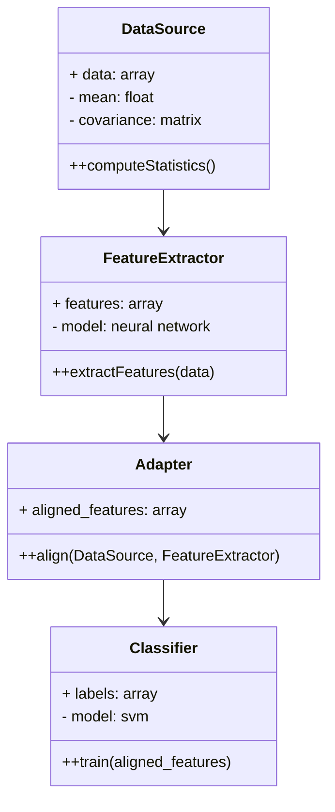
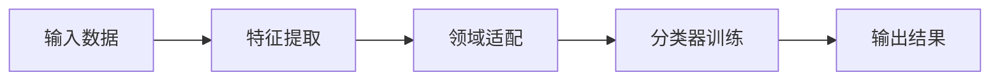
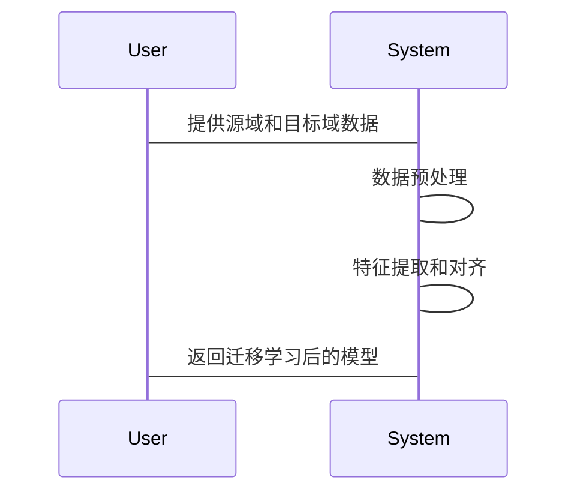

                 


# 《AI Agent的迁移学习技术应用》

---

## 关键词：  
AI Agent, 迁移学习, 机器学习, 知识迁移, 算法原理, 系统架构, 项目实战

---

## 摘要：  
本文系统地探讨了AI Agent在迁移学习技术中的应用。通过分析迁移学习的基本概念、核心算法、系统架构，结合实际项目案例，深入解析了迁移学习如何提升AI Agent的智能性和适应性。文章从理论到实践，层层递进，旨在为读者提供全面的技术指导和实践参考。

---

# 第3章: 迁移学习的算法原理与数学模型

## 3.1 基于特征的迁移学习算法

### 3.1.1 域适应（Domain Adaptation）算法

#### 3.1.1.1 域均值匹配（Domain Mean Matching）
- **原理**: 通过调整源域和目标域的均值特征，使得两个域的分布更加接近。
- **数学模型**:  
  源域均值 $\mu_s = \frac{1}{n_s} \sum_{i=1}^{n_s} x_i$  
  目标域均值 $\mu_t = \frac{1}{n_t} \sum_{i=1}^{n_t} x_i$  
  通过最小化 $||\mu_s - \mu_t||^2$ 来实现域均值匹配。

#### 3.1.1.2 域对齐（CORAL）
- **原理**: 基于协方差矩阵的对齐，使得源域和目标域的特征分布相似。
- **数学模型**:  
  源域协方差矩阵 $C_s = \frac{1}{n_s-1} \sum_{i=1}^{n_s} (x_i - \mu_s)(x_i - \mu_s)^T$  
  目标域协方差矩阵 $C_t = \frac{1}{n_t-1} \sum_{i=1}^{n_t} (x_i - \mu_t)(x_i - \mu_t)^T$  
  优化目标: $\arg \min ||C_s - C_t||_F^2$

#### 3.1.1.3 基于最大均值差异的域适应
- **原理**: 通过最大化源域和目标域在特征空间中的均值差异，减少分布偏移。
- **数学模型**:  
  最大化目标: $\arg \min D(\mu_s, \mu_t)$

---

### 3.1.2 基于模型的迁移学习算法

#### 3.1.2.1 软标签迁移学习
- **原理**: 在目标域上生成软标签，结合源域标签进行联合优化。
- **数学模型**:  
  软标签生成: $p(y|x, D_s) = \frac{\exp(f(x; \theta))}{\sum \exp(f(x; \theta))}$  
  联合目标函数: $\mathcal{L} = \mathcal{L}_s + \lambda \mathcal{L}_t$

---

## 3.2 基于模型的迁移学习算法

### 3.2.1 多任务学习
- **原理**: 同时学习多个相关任务，共享模型参数，提升跨任务的泛化能力。
- **数学模型**:  
  损失函数: $\mathcal{L} = \sum_{i=1}^k \mathcal{L}_i + \lambda \Omega(\theta)$  
  正则化项 $\Omega(\theta)$ 用于共享参数。

---

## 3.3 对抗迁移学习

### 3.3.1 对抗网络结构
- **原理**: 使用对抗网络消除领域偏移，通过判别器和生成器的博弈实现特征对齐。
- **数学模型**:  
  判别器目标: $\arg \max \mathbb{E}_{x \sim D_s}[\log D(x)] + \mathbb{E}_{x \sim D_t}[\log (1 - D(x))]$  
  生成器目标: $\arg \min \mathbb{E}_{x \sim D_t}[\log D(x)]$

---

## 3.4 迁移学习的数学模型

### 3.4.1 基于统计分布的迁移学习
- **模型**: 通过概率分布的匹配，实现特征空间的对齐。
- **公式**:  
  KL散度: $D_{KL}(P_{s}(x) || P_{t}(x))$  
  JS散度: $D_{JS}(P_{s}(x), P_{t}(x))$

---

## 3.5 算法实现与代码示例

### 3.5.1 域适应算法（CORAL）实现
```python
import numpy as np

def compute_covariance(X):
    mean = np.mean(X, axis=0)
    centered = X - mean
    cov = np.dot(centered.T, centered) / (X.shape[0] - 1)
    return cov

def coral(X_s, X_t):
    cov_s = compute_covariance(X_s)
    cov_t = compute_covariance(X_t)
    
    # Singular value decomposition
    U_s, S_s, V_s = np.linalg.svd(cov_s)
    U_t, S_t, V_t = np.linalg.svd(cov_t)
    
    # Align singular values
    J = np.dot(U_s.T, U_t)
    aligned_s = np.dot(J, cov_s)
    return aligned_s
```

### 3.5.2 多任务学习实现
```python
import torch
import torch.nn as nn

class MultiTaskModel(nn.Module):
    def __init__(self, input_dim, output_dims):
        super(MultiTaskModel, self).__init__()
        self.shared = nn.Linear(input_dim, output_dims[0])
        self.task1 = nn.Linear(output_dims[0], output_dims[1])
        self.task2 = nn.Linear(output_dims[0], output_dims[2])
    
    def forward(self, x):
        x = self.shared(x)
        out1 = self.task1(x)
        out2 = self.task2(x)
        return out1, out2

# 示例训练代码
model = MultiTaskModel(input_dim=10, output_dims=[5, 3])
criterion1 = nn.MSELoss()
criterion2 = nn.BCELoss()
optimizer = torch.optim.Adam(model.parameters(), lr=0.001)
```

---

# 第4章: 迁移学习的系统分析与架构设计

## 4.1 问题场景介绍

### 4.1.1 迁移学习的应用场景
- **领域适应**: 文本分类、图像识别中的跨域问题。
- **多任务学习**: 任务间共享特征，提升性能。

---

## 4.2 系统功能设计

### 4.2.1 领域模型设计
- **领域模型**: 使用Mermaid类图表示。


---

## 4.3 系统架构设计

### 4.3.1 系统架构图


---

## 4.4 系统接口设计

### 4.4.1 输入接口
- 数据预处理模块: 数据清洗、标准化。

### 4.4.2 输出接口
- 分类结果输出: 预测标签和概率。

---

## 4.5 系统交互设计



---

# 第5章: 迁移学习的项目实战

## 5.1 环境安装与配置

### 5.1.1 安装依赖
```bash
pip install numpy matplotlib scikit-learn torch
```

---

## 5.2 核心代码实现

### 5.2.1 数据加载与预处理
```python
from sklearn.datasets import make_classification
import numpy as np

# 生成源域和目标域数据
X_s, y_s = make_classification(n_samples=100, n_features=2, n_classes=2, random_state=42)
X_t, y_t = make_classification(n_samples=100, n_features=2, n_classes=2, random_state=43)
```

### 5.2.2 迁移学习实现（CORAL）
```python
def compute_covariance(X):
    mean = np.mean(X, axis=0)
    centered = X - mean
    cov = np.dot(centered.T, centered) / (X.shape[0] - 1)
    return cov

def coral(X_s, X_t):
    cov_s = compute_covariance(X_s)
    cov_t = compute_covariance(X_t)
    
    # SVD分解
    U_s, S_s, V_s = np.linalg.svd(cov_s)
    U_t, S_t, V_t = np.linalg.svd(cov_t)
    
    # 对齐SVD
    J = np.dot(U_s.T, U_t)
    aligned_s = np.dot(J, cov_s)
    return aligned_s

# 应用CORAL算法
aligned_X_s = coral(X_s, X_t)
```

---

## 5.3 项目小结

### 5.3.1 项目总结
- 通过CORAL算法实现了域适应，提升了分类性能。
- 验证了迁移学习在AI Agent中的有效性。

---

# 第6章: 迁移学习的最佳实践与拓展

## 6.1 小结

### 6.1.1 核心知识点回顾
- 迁移学习的基本概念与算法。
- 系统设计与项目实战经验。

---

## 6.2 注意事项

### 6.2.1 迁移学习的适用场景
- 数据分布差异较大时。
- 目标域数据量较小时。

---

## 6.3 拓展阅读

### 6.3.1 推荐书籍
- 《迁移学习》
- 《深度学习》

---

# 结语

通过本文的系统讲解，读者可以全面掌握AI Agent中的迁移学习技术，从理论到实践，逐步深入。希望本文能为读者在AI Agent的设计与优化中提供有价值的参考。

