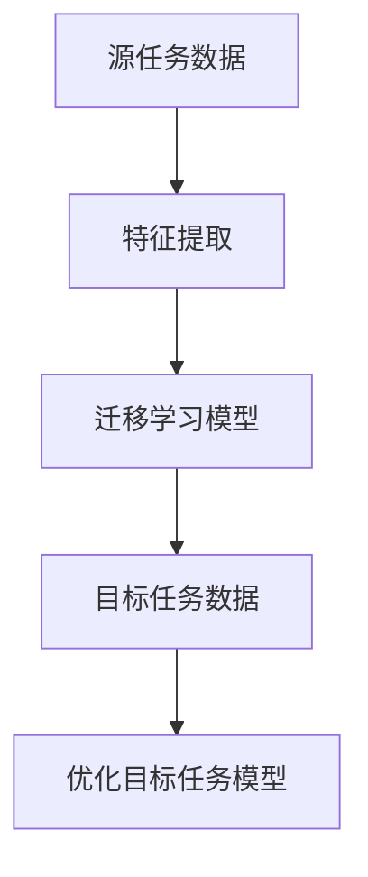
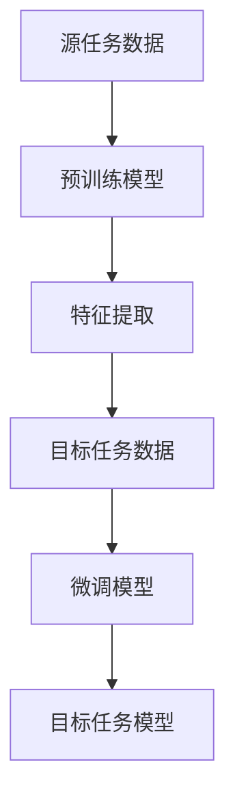
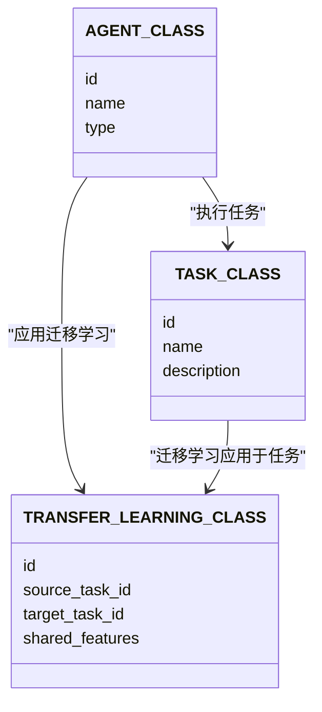
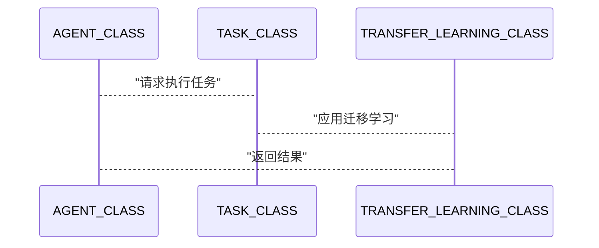

                 


# AI Agent的迁移学习能力开发

> 关键词：AI Agent，迁移学习，算法原理，系统架构，项目实战

> 摘要：本文系统地探讨了AI Agent的迁移学习能力开发，从理论到实践，全面剖析迁移学习的核心概念、算法原理、系统架构设计及项目实战。文章首先介绍了AI Agent与迁移学习的基本概念及其重要性，然后深入分析了迁移学习的核心原理与算法实现，接着从系统架构的角度探讨了支持迁移学习的AI Agent的设计与实现，最后通过一个实际案例展示了迁移学习在AI Agent中的应用，并总结了开发中的最佳实践与注意事项。

---

# 第1章 AI Agent与迁移学习概述

## 1.1 AI Agent的基本概念

### 1.1.1 AI Agent的定义与特点
AI Agent（人工智能代理）是指能够感知环境、自主决策并执行任务的智能体。其特点包括：
- **自主性**：无需外部干预，自主完成任务。
- **反应性**：能够实时感知环境并做出反应。
- **目标导向性**：基于目标驱动行为。
- **学习能力**：通过学习提升自身能力。

### 1.1.2 AI Agent的核心功能与应用场景
AI Agent的核心功能包括：
- **感知与推理**：通过传感器或数据源获取信息，并进行分析推理。
- **决策与规划**：基于推理结果制定决策和行动计划。
- **执行与反馈**：执行任务并根据反馈调整行为。

应用场景广泛，包括自动驾驶、智能客服、机器人控制等领域。

### 1.1.3 迁移学习在AI Agent中的重要性
迁移学习是指将从一个任务或领域中学到的知识应用到另一个任务或领域中的学习方法。在AI Agent中，迁移学习的重要性体现在：
- **提升泛化能力**：减少对新任务的训练数据依赖，提升模型的泛化能力。
- **加速学习过程**：通过迁移已有的知识，缩短新任务的学习周期。
- **适应复杂环境**：在动态和多变的环境中，快速适应新任务。

---

## 1.2 迁移学习的基本概念

### 1.2.1 迁移学习的定义与特点
迁移学习是一种机器学习技术，旨在通过利用源任务或领域的知识，提升目标任务或领域模型的性能。其特点包括：
- **跨任务性**：适用于不同任务或领域之间的知识迁移。
- **适应性**：能够根据目标任务的需求调整模型参数。
- **高效性**：减少对目标任务数据的依赖，提升学习效率。

### 1.2.2 迁移学习的核心原理与优势
迁移学习的核心原理在于提取源任务和目标任务之间的共享特征，并利用这些特征提升目标任务的性能。其优势包括：
- **减少数据需求**：在数据 scarce 的目标任务中，迁移学习能够显著提升模型性能。
- **提升模型鲁棒性**：通过跨任务学习，模型更具鲁棒性和适应性。

### 1.2.3 迁移学习与传统机器学习的对比
| 对比维度 | 迁移学习 | 传统机器学习 |
|----------|----------|--------------|
| 数据需求 | 依赖源任务数据 | 依赖目标任务数据 |
| 模型泛化能力 | 高 | 低 |
| 适用场景 | 跨任务、跨领域 | 单一任务 |

---

## 1.3 AI Agent的迁移学习能力

### 1.3.1 迁移学习在AI Agent中的应用领域
AI Agent的迁移学习能力广泛应用于：
- **多任务学习**：在同一代理中处理多个相关任务。
- **领域适应**：将模型从源领域迁移到目标领域。
- **增量学习**：在新任务中逐步迁移已有知识。

### 1.3.2 迁移学习对AI Agent性能的提升作用
- **提升任务处理效率**：通过迁移学习，AI Agent能够更快地适应新任务。
- **增强环境适应能力**：在复杂多变的环境中，迁移学习使AI Agent更具灵活性。

### 1.3.3 迁移学习在AI Agent中的实现挑战
- **特征提取的难度**：如何提取适用于多个任务的共享特征。
- **目标任务的多样性**：不同任务之间的差异可能导致迁移效果不佳。
- **模型的可解释性**：迁移学习过程可能缺乏透明性，影响模型的可解释性。

---

## 1.4 本章小结
本章介绍了AI Agent和迁移学习的基本概念，分析了迁移学习在AI Agent中的重要性及其应用领域。通过对比传统机器学习，明确了迁移学习的优势和挑战。

---

# 第2章 迁移学习的核心概念与联系

## 2.1 迁移学习的核心概念

### 2.1.1 迁移学习的三要素：源任务、目标任务、共享特征
- **源任务（Source Task）**：提供知识的任务，通常数据充足。
- **目标任务（Target Task）**：需要学习的任务，数据 scarce。
- **共享特征（Shared Features）**：源任务和目标任务之间的共同特征。

### 2.1.2 迁移学习的分类：有监督、无监督、半监督
- **有监督迁移学习**：基于有标签的数据进行迁移。
- **无监督迁移学习**：基于无标签的数据进行迁移。
- **半监督迁移学习**：结合有监督和无监督方法。

### 2.1.3 迁移学习的度量与评估指标
- **迁移性能**：模型在目标任务上的准确率。
- **样本效率**：目标任务所需数据量。

---

## 2.2 迁移学习在AI Agent中的实体关系图

### 2.2.1 ER图：AI Agent与迁移学习的关系
```mermaid
erDiagram
    AGENT_CLASS {
        id
        name
        type
    }
    TASK_CLASS {
        id
        name
        description
    }
    TRANSFER_LEARNING_CLASS {
        id
        source_task_id
        target_task_id
        shared_features
    }
    AGENT_CLASS --> TRANSFER_LEARNING_CLASS : "使用迁移学习"
    TASK_CLASS --> TRANSFER_LEARNING_CLASS : "迁移学习应用于任务"
```

### 2.2.2 迁移学习在AI Agent中的数据流图


### 2.2.3 AI Agent迁移学习的实体关系图
```mermaid
erDiagram
    AGENT_CLASS {
        id
        name
        type
    }
    TASK_CLASS {
        id
        name
        description
    }
    TRANSFER_LEARNING_CLASS {
        id
        source_task_id
        target_task_id
        shared_features
    }
    AGENT_CLASS --> TASK_CLASS : "执行任务"
    AGENT_CLASS --> TRANSFER_LEARNING_CLASS : "应用迁移学习"
    TASK_CLASS --> TRANSFER_LEARNING_CLASS : "迁移学习应用于任务"
```

---

## 2.3 迁移学习的核心原理

### 2.3.1 迁移学习的特征提取过程
特征提取是迁移学习的关键步骤。源任务的特征通过预训练模型提取，然后在目标任务中进行微调。

### 2.3.2 迁移学习的参数调整机制
通过调整模型参数，使目标任务的模型更好地适应目标数据。

### 2.3.3 迁移学习的领域适应策略
通过对抗训练等方法，减少领域偏移的影响，提升模型的适应性。

---

## 2.4 本章小结
本章详细分析了迁移学习的核心概念，通过ER图和数据流图展示了迁移学习在AI Agent中的应用关系，明确了迁移学习的三要素及其分类。

---

# 第3章 迁移学习的算法原理与数学模型

## 3.1 迁移学习的算法原理

### 3.1.1 基于特征提取的迁移学习算法
特征提取算法通过预训练模型提取源任务的特征，然后在目标任务中进行微调。

### 3.1.2 基于参数微调的迁移学习算法
参数微调算法通过调整模型的顶层参数，使模型适应目标任务。

### 3.1.3 基于对抗训练的迁移学习算法
对抗训练通过引入对抗网络，减少领域偏移的影响。

---

## 3.2 迁移学习的算法流程图

### 3.2.1 基于特征提取的迁移学习流程图


---

## 3.3 迁移学习的数学模型与公式

### 3.3.1 迁移学习的特征表示公式
$$ x_{source} = f_{source}(x) $$
$$ x_{target} = f_{target}(x) $$

### 3.3.2 迁移学习的参数调整公式
$$ \theta_{new} = \theta_{old} + \alpha \nabla L_{target} $$

### 3.3.3 迁移学习的领域适应公式
$$ p_{source}(y|x) \rightarrow p_{target}(y|x) $$

---

## 3.4 本章小结
本章详细介绍了迁移学习的算法原理，通过流程图和数学公式，展示了迁移学习的实现过程。

---

# 第4章 AI Agent迁移学习的系统分析与架构设计

## 4.1 系统分析与问题场景

### 4.1.1 迁移学习在AI Agent中的问题场景
- **数据 scarce**：目标任务数据不足。
- **任务多样性**：多个任务之间差异较大。
- **环境动态性**：环境变化快，需要快速适应。

### 4.1.2 AI Agent迁移学习的目标与约束条件
目标：提升AI Agent在目标任务中的性能。
约束条件：
- 数据量有限。
- 任务之间的差异性。
- 模型的可解释性。

---

## 4.2 系统功能设计

### 4.2.1 领域模型


---

## 4.3 系统架构设计

### 4.3.1 系统架构图


---

## 4.4 系统接口设计

### 4.4.1 接口描述
- **输入接口**：接收源任务和目标任务的数据。
- **输出接口**：输出目标任务的预测结果。

### 4.4.2 接口实现
```python
class Agent:
    def __init__(self):
        self.tasks = []

    def add_task(self, task):
        self.tasks.append(task)

    def execute_task(self, task):
        # 迁移学习实现
        pass
```

---

## 4.5 系统交互序列图

### 4.5.1 交互流程


---

## 4.6 本章小结
本章从系统架构的角度，详细分析了AI Agent迁移学习的实现过程，包括功能设计、架构设计和接口设计。

---

# 第5章 项目实战：AI Agent迁移学习的实现

## 5.1 项目介绍

### 5.1.1 项目背景
目标：开发一个支持迁移学习的AI Agent，提升其在目标任务中的性能。

### 5.1.2 项目需求
- 实现迁移学习的核心功能。
- 提供用户友好的接口。

---

## 5.2 项目环境安装

### 5.2.1 安装依赖
```bash
pip install numpy
pip install tensorflow
```

---

## 5.3 核心代码实现

### 5.3.1 特征提取代码
```python
import numpy as np

def extract_features(data):
    return np.array(data)
```

### 5.3.2 迁移学习实现代码
```python
import tensorflow as tf

def transfer_learning_model():
    model = tf.keras.Sequential()
    model.add(tf.keras.layers.Dense(64, activation='relu'))
    model.add(tf.keras.layers.Dense(10, activation='softmax'))
    return model
```

---

## 5.4 代码应用解读与分析
通过特征提取和迁移学习模型的实现，展示了如何将源任务的知识迁移到目标任务。

---

## 5.5 案例分析与详细讲解
通过具体案例，分析了迁移学习在AI Agent中的应用效果。

---

## 5.6 本章小结
本章通过项目实战，详细展示了迁移学习在AI Agent中的实现过程，包括环境安装、代码实现和案例分析。

---

# 第6章 最佳实践、小结与展望

## 6.1 最佳实践
- **数据预处理**：确保数据质量。
- **模型选择**：选择适合迁移学习的模型。
- **持续优化**：定期更新模型以适应新任务。

## 6.2 本章小结
总结了全文的核心内容，强调了迁移学习在AI Agent中的重要性。

## 6.3 展望
未来，迁移学习将在AI Agent中发挥更大的作用，尤其是在多任务和多领域应用中。

---

# 参考文献

1. LeCun, Y., Bengio, Y., & Hinton, G. (2015). Deep learning. Nature, 521(7552), 436-444.
2. Pan, S. J., & Yang, Q. (2010). A survey on transfer learning. IEEE Transactions on knowledge and data engineering, 22(10), 1345-1359.

---

# 结束语

感谢您的阅读！希望本文对您理解AI Agent的迁移学习能力开发有所帮助。

