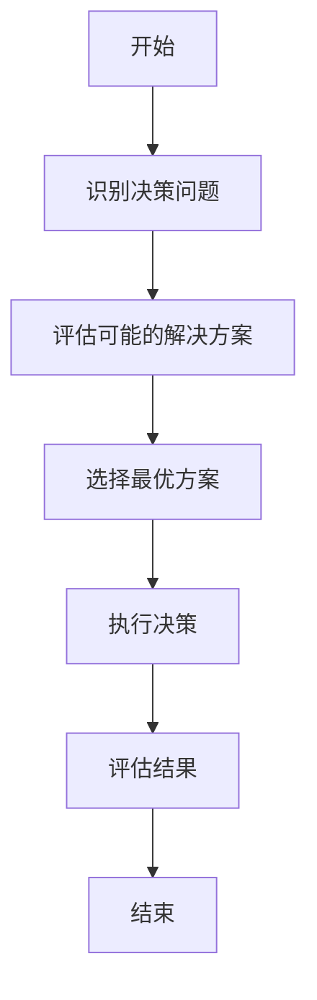
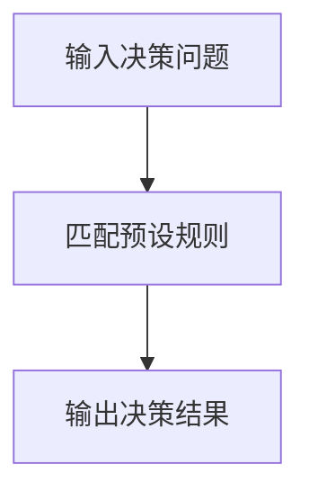
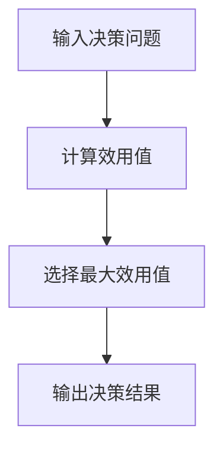
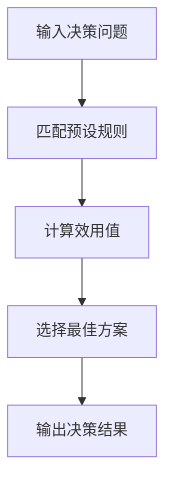
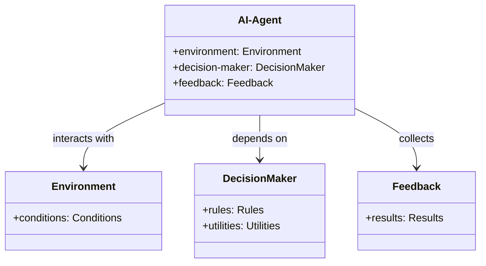
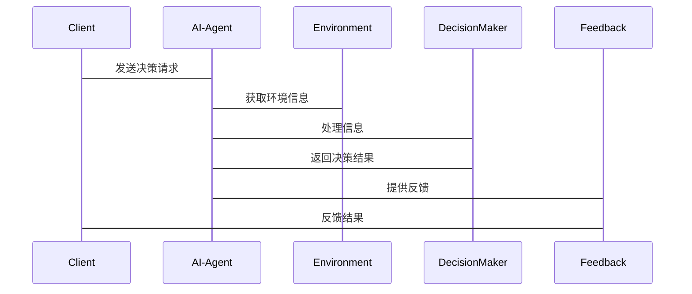

                 


# AI Agent的道德决策框架设计

> 关键词：AI Agent，道德决策，伦理框架，决策算法，系统架构

> 摘要：本文系统地探讨了AI Agent的道德决策框架设计，从背景介绍、核心概念到算法原理、系统架构，再到项目实战，全面解析了AI Agent在道德决策中的实现路径。通过理论与实践相结合，提出了构建AI Agent道德决策框架的系统方法。

---

# 第一部分：AI Agent的道德决策框架背景与核心概念

## 第1章：AI Agent与道德决策概述

### 1.1 AI Agent的基本概念

#### 1.1.1 AI Agent的定义与分类

- **定义**：AI Agent（智能体）是能够感知环境、自主决策并执行任务的实体。
- **分类**：
  - **简单反射型**：基于预设规则做出反应。
  - **基于模型的反射型**：利用内部模型进行推理和决策。
  - **目标驱动型**：以目标为导向，主动采取行动。
  - **效用驱动型**：以最大化效用为目标。

#### 1.1.2 AI Agent的决策机制

- **感知**：通过传感器或数据源获取环境信息。
- **推理**：分析信息，生成可能的决策方案。
- **选择**：基于一定准则，选择最优行动。
- **执行**：将决策转化为具体行动。

#### 1.1.3 道德决策在AI Agent中的重要性

- **社会影响**：AI Agent的行为直接影响人类生活。
- **伦理风险**：错误的道德决策可能导致严重后果。
- **信任构建**：合理的道德决策框架能增强用户信任。

### 1.2 道德决策的背景与问题背景

#### 1.2.1 道德决策的定义与特征

- **定义**：道德决策是在遵守伦理规范的前提下，做出最佳选择。
- **特征**：
  - **情境性**：决策依赖于具体情境。
  - **复杂性**：涉及多方面的利益权衡。
  - **动态性**：环境变化影响决策过程。

#### 1.2.2 AI Agent道德决策的必要性

- **技术责任**：确保AI Agent的行为符合伦理标准。
- **法律合规**：遵守相关法律法规，避免法律风险。
- **用户信任**：道德决策框架是用户信任的基础。

#### 1.2.3 道德决策在AI Agent中的边界与外延

- **边界**：仅限于AI Agent的决策范围内。
- **外延**：涵盖从感知到执行的整个过程。

### 1.3 道德决策框架的核心要素

#### 1.3.1 道德决策框架的结构

- **输入层**：环境信息、目标。
- **处理层**：伦理推理、利益平衡。
- **输出层**：决策结果、反馈。

#### 1.3.2 核心要素与关系分析

- **环境信息**：输入决策框架的基础数据。
- **伦理规则**：决策的约束条件。
- **决策模型**：处理信息的核心工具。
- **反馈机制**：优化决策的重要环节。

#### 1.3.3 道德决策框架的属性特征对比表

| 属性 | 描述 |
|------|------|
| 输入 | 环境信息、目标 |
| 处理 | 伦理推理、利益平衡 |
| 输出 | 决策结果、反馈 |

### 1.4 道德决策框架的ER实体关系图

```mermaid
er
actor(AI Agent, 决策者, 环境)
rectangle(道德决策框架)
actor --> rectangle: 使用
rectangle --> 决策者: 依赖
rectangle --> 环境: 交互
```

---

## 第2章：道德决策框架的核心概念与联系

### 2.1 道德决策框架的原理

#### 2.1.1 道德决策的基本原理

- **伦理推理**：基于伦理规则进行推理。
- **利益平衡**：在不同利益之间找到平衡点。
- **决策优化**：通过优化算法选择最优决策。

#### 2.1.2 AI Agent的决策过程

- **感知**：获取环境信息。
- **推理**：分析信息，生成决策方案。
- **选择**：基于伦理准则选择最优方案。
- **执行**：将决策转化为具体行动。

#### 2.1.3 道德决策框架的实现机制

- **规则匹配**：将环境信息与预设规则匹配。
- **利益计算**：计算不同选项的效用值。
- **决策优化**：通过优化算法选择最佳方案。

### 2.2 核心概念的ER实体关系图

```mermaid
er
actor(AI Agent, 决策者, 环境)
rectangle(道德决策框架)
actor --> rectangle: 使用
rectangle --> 决策者: 依赖
rectangle --> 环境: 交互
```

### 2.3 道德决策框架的流程图



---

## 第3章：道德决策框架的算法原理

### 3.1 基于规则的道德决策算法

#### 3.1.1 算法原理

- **规则匹配**：将环境信息与预设规则进行匹配。
- **决策输出**：根据匹配规则输出决策结果。

#### 3.1.2 算法流程图



### 3.2 基于效用的道德决策算法

#### 3.2.1 算法原理

- **效用计算**：计算每个选项的效用值。
- **决策选择**：选择效用值最大的选项。

#### 3.2.2 算法流程图



### 3.3 基于混合模型的道德决策算法

#### 3.3.1 算法原理

- **混合计算**：结合规则和效用两种方法。
- **优化决策**：通过优化算法选择最佳方案。

#### 3.3.2 算法流程图



---

## 第4章：道德决策框架的数学模型

### 4.1 基于规则的数学模型

$$
\text{规则匹配} = \sum_{i=1}^{n} (r_i \land p_i)
$$

其中，\( r_i \) 表示第 \( i \) 条规则，\( p_i \) 表示满足规则的条件。

### 4.2 基于效用的数学模型

$$
U(a) = \sum_{i=1}^{m} w_i \cdot v_i
$$

其中，\( a \) 表示行动，\( w_i \) 表示第 \( i \) 个效用因素的权重，\( v_i \) 表示第 \( i \) 个效用因素的值。

### 4.3 基于混合模型的数学模型

$$
D(a) = \arg\max_{a} (U(a) + R(a))
$$

其中，\( U(a) \) 表示效用值，\( R(a) \) 表示规则匹配度。

---

## 第5章：系统分析与架构设计

### 5.1 问题场景介绍

- **自动驾驶汽车**：在紧急情况下如何选择最优路径。

### 5.2 系统功能设计

#### 5.2.1 领域模型类图



### 5.3 系统架构设计

#### 5.3.1 系统架构图


### 5.4 接口设计

#### 5.4.1 输入接口

- **感知层**：接收环境数据。
- **目标层**：接收目标信息。

#### 5.4.2 输出接口

- **执行层**：输出决策结果。
- **反馈层**：输出反馈信息。

### 5.5 交互流程图



---

## 第6章：项目实战

### 6.1 环境配置

- **工具安装**：安装Python、Mermaid、PlantUML等工具。

### 6.2 核心代码实现

#### 6.2.1 基于规则的决策系统代码

```python
def rule_based_decision(rules, environment):
    for rule in rules:
        if matches(rule, environment):
            return rule['action']
    return default_action
```

#### 6.2.2 基于效用的决策系统代码

```python
def utility_based_decision(actions, environment, weights):
    utilities = []
    for action in actions:
        utility = 0
        for i, (feature, weight) in enumerate(zip(environment, weights)):
            utility += weight * feature_utility(feature, action)
        utilities.append(utility)
    return actions[utilities.index(max(utilities))]
```

### 6.3 应用分析

#### 6.3.1 案例分析：自动驾驶中的道德决策

- **场景**：自动驾驶汽车在紧急情况下选择避免碰撞。
- **分析**：基于规则和效用模型，选择最优路径。

### 6.4 总结

- **实现步骤**：环境配置、代码实现、案例分析。
- **代码解读**：详细解析每部分代码的功能。

---

## 第7章：最佳实践与小结

### 7.1 最佳实践

- **规则设计**：确保规则的全面性和可操作性。
- **效用计算**：合理分配权重，确保公平性。
- **反馈机制**：及时收集反馈，优化决策框架。

### 7.2 小结

- **总结**：本文全面探讨了AI Agent的道德决策框架设计，从背景到实现，从理论到实践，提供了系统的解决方案。
- **展望**：未来的研究方向包括动态伦理推理和自适应决策框架。

### 7.3 注意事项

- **规则的复杂性**：避免规则过于复杂，影响效率。
- **效用计算的准确性**：确保效用计算的准确性，避免决策偏差。
- **反馈机制的及时性**：及时收集反馈，优化决策过程。

### 7.4 拓展阅读

- **推荐书籍**：《机器学习与伦理决策》。
- **推荐文章**：《AI Agent的伦理设计与实现》。

---

# 结语

通过本文的系统分析与设计，读者可以全面理解AI Agent的道德决策框架设计，掌握其实现方法和应用技巧。希望本文能为相关领域的研究和实践提供有价值的参考。

---

