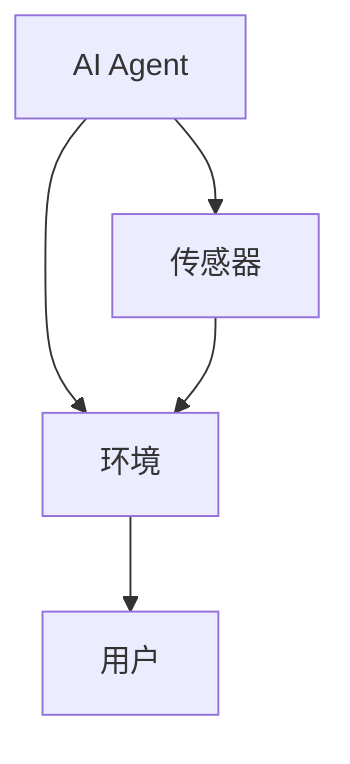
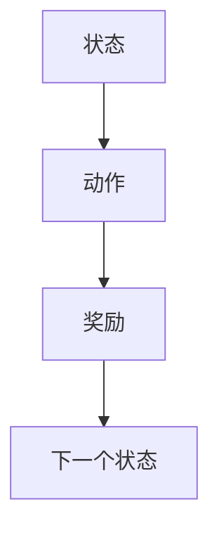
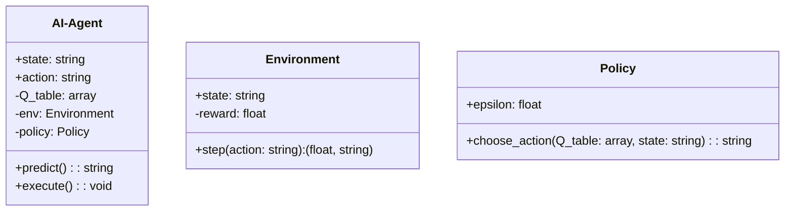
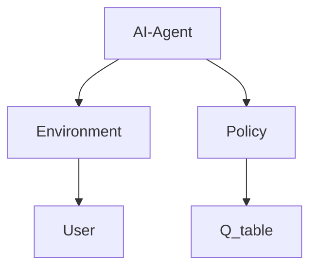
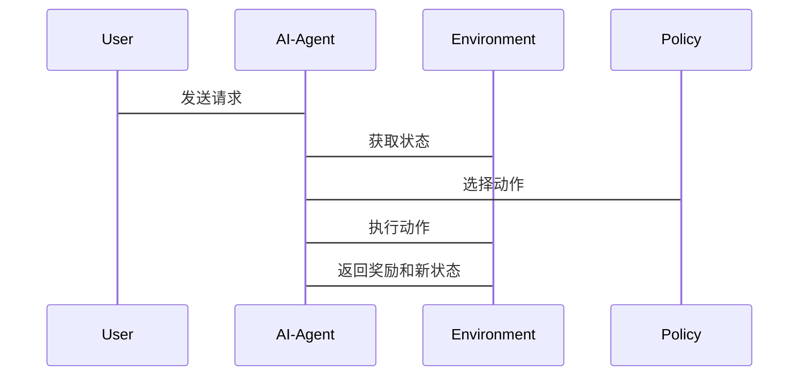

                 


# AI Agent的部署与扩展性考虑

---

## 关键词：
AI Agent, 部署, 扩展性, 算法原理, 系统架构, 项目实战

---

## 摘要：
本文围绕AI Agent的部署与扩展性展开，从概念、算法、系统架构到实际项目，全面探讨如何高效部署和扩展AI Agent。通过详细分析核心概念、算法原理、系统设计与实现，结合实际案例，为读者提供从理论到实践的完整指南。

---

# 第一部分: AI Agent的背景与概念

## 第1章: AI Agent的基本概念

### 1.1 AI Agent的定义与特点
AI Agent是一种智能代理，能够感知环境、自主决策并执行任务。其特点包括自主性、反应性、目标导向和社会性。

### 1.2 AI Agent的分类与应用场景
AI Agent可分为简单反射型、基于模型的反应型、目标驱动型和效用驱动型。应用场景包括推荐系统、自动驾驶、智能客服等。

### 1.3 AI Agent与传统自动化系统的区别
AI Agent具备自主决策能力，能够处理不确定性，而传统系统依赖预设规则。

---

## 第2章: AI Agent的部署背景

### 2.1 当前AI技术的发展趋势
AI技术广泛应用于各个领域，推动自动化和智能化发展。

### 2.2 AI Agent在企业中的需求
企业通过部署AI Agent提高效率、降低成本，并提升用户体验。

### 2.3 部署挑战与机遇
挑战包括数据依赖性、计算资源需求和复杂性；机遇则在于智能化升级和效率提升。

---

## 第3章: 问题描述与目标

### 3.1 AI Agent部署的核心问题
如何在复杂环境中高效部署AI Agent，并确保其可扩展性。

### 3.2 扩展性考虑的必要性
扩展性确保AI Agent能够应对更大的负载和更复杂的需求。

### 3.3 研究目标与范围
目标是探讨AI Agent的部署方法和扩展性设计，范围涵盖算法优化、系统架构和实际应用。

---

# 第二部分: AI Agent的核心概念与原理

## 第4章: AI Agent的核心概念与联系

### 4.1 AI Agent的核心原理
AI Agent通过感知环境、制定决策并执行动作完成任务。

### 4.2 核心要素对比
| 核心要素 | 特点 | 示例 |
|----------|------|------|
| 感知层 | 数据采集与处理 | 使用传感器获取环境数据 |
| 决策层 | 策略制定与优化 | 利用强化学习优化策略 |
| 执行层 | 动作输出与反馈 | 控制机器人执行动作 |

### 4.3 实体关系图


---

## 第5章: AI Agent的算法原理

### 5.1 强化学习算法
#### 5.1.1 Q-learning算法流程

代码示例：
```python
def q_learning():
    import numpy as np
    np.random.seed(1)
    # 初始化Q表
    Q = np.zeros([state_space, action_space])
    # 参数设置
    learning_rate = 0.1
    discount_factor = 0.9
    # 训练过程
    for episode in range(episodes):
        state = initial_state()
        while not done:
            # 选择动作
            action = choose_action(Q, state)
            # 执行动作，获取奖励和下一个状态
            reward, next_state = env.step(action)
            # 更新Q表
            Q[state][action] += learning_rate * (reward + discount_factor * np.max(Q[next_state]))
```

---

## 第6章: 数学模型与公式

### 6.1 Q-learning的数学模型
$$ Q(s, a) = r + \gamma \max_{a'} Q(s', a') $$
其中，$s$为当前状态，$a$为动作，$r$为奖励，$\gamma$为折扣因子。

---

# 第三部分: AI Agent的系统架构与设计

## 第7章: 系统分析与架构设计方案

### 7.1 问题场景介绍
部署AI Agent用于智能客服系统，需要处理大量用户请求并提供个性化服务。

### 7.2 系统功能设计


### 7.3 系统架构设计


### 7.4 接口设计与交互


---

## 第8章: 项目实战

### 8.1 环境安装
```bash
pip install numpy gym
```

### 8.2 系统核心实现
```python
class AI-Agent:
    def __init__(self, state_space, action_space):
        self.Q_table = np.zeros([state_space, action_space])
        self.epsilon = 0.1
        self.learning_rate = 0.1
        self.discount_factor = 0.9

    def choose_action(self, state):
        if np.random.random() < self.epsilon:
            return np.random.randint(0, self.action_space)
        else:
            return np.argmax(self.Q_table[state])

    def learn(self, state, action, reward, next_state):
        self.Q_table[state][action] += self.learning_rate * (reward + self.discount_factor * np.max(self.Q_table[next_state]) - self.Q_table[state][action])
```

### 8.3 案例分析与优化
通过训练AI Agent在迷宫中的导航任务，验证算法的有效性和扩展性。

---

## 第9章: 最佳实践与总结

### 9.1 最佳实践
- **模块化设计**：确保系统各部分独立可扩展。
- **监控与日志**：实时监控系统状态，及时发现和解决问题。
- **持续优化**：定期更新模型，提升性能和用户体验。

### 9.2 小结
本文从概念、算法、系统架构到项目实战，全面探讨了AI Agent的部署与扩展性，为实际应用提供了理论支持和实践指导。

### 9.3 注意事项
- 确保数据质量和多样性，避免过拟合。
- 合理配置计算资源，保证系统性能。
- 定期维护和更新模型，适应环境变化。

### 9.4 拓展阅读
推荐阅读《强化学习入门》和《分布式系统设计》，深入了解AI Agent的算法优化和系统架构设计。

---

# 结语
通过本文的系统性分析和实践，读者可以全面掌握AI Agent的部署与扩展性考虑，为实际应用打下坚实基础。

