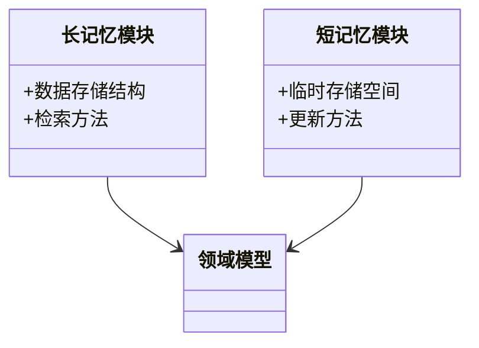
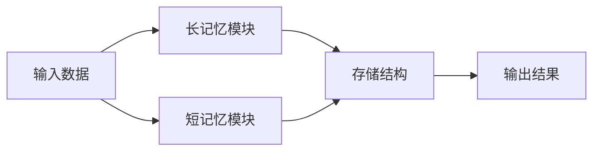
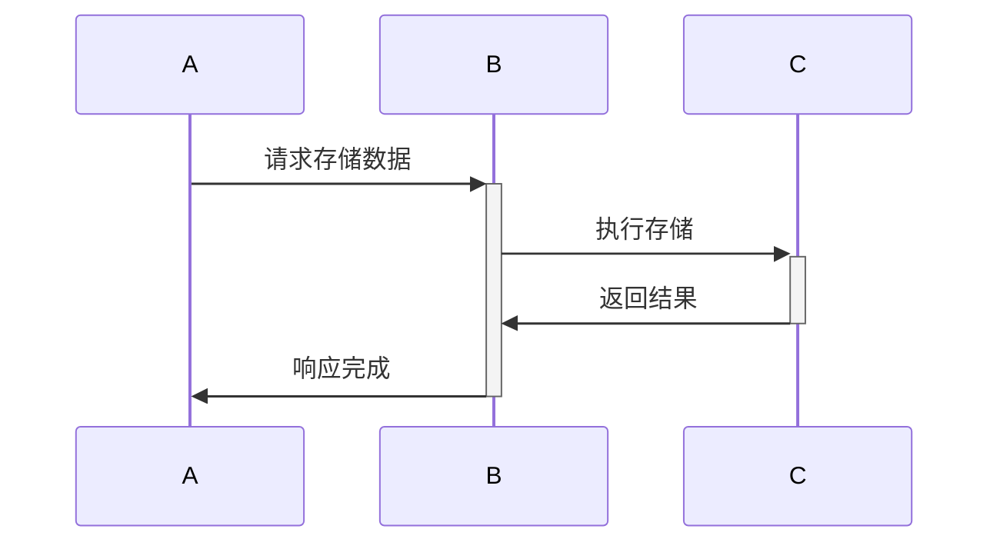

                 


# AI Agent的长短期记忆管理

## 关键词：AI Agent、长短期记忆、记忆管理、智能体设计、记忆模型

## 摘要：本文将详细探讨AI Agent的长短期记忆管理，从基本概念到算法实现，再到系统架构设计和项目实战，系统地分析记忆管理在智能体中的重要性及其应用。

---

# 第1章: 长短期记忆管理概述

## 1.1 长短期记忆管理的基本概念

### 1.1.1 什么是长短期记忆
长短期记忆（Long Term Memory, 短期记忆（Short Term Memory）是AI Agent处理信息的两个关键部分。长记忆用于存储长期的知识和经验，而短记忆则处理当前任务的相关信息。

### 1.1.2 长短期记忆在AI Agent中的作用
长记忆确保智能体能够积累经验，而短记忆帮助处理当前任务，两者结合使智能体具备更强的智能水平。

### 1.1.3 长短期记忆的特征与区别
- **长记忆**：持久性、稳定性、累积性
- **短记忆**：临时性、快速更新、容量有限

---

## 1.2 AI Agent的背景与问题背景

### 1.2.1 AI Agent的基本概念
AI Agent是智能体，能够感知环境并执行任务。

### 1.2.2 长短期记忆管理的问题背景
智能体需要处理复杂任务，长短期记忆管理是其高效运作的关键。

### 1.2.3 问题的边界与外延
记忆管理涉及数据存储、检索和更新，需确保信息的有效性和高效性。

---

## 1.3 长短期记忆管理的核心要素

### 1.3.1 核心概念与属性
- 输入数据
- 记忆模块
- 输出结果

### 1.3.2 长短期记忆的结构与组成
- 长记忆模块
- 短记忆模块

### 1.3.3 核心要素的对比分析
| 特性 | 长记忆 | 短记忆 |
|------|--------|--------|
| 持久性 | 高     | 低     |
| 容量   | 大     | 有限   |

---

## 1.4 本章小结
本章介绍了长短期记忆的基本概念和在AI Agent中的作用，分析了核心要素及其区别。

---

# 第2章: 长短期记忆管理的核心概念与联系

## 2.1 长短期记忆管理的模型结构

### 2.1.1 模型的基本结构
长记忆和短记忆模块共同作用，处理输入数据，输出结果。

### 2.1.2 核心组件与功能
- 数据输入：感知环境
- 记忆模块：存储和检索
- 输出结果：智能体决策

### 2.1.3 模型的输入输出关系
$$ \text{输入数据} \rightarrow \text{记忆模块} \rightarrow \text{输出结果} $$

---

## 2.2 实体关系图

### 2.2.1 ER实体关系图
```mermaid
graph LR
A[长记忆] --> B[记忆管理模块]
C[短记忆] --> B
D[输入数据] --> B
E[输出结果] <-- B
```

---

## 2.3 本章小结
本章通过模型结构和实体关系图，详细分析了长短期记忆管理的核心概念及其联系。

---

# 第3章: 长短期记忆管理的算法实现

## 3.1 长记忆存储与检索算法

### 3.1.1 长记忆存储的流程
$$ \text{数据输入} \rightarrow \text{存储结构} \rightarrow \text{存储结果} $$

### 3.1.2 算法代码实现
```python
def long_memory_store(data):
    # 数据存储逻辑
```

### 3.1.3 算法的数学模型
$$ \text{存储结构} = f(\text{数据输入}) $$

---

## 3.2 短记忆更新与清空算法

### 3.2.1 短记忆更新流程
$$ \text{新数据} \rightarrow \text{短记忆模块} \rightarrow \text{更新结果} $$

### 3.2.2 算法代码实现
```python
def short_memory_update(new_data):
    # 短记忆更新逻辑
```

---

## 3.3 本章小结
本章详细讲解了长短期记忆的存储和检索算法，通过代码示例和数学模型分析了其实现过程。

---

# 第4章: 长短期记忆管理的系统分析与架构设计

## 4.1 系统功能设计

### 4.1.1 领域模型


---

## 4.2 系统架构设计

### 4.2.1 系统架构图


---

## 4.3 接口设计与交互流程

### 4.3.1 系统接口
- 长记忆接口：存储、检索
- 短记忆接口：更新、清空

### 4.3.2 交互流程


---

## 4.4 本章小结
本章分析了长短期记忆管理的系统功能和架构设计，展示了其在实际系统中的应用。

---

# 第5章: 长短期记忆管理的项目实战

## 5.1 项目背景与目标

### 5.1.1 项目背景
智能体需要高效处理信息，提升任务执行效率。

### 5.1.2 项目目标
实现长短期记忆管理，优化智能体性能。

---

## 5.2 环境安装与配置

### 5.2.1 环境要求
- Python 3.8+
- 相关库安装：numpy, matplotlib

---

## 5.3 核心代码实现

### 5.3.1 长记忆模块实现
```python
class LongMemory:
    def __init__(self):
        self.storage = {}

    def store(self, key, value):
        self.storage[key] = value

    def retrieve(self, key):
        return self.storage.get(key, None)
```

### 5.3.2 短记忆模块实现
```python
class ShortMemory:
    def __init__(self, capacity=10):
        self.memories = {}
        self.capacity = capacity

    def update(self, key, value):
        self.memories[key] = value

    def clear(self):
        self.memories = {}
```

---

## 5.4 项目小结
本章通过实际项目，展示了长短期记忆管理的实现过程，帮助读者理解其应用。

---

# 第6章: 长短期记忆管理的最佳实践与小结

## 6.1 最佳实践

### 6.1.1 设计原则
- 明确长短期记忆的界限
- 定期清理无效数据
- 优化检索算法

### 6.1.2 实现技巧
- 使用高效数据结构
- 定期测试和优化

---

## 6.2 本章小结
本文系统地探讨了长短期记忆管理在AI Agent中的应用，提供了理论支持和实践指导。

---

## 总结

通过本文的详细讲解，读者可以全面理解AI Agent的长短期记忆管理，从理论到实践，掌握其实现和优化技巧。

---

## 致谢

感谢读者的耐心阅读，希望本文能为AI Agent的研究和实践提供有价值的参考。

