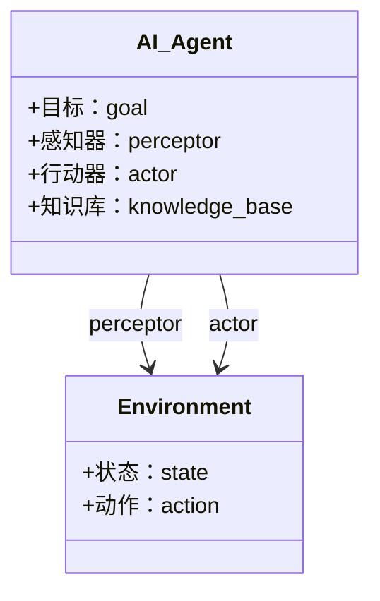

                 


# AI Agent的零样本学习能力开发

> **关键词**：零样本学习、AI Agent、生成对抗网络、对比学习、系统架构设计

> **摘要**：本文详细探讨了AI Agent的零样本学习能力开发，从理论基础到实际应用，结合算法原理和系统架构设计，为开发者提供全面的指导。

---

# 第1章：AI Agent与零样本学习概述

## 1.1 零样本学习的定义与背景

### 1.1.1 零样本学习的定义

零样本学习（Zero-shot Learning）是一种机器学习范式，允许模型在没有特定类别标签的情况下识别和分类新样本。它通过利用领域知识或外部知识库来推断新样本的类别。

### 1.1.2 零样本学习的背景与重要性

随着AI应用的扩展，数据获取变得越来越困难，特别是在数据稀疏领域。零样本学习在这些场景中尤为重要，因为它能够利用现有数据推断新任务。

### 1.1.3 零样本学习与AI Agent的结合

AI Agent需要在复杂环境中自主决策，零样本学习使其能够在新任务中快速适应，无需额外的训练数据。

## 1.2 AI Agent的基本概念

### 1.2.1 AI Agent的定义

AI Agent是一个能够感知环境、采取行动以实现目标的实体，可能是软件程序或其他自动化系统。

### 1.2.2 AI Agent的核心特点

- **自主性**：无需外部干预
- **反应性**：能感知并响应环境变化
- **目标导向**：行动基于明确的目标

### 1.2.3 AI Agent的应用场景

- **智能助手**：如Siri、Alexa
- **自动驾驶**：车辆实时决策
- **推荐系统**：个性化内容推荐

---

# 第2章：零样本学习的核心原理

## 2.1 零样本学习的原理

### 2.1.1 零样本学习的基本原理

零样本学习通过利用共享特征或语义信息，将新样本映射到已知类别，从而进行分类。

### 2.1.2 零样本学习的关键技术

- **生成模型**：如GAN，生成合成样本以扩展训练数据。
- **对比学习**：通过对比损失函数，学习样本之间的相似性。

## 2.2 零样本学习的算法与模型

### 2.2.1 基于生成模型的零样本学习

使用生成对抗网络（GAN）生成合成样本，扩展训练数据集。

### 2.2.2 基于对比学习的零样本学习

通过对比损失函数，学习样本的特征表示，使其在不同类别之间具有区分性。

---

# 第3章：零样本学习的算法原理与实现

## 3.1 零样本学习的数学模型

### 3.1.1 生成对抗网络的损失函数

$$\mathcal{L}_{\text{GAN}} = \mathcal{L}_{\text{D}} + \mathcal{L}_{\text{G}}$$

其中，$\mathcal{L}_{\text{D}}$是判别器的损失，$\mathcal{L}_{\text{G}}$是生成器的损失。

### 3.1.2 对比学习的相似度计算

$$s(x, y) = \frac{e^{d(x, y)}}{e^{d(x, y)} + e^{d(x, y')}}$$

其中，$d(x, y)$是样本$x$和$y$之间的距离。

## 3.2 零样本学习的算法实现

### 3.2.1 GAN的实现代码示例

```python
import torch

# 定义判别器
class Discriminator(nn.Module):
    def __init__(self):
        super().__init__()
        self.fc1 = nn.Linear(100, 50)
        self.fc2 = nn.Linear(50, 1)

    def forward(self, x):
        x = torch.relu(self.fc1(x))
        x = torch.sigmoid(self.fc2(x))
        return x

# 定义生成器
class Generator(nn.Module):
    def __init__(self):
        super().__init__()
        self.fc1 = nn.Linear(100, 50)
        self.fc2 = nn.Linear(50, 10)

    def forward(self, x):
        x = torch.relu(self.fc1(x))
        x = torch.tanh(self.fc2(x))
        return x
```

---

# 第4章：AI Agent的系统架构设计

## 4.1 系统功能设计

### 4.1.1 领域模型类图



### 4.1.2 系统架构设计图


---

# 第5章：项目实战

## 5.1 项目介绍

### 5.1.1 项目环境安装

```bash
pip install torch
pip install matplotlib
```

### 5.1.2 代码实现

```python
import torch
import torch.nn as nn
import torch.optim as optim

# 定义判别器和生成器
discriminator = Discriminator()
generator = Generator()

# 定义损失函数和优化器
criterion = nn.BCELoss()
d_optimizer = optim.Adam(discriminator.parameters(), lr=0.002)
g_optimizer = optim.Adam(generator.parameters(), lr=0.002)

# 训练循环
for epoch in range(100):
    for _ in range(200):
        # 训练判别器
        discriminator.zero_grad()
        real_data = torch.randn(100, 10)
        fake_data = generator(torch.randn(100, 100)).detach()
        d_real = discriminator(real_data)
        d_fake = discriminator(fake_data)
        d_loss = criterion(d_real, torch.ones_like(d_real)) + criterion(d_fake, torch.zeros_like(d_fake))
        d_loss.backward()
        d_optimizer.step()

        # 训练生成器
        generator.zero_grad()
        fake_data = generator(torch.randn(100, 100))
        g_loss = criterion(discriminator(fake_data), torch.ones_like(d_real))
        g_loss.backward()
        g_optimizer.step()
```

### 5.1.3 代码应用解读

上述代码展示了如何训练GAN模型，生成器和判别器交替优化，最终生成符合要求的样本。

---

# 第6章：最佳实践与总结

## 6.1 小结

零样本学习为AI Agent提供了强大的能力，能够在数据稀疏的环境中有效工作。通过生成模型和对比学习，可以显著提升模型的泛化能力。

## 6.2 注意事项

- 数据质量：确保输入数据的准确性和代表性。
- 模型调优：合理选择超参数，避免过拟合。
- 实际应用：根据具体场景调整模型结构。

## 6.3 拓展阅读

- 《生成对抗网络：算法与实现》
- 《对比学习：原理与应用》

---

通过以上结构，文章详细探讨了AI Agent的零样本学习能力开发，从理论到实践，为开发者提供了全面的指导。

