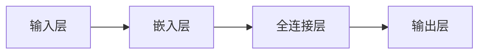
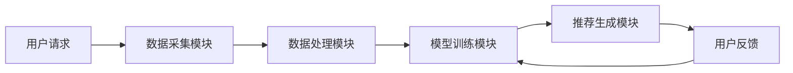

                 


# AI Agent辅助企业产品推荐与个性化服务

> 关键词：AI Agent, 个性化推荐, 企业服务, 算法, 系统架构

> 摘要：本文探讨了AI Agent在企业产品推荐与个性化服务中的应用，详细分析了其核心概念、算法原理、系统架构，并通过实际案例展示了如何利用AI Agent提升企业推荐系统的效率和准确性。

---

# 第一部分: AI Agent与企业产品推荐概述

## 第1章: AI Agent的基本概念

### 1.1 AI Agent的定义与特点

AI Agent（人工智能代理）是一种能够感知环境并采取行动以实现目标的智能实体。其核心特点包括：

- **自主性**：能够在没有外部干预的情况下运行。
- **反应性**：能够实时感知环境变化并做出响应。
- **目标导向性**：通过目标驱动进行决策和行动。
- **学习能力**：能够通过数据和经验不断优化自身行为。

### 1.2 AI Agent在企业中的作用

AI Agent在企业中的应用广泛，特别是在产品推荐和个性化服务方面：

- **数据处理与分析**：AI Agent能够快速处理大量数据，提取有价值的信息。
- **实时决策**：通过实时分析用户行为和市场动态，提供即时的推荐服务。
- **优化策略**：通过不断学习和优化推荐算法，提升推荐的准确性和用户满意度。

### 1.3 AI Agent与传统推荐系统的区别

传统推荐系统通常基于静态数据和规则，而AI Agent推荐系统具有以下优势：

| 特性          | 传统推荐系统            | AI Agent推荐系统            |
|---------------|-------------------------|-----------------------------|
| 数据来源      | 主要依赖历史数据        | 结合历史数据与实时数据      |
| 决策方式      | 基于固定规则            | 基于动态学习与优化          |
| 灵活性        | 较低                    | 较高                        |
| 适应性        | 较差                    | 较强                        |

---

## 第2章: 企业产品推荐的背景与挑战

### 2.1 传统推荐系统的问题与局限

传统推荐系统在实际应用中面临诸多挑战：

- **数据稀疏性**：用户数据不足导致推荐结果不够精准。
- **冷启动问题**：新用户或新产品的推荐困难。
- **计算效率**：大规模数据处理需要较高的计算资源。

### 2.2 AI Agent在推荐系统中的优势

AI Agent通过引入动态学习和实时反馈，解决了传统推荐系统的问题：

- **动态适应性**：能够根据实时数据调整推荐策略。
- **个性化深度**：通过深度学习模型，提供更个性化的推荐。
- **高效性**：利用分布式计算和优化算法，提升推荐效率。

### 2.3 个性化服务对企业价值的影响

个性化服务能够显著提升用户体验和企业竞争力：

- **用户满意度**：通过精准推荐，提升用户购买意愿。
- **客户忠诚度**：个性化服务增强用户对品牌的忠诚度。
- **市场响应速度**：快速适应市场变化，抓住商机。

---

# 第二部分: AI Agent的核心算法与数学模型

## 第3章: 协同过滤算法

### 3.1 协同过滤的基本原理

协同过滤是一种基于用户相似性或物品相似性的推荐方法。其基本流程如下：

1. **构建用户-物品评分矩阵**：收集用户对物品的评分数据。
2. **计算相似度**：通过余弦相似度或皮尔逊相关系数计算用户或物品之间的相似度。
3. **生成推荐**：基于相似用户或物品的评分，预测目标用户的偏好。

### 3.2 协同过滤的数学模型

协同过滤的核心公式是相似度计算：

$$ \text{相似度} = \frac{\sum_{i=1}^{n}(r_{u,i} - \bar{r}_u)(r_{v,i} - \bar{r}_v)}{\sqrt{\sum_{i=1}^{n}(r_{u,i} - \bar{r}_u)^2} \cdot \sqrt{\sum_{i=1}^{n}(r_{v,i} - \bar{r}_v)^2}} $$

其中，$r_{u,i}$表示用户$u$对物品$i$的评分，$\bar{r}_u$是用户$u$的平均评分。

### 3.3 协同过滤的优化与改进

为了提升协同过滤的效率和准确性，可以采用以下方法：

1. **基于矩阵分解的优化**：使用SVD（奇异值分解）等方法对评分矩阵进行降维。
2. **基于隐式反馈的改进**：利用用户行为数据（如点击、浏览）生成隐式反馈。
3. **基于深度学习的协同过滤**：结合神经网络进行推荐。

---

## 第4章: 深度学习算法在推荐系统中的应用

### 4.1 基于神经网络的推荐模型

深度学习模型在推荐系统中的应用越来越广泛，常见的模型包括：

- **深度神经网络（DNN）**：通过多层神经网络提取高维特征。
- **注意力机制（Attention）**：在序列推荐中，关注用户的最近行为。
- **生成对抗网络（GAN）**：用于生成多样化的推荐内容。

### 4.2 基于深度学习的推荐模型结构

以下是一个简单的DNN推荐模型结构图：



---

# 第三部分: AI Agent的系统架构与实现

## 第5章: 系统架构设计

### 5.1 系统功能模块划分

一个典型的AI Agent推荐系统架构包括以下模块：

- **数据采集模块**：负责收集用户行为数据和产品信息。
- **数据处理模块**：对数据进行清洗、转换和预处理。
- **模型训练模块**：基于数据训练推荐模型。
- **推荐生成模块**：根据模型输出生成推荐结果。
- **反馈收集模块**：收集用户对推荐的反馈，用于模型优化。

### 5.2 系统架构设计图

以下是一个AI Agent推荐系统的架构图：



---

## 第6章: 项目实战

### 6.1 环境安装

推荐系统开发所需的环境包括：

- **编程语言**：Python 3.8+
- **深度学习框架**：TensorFlow或PyTorch
- **数据处理工具**：Pandas、NumPy
- **开发框架**：Flask或Django

### 6.2 核心代码实现

以下是一个简单的协同过滤算法实现：

```python
import numpy as np

def calculate_similarity(matrix, user_id):
    user_ratings = matrix[user_id]
    mean_rating = np.mean(user_ratings)
    normalized_ratings = user_ratings - mean_rating
    similarity = np.dot(normalized_ratings, normalized_ratings.T)
    return similarity

# 示例数据矩阵
ratings = np.array([[4, 3, 0],
                     [2, 0, 0],
                     [1, 5, 0]])

similarity = calculate_similarity(ratings, 0)
print(similarity)
```

### 6.3 案例分析

假设我们有一个电影推荐系统，用户A喜欢动作和科幻电影，系统会根据其他用户的偏好推荐类似的电影。

---

## 第7章: 最佳实践

### 7.1 小结

本文详细介绍了AI Agent在企业产品推荐中的应用，从基本概念到算法实现，再到系统架构，为读者提供了一个全面的视角。

### 7.2 注意事项

- **数据隐私**：在处理用户数据时，必须遵守相关法律法规，保护用户隐私。
- **模型优化**：定期更新模型，避免过时数据影响推荐效果。
- **用户体验**：推荐结果需简洁明了，避免过度复杂。

### 7.3 拓展阅读

- **《推荐系统实战》**：深入讲解推荐系统的设计与实现。
- **《深度学习导论》**：了解深度学习的基本原理和应用。

---

通过以上内容，我们详细探讨了AI Agent在企业产品推荐与个性化服务中的应用，从理论到实践，为读者提供了系统的知识和实用的代码示例。

