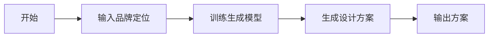
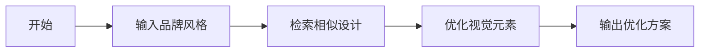
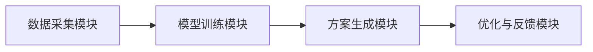

                 


# AI Agent辅助企业品牌形象设计与管理

> 关键词：AI Agent, 企业品牌管理, 自然语言处理, 机器学习, 品牌设计

> 摘要：本文详细探讨了AI Agent在企业品牌形象设计与管理中的应用。通过分析AI Agent的核心原理，结合自然语言处理和机器学习技术，展示了其在品牌设计中的优势。文章还提供了系统架构设计和项目实战案例，帮助读者理解如何将AI Agent应用于实际品牌管理中。

---

## 第1章 AI Agent与企业品牌管理概述

### 1.1 AI Agent的定义与核心概念

AI Agent，即人工智能代理，是一种能够感知环境并采取行动以实现目标的智能系统。在企业品牌管理中，AI Agent可以辅助完成从品牌定位到设计优化的全过程。

#### 1.1.1 AI Agent的基本定义
AI Agent通过传感器或数据输入感知环境，利用算法处理信息，并通过执行器或输出模块采取行动。其核心在于理解需求、分析数据、生成解决方案并提供反馈。

#### 1.1.2 AI Agent在企业品牌管理中的作用
AI Agent可以辅助品牌定位、设计视觉元素、优化广告文案、监测品牌声誉等。它通过数据驱动的方法，提供更精准和高效的解决方案。

#### 1.1.3 企业品牌管理的传统方法与AI Agent的结合
传统方法依赖人工经验，效率低且成本高。AI Agent通过自动化处理，提高了效率和准确性，同时保留了人类的创造性和灵活性。

### 1.2 企业品牌形象设计与管理的背景

#### 1.2.1 品牌形象的重要性
品牌形象是企业在市场中的标识，影响消费者认知和购买决策。一个成功的品牌形象能够提升品牌价值和市场竞争力。

#### 1.2.2 传统品牌设计与管理的挑战
传统设计依赖设计师的经验，存在效率低、成本高、难以量化等问题。同时，市场变化快，需要快速调整品牌策略。

#### 1.2.3 AI Agent在品牌设计中的优势
AI Agent能够快速分析大量数据，生成多种设计方案，提供实时反馈，优化设计效果，显著提高效率和决策质量。

### 1.3 本章小结
本章介绍了AI Agent的基本概念和其在企业品牌管理中的作用，指出了传统方法的局限性和AI Agent的优势，为后续内容奠定了基础。

---

## 第2章 AI Agent的核心原理

### 2.1 自然语言处理（NLP）在AI Agent中的应用

#### 2.1.1 NLP的基本概念
NLP是研究人机交互中自然语言处理的理论和方法，包括文本理解、生成和翻译等。在品牌设计中，NLP用于分析品牌定位、目标客户群体等文本信息。

#### 2.1.2 NLP在品牌设计中的具体应用
- **品牌定位分析**：通过分析市场数据和客户反馈，提取关键词和主题，帮助确定品牌定位。
- **文案生成**：根据品牌调性生成广告文案、标语等。

#### 2.1.3 NLP与品牌设计的关系
NLP帮助AI Agent理解品牌相关的文本信息，生成符合品牌调性的设计方案。

### 2.2 机器学习与深度学习在AI Agent中的作用

#### 2.2.1 机器学习的基本原理
机器学习通过数据训练模型，使其能够从数据中学习规律，并用于预测或分类。在品牌设计中，机器学习可以用于推荐设计元素、预测设计方案的受欢迎程度。

#### 2.2.2 深度学习在品牌设计中的应用
深度学习，特别是卷积神经网络（CNN）和生成对抗网络（GAN），在图像生成和风格迁移方面表现优异。例如，GAN可以生成符合品牌风格的标志设计。

### 2.3 AI Agent的决策机制

#### 2.3.1 基于规则的决策
基于预定义的规则进行决策，如优先选择红色作为主色调。这种方法简单，但缺乏灵活性。

#### 2.3.2 基于模型的决策
利用训练好的模型进行决策，如使用分类模型预测客户偏好。这种方法更灵活，但需要大量数据支持。

#### 2.3.3 基于反馈的优化
通过用户反馈不断优化决策模型，如调整广告文案以提高点击率。这种方法能够实时适应市场变化。

### 2.4 本章小结
本章详细介绍了NLP和机器学习在AI Agent中的应用，解释了AI Agent的决策机制，为后续算法实现奠定了基础。

---

## 第3章 AI Agent辅助品牌设计的算法与实现

### 3.1 基于生成模型的品牌设计

#### 3.1.1 生成模型的基本原理
生成模型（如GAN）通过对抗训练生成逼真的数据。在品牌设计中，生成模型可以用于生成品牌标志和视觉元素。

#### 3.1.2 使用生成模型设计品牌名称和标语
通过训练一个生成模型，输入品牌定位和行业信息，生成多个品牌名称和标语供选择。

### 3.2 基于检索模型的品牌设计

#### 3.2.1 检索模型的基本原理
检索模型（如BM25）通过关键词匹配从数据库中检索相关信息。在品牌设计中，检索模型可以用于优化视觉元素的匹配度。

#### 3.2.2 使用检索模型优化品牌视觉元素
根据品牌风格检索相似的设计元素，优化标志设计。

### 3.3 算法实现的流程图

#### 3.3.1 生成模型的流程图



#### 3.3.2 检索模型的流程图



### 3.4 本章小结
本章介绍了生成模型和检索模型的算法原理，并通过流程图展示了其在品牌设计中的应用，帮助读者理解AI Agent如何实现设计方案生成。

---

## 第4章 系统架构设计

### 4.1 系统功能模块划分

#### 4.1.1 数据采集模块
负责收集市场趋势、竞争对手信息等数据，为后续分析提供基础。

#### 4.1.2 模型训练模块
利用收集的数据训练生成和检索模型，确保模型具有高精度和效率。

#### 4.1.3 方案生成模块
根据输入的品牌需求，生成多个设计方案供选择。

#### 4.1.4 优化与反馈模块
根据用户反馈优化设计方案，调整模型参数，提高设计质量。

### 4.2 系统架构图



### 4.3 系统接口设计

#### 4.3.1 输入接口
- **品牌定位**：品牌的核心价值、目标客户等。
- **设计要求**：颜色、字体等视觉元素。

#### 4.3.2 输出接口
- **设计方案**：生成的品牌名称、标志等。
- **反馈接口**：用户反馈用于模型优化。

### 4.4 本章小结
本章详细描述了系统的功能模块、架构设计和接口设计，展示了AI Agent在企业品牌管理中的整体架构。

---

## 第5章 项目实战

### 5.1 环境安装与配置

#### 5.1.1 安装Python
```bash
python --version
pip install --upgrade pip
```

#### 5.1.2 安装深度学习库
```bash
pip install tensorflow-gpu==2.5.0
pip install numpy==1.21.0
pip install pillow==10.0.0
```

#### 5.1.3 安装NLP库
```bash
pip install transformers==4.9.0
pip install spacy==3.3.1
```

### 5.2 核心代码实现

#### 5.2.1 生成模型实现

```python
import tensorflow as tf
from tensorflow.keras.layers import Dense, InputLayer, Input
from tensorflow.keras.models import Model

# 定义生成器模型
def build_generator():
    input = Input(shape=(100,))
    x = Dense(256, activation='relu')(input)
    x = Dense(128, activation='relu')(x)
    output = Dense(2, activation='sigmoid')(x)
    model = Model(inputs=input, outputs=output)
    return model

# 定义判别器模型
def build_discriminator():
    input = Input(shape=(2,))
    x = Dense(128, activation='relu')(input)
    output = Dense(1, activation='sigmoid')(x)
    model = Model(inputs=input, outputs=output)
    return model

# 初始化模型
generator = build_generator()
discriminator = build_discriminator()
```

#### 5.2.2 数据预处理

```python
import numpy as np

# 生成随机噪声
noise = np.random.randn(100, 100)

# 生成真实数据（示例）
real_data = np.random.randn(100, 2)
```

#### 5.2.3 训练模型

```python
# 编译模型
generator.compile(optimizer='adam', loss='binary_crossentropy')
discriminator.compile(optimizer='adam', loss='binary_crossentropy')

# 训练过程
for _ in range(1000):
    # 生成假数据
    noise = np.random.randn(100, 100)
    fake_data = generator.predict(noise)
    
    # 训练判别器
    discriminator.trainable = True
    d_loss = discriminator.train_on_batch(fake_data, np.zeros((100, 1)))
    d_loss_real = discriminator.train_on_batch(real_data, np.ones((100, 1)))
    discriminator.trainable = False
    
    # 训练生成器
    g_loss = generator.train_on_batch(noise, np.ones((100, 1)))
```

### 5.3 项目实战案例

#### 5.3.1 案例背景
假设我们为一家科技公司设计新品牌，目标客户是年轻科技爱好者，品牌定位为“创新、前沿”。

#### 5.3.2 实施步骤
1. **数据采集**：收集科技行业品牌信息，包括竞争对手的标志、颜色、字体等。
2. **模型训练**：使用上述代码训练生成模型。
3. **方案生成**：输入品牌定位，生成多个品牌名称和标志设计。
4. **优化与反馈**：根据用户反馈调整模型，优化设计方案。

#### 5.3.3 实际效果
生成的品牌名称如“TechNova”，标志设计采用蓝色渐变背景，白色简洁字体，传达创新和现代感。

### 5.4 本章小结
本章通过具体案例展示了AI Agent在品牌设计中的实际应用，详细说明了环境配置、代码实现和效果展示，帮助读者理解理论与实践的结合。

---

## 第6章 最佳实践与注意事项

### 6.1 最佳实践

#### 6.1.1 数据质量的重要性
确保数据的多样性和相关性，避免数据偏见影响设计结果。

#### 6.1.2 模型的泛化能力
在训练过程中，采用数据增强和正则化技术，提升模型的泛化能力。

#### 6.1.3 人类设计师的协作
AI Agent辅助设计，而非完全替代人类设计师。设计师可以进一步优化AI生成的方案。

### 6.2 注意事项

#### 6.2.1 数据隐私
在数据采集和处理过程中，需遵守相关法律法规，保护用户隐私。

#### 6.2.2 模型的可解释性
确保模型决策过程的透明性，便于问题诊断和优化。

#### 6.2.3 持续优化
定期更新模型，适应市场变化和用户需求。

### 6.3 拓展阅读

#### 6.3.1 推荐书籍
- 《Deep Learning》 - Ian Goodfellow
- 《自然语言处理实战》 - 李航

#### 6.3.2 推荐在线课程
- Coursera: Andrew Ng的《Machine Learning》
- edX: MIT的《Introduction to AI》

### 6.4 本章小结
本章总结了使用AI Agent的注意事项和最佳实践，提供了进一步学习的资源，帮助读者更好地应用AI技术于企业品牌管理。

---

## 结语

AI Agent通过结合自然语言处理、机器学习等技术，为企业的品牌形象设计与管理提供了高效、智能的解决方案。随着技术的不断发展，AI Agent将在品牌管理中发挥越来越重要的作用，帮助企业快速适应市场变化，提升品牌价值。

