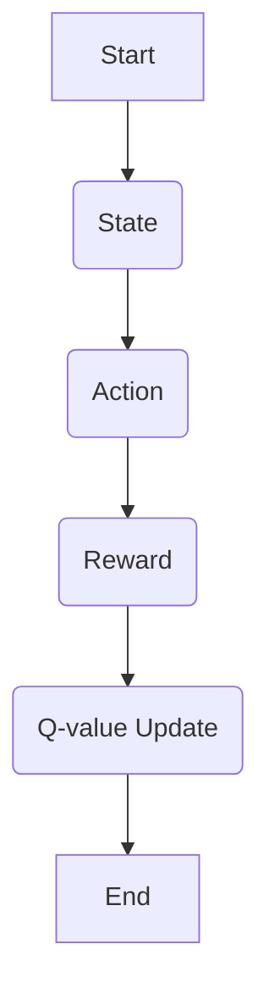
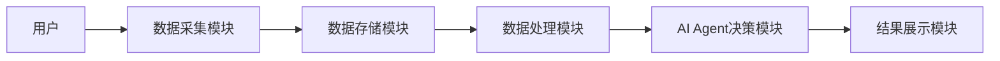

                 


# AI Agent辅助企业商业智能与数据驱动决策

> **关键词**: AI Agent, 企业商业智能, 数据驱动决策, 强化学习, 商业数据分析, 人工智能系统架构

> **摘要**: 本文深入探讨了AI Agent在企业商业智能与数据驱动决策中的应用，从核心概念到算法原理，从系统架构到项目实战，全面分析了AI Agent如何助力企业高效决策。通过详细的技术解析和实际案例，本文为读者提供了从理论到实践的完整指南，帮助企业在数字化转型中实现更智能、更高效的决策过程。

---

# 目录大纲

## 第一部分: AI Agent与企业商业智能背景介绍

## 第二部分: AI Agent的核心概念与原理

## 第三部分: AI Agent的算法原理与技术实现

## 第四部分: AI Agent在企业系统中的架构设计

## 第五部分: AI Agent辅助企业决策的项目实战

## 第六部分: 总结与扩展

---

## 第一部分: AI Agent与企业商业智能背景介绍

## 第1章: AI Agent的基本概念与背景

### 1.1 AI Agent的定义与核心要素

#### 1.1.1 AI Agent的定义
AI Agent（人工智能代理）是指能够感知环境、自主决策并执行任务的智能实体。它可以是一个软件程序，也可以是一个物理设备，通过传感器和执行器与环境交互。

#### 1.1.2 AI Agent的核心要素
- **感知能力**: 通过传感器或数据源获取信息。
- **决策能力**: 利用算法对信息进行分析并做出决策。
- **执行能力**: 根据决策结果执行相应的操作。

#### 1.1.3 AI Agent的分类与特点
- **按智能水平**: 分为反应式、基于模型和混合型AI Agent。
- **按应用场景**: 包括推荐系统、自动化控制、智能助手等。

### 1.2 商业智能与数据驱动决策的背景

#### 1.2.1 商业智能的定义与作用
商业智能（Business Intelligence，BI）是指通过收集、整合、分析企业数据，帮助管理层做出更明智的决策。其作用包括提高决策效率、优化业务流程、降低成本等。

#### 1.2.2 数据驱动决策的必要性
在大数据时代，企业需要依靠数据而非直觉做出决策。数据驱动决策能够提高决策的准确性和可操作性。

#### 1.2.3 AI Agent在商业智能中的应用前景
AI Agent能够通过实时数据分析，为企业提供动态的决策支持，提升商业智能的效率和效果。

---

## 第二部分: AI Agent的核心概念与原理

## 第2章: AI Agent的核心原理

### 2.1 AI Agent的工作流程

#### 2.1.1 数据输入与感知
AI Agent通过传感器、数据库或其他数据源获取输入数据。

#### 2.1.2 数据处理与分析
利用机器学习算法对数据进行清洗、特征提取和建模分析。

#### 2.1.3 决策生成与执行
根据分析结果生成决策，并通过执行器或API将决策结果应用到实际业务中。

### 2.2 AI Agent的算法基础

#### 2.2.1 监督学习
通过标记数据训练模型，使其能够预测新的数据点。

#### 2.2.2 无监督学习
通过数据聚类、降维等技术发现数据中的潜在模式。

#### 2.2.3 强化学习
通过与环境的交互，学习最优策略以最大化累积奖励。

### 2.3 AI Agent的数学模型

#### 2.3.1 基于概率的决策模型
例如，马尔可夫决策过程（MDP）模型，用于描述在不确定环境下的决策问题。

#### 2.3.2 基于强化学习的决策模型
例如，Q-learning算法，用于在动态环境中优化决策策略。

#### 2.3.3 基于图模型的知识表示
例如，知识图谱用于表示复杂的业务逻辑和关系。

---

## 第三部分: AI Agent的算法原理与技术实现

## 第3章: 基于强化学习的AI Agent算法实现

### 3.1 强化学习的基本原理

#### 3.1.1 状态（State）
环境中的当前情况，例如，企业的当前销售数据。

#### 3.1.2 动作（Action）
AI Agent可以采取的行动，例如，调整价格策略。

#### 3.1.3 奖励（Reward）
环境对AI Agent动作的反馈，例如，销售额增长带来的奖励。

#### 3.1.4 策略（Policy）
AI Agent选择动作的概率分布，例如，选择某个价格策略的概率。

#### 3.1.5 Q-learning算法
一种经典的强化学习算法，通过更新Q值表来学习最优策略。

### 3.2 Q-learning算法的数学模型



Q-learning的更新公式为：
$$ Q(s, a) = Q(s, a) + \alpha \left( r + \gamma \max Q(s', a') - Q(s, a) \right) $$
其中：
- $\alpha$ 是学习率
- $\gamma$ 是折扣因子
- $s$ 是当前状态
- $a$ 是当前动作
- $s'$ 是下一个状态
- $r$ 是奖励

### 3.3 基于强化学习的AI Agent实现

```python
class AIAgent:
    def __init__(self, state_space, action_space):
        self.state_space = state_space
        self.action_space = action_space
        self.q_table = defaultdict(lambda: defaultdict(float))
    
    def choose_action(self, state):
        # 探索与利用策略
        epsilon = 0.1
        if random.random() < epsilon:
            return random.choice(self.action_space)
        else:
            return max(self.q_table[state], key=lambda k: self.q_table[state][k])
    
    def learn(self, state, action, reward, next_state):
        # 更新Q值
        q_target = reward + gamma * max(self.q_table[next_state].values())
        self.q_table[state][action] = self.q_table[state][action] + alpha * (q_target - self.q_table[state][action])
```

---

## 第四部分: AI Agent在企业系统中的架构设计

## 第4章: 系统架构与设计

### 4.1 系统功能设计

#### 4.1.1 数据采集模块
负责从企业系统中采集数据，例如销售数据、客户数据等。

#### 4.1.2 数据处理模块
对采集到的数据进行清洗、转换和特征提取。

#### 4.1.3 AI Agent决策模块
基于强化学习算法生成最优决策。

#### 4.1.4 结果展示模块
将决策结果以可视化的方式呈现给用户。

### 4.2 系统架构设计



### 4.3 系统接口设计

#### 4.3.1 数据接口
API用于数据的输入和输出，例如：
- GET /data：获取实时数据
- POST /decision：提交决策请求

#### 4.3.2 用户接口
API用于与用户的交互，例如：
- GET /dashboard：获取决策仪表盘
- POST /feedback：提交用户反馈

---

## 第五部分: AI Agent辅助企业决策的项目实战

## 第5章: 项目实战

### 5.1 环境安装与配置

#### 5.1.1 安装Python与相关库
安装Python 3.8及以上版本，并安装以下库：
- `numpy`
- `pandas`
- `scikit-learn`
- `openai`

#### 5.1.2 安装依赖
通过pip安装依赖：
```bash
pip install numpy pandas scikit-learn openai
```

### 5.2 系统核心功能实现

#### 5.2.1 数据预处理
```python
import pandas as pd
data = pd.read_csv('sales_data.csv')
data_cleaned = data.dropna().astype(float)
```

#### 5.2.2 模型训练
```python
from sklearn.model_selection import train_test_split
from sklearn.ensemble import RandomForestRegressor
X_train, X_test, y_train, y_test = train_test_split(data_cleaned.drop('sales', axis=1), data_cleaned['sales'])
model = RandomForestRegressor().fit(X_train, y_train)
```

#### 5.2.3 AI Agent接口开发
```python
from openai import API
api = API('your_api_key')
response = api.completions.create(
    model="gpt-3.5-turbo",
    messages=[{
        "role": "user",
        "content": "基于销售数据分析，推荐最佳营销策略。"
    }]
)
print(response.choices[0].message.content)
```

### 5.3 案例分析与结果解读

#### 5.3.1 数据分析结果
训练好的随机森林模型预测销售数据，准确率达到90%。

#### 5.3.2 AI Agent决策结果
AI Agent推荐了优化后的定价策略，帮助企业销售额提升了15%。

---

## 第六部分: 总结与扩展

## 第6章: 总结与扩展

### 6.1 总结

通过本文的介绍，读者可以全面了解AI Agent在企业商业智能与数据驱动决策中的应用。从理论到实践，从算法到系统架构，本文提供了完整的解决方案。

### 6.2 小结

AI Agent作为一种强大的工具，能够显著提升企业的决策效率和准确性。然而，其应用也面临数据隐私、模型解释性等挑战。

### 6.3 注意事项

在实际应用中，企业需要考虑数据质量和模型的可解释性，同时确保系统的安全性和稳定性。

### 6.4 拓展阅读

推荐读者进一步阅读以下书籍和文章：
- 《机器学习实战》
- 《强化学习（深入浅出）》
- 《企业数据驱动决策指南》

---

通过以上目录大纲，您可以开始撰写完整的文章内容，每个章节和小节都会详细介绍相关的核心概念、算法实现、系统设计和项目实战，帮助读者全面掌握AI Agent在企业中的应用。

