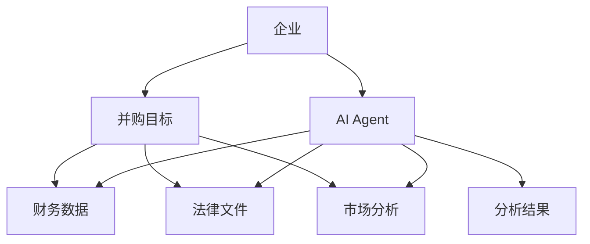
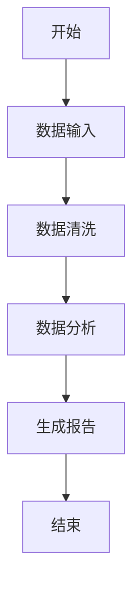
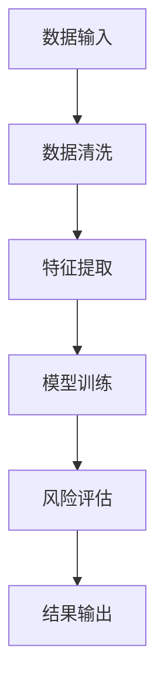
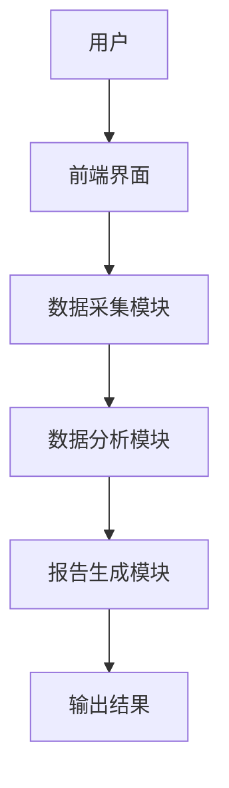

                 

# AI Agent辅助企业并购分析与尽职调查

## 关键词：AI Agent，企业并购，尽职调查，算法原理，系统架构

## 摘要：  
随着企业并购活动的日益复杂化和数据化，AI Agent（人工智能代理）在企业并购分析与尽职调查中的应用逐渐成为焦点。本文深入探讨AI Agent在企业并购中的核心作用，从背景介绍、算法原理到系统架构，再到项目实战，全面解析AI Agent如何辅助企业高效完成并购分析与尽职调查。通过实际案例分析和系统设计，本文为读者提供一份详尽的指导，展示AI Agent在企业并购中的巨大潜力和实际应用价值。

---

## 第一部分: AI Agent辅助企业并购分析与尽职调查的背景与概念

### 第1章: 企业并购与AI Agent的背景介绍

#### 1.1 问题背景与问题描述
企业并购是企业战略发展的重要手段之一，然而，传统的企业并购分析与尽职调查过程存在效率低、成本高、信息不对称等问题。并购涉及大量的数据收集、分析和决策，传统的人工方式容易出错且耗时长。

#### 1.2 AI Agent的核心概念与定义
AI Agent是一种能够感知环境、自主决策并执行任务的智能实体。它能够通过自然语言处理、机器学习等技术，从海量数据中提取有价值的信息，辅助人类完成复杂任务。

#### 1.3 AI Agent在企业并购中的应用前景
AI Agent可以显著提升企业并购的效率和准确性。通过自动化数据收集、分析和报告生成，AI Agent能够帮助企业快速识别并购目标的价值、风险和潜在问题。

### 1.4 本章小结
本章介绍了企业并购的基本概念、AI Agent的核心定义及其在并购中的应用前景，为后续章节的深入探讨奠定了基础。

---

## 第二部分: AI Agent的核心概念与原理

### 第2章: AI Agent的核心概念与联系

#### 2.1 AI Agent的核心原理
AI Agent在企业并购中的核心原理包括数据采集、信息处理和决策支持。它通过整合结构化和非结构化数据，利用机器学习模型生成分析结果，并提供可视化报告。

#### 2.2 AI Agent的实体关系图

#### 2.3 AI Agent的流程图

### 2.4 本章小结
本章通过实体关系图和流程图，详细阐述了AI Agent在企业并购中的核心概念和工作原理。

---

## 第三部分: AI Agent的算法原理

### 第3章: AI Agent的算法原理

#### 3.1 自然语言处理算法
自然语言处理（NLP）用于解析法律文件和市场报告中的非结构化数据。常用的算法包括TF-IDF和BERT模型。

#### 3.2 知识图谱构建算法
知识图谱用于整合企业间的关联关系。使用图嵌入算法（如Word2Vec）构建企业间的语义网络。

#### 3.3 风险评估算法
基于机器学习的模型（如随机森林）进行企业风险评估，预测并购后的潜在问题。

#### 3.4 算法流程图

#### 3.5 本章小结
本章详细介绍了AI Agent在企业并购中使用的算法及其工作流程。

---

## 第四部分: 系统分析与架构设计

### 第4章: 系统分析与架构设计

#### 4.1 问题场景介绍
企业并购涉及多方面的数据，包括财务、法律和市场分析。传统方法效率低下，容易出错。

#### 4.2 系统功能设计
系统功能模块包括数据采集、数据分析、报告生成和用户界面。

#### 4.3 系统架构设计

#### 4.4 本章小结
本章通过系统架构设计，展示了AI Agent在企业并购中的具体应用场景。

---

## 第五部分: 项目实战

### 第5章: 项目实战

#### 5.1 环境安装与配置
安装Python、TensorFlow和自然语言处理库（如spaCy）。

#### 5.2 核心功能实现
实现数据清洗、特征提取和模型训练功能。

#### 5.3 实际案例分析
以某公司并购案例为例，展示AI Agent如何识别潜在风险。

#### 5.4 本章小结
本章通过实际案例，展示了AI Agent在企业并购中的实际应用。

---

## 第六部分: 结论与展望

### 第6章: 结论与展望

#### 6.1 本章总结
AI Agent通过自动化和智能化的方式，显著提升了企业并购分析与尽职调查的效率和准确性。

#### 6.2 未来展望
未来，AI Agent在企业并购中的应用将更加广泛，技术也将更加成熟。

#### 6.3 注意事项
在实际应用中，需要注意数据隐私和模型解释性问题。

#### 6.4 拓展阅读
推荐相关书籍和论文，供读者深入学习。

---

## 附录

### 附录A: 相关术语解释
- AI Agent：人工智能代理。
- 自然语言处理：NLP。
- 知识图谱：KG。

### 附录B: 常见问题解答
- Q1: AI Agent如何处理数据隐私问题？
- A1: 通过数据加密和访问控制技术保障数据隐私。

---

# 结语
通过本文的详细讲解，读者可以全面了解AI Agent在企业并购中的应用价值和实现方法。希望本文能为企业的并购分析与尽职调查提供新的思路和工具。

---

感谢您的耐心阅读！如果需要进一步的技术支持或合作，欢迎随时联系！

