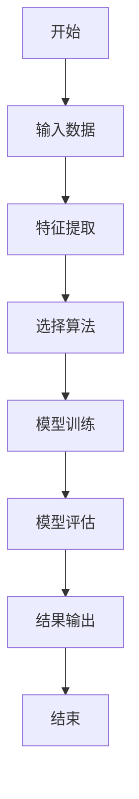
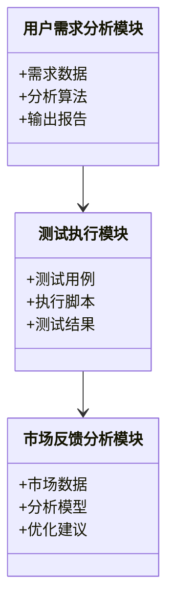
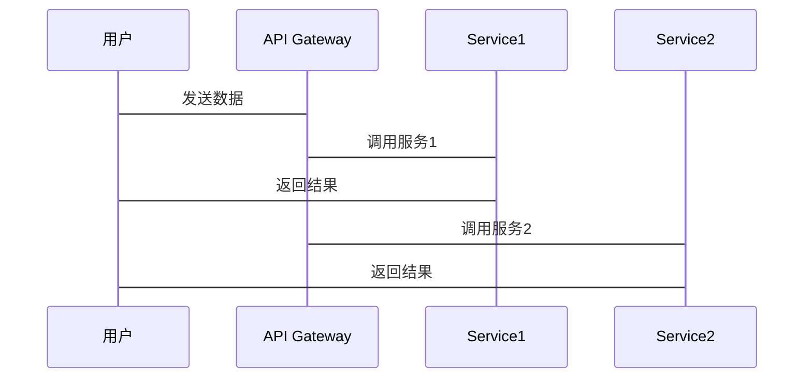

                 


# AI Agent辅助企业新产品开发与市场测试

## 关键词
AI Agent, 企业新产品开发, 市场测试, 算法原理, 系统架构设计, 项目实战

## 摘要
随着人工智能技术的快速发展，AI Agent在企业新产品开发和市场测试中的应用日益广泛。本文将详细介绍AI Agent的基本概念、核心原理、算法实现、系统架构设计，以及在企业中的实际应用案例。通过本文的探讨，读者将能够理解AI Agent在企业创新中的巨大潜力，并掌握如何将其应用于实际的开发和测试过程中。

# 第1章 AI Agent的基本概念与背景

## 1.1 AI Agent的定义与特点
### 1.1.1 AI Agent的定义
AI Agent（人工智能代理）是指能够感知环境、自主决策并采取行动以实现特定目标的智能实体。与传统自动化工具不同，AI Agent具备学习、推理和自适应能力。

### 1.1.2 AI Agent的核心特点
- **自主性**：能够在没有外部干预的情况下独立运行。
- **反应性**：能够实时感知环境变化并做出相应反应。
- **目标导向**：所有的行为都围绕实现预定目标展开。
- **学习能力**：通过数据和经验不断优化自身的决策过程。

### 1.1.3 AI Agent与传统AI的区别
| 特性         | 传统AI                         | AI Agent                     |
|--------------|--------------------------------|------------------------------|
| 行为模式     | 预设规则执行                   | 自主决策和行动               |
| 环境适应性   | 无法动态调整                   | 能够适应动态变化的环境       |
| 目标导向性   | 通常为特定任务设计             | 具备明确的目标导向性         |

## 1.2 企业新产品开发与市场测试的背景
### 1.2.1 企业新产品开发的挑战
- 市场需求变化快，产品生命周期缩短。
- 开发过程复杂，涉及多个部门协作。
- 测试环境多样，测试成本高昂。

### 1.2.2 市场测试的重要性
- 确保产品功能符合市场需求。
- 通过数据反馈优化产品设计。
- 提高产品上市速度和市场竞争力。

### 1.2.3 AI Agent在其中的作用
- 自动化执行测试任务，提高测试效率。
- 实时监控市场反馈，优化产品策略。
- 智能分析测试数据，辅助决策。

## 1.3 AI Agent在企业中的应用前景
### 1.3.1 AI Agent的潜在应用领域
- **产品设计优化**：通过AI Agent进行用户需求分析和产品原型设计。
- **测试自动化**：利用AI Agent执行自动化测试，减少人工干预。
- **市场反馈分析**：AI Agent实时收集和分析市场反馈，优化产品策略。

### 1.3.2 企业采用AI Agent的优势
- 提高开发效率，缩短产品上市时间。
- 降低测试成本，优化资源配置。
- 提升产品智能化水平，增强市场竞争力。

### 1.3.3 AI Agent应用的挑战与机遇
- **技术挑战**：算法复杂度高，实施难度大。
- **数据挑战**：需要大量高质量的数据支持。
- **伦理挑战**：AI Agent的决策透明性和可解释性问题。

## 1.4 本章小结
本章介绍了AI Agent的基本概念和特点，分析了企业在新产品开发和市场测试中面临的挑战，并探讨了AI Agent在其中的应用前景和优势。

# 第2章 AI Agent的核心概念与联系

## 2.1 AI Agent的核心概念
### 2.1.1 AI Agent的基本属性
- **感知能力**：通过传感器或数据输入获取环境信息。
- **推理能力**：基于感知信息进行逻辑推理和决策。
- **行动能力**：根据决策结果执行相应的操作。

### 2.1.2 AI Agent的核心要素
| 要素         | 描述                           |
|--------------|--------------------------------|
| 目标         | AI Agent追求的目标或任务       |
| 知识库       | 包含任务所需的所有背景知识     |
| 行为策略     | 决策过程中的规则和策略         |
| 执行机制     | 执行决策的具体操作步骤         |

## 2.2 AI Agent的核心概念对比表
| 特性         | 传统自动化工具                 | AI Agent                     |
|--------------|--------------------------------|------------------------------|
| 决策方式     | 预设规则执行                   | 自主学习和决策               |
| 适应能力     | 固定模式，难以适应变化         | 能够动态调整，适应新环境     |
| 问题解决能力 | 面对未知问题时能力有限         | 具备较强的问题解决能力       |

## 2.3 AI Agent的ER实体关系图
```mermaid
erDiagram
    actor 用户
    actor 管理员
    actor 测试环境
    actor 数据源
    actor 目标
    actor 决策系统
    actor 执行系统
    actor 反馈系统
    actor 优化系统
    actor 学习系统

    用户 --> 决策系统
    管理员 --> 决策系统
    测试环境 --> 决策系统
    数据源 --> 决策系统
    目标 --> 决策系统
    决策系统 --> 执行系统
    执行系统 --> 反馈系统
    反馈系统 --> 优化系统
    优化系统 --> 学习系统
    学习系统 --> 决策系统
```

## 2.4 本章小结
本章详细阐述了AI Agent的核心概念，分析了其基本属性和核心要素，并通过对比表和ER图展示了AI Agent与其他技术的区别和联系。

# 第3章 AI Agent的算法原理

## 3.1 基于规则的AI Agent
### 3.1.1 基于规则的AI Agent的工作原理
基于规则的AI Agent通过预设的规则集来判断和执行操作。规则通常由条件和动作两部分组成。

### 3.1.2 规则的定义与实现
- **规则定义**：如“如果用户点击率低于10%，则推荐优化页面设计”。
- **规则实现**：通过条件判断语句将规则转化为代码。

### 3.1.3 基于规则的AI Agent的优缺点
- **优点**：规则简单易懂，易于维护。
- **缺点**：面对复杂问题时，规则数量庞大，维护成本高。

## 3.2 基于模型的AI Agent
### 3.2.1 基于模型的AI Agent的工作原理
基于模型的AI Agent通过构建和训练模型来实现决策和行动。常用的模型包括决策树、支持向量机和神经网络等。

### 3.2.2 模型的构建与训练
- **数据准备**：收集和清洗数据。
- **特征工程**：提取和选择特征。
- **模型训练**：使用训练数据对模型进行训练。
- **模型评估**：通过测试数据评估模型性能。

### 3.2.3 基于模型的AI Agent的优缺点
- **优点**：能够处理复杂问题，决策能力更强。
- **缺点**：模型训练需要大量数据和计算资源，且模型的可解释性较差。

## 3.3 AI Agent的算法流程图


## 3.4 本章小结
本章介绍了两种常见的AI Agent算法：基于规则的和基于模型的。通过流程图详细展示了算法的实现步骤，并分析了各自的优缺点。

# 第4章 系统分析与架构设计

## 4.1 问题场景介绍
AI Agent在企业新产品开发和市场测试中的应用场景包括需求分析、产品设计、测试执行和市场反馈分析等。

## 4.2 系统功能设计
### 4.2.1 领域模型


## 4.3 系统架构设计
### 4.3.1 系统架构图


## 4.4 系统接口设计
### 4.4.1 API接口
- **输入接口**：接收用户需求数据和市场反馈数据。
- **输出接口**：返回分析结果和优化建议。

### 4.4.2 数据格式
- **JSON格式**：如`{"userId": 123, "feedback": "功能不足"}`。

## 4.5 系统交互设计
### 4.5.1 序列图


## 4.6 本章小结
本章通过系统分析和架构设计，展示了AI Agent在企业中的具体应用，包括功能设计、架构设计和接口设计。

# 第5章 项目实战

## 5.1 环境配置
- **开发工具**：PyCharm、Jupyter Notebook。
- **编程语言**：Python 3.8以上版本。
- **依赖库**：numpy、pandas、scikit-learn。

## 5.2 核心实现源代码
### 5.2.1 基于规则的AI Agent实现
```python
class RuleBasedAgent:
    def __init__(self):
        self.rules = []

    def add_rule(self, condition, action):
        self.rules.append((condition, action))

    def execute(self, input_data):
        for condition, action in self.rules:
            if condition(input_data):
                return action(input_data)
        return None
```

### 5.2.2 基于模型的AI Agent实现
```python
from sklearn.tree import DecisionTreeClassifier

class ModelBasedAgent:
    def __init__(self):
        self.model = None

    def train(self, X, y):
        self.model = DecisionTreeClassifier().fit(X, y)

    def predict(self, X):
        return self.model.predict(X)
```

## 5.3 代码应用解读与分析
### 5.3.1 基于规则的AI Agent应用
- **训练数据**：用户行为数据。
- **规则定义**：如“如果用户点击率低于10%，则推荐优化页面设计”。
- **执行过程**：接收用户数据，判断是否满足条件，执行相应的操作。

### 5.3.2 基于模型的AI Agent应用
- **训练数据**：市场反馈数据。
- **模型训练**：使用决策树模型进行训练。
- **预测过程**：接收新数据，模型进行预测并返回结果。

## 5.4 实际案例分析
### 5.4.1 案例背景
某企业计划推出新产品，希望通过AI Agent进行市场测试和需求分析。

### 5.4.2 数据准备
- **需求数据**：收集用户对产品的反馈意见。
- **市场数据**：收集竞争对手的产品信息和用户评价。

### 5.4.3 案例实现
- **需求分析模块**：分析用户反馈，生成需求报告。
- **测试执行模块**：自动化执行测试用例，生成测试报告。
- **市场反馈分析模块**：分析市场数据，优化产品设计。

### 5.4.4 案例结果
- **需求报告**：用户需求优先级排序。
- **测试报告**：测试结果和问题列表。
- **优化建议**：基于市场反馈的产品优化方案。

## 5.5 项目小结
本章通过实际案例展示了AI Agent在企业新产品开发和市场测试中的应用，详细解读了代码实现和案例分析过程。

# 第6章 总结与展望

## 6.1 本章总结
本文详细探讨了AI Agent在企业新产品开发和市场测试中的应用，从基本概念到算法实现，再到系统架构设计和项目实战，为读者提供了全面的指导。

## 6.2 最佳实践 tips
- **数据质量**：确保数据的准确性和完整性。
- **模型选择**：根据具体问题选择合适的算法。
- **系统设计**：注重系统的可扩展性和可维护性。

## 6.3 注意事项
- **数据隐私**：遵守数据隐私保护法规。
- **模型解释性**：提高模型的可解释性，便于问题排查。
- **持续优化**：定期更新模型和规则，确保系统的适应性。

## 6.4 拓展阅读
- **推荐书籍**：《机器学习实战》、《深度学习》。
- **在线资源**：Coursera上的AI相关课程。
- **技术博客**：关注前沿技术博客，获取最新动态。

## 6.5 本章小结
本章总结了全文的主要内容，给出了最佳实践建议，并推荐了进一步学习的资源。

---

# 附录

## 附录A 常用AI Agent算法对比表
| 算法类型       | 描述                     | 优点                           | 缺点                           |
|----------------|--------------------------|--------------------------------|--------------------------------|
| 基于规则       | 通过预设规则进行决策     | 简单易懂，维护方便             | 面对复杂问题时规则数量庞大     |
| 基于模型       | 通过训练模型进行决策     | 能够处理复杂问题，决策能力强   | 模型训练需要大量数据和计算资源 |

## 附录B 常见问题解答
### 问题1：AI Agent和传统自动化工具的区别？
答：AI Agent具备自主决策和学习能力，而传统自动化工具仅执行预设规则。

### 问题2：如何选择合适的AI Agent算法？
答：根据具体问题和数据量选择，规则简单的问题选择基于规则的算法，复杂问题选择基于模型的算法。

### 问题3：AI Agent的应用有哪些挑战？
答：数据质量、模型解释性、伦理问题等。

## 附录C 参考文献
1. 《机器学习实战》
2. 《深度学习》
3. 《AI Agent入门与实践》

---

# 结束语

随着AI技术的不断进步，AI Agent在企业中的应用前景广阔。通过本文的介绍，读者可以全面了解AI Agent的基本概念、算法原理和实际应用。未来，随着技术的进一步发展，AI Agent将在企业新产品开发和市场测试中发挥更大的作用。

---

通过以上目录结构，可以确保文章内容的完整性和逻辑性，为读者提供有价值的技术指导。

