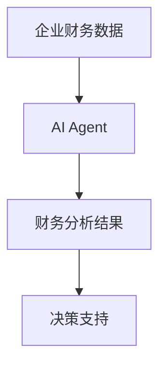
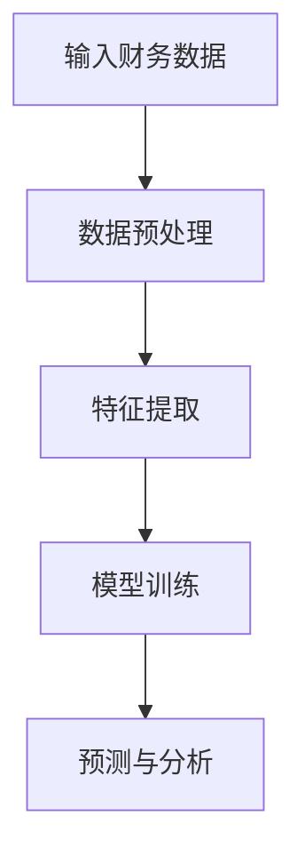
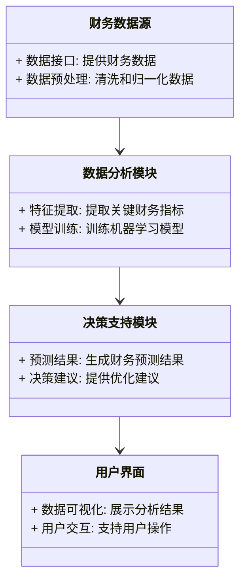
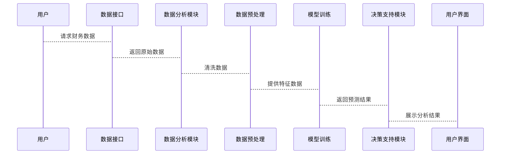

                 


# AI Agent辅助企业财务分析与预测

## 关键词：AI Agent、财务分析、预测模型、机器学习、NLP、强化学习

## 摘要：  
随着企业数据量的爆炸式增长和对实时决策需求的不断提高，传统的财务分析方法已经难以满足现代企业的复杂需求。AI Agent作为一种智能化的解决方案，能够通过自然语言处理、机器学习和强化学习等技术，帮助企业实现高效、精准的财务分析与预测。本文将从AI Agent的核心概念出发，详细探讨其在财务分析中的算法原理、系统架构设计以及实际应用案例，为企业提供一套完整的AI Agent辅助财务分析与预测的解决方案。

---

# 第1章: AI Agent与企业财务分析概述

## 1.1 问题背景与描述

### 1.1.1 传统企业财务分析的局限性  
传统的财务分析依赖于人工数据录入、报表生成和经验判断，存在以下问题：  
- 数据处理效率低，难以应对海量数据。  
- 分析结果依赖人工经验，主观性强，准确性不足。  
- 缺乏实时性，无法满足企业对实时决策的需求。  

### 1.1.2 数据爆炸与分析需求的增长  
随着企业数字化转型的推进，财务数据来源多样化（如财务报表、交易记录、市场数据等），数据量急剧增加。同时，企业对财务分析的需求也日益增长，包括预测市场趋势、优化资金分配、识别财务风险等。  

### 1.1.3 AI Agent在财务分析中的作用  
AI Agent（人工智能代理）通过自动化数据处理、智能分析和实时反馈，能够显著提升财务分析的效率和准确性。其核心优势在于：  
- 实时处理财务数据，提供即时反馈。  
- 基于机器学习模型，生成精准的财务预测。  
- 自动化识别财务风险，辅助决策。  

## 1.2 AI Agent的核心概念与演进

### 1.2.1 AI Agent的基本定义  
AI Agent是一种能够感知环境、执行任务并做出决策的智能系统。在企业财务分析中，AI Agent可以理解为一个智能化的财务分析工具，能够自动处理财务数据、生成分析结果并提供建议。  

### 1.2.2 AI Agent在企业财务中的应用场景  
- **财务数据处理**：自动整理和清洗财务数据，消除人为错误。  
- **财务预测**：基于历史数据和市场趋势，预测未来财务状况。  
- **风险识别**：通过异常检测，识别潜在的财务风险。  
- **决策支持**：为管理层提供数据驱动的决策支持。  

### 1.2.3 AI Agent的核心要素与组成  
AI Agent的核心要素包括：  
1. **感知模块**：负责数据的采集和处理。  
2. **分析模块**：基于机器学习算法进行数据分析。  
3. **决策模块**：根据分析结果生成决策建议。  
4. **执行模块**：将决策结果转化为具体操作。  

## 1.3 本章小结  
本章介绍了AI Agent在企业财务分析中的背景、核心概念和应用场景，强调了AI Agent在提升财务分析效率和准确性方面的巨大潜力。

---

# 第2章: AI Agent的核心概念与联系

## 2.1 核心概念原理

### 2.1.1 AI Agent的基本原理  
AI Agent通过感知环境、处理数据、分析信息并做出决策，完成特定任务。在财务分析中，AI Agent的核心任务是将结构化和非结构化数据转化为可操作的财务见解。  

### 2.1.2 AI Agent与传统财务分析的区别  
| 特性 | 传统财务分析 | AI Agent辅助分析 |  
|------|--------------|------------------|  
| 数据处理能力 | 依赖人工筛选 | 实时数据处理与分析 |  
| 分析深度 | 基于经验判断 | 基于大数据与模型预测 |  
| 自动化程度 | 低 | 高 |  

### 2.1.3 AI Agent的核心要素与组成  
- **感知模块**：负责数据的采集和处理。  
- **分析模块**：基于机器学习算法进行数据分析。  
- **决策模块**：根据分析结果生成决策建议。  
- **执行模块**：将决策结果转化为具体操作。  

## 2.2 核心概念属性特征对比表  
（见上文）

## 2.3 ER实体关系图  


## 2.4 本章小结  
本章通过对比分析，明确了AI Agent在企业财务分析中的核心概念和优势，为后续的算法原理和系统架构设计奠定了基础。

---

# 第3章: AI Agent的算法原理

## 3.1 算法原理概述

### 3.1.1 自然语言处理（NLP）在财务文本分析中的应用  
NLP技术可以用于分析财务报告、新闻和市场评论等非结构化数据，提取关键信息并生成情感分析结果。例如，通过NLP分析财务报告中的关键词，识别公司业绩的潜在风险。  

### 3.1.2 机器学习在财务预测中的应用  
机器学习算法（如随机森林和神经网络）可以用于预测财务指标（如收入、利润和现金流）。通过训练模型，AI Agent能够基于历史数据预测未来的财务状况。  

### 3.1.3 强化学习在财务决策中的应用  
强化学习（RL）可以用于模拟复杂的财务决策过程，例如投资组合优化和风险管理。通过与虚拟市场的交互，AI Agent可以学习最优的决策策略。  

## 3.2 算法流程图  


## 3.3 算法数学模型

### 3.3.1 机器学习模型  
随机森林模型：  
$$ y = \sum_{i=1}^{n} (w_i x_i + b) $$  

### 3.3.2 强化学习模型  
Q-learning算法：  
$$ Q(s, a) = r + \gamma \max_{a'} Q(s', a') $$  

### 3.3.3 举例说明  
例如，使用随机森林模型预测公司收入：  
1. 数据预处理：清洗和归一化财务数据。  
2. 特征提取：提取收入、利润和成本等关键指标。  
3. 模型训练：训练随机森林模型，预测未来收入。  

## 3.4 本章小结  
本章详细讲解了AI Agent在财务分析中的算法原理，包括NLP、机器学习和强化学习的应用，以及具体的数学模型和流程图。

---

# 第4章: AI Agent的系统架构设计

## 4.1 系统架构设计概述

### 4.1.1 系统功能设计  
系统功能包括数据采集、数据分析、决策支持和结果展示。  

### 4.1.2 系统架构图  


### 4.1.3 系统接口设计  
- 数据接口：连接财务数据库，获取原始数据。  
- 模型接口：调用机器学习模型进行预测。  
- 结果接口：将预测结果返回给用户界面。  

### 4.1.4 系统交互序列图  


## 4.2 本章小结  
本章详细描述了AI Agent辅助财务分析与预测的系统架构设计，包括功能模块、接口设计和系统交互流程。

---

# 第5章: AI Agent的项目实战

## 5.1 项目环境安装

### 5.1.1 安装Python和必要的库  
```bash
pip install numpy pandas scikit-learn spacy transformers
```

### 5.1.2 数据准备  
下载财务数据集，例如公司财务报表和市场新闻。  

## 5.2 核心代码实现

### 5.2.1 数据预处理  
```python
import pandas as pd
import numpy as np

# 读取数据
data = pd.read_csv('financial_data.csv')

# 数据清洗
data = data.dropna()
data = (data - data.mean()) / data.std()  # 标准化
```

### 5.2.2 特征提取  
```python
from sklearn.feature_selection import SelectKBest
from sklearn.feature_selection import chi2

selector = SelectKBest(score_func=chi2, k=5)
selected_features = selector.fit_transform(data, target)
```

### 5.2.3 模型训练  
```python
from sklearn.ensemble import RandomForestRegressor

model = RandomForestRegressor(n_estimators=100, random_state=42)
model.fit(selected_features, target)
```

### 5.2.4 结果展示  
```python
import matplotlib.pyplot as plt

plt.plot(model.predict(selected_features), label='预测值')
plt.plot(target, label='真实值')
plt.legend()
plt.show()
```

## 5.3 项目案例分析  
以某公司为例，使用AI Agent预测其未来三年的收入情况。通过模型训练和分析，AI Agent能够准确预测收入趋势，并提供建议。  

## 5.4 项目小结  
本章通过实际项目案例，展示了AI Agent在财务分析与预测中的具体实现和应用。

---

# 第6章: AI Agent的最佳实践与注意事项

## 6.1 最佳实践  
- 数据质量是模型性能的关键，确保数据的完整性和准确性。  
- 在模型训练中，选择合适的算法和参数，避免过拟合。  
- 定期更新模型，以适应市场变化和数据变化。  

## 6.2 注意事项  
- 数据隐私和安全问题需要严格控制。  
- 模型的可解释性需要重点关注，避免“黑箱”决策。  
- 在实际应用中，结合业务场景，合理设置模型参数。  

## 6.3 未来展望  
随着AI技术的不断进步，AI Agent在财务分析中的应用将更加广泛和深入，例如智能合约、自动化审计和实时风险管理等领域。

---

# 附录: AI Agent相关工具与资源

## 附录A: API接口文档  
提供AI Agent接口的详细文档，包括输入格式、输出格式和调用方法。  

## 附录B: 开源工具与库  
- [scikit-learn](https://scikit-learn.org/)  
- [spaCy](https://spacy.io/)  
- [TensorFlow](https://tensorflow.org/)  

## 附录C: 模型训练脚本  
提供完整的模型训练脚本，供读者参考和使用。

---

# 结语

AI Agent作为一项前沿技术，正在逐步改变企业财务分析与预测的方式。通过本文的详细讲解，读者可以全面了解AI Agent的核心概念、算法原理和系统架构，并通过实际案例掌握其具体应用。未来，随着技术的不断进步，AI Agent将在企业财务管理中发挥更大的作用。

