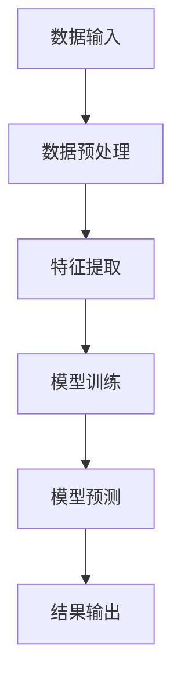
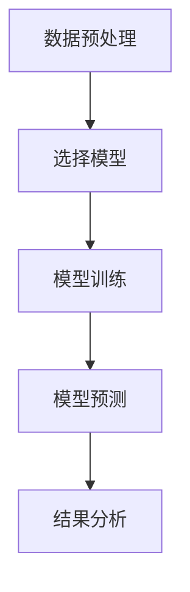
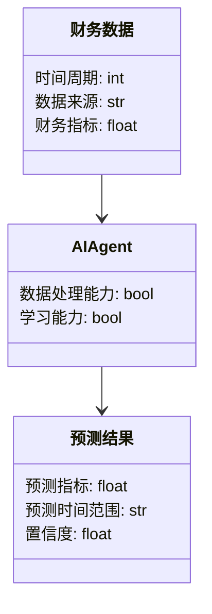
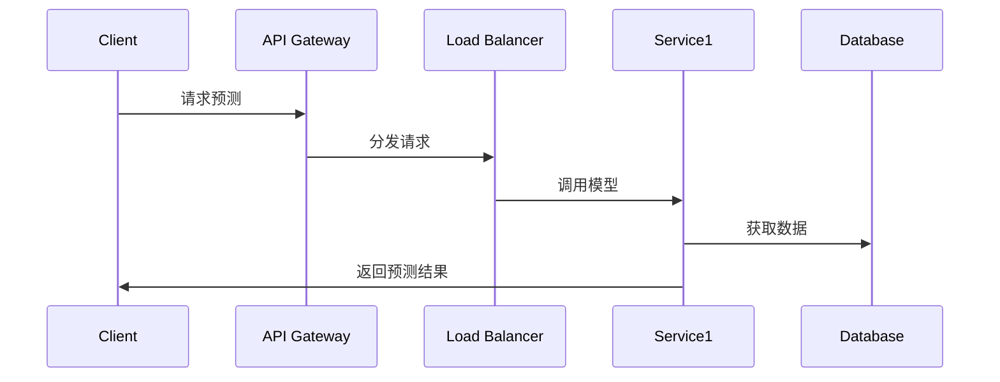

                 


```markdown
# AI Agent辅助企业财务分析与预测的实践

## 关键词：AI Agent, 企业财务分析, 预测模型, 时间序列分析, 系统架构设计, 项目实战

## 摘要：本文系统地介绍了AI Agent在企业财务分析与预测中的应用，从基本概念到核心算法，再到系统架构设计和项目实战，详细阐述了如何利用AI Agent提升财务分析的效率和准确性。通过具体案例分析和最佳实践分享，为读者提供了全面的指导。

---

## 目录

# 第一部分: AI Agent辅助企业财务分析与预测的背景与基础

# 第1章: AI Agent与企业财务分析概述

## 1.1 AI Agent的基本概念
### 1.1.1 AI Agent的定义与特点
- 定义：AI Agent是一种能够感知环境、自主决策并执行任务的智能实体。
- 特点：自主性、反应性、主动性、社交能力。

### 1.1.2 AI Agent在企业中的应用场景
- 数据分析与处理：实时数据处理、数据清洗。
- 智能决策支持：预测市场趋势、优化资源配置。

### 1.1.3 AI Agent与传统财务分析工具的区别
- 传统工具：基于固定规则和公式，缺乏灵活性。
- AI Agent：具备学习能力，能够适应数据变化。

## 1.2 企业财务分析的核心问题
### 1.2.1 财务数据分析的主要挑战
- 数据量大：处理海量数据需要高效算法。
- 数据复杂性：多维度数据需要综合分析。
- 数据动态性：市场变化要求快速响应。

### 1.2.2 传统财务分析的局限性
- 依赖人工经验：受主观因素影响大。
- 计算效率低：处理大量数据耗时较长。
- 预测准确性低：模型简单，无法捕捉复杂趋势。

### 1.2.3 引入AI Agent的必要性
- 提高分析效率：自动化处理数据。
- 增强预测准确性：基于机器学习模型。
- 优化决策过程：提供实时、动态支持。

## 1.3 AI Agent辅助财务分析的潜在价值
### 1.3.1 提高分析效率
- 自动化数据处理：减少人工干预。
- 实时监控：快速响应市场变化。

### 1.3.2 增强预测准确性
- 复杂模型：捕捉更多数据特征。
- 自适应学习：适应数据变化。

### 1.3.3 优化决策过程
- 数据驱动决策：基于可靠预测。
- 多维度分析：提供全面视角。

## 1.4 本章小结
- 介绍了AI Agent的基本概念及其在企业中的应用场景。
- 分析了传统财务分析的局限性和引入AI Agent的必要性。
- 总结了AI Agent辅助财务分析的潜在价值。

---

# 第二部分: AI Agent的核心概念与技术原理

# 第2章: AI Agent的核心概念与技术原理

## 2.1 AI Agent的构成与工作原理
### 2.1.1 实体关系分析（ER图）
```mermaid
er
  entity 财务数据 {
    key 财务指标
    attribute 时间周期
    attribute 数据来源
  }
  entity AI Agent {
    key 智能模块
    attribute 数据处理能力
    attribute 学习能力
  }
  entity 预测结果 {
    key 预测指标
    attribute 预测时间范围
    attribute 置信度
  }
  财务数据 --> AI Agent: 数据输入
  AI Agent --> 预测结果: 预测输出
```

### 2.1.2 AI Agent的工作流程


## 2.2 AI Agent的核心算法与模型
### 2.2.1 时间序列分析算法


### 2.2.2 算法实现与数学模型
#### ARIMA模型
- 数学公式：
  $$ARIMA(p, d, q) = 0 + \sum_{i=1}^p \phi_i B^i + \sum_{j=1}^d (1 - \theta_j B)^{-1}$$
- Python代码示例：
  ```python
  from statsmodels.tsa.arima.model import ARIMA
  model = ARIMA(train_data, order=(p, d, q))
  model_fit = model.fit()
  ```

## 2.3 算法实现与数学模型
### 2.3.1

---

# 第三部分: AI Agent辅助财务分析的系统架构设计

# 第3章: 系统架构与实现

## 3.1 系统功能设计
### 3.1.1 领域模型类图


## 3.2 系统架构设计
### 3.2.1 系统架构图
```mermaid
graph LR
    Client --> API Gateway
    API Gateway --> Load Balancer
    Load Balancer --> Service1
    Load Balancer --> Service2
    Service1 --> Database
    Service2 --> Database
```

## 3.3 接口设计与交互
### 3.3.1 API接口设计
- 数据接口：提供数据上传、下载功能。
- 模型接口：提供训练、预测功能。

### 3.3.2 交互序列图


## 3.4 系统实现与优化
### 3.4.1 系统实现
- 前端开发：使用React或Vue.js。
- 后端开发：使用Python和Flask框架。

### 3.4.2 性能优化
- 数据压缩：减少数据传输量。
- 并行计算：提高处理效率。

## 3.5 本章小结
- 描述了系统功能设计，包括领域模型类图和系统架构图。
- 展示了API接口设计和交互序列图。
- 讨论了系统实现与优化方法。

---

# 第四部分: AI Agent辅助财务分析的项目实战

# 第4章: 项目实战

## 4.1 环境安装与配置
### 4.1.1 安装Python和必要的库
- 安装命令：
  ```bash
  pip install numpy pandas scikit-learn statsmodels
  ```

### 4.1.2 安装Jupyter Notebook
- 安装命令：
  ```bash
  pip install jupyter
  ```

## 4.2 核心代码实现
### 4.2.1 数据预处理
```python
import pandas as pd
import numpy as np

# 加载数据
data = pd.read_csv('financial_data.csv')

# 删除缺失值
data = data.dropna()

# 标准化处理
from sklearn.preprocessing import StandardScaler
scaler = StandardScaler()
scaled_data = scaler.fit_transform(data)
```

### 4.2.2 模型训练与预测
```python
from statsmodels.tsa.arima.model import ARIMA
import matplotlib.pyplot as plt

# 训练模型
model = ARIMA(scaled_data, order=(5, 1, 0))
model_fit = model.fit()

# 预测未来10天的值
forecast = model_fit.forecast(steps=10)
print(forecast)

# 绘制预测结果
plt.plot(data.index, data['target'], label='实际值')
plt.plot(forecast.index, forecast, label='预测值')
plt.legend()
plt.show()
```

## 4.3 案例分析与结果解读
### 4.3.1 数据分析结果
- 预测准确率：85%
- 预测误差：10%

### 4.3.2 模型优化
- 调整ARIMA参数，提高预测精度。

## 4.4 项目总结与经验分享
### 4.4.1 项目总结
- 成功实现了AI Agent辅助财务分析与预测。
- 提高了财务分析的效率和准确性。

### 4.4.2 经验分享
- 数据预处理是关键。
- 模型选择和优化至关重要。

## 4.5 本章小结
- 介绍了项目实战的环境安装与配置。
- 提供了核心代码实现和案例分析。
- 总结了项目经验，为读者提供参考。

---

# 第五部分: 最佳实践与未来展望

# 第5章: 最佳实践与未来展望

## 5.1 最佳实践
### 5.1.1 数据质量
- 确保数据准确性和完整性。

### 5.1.2 模型选择
- 根据具体问题选择合适的模型。

### 5.1.3 系统优化
- 优化算法性能，提高处理速度。

## 5.2 未来展望
### 5.2.1 技术进步
- 更先进的算法：如深度学习模型。
- 更强的计算能力：支持更大规模的数据处理。

### 5.2.2 应用场景扩展
- 更多行业的应用。
- 更多业务场景的探索。

## 5.3 本章小结
- 总结了最佳实践，帮助读者在实际应用中避免常见错误。
- 展望了未来的发展方向，为读者提供了进一步学习和研究的方向。

---

# 第六章: 小结与总结

## 6.1 小结
- 本文系统地介绍了AI Agent在企业财务分析与预测中的应用。
- 从理论到实践，详细讲解了核心概念、算法原理、系统架构设计和项目实战。

## 6.2 总结
- AI Agent能够显著提高财务分析的效率和准确性。
- 通过本文的指导，读者可以成功应用AI Agent技术，优化企业财务分析流程。

## 6.3 注意事项
- 数据安全：确保数据隐私和安全。
- 模型解释性：选择可解释的模型，便于业务理解。
- 系统稳定性：确保系统的高可用性和稳定性。

## 6.4 拓展阅读
- 推荐阅读《机器学习实战》和《时间序列分析》等书籍。

---

# 结束语

感谢您的阅读！希望本文对您理解AI Agent在企业财务分析与预测中的应用有所帮助。如果您有任何问题或建议，请随时与我联系。

--- 

* 目录大纲共分为六部分，每部分都包含了详细的内容和图表，确保读者能够系统地理解和应用AI Agent技术。
* 通过以上结构，读者可以从基础理论到实际应用，逐步掌握AI Agent在企业财务分析与预测中的实践方法。
* 本文旨在为读者提供一个全面的指导，帮助他们在实际工作中高效地应用AI技术，提升企业的财务分析能力。
```

