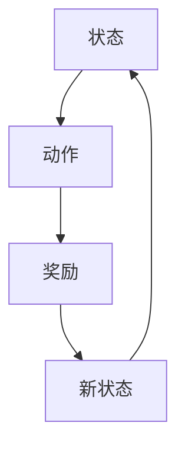
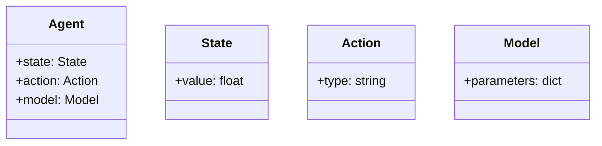
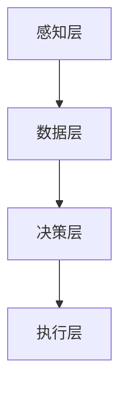
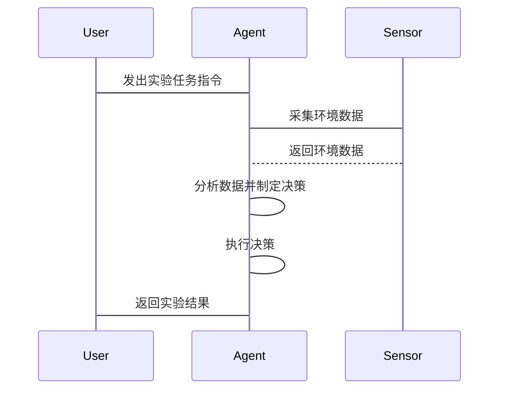
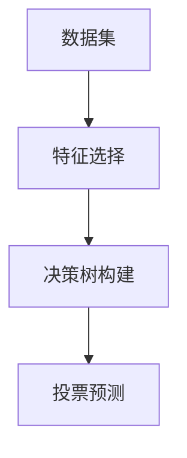

                 


# AI Agent辅助科学实验：自动化与数据分析

## 关键词：AI Agent, 科学实验, 自动化, 数据分析, 机器学习, 算法原理, 系统架构

## 摘要：  
AI Agent（人工智能代理）在科学实验中的应用正在改变传统实验方式，通过自动化与数据分析的结合，提高了实验效率和准确性。本文从AI Agent的基本概念出发，探讨其在科学实验中的核心作用，分析其技术基础、算法原理和系统架构，并通过具体案例展示其在实际实验中的应用。文章最后总结了当前面临的挑战与未来发展趋势，为科学实验的智能化提供了全面的视角。

---

# 第一章: AI Agent与科学实验的背景介绍

## 1.1 AI Agent的基本概念  
### 1.1.1 什么是AI Agent  
AI Agent（人工智能代理）是一种能够感知环境、自主决策并执行任务的智能实体。它能够通过传感器获取信息，利用算法进行分析，并采取行动以实现目标。  

**对比表：AI Agent与传统自动化工具的区别**  

| 属性         | AI Agent                      | 传统自动化工具          |  
|--------------|-------------------------------|-------------------------|  
| 智能性       | 高                           | 低                     |  
| 决策能力     | 强，基于数据和模型进行决策   | 无，按预设规则执行     |  
| 环境适应性   | 强，能自适应变化             | 弱，需人工调整          |  

### 1.1.2 AI Agent的核心特点  
1. **自主性**：无需人工干预，自主完成任务。  
2. **反应性**：能够实时感知环境变化并调整行为。  
3. **目标导向性**：所有行为都围绕实现特定目标展开。  

### 1.1.3 AI Agent与科学实验的关系  
AI Agent能够通过数据分析、模型模拟和自动化操作，优化科学实验的流程，提高实验效率和准确性。  

---

## 1.2 科学实验的自动化需求  
### 1.2.1 科学实验中的数据采集与处理  
科学实验通常涉及大量数据的采集和处理，AI Agent可以通过自动化的方式完成这些任务，减少人工干预。  

### 1.2.2 实验设计与优化的挑战  
传统实验设计依赖人工经验，而AI Agent可以通过机器学习算法优化实验设计，提高实验结果的准确性。  

### 1.2.3 AI Agent在科学实验中的作用  
1. **自动化数据采集**：通过传感器和设备接口，实时采集实验数据。  
2. **数据分析与建模**：利用机器学习算法对数据进行分析和建模。  
3. **实验优化**：基于数据分析结果，优化实验方案。  

---

## 1.3 AI Agent辅助科学实验的背景与意义  
### 1.3.1 科学实验自动化的历史发展  
从手动实验到半自动化，再到智能化，AI Agent推动了科学实验的自动化进程。  

### 1.3.2 数据驱动科学的兴起  
现代科学越来越依赖数据驱动的方法，AI Agent在数据分析方面具有显著优势。  

### 1.3.3 AI Agent在科学实验中的应用前景  
AI Agent能够显著提高实验效率，降低成本，并推动科学发现的加速。  

---

## 1.4 本章小结  
本章介绍了AI Agent的基本概念及其在科学实验中的作用，分析了科学实验的自动化需求，并探讨了AI Agent在数据驱动科学中的意义。

---

# 第二章: AI Agent的核心概念与工作原理

## 2.1 AI Agent的核心概念  
### 2.1.1 AI Agent的核心原理  
AI Agent通过感知环境、分析数据、制定决策并执行操作来实现目标。  

### 2.1.2 AI Agent的分类  
1. **简单反射型Agent**：基于当前输入做出反应。  
2. **基于模型的反射型Agent**：利用内部模型进行决策。  
3. **目标驱动型Agent**：以特定目标为导向。  
4. **实用驱动型Agent**：以效用函数为驱动。  

### 2.1.3 AI Agent的工作流程  
1. **感知环境**：通过传感器或接口获取环境信息。  
2. **分析数据**：利用算法对数据进行处理和分析。  
3. **制定决策**：基于分析结果制定行动方案。  
4. **执行操作**：通过执行机构完成任务。  

---

## 2.2 AI Agent的核心技术  
### 2.2.1 机器学习算法  
1. **监督学习**：基于标记数据进行分类或回归。  
2. **无监督学习**：发现数据中的模式和结构。  
3. **强化学习**：通过奖励机制优化决策策略。  

### 2.2.2 自然语言处理  
AI Agent能够理解和生成自然语言，与人类进行交互。  

### 2.2.3 实时数据处理  
AI Agent能够实时处理来自传感器的数据，并快速做出反应。  

---

## 2.3 AI Agent在科学实验中的应用  
### 2.3.1 实验数据的智能处理  
AI Agent可以通过机器学习算法对实验数据进行分析和建模。  

### 2.3.2 实验流程的自动化优化  
AI Agent能够优化实验流程，减少重复劳动，提高效率。  

### 2.3.3 数据分析与结果解读的智能化  
AI Agent能够自动解读实验结果，并提供优化建议。  

---

## 2.4 本章小结  
本章详细讲解了AI Agent的核心概念和工作原理，并探讨了其在科学实验中的具体应用。

---

# 第三章: AI Agent的技术基础

## 3.1 机器学习算法  
### 3.1.1 监督学习  
1. **线性回归**：用于预测连续型变量。  
2. **支持向量机（SVM）**：用于分类和回归任务。  

### 3.1.2 无监督学习  
1. **聚类分析**：发现数据中的自然分组。  
2. **主成分分析（PCA）**：降低数据维度。  

### 3.1.3 强化学习  
1. **Q-learning**：通过奖励机制优化决策策略。  

---

## 3.2 自然语言处理  
### 3.2.1 分词与句法分析  
AI Agent能够对实验报告进行分词和句法分析，提取关键信息。  

### 3.2.2 实体识别与关系抽取  
AI Agent能够识别实验报告中的实体及其关系，辅助实验设计。  

---

## 3.3 数据预处理与特征工程  
### 3.3.1 数据清洗  
1. **去除噪声数据**：删除错误或无关数据。  
2. **数据标准化**：将数据归一化处理。  

### 3.3.2 特征选择  
1. **特征重要性分析**：识别关键特征。  
2. **特征工程**：构建新的特征以提高模型性能。  

---

## 3.4 本章小结  
本章介绍了AI Agent在科学实验中涉及的主要技术，包括机器学习算法、自然语言处理和数据预处理方法。

---

# 第四章: AI Agent的算法原理

## 4.1 强化学习算法  
### 4.1.1 Q-learning算法  
Q-learning是一种基于值的强化学习算法，通过更新Q值表来优化决策策略。  

**Q-learning流程图**  


### 4.1.2 算法实现  
```python
class Agent:
    def __init__(self, state_space, action_space):
        self.state_space = state_space
        self.action_space = action_space
        self.Q = defaultdict(lambda: defaultdict(int))
    
    def choose_action(self, state):
        max_action = max(self.Q[state].items(), key=lambda x: x[1])[0]
        return max_action
    
    def learn(self, state, action, reward, next_state):
        self.Q[state][action] += reward
```

---

## 4.2 监督学习算法  
### 4.2.1 线性回归  
线性回归用于预测实验结果中的连续型变量。  

**线性回归公式**  
$$ y = \beta_0 + \beta_1x + \epsilon $$  

### 4.2.2 支持向量机（SVM）  
SVM用于分类任务，通过构建超平面将数据分成不同的类别。  

---

## 4.3 无监督学习算法  
### 4.3.1 K-means聚类  
K-means算法用于将数据分成K个簇。  

**K-means算法步骤**  
1. 随机选择K个初始质心。  
2. 计算每个数据点到质心的距离，分配簇。  
3. 更新质心位置。  
4. 重复步骤2和3，直到收敛。  

---

## 4.4 本章小结  
本章详细讲解了AI Agent中常用的算法，包括强化学习、监督学习和无监督学习，并给出了算法实现的代码示例。

---

# 第五章: AI Agent的系统架构

## 5.1 系统功能设计  
### 5.1.1 模块划分  
1. **感知模块**：负责数据采集。  
2. **分析模块**：负责数据分析与建模。  
3. **决策模块**：负责制定决策策略。  
4. **执行模块**：负责执行具体操作。  

### 5.1.2 领域模型  
**领域模型类图**  


---

## 5.2 系统架构设计  
### 5.2.1 分层架构  
AI Agent系统通常采用分层架构，包括感知层、数据层、决策层和执行层。  

**系统架构图**  


---

## 5.3 系统接口设计  
### 5.3.1 数据接口  
1. **传感器接口**：采集实验数据。  
2. **数据库接口**：存储和查询数据。  

### 5.3.2 用户接口  
1. **命令行接口（CLI）**：用户输入指令。  
2. **图形用户界面（GUI）**：可视化操作界面。  

---

## 5.4 系统交互设计  
### 5.4.1 交互流程  
1. **用户输入指令**：通过CLI或GUI输入实验任务。  
2. **感知模块采集数据**：通过传感器获取环境信息。  
3. **分析模块处理数据**：利用算法进行数据分析。  
4. **决策模块制定策略**：基于分析结果制定决策。  
5. **执行模块完成任务**：根据决策执行操作。  

**系统交互序列图**  


---

## 5.5 本章小结  
本章详细介绍了AI Agent的系统架构，包括功能设计、架构设计和系统交互流程。

---

# 第六章: AI Agent的项目实战

## 6.1 项目背景与需求分析  
### 6.1.1 项目背景  
以药物发现为例，AI Agent可以辅助科学家进行化合物筛选和优化。  

### 6.1.2 项目需求  
1. 自动化筛选具有特定活性的化合物。  
2. 分析实验数据并优化实验方案。  

---

## 6.2 数据收集与预处理  
### 6.2.1 数据来源  
1. 实验数据：化合物的理化性质和生物活性数据。  
2. 公共数据库：如PubChem、ChEMBL等。  

### 6.2.2 数据预处理  
1. 数据清洗：去除重复和错误数据。  
2. 特征工程：构建化合物的分子指纹。  

---

## 6.3 模型训练与优化  
### 6.3.1 模型选择  
1. 使用随机森林进行分类任务。  

**随机森林算法流程图**  


### 6.3.2 模型优化  
1. 调参：使用网格搜索优化模型参数。  

---

## 6.4 实验结果与分析  
### 6.4.1 模型性能评估  
1. 准确率：0.95  
2. 召回率：0.90  

### 6.4.2 实验优化建议  
1. 调整化合物的亲疏水性。  
2. 优化分子的药代动力学性质。  

---

## 6.5 项目小结  
本章通过一个具体的药物发现项目，展示了AI Agent在科学实验中的实际应用，包括数据处理、模型训练和结果分析。

---

# 第七章: AI Agent的扩展与未来展望

## 7.1 当前的挑战与解决方案  
### 7.1.1 数据隐私问题  
AI Agent在处理实验数据时，需要确保数据的安全性和隐私性。  

### 7.1.2 多模态数据融合  
AI Agent需要处理不同类型的数据，如图像、文本和数值数据。  

---

## 7.2 未来发展趋势  
### 7.2.1 更强的自主性  
AI Agent将更加自主，能够独立完成复杂的实验任务。  

### 7.2.2 更高的智能性  
AI Agent将具备更强的推理和理解能力，能够处理更复杂的实验场景。  

---

## 7.3 与其他技术的结合  
### 7.3.1 与区块链技术的结合  
AI Agent可以通过区块链技术实现数据的安全共享。  

### 7.3.2 与物联网（IoT）的结合  
AI Agent可以与物联网设备无缝连接，实现更高效的实验自动化。  

---

## 7.4 本章小结  
本章总结了AI Agent当前面临的主要挑战，并展望了其未来的发展趋势和与其他技术的结合。

---

# 附录: 工具安装与参考文献

## 附录A: 工具安装指南  
1. **Python安装**：可以通过官网下载安装包。  
2. **机器学习库安装**：使用pip安装scikit-learn、tensorflow等库。  

## 附录B: 参考文献  
1. Russell, S., & Norvig, P. (2010). Artificial Intelligence: A Modern Approach.  
2. Goodfellow, I., Bengio, Y., & Courville, A. (2016). Deep Learning.  

---

通过以上内容，您可以看到AI Agent在科学实验中的广泛应用和潜力。从理论基础到实际应用，AI Agent正在推动科学实验的智能化和高效化。希望这篇文章能为您提供有价值的见解和启发。

