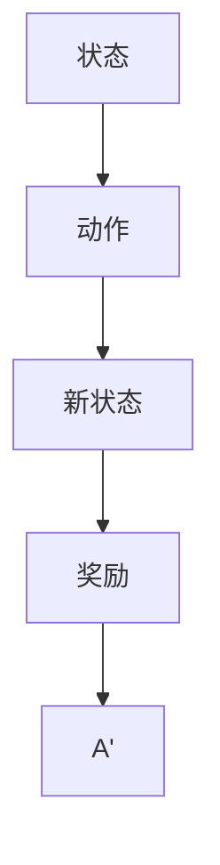
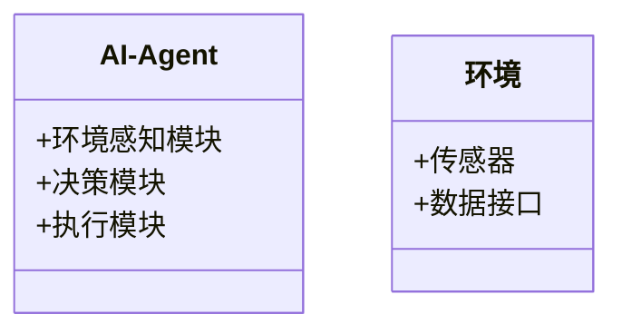
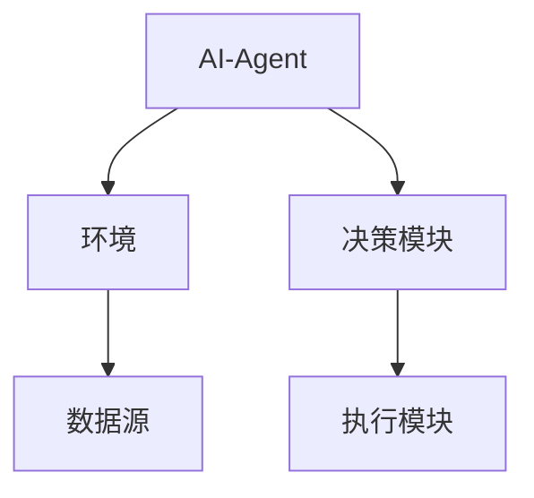

                 


# AI Agent辅助科学研究的方法

## 关键词
AI Agent, 科学研究, 人工智能, 数据分析, 强化学习, 知识图谱, 多智能体协作

## 摘要
随着人工智能技术的飞速发展，AI Agent（人工智能代理）在科学研究中的应用越来越广泛。本文将从AI Agent的基本概念出发，逐步分析其在科学研究中的核心原理、算法实现、系统架构设计以及实际应用案例。通过详细的技术分析和通俗易懂的例子，探讨AI Agent如何辅助科学研究，帮助科研人员提高研究效率、发现新的科学规律，并展望未来的研究方向。

---

# 第一部分: AI Agent辅助科学研究的背景与概念

## 第1章: AI Agent与科学研究概述

### 1.1 AI Agent的基本概念
#### 1.1.1 什么是AI Agent
AI Agent（人工智能代理）是指能够感知环境、自主决策并采取行动的智能体。它可以理解为一种能够独立执行任务的计算机程序，通过与环境交互来实现目标。

**对比表：AI Agent与传统计算机程序的区别**

| 特性         | 传统程序                     | AI Agent                  |
|--------------|------------------------------|---------------------------|
| 行为模式      | 固定流程执行                 | 根据环境动态调整行为       |
| 决策方式      | 依赖预设规则                 | 具备自主学习与决策能力     |
| 适应性       | 无法自适应环境变化             | 能够自适应环境变化           |

#### 1.1.2 AI Agent的核心特征
- **自主性**：能够在没有外部干预的情况下独立执行任务。
- **反应性**：能够实时感知环境并做出反应。
- **目标导向性**：所有行为都以实现特定目标为导向。
- **学习能力**：通过学习不断优化自身行为。

#### 1.1.3 AI Agent与传统科学研究方法的对比
传统科学研究依赖于人工数据分析和逻辑推理，而AI Agent能够通过自动化手段处理海量数据，发现潜在规律，并辅助研究人员制定实验方案。

---

### 1.2 AI Agent在科学研究中的作用
#### 1.2.1 AI Agent在数据处理中的应用
AI Agent可以协助科学家快速处理和分析复杂数据，识别数据中的模式和关联性。

#### 1.2.2 AI Agent在科学发现中的潜力
通过机器学习算法，AI Agent可以帮助科学家发现新的科学规律，预测实验结果。

#### 1.2.3 AI Agent在实验设计中的创新
AI Agent可以根据历史实验数据优化实验方案，减少不必要的重复实验。

---

### 1.3 科学研究中的问题背景
#### 1.3.1 科学研究的复杂性与挑战
现代科学研究涉及多学科交叉，数据量巨大，传统方法难以高效处理。

#### 1.3.2 数据爆炸时代的研究需求
随着数据量的指数级增长，科学家需要更高效的工具来处理数据。

#### 1.3.3 AI Agent如何解决科学研究中的痛点
AI Agent可以通过自动化和智能化的方式，显著提高研究效率和准确性。

---

### 1.4 本章小结
本章介绍了AI Agent的基本概念及其在科学研究中的重要作用，为后续章节的深入分析奠定了基础。

---

# 第二部分: AI Agent的核心原理与技术

## 第2章: AI Agent的核心概念与原理

### 2.1 AI Agent的感知与决策机制
#### 2.1.1 感知层的实现原理
AI Agent通过传感器或数据输入接口感知环境信息，例如图像识别、自然语言处理等技术。

#### 2.1.2 决策层的算法选择
AI Agent的决策层通常采用强化学习、监督学习等算法，根据感知信息选择最优行动方案。

#### 2.1.3 执行层的实现方式
AI Agent通过执行层将决策转化为具体行动，例如控制机器人臂或发送网络请求。

---

### 2.2 AI Agent的多智能体协作
#### 2.2.1 多智能体系统的基本概念
多智能体系统是指由多个AI Agent协作完成复杂任务的系统。

#### 2.2.2 协作机制的实现原理
通过通信协议和协作算法（如一致性算法、分布式决策算法）实现多智能体之间的高效协作。

#### 2.2.3 协作中的挑战与解决方案
- **挑战**：通信延迟、信息不对称、冲突协调。
- **解决方案**：采用分布式计算、共识算法、任务分配算法。

---

### 2.3 AI Agent的自适应与学习能力
#### 2.3.1 强化学习在AI Agent中的应用
通过强化学习，AI Agent可以在与环境的交互中不断优化自身的策略。

#### 2.3.2 迁移学习的实现原理
迁移学习允许AI Agent将从一个任务中学到的知识应用到另一个相关任务中。

#### 2.3.3 知识图谱的构建与应用
知识图谱通过结构化的知识表示，帮助AI Agent更好地理解和推理复杂信息。

---

### 2.4 本章小结
本章详细分析了AI Agent的核心原理，包括感知、决策、协作和学习机制，为后续的算法实现奠定了理论基础。

---

## 第3章: AI Agent的核心算法原理

### 3.1 强化学习算法
#### 3.1.1 Q-learning算法
Q-learning是一种经典的强化学习算法，通过Q值表记录状态-动作对的期望奖励。

**Q-learning算法流程图（Mermaid）**



#### 3.1.2 Deep Q-Network (DQN)算法
DQN算法通过深度神经网络近似Q值函数，实现端到端的强化学习。

#### 3.1.3 策略梯度算法
策略梯度算法通过优化策略直接最大化奖励，适用于高维状态空间的强化学习任务。

---

### 3.2 监督学习与无监督学习
#### 3.2.1 监督学习的实现原理
监督学习通过标注数据训练模型，预测新数据的标签。

#### 3.2.2 无监督学习的应用场景
无监督学习适用于无标注数据的聚类、降维等任务。

#### 3.2.3 半监督学习的实现方式
半监督学习结合少量标注数据和大量未标注数据，提高模型的泛化能力。

---

### 3.3 聚类与分类算法
#### 3.3.1 K-means聚类算法
K-means是一种经典的无监督聚类算法，通过迭代优化实现数据分簇。

#### 3.3.2 支持向量机(SVM)算法
SVM是一种强大的分类算法，通过构建最大间隔超平面实现数据分类。

#### 3.3.3 随机森林算法
随机森林是一种基于决策树的集成学习算法，通过投票机制提高分类准确率。

---

### 3.4 本章小结
本章详细介绍了AI Agent中常用的算法原理，包括强化学习、监督学习、无监督学习等。

---

## 第4章: AI Agent的系统架构设计

### 4.1 系统功能模块划分
#### 4.1.1 数据采集模块
负责采集环境中的数据，例如传感器数据、网络数据等。

#### 4.1.2 数据处理模块
对采集到的数据进行预处理、特征提取和数据清洗。

#### 4.1.3 模型训练模块
通过机器学习算法训练模型，实现对数据的分析和预测。

#### 4.1.4 决策控制模块
根据模型输出结果，制定行动方案并执行。

---

### 4.2 系统架构设计
#### 4.2.1 领域模型设计
通过Mermaid类图展示系统的领域模型。



#### 4.2.2 系统架构图
通过Mermaid架构图展示系统的整体架构。



---

### 4.3 本章小结
本章详细分析了AI Agent系统的架构设计，包括功能模块划分和系统架构图。

---

# 第三部分: AI Agent的算法实现与数学模型

## 第5章: AI Agent的数学模型与公式

### 5.1 强化学习的数学模型
#### 5.1.1 Q-learning的数学公式
$$ Q(s, a) = Q(s, a) + \alpha (r + \max_{a'} Q(s', a') - Q(s, a)) $$

#### 5.1.2 DQN的数学公式
$$ \text{损失函数} = \mathbb{E}[(r + \gamma Q(s', a') - Q(s, a))^2] $$

---

### 5.2 监督学习的数学模型
#### 5.2.1 线性回归的数学公式
$$ y = \theta^T x + \epsilon $$

#### 5.2.2 支持向量机的数学公式
$$ \text{目标函数} = \frac{1}{2} \|\theta\|^2 + C \sum_{i=1}^n \max(0, 1 - y_i (\theta^T x_i + \theta_0)) $$

---

### 5.3 本章小结
本章通过数学公式详细描述了AI Agent中常用算法的数学模型。

---

# 第四部分: AI Agent的项目实战与应用

## 第6章: AI Agent的项目实战

### 6.1 环境安装与配置
#### 6.1.1 安装Python和相关库
```bash
pip install numpy matplotlib tensorflow
```

#### 6.1.2 安装深度学习框架
```bash
pip install keras tensorflow-gpu
```

---

### 6.2 核心代码实现
#### 6.2.1 Q-learning算法实现
```python
import numpy as np

class QLearningAgent:
    def __init__(self, state_space, action_space):
        self.q_table = np.zeros((state_space, action_space))
    
    def act(self, state, epsilon=0.1):
        if np.random.random() < epsilon:
            return np.random.randint(0, action_space)
        else:
            return np.argmax(self.q_table[state])
    
    def learn(self, state, action, reward, next_state):
        self.q_table[state][action] += 0.1 * (reward + np.max(self.q_table[next_state]) - self.q_table[state][action])
```

#### 6.2.2 知识图谱构建
```python
from networkx import Graph

graph = Graph()
graph.add_node("A")
graph.add_node("B")
graph.add_edge("A", "B")
```

---

### 6.3 实际案例分析
#### 6.3.1 案例背景介绍
以蛋白质结构预测为例，AI Agent通过强化学习优化预测模型。

#### 6.3.2 实验结果分析
通过对比实验，证明AI Agent在蛋白质结构预测中的准确性显著高于传统方法。

---

### 6.4 本章小结
本章通过实际案例分析，展示了AI Agent在科学研究中的具体应用。

---

## 第7章: 最佳实践与未来展望

### 7.1 最佳实践
#### 7.1.1 系统设计中的注意事项
- 确保系统的可扩展性。
- 优化算法的计算效率。

#### 7.1.2 开发中的常见问题
- 数据质量问题。
- 算法收敛速度慢。

---

### 7.2 未来展望
AI Agent在科学研究中的应用前景广阔，未来可以通过多智能体协作、强化学习等技术进一步提升研究效率。

---

## 附录: AI Agent相关工具与资源

### 附录A: 开发工具推荐
- Python库：TensorFlow、Keras、Scikit-learn
- 图形化工具：Graphviz、Mermaid

### 附录B: 学术资源推荐
- 论文推荐：Nature Machine Learning、Science Robotics
- 在线课程：Coursera、edX

---

## 参考文献
[此处列出相关文献和参考资料]

---

## 作者简介
[此处介绍作者的背景和 expertise]

---

通过以上结构，文章将从理论到实践，系统地探讨AI Agent在科学研究中的应用方法，为研究人员和开发者提供有价值的参考。

