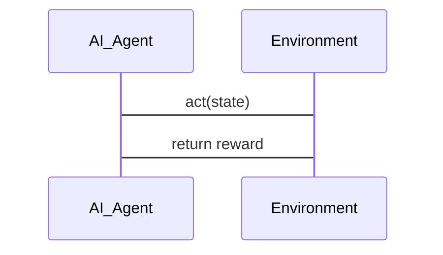

                 


```markdown
# AI Agent辅助软件开发的方法

> 关键词：AI Agent, 软件开发, 强化学习, 算法原理, 系统架构设计

> 摘要：本文详细探讨了AI Agent在软件开发中的应用方法，从基本概念到算法原理，再到系统架构设计和项目实战，系统地介绍了如何利用AI Agent提升软件开发效率和质量。通过实际案例分析，本文展示了AI Agent在解决复杂软件问题中的巨大潜力。

---

## 第1章 AI Agent与软件开发概述

### 1.1 AI Agent的基本概念
- 1.1.1 什么是AI Agent
  - AI Agent的定义
  - AI Agent的核心特征
- 1.1.2 AI Agent与传统软件开发的区别
  - 开发目标的区别
  - 开发过程的区别
- 1.1.3 AI Agent的核心概念与联系
  - 核心概念原理
  - 核心概念属性特征对比表
  - ER实体关系图架构（Mermaid流程图）

### 1.2 AI Agent在软件开发中的应用背景
- 1.2.1 软件开发中的主要问题
  - 代码质量
  - 开发效率
  - 维护成本
- 1.2.2 AI Agent如何解决这些问题
  - 提供智能化的解决方案
  - 提高开发效率
  - 降低维护成本
- 1.2.3 AI Agent的边界与外延
  - 应用范围
  - 与其他技术的结合

---

## 第2章 AI Agent的算法原理

### 2.1 AI Agent的核心算法
- 2.1.1 基于强化学习的AI Agent算法
  - 算法原理
  - 优缺点
- 2.1.2 基于监督学习的AI Agent算法
  - 算法原理
  - 优缺点
- 2.1.3 基于生成对抗网络的AI Agent算法
  - 算法原理
  - 优缺点

### 2.2 算法原理的数学模型与公式
- 2.2.1 强化学习的数学模型
  - $$ V(s) = \max_{a} [r(s,a) + \gamma V(s')] $$
- 2.2.2 监督学习的数学模型
  - $$ y = \theta x + b $$
- 2.2.3 生成对抗网络的数学模型
  - $$ G(z) = D(G(z)) $$

### 2.3 算法实现的Python源代码
- 2.3.1 强化学习AI Agent的实现
  ```python
  class AI_Agent:
      def __init__(self):
          self.model = ...
      def act(self, state):
          return self.model.predict(state)
  ```

---

## 第3章 AI Agent的系统架构设计

### 3.1 系统分析与架构方案
- 3.1.1 问题场景介绍
  - 需求分析
  - 系统目标
- 3.1.2 系统功能设计（领域模型Mermaid类图）
  ```mermaid
  classDiagram
      class AI_Agent {
          - model
          + act()
      }
      class Environment {
          - state
          + get_reward()
      }
  ```

### 3.2 系统架构设计（Mermaid架构图）


### 3.3 系统接口设计与交互流程
- 3.3.1 系统接口设计
  - 输入接口
  - 输出接口
- 3.3.2 系统交互流程（Mermaid序列图）


---

## 第4章 AI Agent在软件开发中的项目实战

### 4.1 项目环境与工具安装
- 4.1.1 开发环境配置
  - Python版本
  - 依赖库安装
- 4.1.2 工具链安装
  - AI框架（TensorFlow/PyTorch）
  - 开发工具（IDE）

### 4.2 系统核心实现
- 4.2.1 AI Agent核心代码实现
  ```python
  def develop_software(self, requirements):
      return self.model.develop(requirements)
  ```

### 4.3 案例分析与实际应用
- 4.3.1 案例分析
  - 某项目案例介绍
  - AI Agent的应用过程
- 4.3.2 实际应用中的问题与解决方案
  - 常见问题
  - 解决策略

---

## 第5章 总结与展望

### 5.1 项目总结
- 核心成果
- 经验教训

### 5.2 未来展望
- 技术发展趋势
- 应用前景

---

## 第6章 最佳实践与注意事项

### 6.1 最佳实践
- 项目实施建议
- 开发规范

### 6.2 注意事项
- 常见问题及解决方案
- 未来优化方向

---

## 第7章 参考文献与拓展阅读

### 7.1 参考文献
- 相关书籍
- 学术论文

### 7.2 拓展阅读
- 推荐资源
- 进一步学习方向

---

## 附录

### 附录A 术语表
- 关键术语解释

### 附录B 工具清单
- 开发工具列表

### 附录C 代码示例
- 项目代码片段

---

通过以上目录结构，我们可以系统地了解AI Agent在软件开发中的应用方法，从理论到实践，逐步深入，为读者提供一个清晰的学习路径。
```

