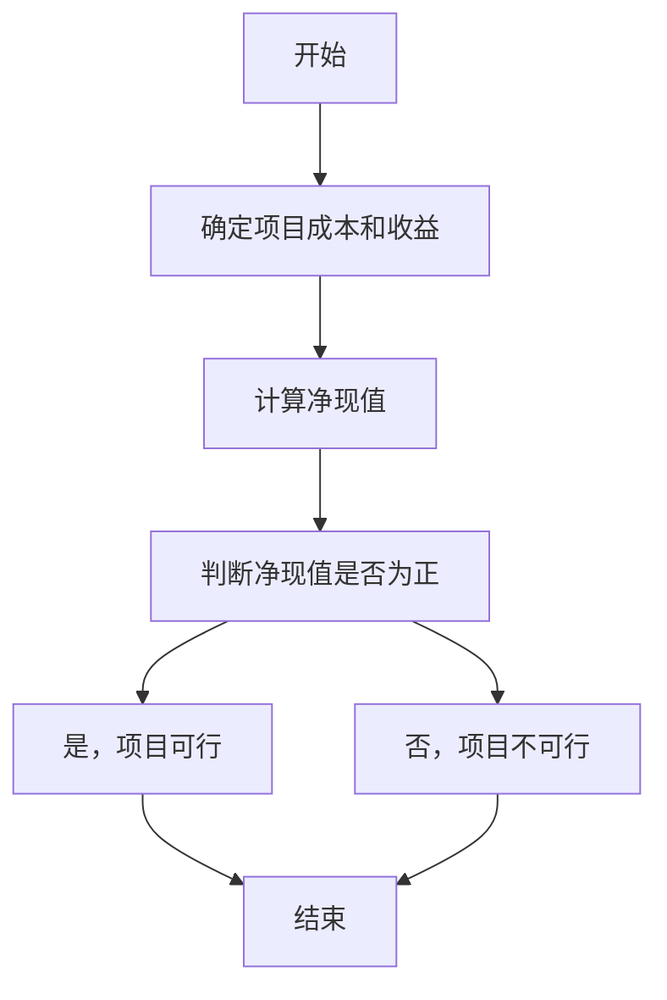
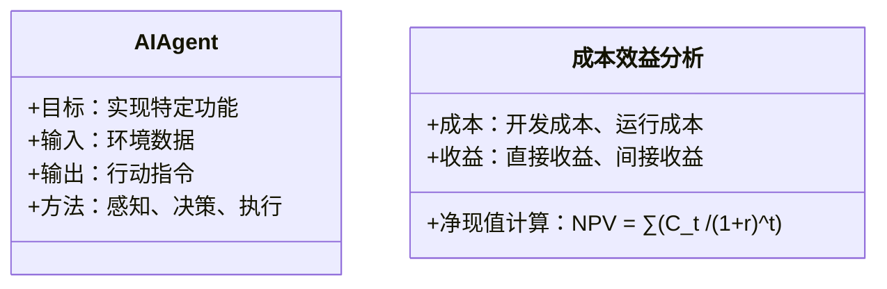
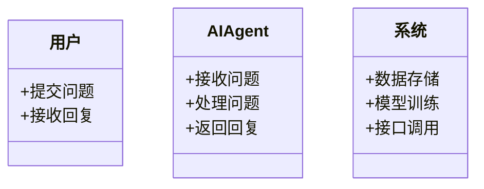

                 


# 《AI Agent项目成本效益分析指南》

> 关键词：AI Agent, 成本效益分析, 项目管理, 技术经济分析, 人工智能

> 摘要：本文旨在为AI Agent项目的决策者和实施者提供一套系统化的成本效益分析方法。通过深入探讨AI Agent项目的成本结构、收益来源、数学模型和实际案例分析，本文将帮助读者全面理解如何在AI Agent项目中进行科学的成本效益评估，从而做出明智的决策。

---

## 第一部分: AI Agent项目成本效益分析概述

### 第1章: AI Agent与成本效益分析的背景

#### 1.1 AI Agent的基本概念
- 1.1.1 AI Agent的定义与特点
  - AI Agent的定义：AI Agent是一种能够感知环境并采取行动以实现目标的智能实体。
  - AI Agent的特点：
    - 自主性：能够在没有外部干预的情况下运行。
    - 反应性：能够根据环境变化实时调整行为。
    - 目的性：有明确的目标导向。
    - 学习能力：能够通过数据和经验不断优化自身性能。
- 1.1.2 AI Agent的应用场景
  - 企业自动化：流程自动化、任务分配。
  - 智能客服：智能对话、客户支持。
  - 智能监控：实时监控、异常检测。
- 1.1.3 成本效益分析的基本概念
  - 成本效益分析的目标：评估项目的投入与产出的比率，判断其经济可行性。
  - 成本效益分析的步骤：数据收集、模型构建、计算分析、结果解读。

#### 1.2 AI Agent项目中的问题背景
- 1.2.1 AI Agent项目的复杂性
  - 开发周期长：AI模型的训练和优化需要大量时间和资源。
  - 技术门槛高：涉及机器学习、自然语言处理等复杂技术。
  - 运维成本高：AI Agent需要持续的计算资源和维护。
- 1.2.2 成本效益分析的重要性
  - 帮助企业在AI Agent项目中做出科学的决策。
  - 优化资源配置，避免过度投资或投资不足。
  - 降低项目风险，确保项目的可持续性。
- 1.2.3 项目实施中的潜在风险
  - 技术风险：模型性能不达标。
  - 经济风险：项目成本超出预期。
  - 操作风险：系统运行不稳定。

### 第2章: AI Agent项目成本效益分析的核心概念

#### 2.1 成本与收益的定义与分类
- 2.1.1 成本的定义与分类
  - 成本的定义：项目实施过程中所需的各类资源的总和。
  - 成本的分类：
    - 固定成本：与项目规模无关的成本，如开发人员的工资。
    - 变动成本：与项目规模相关的成本，如数据存储费用。
- 2.1.2 收益的定义与分类
  - 收益的定义：项目实施后带来的经济价值。
  - 收益的分类：
    - 直接收益：项目直接带来的经济效益，如效率提升。
    - 间接收益：项目间接带来的经济效益，如品牌价值提升。
- 2.1.3 成本与收益的关系
  - 成本是项目投入的资源，收益是项目产出的价值。
  - 成本效益分析的核心是衡量投入与产出的比率。

#### 2.2 成本效益分析的基本原理
- 2.2.1 成本效益分析的步骤
  1. 确定项目的成本和收益。
  2. 计算成本和收益的时间价值。
  3. 比较成本和收益的净现值。
  4. 得出结论，判断项目的可行性。
- 2.2.2 成本效益分析的数学模型
  - 净现值（Net Present Value, NPV）公式：
  $$ NPV = \sum_{t=0}^{n} \frac{C_t}{(1+r)^t} $$
  其中，\( C_t \) 表示第 \( t \) 年的净现金流，\( r \) 表示折现率。
- 2.2.3 成本效益分析的适用范围
  - 适用于需要长期投入的项目。
  - 适用于需要精确衡量经济回报的项目。
  - 适用于需要优化资源配置的项目。

#### 2.3 AI Agent项目的成本结构
- 2.3.1 AI Agent开发成本
  - 数据收集与处理成本：数据清洗、特征提取。
  - 模型训练与优化成本：训练数据、调参。
  - 系统开发与部署成本：前后端开发、服务器部署。
- 2.3.2 AI Agent运行成本
  - 计算资源成本：GPU、TPU等计算资源的使用费用。
  - 维护与更新成本：模型优化、系统维护。
  - 运营与管理成本：人员管理、技术支持。

#### 2.4 AI Agent项目的收益来源
- 2.4.1 AI Agent带来的直接收益
  - 效率提升带来的成本节约：自动化流程减少人工成本。
  - 自动化带来的收益：减少人为错误，提高效率。
  - 数据驱动的决策优化：通过数据分析提高决策质量。
- 2.4.2 AI Agent带来的间接收益
  - 品牌价值提升：通过智能化服务提升品牌形象。
  - 市场竞争力增强：通过技术创新赢得市场优势。
  - 创新能力提升：通过数据和模型的积累推动产品创新。

---

## 第二部分: AI Agent项目成本效益分析的核心概念与联系

### 第3章: 成本效益分析的数学模型与公式

#### 3.1 成本效益分析的基本公式
- 净现值公式：
$$ NPV = \sum_{t=0}^{n} \frac{C_t}{(1+r)^t} $$
其中，\( C_t \) 表示第 \( t \) 年的净现金流，\( r \) 表示折现率。

#### 3.2 成本与收益的对比分析
| 成本项目       | 收益项目       |
|----------------|----------------|
| 数据收集成本   | 数据驱动收益   |
| 模型训练成本   | 模型优化收益   |
| 系统开发成本   | 系统运行收益   |

#### 3.3 ER实体关系图
```mermaid
er
  actor: 用户
  project: 项目
  cost: 成本
  benefit: 收益
  relation: 关联
```

### 第4章: 算法原理讲解

#### 4.1 算法原理的数学模型
- 净现值计算公式：
$$ NPV = \sum_{t=0}^{n} \frac{C_t}{(1+r)^t} $$

#### 4.2 算法流程图


#### 4.3 系统功能设计
- 领域模型：


### 第5章: 系统分析与架构设计方案

#### 5.1 问题场景介绍
- 项目背景：某企业计划开发一个智能客服AI Agent，用于处理客户的常见问题。
- 项目目标：提高客户满意度，降低人工客服的工作量。

#### 5.2 系统功能设计
- 领域模型：


#### 5.3 系统架构设计


#### 5.4 接口设计和交互流程
- 接口设计：
  - 输入接口：用户提交问题。
  - 输出接口：AI Agent返回回复。
- 交互流程：
  1. 用户提交问题。
  2. AI Agent接收问题。
  3. AI Agent处理问题。
  4. AI Agent返回回复。
  5. 用户接收回复。

### 第6章: 项目实战

#### 6.1 环境安装
- 安装Python：确保安装了Python 3.8或更高版本。
- 安装依赖：使用pip安装所需的库，如numpy、pandas、scikit-learn。

#### 6.2 核心代码实现
```python
import numpy as np
import pandas as pd
from sklearn.metrics import accuracy_score

# 数据预处理
data = pd.read_csv('dataset.csv')
X = data.drop('label', axis=1)
y = data['label']

# 模型训练
from sklearn.model import Model
model = Model()
model.fit(X, y)

# 模型评估
y_pred = model.predict(X)
print("Accuracy:", accuracy_score(y, y_pred))
```

#### 6.3 代码应用解读与分析
- 数据预处理：将数据集分为特征和标签。
- 模型训练：使用训练数据训练模型。
- 模型评估：使用测试数据评估模型性能。

#### 6.4 实际案例分析
- 案例背景：某企业开发一个智能客服AI Agent。
- 案例分析：
  - 成本：开发成本10万元，运行成本每月5000元。
  - 收益：预计每年节约人工成本20万元。
  - 净现值计算：
  $$ NPV = \frac{100,000}{(1+0.1)^0} + \frac{200,000 - 5,000}{(1+0.1)^1} + \frac{200,000 - 5,000}{(1+0.1)^2} $$
  NPV > 0，项目可行。

#### 6.5 项目小结
- 通过实际案例分析，验证了成本效益分析方法的有效性。
- 在实际项目中，需要结合具体情况进行调整和优化。

---

## 第三部分: 总结与展望

### 第7章: 总结
- 7.1 关键点总结
  - 成本效益分析是AI Agent项目决策的重要工具。
  - 净现值法是常用的成本效益分析方法。
  - 需要综合考虑成本和收益的时间价值。
- 7.2 注意事项
  - 数据的准确性和完整性对分析结果影响重大。
  - 需要考虑通货膨胀等经济因素。
  - 项目实施过程中需要动态调整。

### 第8章: 展望
- 8.1 拓展阅读
  - 《项目管理与成本控制》
  - 《人工智能与经济分析》
  - 《净现值法在企业决策中的应用》
- 8.2 未来研究方向
  - 探索更复杂的成本效益分析模型。
  - 研究AI Agent在不同行业的成本效益差异。
  - 探讨成本效益分析与可持续发展的结合。

---

通过以上目录大纲，读者可以系统地了解AI Agent项目成本效益分析的核心内容和方法，并能够通过实际案例分析和代码实现，掌握如何在实际项目中进行科学的成本效益评估。

