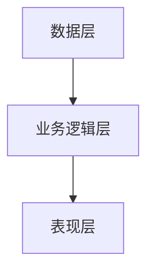

                 

# AI Agent项目的ROI分析方法

## 关键词：AI Agent, ROI分析, 投资回报率, 项目管理, 人工智能

## 摘要：本文详细探讨了AI Agent项目中如何进行投资回报率（ROI）分析，通过系统分析与架构设计，结合实际案例，提供了一套完整的ROI分析方法。文章从AI Agent的基本概念出发，逐步分析了ROI的计算方法、系统架构设计、项目实战及最佳实践，帮助读者全面掌握AI Agent项目的ROI分析技巧。

---

# 第1章: AI Agent与ROI分析概述

## 1.1 AI Agent的基本概念

### 1.1.1 AI Agent的定义
AI Agent（人工智能代理）是指能够感知环境并采取行动以实现目标的智能体。AI Agent可以是软件程序、机器人或其他智能系统，具备自主决策和执行任务的能力。

### 1.1.2 AI Agent的核心特征
AI Agent的核心特征包括：
1. **自主性**：能够在没有外部干预的情况下独立运行。
2. **反应性**：能够感知环境并实时做出反应。
3. **目标导向性**：具备明确的目标，并采取行动以实现目标。
4. **学习能力**：能够通过数据和经验不断优化自身性能。

### 1.1.3 AI Agent的应用场景
AI Agent广泛应用于多个领域，包括：
- 自动化控制（如自动驾驶）
- 智能推荐系统（如电商平台的个性化推荐）
- 联网设备管理（如智能家居）
- 机器人流程自动化（RPA）

## 1.2 ROI分析的基本概念

### 1.2.1 ROI的定义
ROI（Return on Investment）即投资回报率，是衡量投资项目收益能力的指标。ROI=（净收益/投资成本）×100%。

### 1.2.2 ROI分析的流程
1. 确定投资成本。
2. 估算项目收益。
3. 计算净收益。
4. 计算ROI值。
5. 分析结果并做出决策。

### 1.2.3 ROI在项目管理中的作用
ROI分析在项目管理中用于评估项目的经济可行性，帮助决策者判断是否值得投入资源。

## 1.3 AI Agent项目与ROI分析的关系

### 1.3.1 AI Agent项目的特点
AI Agent项目通常具有高技术门槛、高投入成本和高收益潜力的特点。

### 1.3.2 ROI分析在AI Agent项目中的重要性
通过对AI Agent项目的投资成本和收益进行分析，可以评估项目的经济可行性，为决策提供依据。

### 1.3.3 AI Agent项目ROI分析的边界与外延
- **边界**：项目的投资成本和直接收益。
- **外延**：项目的间接收益和长期影响。

---

# 第2章: AI Agent项目的ROI分析框架

## 2.1 ROI分析的核心要素

### 2.1.1 投资成本
AI Agent项目的投资成本包括开发成本、运维成本和机会成本。

### 2.1.2 收益
AI Agent项目的收益包括经营收益、无形收益和额外收益。

### 2.1.3 时间周期
时间周期影响投资的回收期和收益的时间分布。

## 2.2 AI Agent项目的成本构成

### 2.2.1 开发成本
开发成本包括硬件成本、软件开发成本和人工成本。

### 2.2.2 运维成本
运维成本包括维护成本、能源成本和人员成本。

### 2.2.3 机会成本
机会成本是指放弃其他投资可能带来的收益。

## 2.3 AI Agent项目的收益来源

### 2.3.1 经营收益
经营收益是指通过AI Agent项目直接获得的收入。

### 2.3.2 无形收益
无形收益包括品牌价值提升和技术创新带来的间接收益。

### 2.3.3 额外收益
额外收益是指通过AI Agent项目获得的意外收益。

## 2.4 ROI分析的数学模型与公式

### 2.4.1 ROI的计算公式
$$ ROI = \frac{净收益}{投资成本} \times 100\% $$

### 2.4.2 净收益的计算公式
$$ 净收益 = 总收益 - 总成本 $$

---

# 第3章: AI Agent项目的系统分析与架构设计

## 3.1 项目背景与目标

### 3.1.1 项目背景
随着AI技术的发展，AI Agent在多个领域的应用日益广泛。

### 3.1.2 项目目标
本项目旨在开发一个高效的AI Agent系统，实现特定任务的自动化。

### 3.1.3 项目范围
项目范围包括系统设计、开发、测试和部署。

## 3.2 系统功能设计

### 3.2.1 需求分析
通过分析用户需求，确定系统的功能模块。

### 3.2.2 功能模块划分
系统功能模块包括用户界面、数据处理和AI Agent核心算法。

### 3.2.3 功能流程设计
功能流程设计需要明确各个模块之间的交互流程。

## 3.3 系统架构设计

### 3.3.1 系统架构概述
系统架构采用分层设计，包括数据层、业务逻辑层和表现层。

### 3.3.2 系统架构图

### 3.3.3 模块交互设计
模块交互设计需要明确各个模块之间的接口和数据流。

## 3.4 系统接口设计

### 3.4.1 API接口定义
API接口包括数据接口、业务逻辑接口和外部服务接口。

### 3.4.2 接口调用流程
接口调用流程需要明确接口的调用顺序和参数传递方式。

### 3.4.3 接口安全
接口安全需要考虑身份认证、权限控制和数据加密。

## 3.5 系统交互设计

### 3.5.1 交互流程设计
交互流程设计需要明确用户与系统之间的交互步骤。

### 3.5.2 交互界面设计
交互界面设计需要考虑用户体验，提供直观的操作界面。

---

# 第4章: AI Agent项目实战

## 4.1 环境安装

### 4.1.1 系统要求
系统要求包括操作系统、处理器、内存和存储空间。

### 4.1.2 安装步骤
安装步骤包括安装开发工具、安装依赖库和配置环境变量。

## 4.2 系统核心实现

### 4.2.1 核心算法实现
核心算法实现包括感知算法、决策算法和执行算法。

### 4.2.2 代码实现
代码实现需要提供具体的Python代码示例。

## 4.3 代码应用解读与分析

### 4.3.1 代码功能解读
代码功能解读需要分析代码的结构和功能。

### 4.3.2 代码优化建议
代码优化建议包括性能优化和代码结构优化。

## 4.4 案例分析

### 4.4.1 案例背景
案例背景需要说明案例的具体应用场景。

### 4.4.2 案例分析
案例分析需要详细分析案例的 ROI 计算过程。

## 4.5 项目小结

### 4.5.1 项目总结
项目总结需要回顾项目的整体实施过程。

### 4.5.2 经验教训
经验教训需要总结项目实施过程中遇到的问题及解决方案。

---

# 第5章: 最佳实践与注意事项

## 5.1 最佳实践

### 5.1.1 ROI分析的注意事项
ROI分析需要考虑投资成本、收益和时间周期。

### 5.1.2 系统设计的注意事项
系统设计需要考虑可扩展性、可维护性和可测试性。

## 5.2 小结

### 5.2.1 项目总结
项目总结需要回顾项目的整体实施过程。

### 5.2.2 展望
展望未来，AI Agent技术的应用前景广阔，ROI分析将变得更加重要。

## 5.3 注意事项

### 5.3.1 ROI分析中的潜在风险
ROI分析中的潜在风险包括收益不确定性和成本超支。

### 5.3.2 系统设计中的常见问题
系统设计中的常见问题包括需求变更和性能瓶颈。

---

# 结语

通过本文的详细讲解，读者可以全面掌握AI Agent项目的ROI分析方法。从基本概念到系统设计，再到项目实战，每一步都进行了深入的分析和解读。希望本文能够为读者在AI Agent项目的ROI分析中提供有价值的参考和指导。

---

# 拓展阅读

- 《人工智能系统设计》
- 《项目管理与投资决策》
- 《ROI分析方法论》

---

通过以上结构，您可以逐步展开每一章节的具体内容，确保文章逻辑清晰、内容详实，帮助读者系统地掌握AI Agent项目的ROI分析方法。

