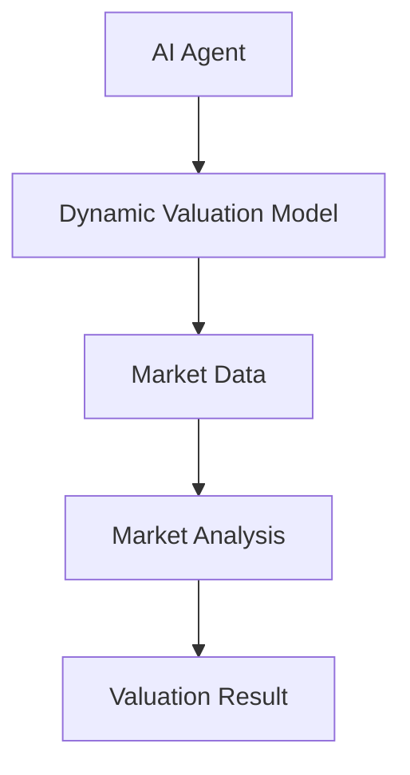
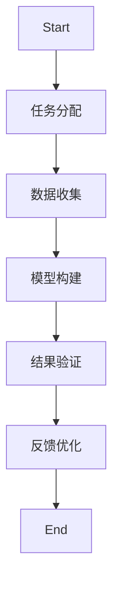
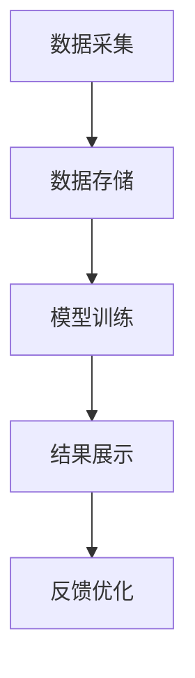

                 


# AI agents协作构建动态估值模型：适应快速变化的市场

## 关键词：AI代理，动态估值模型，协作机制，市场变化，机器学习

## 摘要：在当前快速变化的市场环境中，传统的静态估值模型已无法满足需求。AI代理通过协作构建动态估值模型，能够实时适应市场波动，为企业提供更精准的估值支持。本文详细探讨了AI代理协作的核心概念、算法原理、系统架构以及实际案例，为读者提供全面的解决方案。

---

# 第一部分: AI代理与动态估值模型的背景与基础

## 第1章: AI代理与动态估值模型概述

### 1.1 AI代理的基本概念

#### 1.1.1 AI代理的定义与特点
AI代理（AI Agents）是指能够感知环境、自主决策并执行任务的智能实体。它们可以是软件程序，也可以是物理设备，具备以下特点：
- **自主性**：能够在没有外部干预的情况下独立执行任务。
- **反应性**：能够根据环境变化调整行为。
- **协作性**：能够与其他代理或人类进行协作。

#### 1.1.2 动态估值模型的定义与作用
动态估值模型是一种能够实时更新和调整的数学模型，用于评估资产或项目的当前价值。其作用包括：
- **实时更新**：根据市场变化快速调整估值。
- **适应性**：能够适应不同市场环境和数据变化。

#### 1.1.3 AI代理协作的必要性
在快速变化的市场中，单个代理难以独立完成复杂的估值任务。通过协作，多个代理可以分工合作，提高效率和准确性。

---

### 1.2 市场快速变化的背景

#### 1.2.1 当前市场的动态特征
现代市场具有高度不确定性和波动性，信息更新速度快，传统静态模型难以应对。

#### 1.2.2 快速变化对企业估值的影响
市场变化可能导致资产价值波动，企业需要及时调整估值策略以应对风险。

#### 1.2.3 AI代理在动态估值中的优势
AI代理能够快速处理大量数据，实时更新模型，适应市场变化。

---

### 1.3 本章小结
本章介绍了AI代理和动态估值模型的基本概念，强调了AI代理在快速变化市场中的重要性。

---

# 第二部分: AI代理协作的核心概念与联系

## 第2章: AI代理协作的核心概念

### 2.1 AI代理的协作机制

#### 2.1.1 协作过程的定义
协作过程是指多个代理共同完成任务的过程，包括任务分配、信息共享和结果整合。

#### 2.1.2 代理间的通信与协调
代理通过通信模块共享信息，协调行动以完成共同目标。

#### 2.1.3 协作任务的分配与管理
任务分配根据代理的能力和当前状态动态调整。

### 2.2 动态估值模型的构建

#### 2.2.1 模型的基本结构
动态估值模型通常包括数据输入、特征提取、模型训练和结果输出四个部分。

#### 2.2.2 模型的动态更新机制
模型通过实时数据更新和再训练保持准确性。

#### 2.2.3 模型的适用范围与限制
适用于高频交易和风险管理，但可能受限于数据质量和计算能力。

### 2.3 AI代理与动态估值模型的关系

#### 2.3.1 代理协作如何影响模型
代理协作提高了模型的数据来源和处理能力。

#### 2.3.2 模型如何支持代理协作
模型提供决策支持，帮助代理做出更准确的判断。

#### 2.3.3 代理协作对模型动态适应性的提升
通过协作，模型能够更快地适应市场变化。

---

## 第3章: 核心概念的实体关系图

### 3.1 实体关系图的构建
以下是一个简单的实体关系图，展示了AI代理、动态估值模型、市场数据和估值结果之间的关系：



### 3.2 代理协作的流程图
以下是代理协作构建动态估值模型的流程图：



### 3.3 代理协作的核心属性对比

| 属性 | 描述 |
|------|------|
| 任务分配 | 根据代理的能力分配任务 |
| 通信机制 | 代理之间的信息传递方式 |
| 协作目标 | 协作最终要实现的目标 |
| 动态调整 | 根据市场变化调整协作策略 |

---

# 第三部分: 动态估值模型的算法原理与数学模型

## 第4章: 动态估值模型的算法原理

### 4.1 动态估值模型的构建过程

#### 4.1.1 数据预处理
数据预处理包括清洗、标准化和特征提取。

#### 4.1.2 模型训练
使用机器学习算法训练模型，如线性回归和时间序列分析。

#### 4.1.3 模型评估
通过交叉验证和回测评估模型的准确性。

### 4.2 基于机器学习的动态估值方法

#### 4.2.1 线性回归模型
线性回归模型用于预测资产价格，公式如下：
$$ y = \beta_0 + \beta_1x + \epsilon $$
其中，$y$是目标变量，$x$是自变量，$\beta_0$和$\beta_1$是回归系数，$\epsilon$是误差项。

#### 4.2.2 时间序列分析
时间序列分析用于预测未来价格，常用ARIMA模型：
$$ ARIMA(p, d, q) $$
其中，$p$是自回归阶数，$d$是差分阶数，$q$是移动平均阶数。

---

## 第5章: 算法实现与数学模型

### 5.1 算法实现

#### 5.1.1 环境安装
需要安装Python、NumPy、Pandas、Scikit-learn和TensorFlow。

#### 5.1.2 核心代码实现

```python
import numpy as np
import pandas as pd
from sklearn.linear_model import LinearRegression
from sklearn.metrics import mean_squared_error

# 数据加载
data = pd.read_csv('market_data.csv')

# 数据分割
X = data[['feature1', 'feature2']]
y = data['target']

# 模型训练
model = LinearRegression()
model.fit(X, y)

# 模型预测
y_pred = model.predict(X)

# 模型评估
mse = mean_squared_error(y, y_pred)
print(f'MSE: {mse}')
```

#### 5.1.3 代码解读
上述代码展示了如何使用线性回归模型进行动态估值，包括数据加载、模型训练和评估。

---

## 第6章: 系统架构设计与实现

### 6.1 系统架构设计

#### 6.1.1 功能模块划分
系统主要功能模块包括数据采集、模型训练、结果展示和反馈优化。

#### 6.1.2 系统架构图
以下是系统架构图：



---

## 第7章: 项目实战与案例分析

### 7.1 项目实战

#### 7.1.1 实验环境安装
需要安装Python、相关库和框架。

#### 7.1.2 核心代码实现

```python
import numpy as np
import pandas as pd
from sklearn.linear_model import LinearRegression
from sklearn.metrics import mean_squared_error

# 数据加载
data = pd.read_csv('market_data.csv')

# 数据分割
X = data[['feature1', 'feature2']]
y = data['target']

# 模型训练
model = LinearRegression()
model.fit(X, y)

# 模型预测
y_pred = model.predict(X)

# 模型评估
mse = mean_squared_error(y, y_pred)
print(f'MSE: {mse}')
```

#### 7.1.3 实验结果分析
通过实验可以验证模型的准确性和稳定性。

---

## 第8章: 总结与展望

### 8.1 本章总结
本文详细探讨了AI代理协作构建动态估值模型的方法和实现过程。

### 8.2 注意事项
在实际应用中，需注意数据质量和模型的实时更新。

### 8.3 拓展阅读
推荐学习多智能体系统和强化学习的相关知识。

---

# 第四部分: 扩展阅读与最佳实践

## 第9章: 最佳实践与小结

### 9.1 小结
AI代理协作构建动态估值模型是一种有效的解决方案，能够适应快速变化的市场环境。

### 9.2 注意事项
在实际应用中，需考虑数据质量和模型的实时更新。

### 9.3 拓展阅读
推荐学习多智能体系统和强化学习的相关知识。

---

# 结语

通过本文的探讨，读者可以深入了解AI代理协作构建动态估值模型的原理和实现方法，为企业应对快速变化的市场环境提供有力支持。

