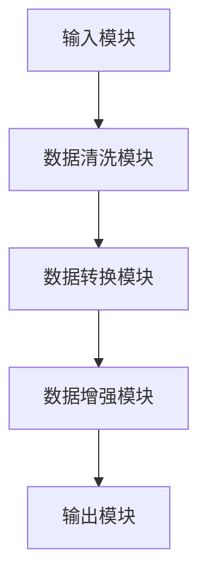

                 


# AI模型训练数据收集与处理技巧

## 关键词：AI模型训练、数据收集、数据处理、数据清洗、特征工程、数据增强

## 摘要：  
AI模型的性能高度依赖于训练数据的质量和数量。本文详细探讨了AI模型训练数据收集与处理的关键技巧，包括数据预处理、特征工程和数据增强的核心概念、算法原理、系统架构以及实战项目案例。通过本篇文章，读者可以掌握从数据收集到处理的完整流程，提升AI模型的训练效果。

---

# 第1章: 数据收集与处理的背景与重要性

## 1.1 数据在AI模型训练中的核心地位

### 1.1.1 数据的重要性与作用  
AI模型的性能高度依赖于训练数据的质量和数量。高质量的数据能够显著提升模型的准确性和泛化能力，而低质量或不完整的数据可能导致模型性能下降甚至失效。数据是AI模型的“燃料”，决定了模型的上限。

### 1.1.2 数据质量对模型性能的影响  
数据质量直接影响模型训练效果：  
- **完整性**：缺失数据会导致模型无法学习到完整的特征关系。  
- **一致性**：数据格式不一致可能导致训练过程中的错误或低效。  
- **准确性**：错误或噪声数据会误导模型学习，降低预测准确性。  
- **多样性**：缺乏多样性的数据可能导致模型过拟合或欠拟合。  

### 1.1.3 数据收集的挑战与解决方案  
数据收集面临以下挑战：  
- 数据量不足或过剩：需要通过数据增强或采样技术解决。  
- 数据标注成本高：可以利用自动化工具或 crowdsourcing 平台降低标注成本。  
- 数据隐私与合规性：需遵守数据隐私法规（如GDPR），避免数据泄露风险。  

---

## 1.2 数据处理的基本概念

### 1.2.1 数据预处理的概念  
数据预处理是指在模型训练之前，对数据进行清洗、转换和标准化等操作，以提高数据质量和一致性。  

### 1.2.2 数据清洗的必要性  
数据清洗是数据预处理的核心步骤，主要处理以下问题：  
- **缺失值**：删除或填充缺失值。  
- **噪声数据**：去除异常值或通过平滑技术降低噪声影响。  
- **重复数据**：去除重复样本，避免模型过拟合。  

### 1.2.3 数据增强的定义与作用  
数据增强是指通过技术手段扩展训练数据集，增加数据的多样性和代表性。例如，图像数据增强可以通过旋转、翻转、裁剪等方式生成新的样本。

---

## 1.3 数据收集的常见方法

### 1.3.1 数据标注的基本流程  
数据标注是将数据转换为可训练格式的过程：  
1. 数据收集：从数据库、API或爬虫获取数据。  
2. 数据清洗：去除噪声和无效数据。  
3. 数据标注：为文本、图像或语音数据添加标签。  

### 1.3.2 数据清洗的步骤与工具  
常用数据清洗工具包括：  
- **Pandas**：用于数据清洗和转换。  
- **Python的Scikit-learn**：提供数据预处理模块。  
- **Datawig**：用于自动数据清洗和标注。  

### 1.3.3 数据增强的技巧与实践  
数据增强技巧包括：  
- **文本增强**：同义词替换、句式改写。  
- **图像增强**：随机裁剪、旋转、翻转。  
- **语音增强**：添加噪声、改变音调。  

---

## 1.4 数据质量评估与优化

### 1.4.1 数据质量评估指标  
数据质量评估指标包括：  
- 数据完整性：检查数据是否缺失。  
- 数据一致性：确保数据格式统一。  
- 数据准确性：验证数据是否真实反映实际场景。  

### 1.4.2 数据清洗的具体步骤  
数据清洗步骤：  
1. 识别缺失值：使用Pandas的`isnull()`函数。  
2. 去除异常值：使用箱线图或Z-score方法。  
3. 处理重复数据：使用`duplicated()`函数。  

### 1.4.3 数据增强的实际案例  
以图像数据增强为例：  
1. 使用OpenCV库对图像进行随机旋转和翻转。  
2. 应用`cv2.flip()`函数实现图像翻转。  

---

## 1.5 本章小结  
本章介绍了数据在AI模型训练中的重要性，数据质量对模型性能的影响，以及数据收集和处理的基本概念。通过数据预处理和数据增强，可以显著提升数据质量和多样性，为模型训练打下坚实基础。

---

# 第2章: 数据预处理的核心技术与实现

## 2.1 数据预处理的定义与目标

### 2.1.1 数据预处理的定义  
数据预处理是通过清洗、转换和标准化等操作，将原始数据转化为适合模型训练的格式。

### 2.1.2 数据预处理的目标  
- 提高数据质量。  
- 统一数据格式。  
- 提取有用特征。  

---

## 2.2 数据预处理的关键步骤

### 2.2.1 数据清洗  
数据清洗步骤包括：  
1. 识别缺失值：`data.isnull().sum()`。  
2. 删除异常值：使用箱线图识别异常值。  
3. 处理重复数据：`data.drop_duplicates()`。  

### 2.2.2 数据转换  
数据转换包括：  
- 文本分词：使用`nltk.word_tokenize()`。  
- 图像归一化：将图像缩放到统一尺寸。  

### 2.2.3 数据标准化  
数据标准化方法：  
- **最小-最大归一化**：将数据缩放到[0,1]范围。  
- **Z-score标准化**：消除数据均值，使标准差为1。  

---

## 2.3 数据预处理的工具与技术

### 2.3.1 常用数据处理工具  
- **Pandas**：数据清洗和转换。  
- **Scikit-learn**：数据预处理模块。  
- **TensorFlow/PyTorch**：内置数据处理工具。  

### 2.3.2 数据预处理技术的选择  
选择数据预处理技术时，需考虑：  
- 数据类型：文本、图像、语音。  
- 数据规模：小数据集适合复杂预处理，大数据集适合简单预处理。  

### 2.3.3 数据预处理的自动化工具  
- **Datawig**：自动化数据清洗工具。  
- **Great Expectations**：数据质量验证工具。  

---

## 2.4 数据预处理的代码实现

### 2.4.1 数据清洗的Python代码实现  
```python
import pandas as pd

# 加载数据
data = pd.read_csv('raw_data.csv')

# 检查缺失值
print(data.isnull().sum())

# 删除缺失值
data.dropna(inplace=True)

# 去除异常值
Q1 = data.quantile(0.25)
Q3 = data.quantile(0.75)
IQR = Q3 - Q1
data = data[~((data < (Q1 - 1.5 * IQR)) | (data > (Q3 + 1.5 * IQR))).any(axis=1)]
```

### 2.4.2 数据转换的Python代码实现  
```python
from sklearn.preprocessing import StandardScaler

# 标准化处理
scaler = StandardScaler()
data_normalized = scaler.fit_transform(data)
```

---

## 2.5 数据预处理的系统架构与设计

### 2.5.1 数据预处理系统的总体架构  
- **输入模块**：接收原始数据。  
- **数据清洗模块**：处理缺失值和异常值。  
- **数据转换模块**：进行数据格式转换。  
- **输出模块**：输出处理后的数据。  

### 2.5.2 数据预处理系统的实现  
1. 数据输入：加载原始数据集。  
2. 数据清洗：识别并处理缺失值、异常值。  
3. 数据转换：标准化或归一化处理。  
4. 数据输出：保存处理后的数据集。  

---

## 2.6 本章小结  
本章详细讲解了数据预处理的核心技术与实现，包括数据清洗、数据转换和数据标准化的具体步骤，并通过Python代码示例展示了如何实现这些操作。

---

# 第3章: 数据增强的技巧与实践

## 3.1 数据增强的定义与目标

### 3.1.1 数据增强的定义  
数据增强是指通过技术手段生成更多样化的数据样本，以增加训练数据的多样性。  

### 3.1.2 数据增强的目标  
- 提高模型的泛化能力。  
- 防止模型过拟合。  
- 降低数据不足的风险。  

---

## 3.2 数据增强的核心技术

### 3.2.1 图像数据增强  
常用图像数据增强技术：  
- **旋转**：使用OpenCV库实现图像旋转。  
- **翻转**：水平或垂直翻转图像。  
- **裁剪**：随机裁剪图像生成新样本。  

### 3.2.2 文本数据增强  
文本数据增强技巧：  
- **同义词替换**：使用WordNet进行同义词替换。  
- **句式改写**：通过句式重组生成新文本。  

### 3.2.3 语音数据增强  
语音数据增强方法：  
- **添加噪声**：在语音信号中加入背景噪声。  
- **改变音调**：通过调整采样率改变音调。  

---

## 3.3 数据增强的代码实现

### 3.3.1 图像数据增强的Python代码  
```python
import cv2

# 读取图像
img = cv2.imread('image.jpg')

# 图像旋转
rotated_img = cv2.rotate(img, cv2.ROTATE_90_CLOCKWISE)

# 图像翻转
flipped_img = cv2.flip(img, 1)
```

### 3.3.2 文本数据增强的Python代码  
```python
from wordnet import WordNet

# 同义词替换
text = "The cat is on the mat."
synonyms = WordNet(text).most_common_synonyms()
augmented_text = synonyms[0]
```

---

## 3.4 数据增强的系统架构与设计

### 3.4.1 数据增强系统的总体架构  
- **输入模块**：接收原始数据。  
- **数据增强模块**：根据数据类型选择增强方法。  
- **输出模块**：保存增强后的数据。  

### 3.4.2 数据增强系统的实现  
1. 数据输入：加载原始数据集。  
2. 数据增强：根据数据类型选择合适的增强方法。  
3. 数据输出：保存增强后的数据集。  

---

## 3.5 本章小结  
本章介绍了数据增强的核心技术与实践，包括图像、文本和语音数据增强的具体方法，并通过代码示例展示了如何实现这些增强操作。

---

# 第4章: 数据处理的系统架构与设计

## 4.1 数据处理系统的总体架构

### 4.1.1 系统模块划分  
- 数据清洗模块：处理缺失值和异常值。  
- 数据转换模块：进行数据格式转换。  
- 数据增强模块：生成更多样化的数据样本。  

### 4.1.2 系统功能设计  
- 数据输入：支持多种数据格式。  
- 数据处理：清洗、转换和增强数据。  
- 数据输出：保存处理后的数据集。  

### 4.1.3 系统架构图  


---

## 4.2 数据处理系统的实现

### 4.2.1 系统功能实现  
1. 数据输入：加载原始数据集。  
2. 数据清洗：识别并处理缺失值、异常值。  
3. 数据转换：进行标准化或归一化处理。  
4. 数据增强：根据数据类型选择合适的增强方法。  
5. 数据输出：保存处理后的数据集。  

### 4.2.2 系统接口设计  
- 数据输入接口：`load_data()`。  
- 数据处理接口：`process_data()`。  
- 数据输出接口：`save_data()`。  

### 4.2.3 系统交互流程  
1. 用户调用`load_data()`加载数据。  
2. 数据清洗模块处理缺失值和异常值。  
3. 数据转换模块进行标准化或归一化。  
4. 数据增强模块生成更多样化的数据样本。  
5. 用户调用`save_data()`保存处理后的数据集。  

---

## 4.3 数据处理系统的优化与扩展

### 4.3.1 系统优化  
- 并行处理：使用多线程加速数据处理。  
- 自动化标注：利用AI模型辅助数据标注。  

### 4.3.2 系统扩展  
- 支持多种数据格式：文本、图像、语音。  
- 支持多种数据增强方法：文本同义词替换、图像旋转、语音降噪。  

---

## 4.4 本章小结  
本章详细讲解了数据处理系统的总体架构与实现，包括系统模块划分、功能设计、接口设计和交互流程，并通过Mermaid图展示了系统的架构设计。

---

# 第5章: 项目实战——电商评论数据处理

## 5.1 项目背景与目标

### 5.1.1 项目背景  
电商评论数据处理是NLP领域的重要任务，目标是通过数据预处理提升评论分类模型的性能。

### 5.1.2 项目目标  
- 清洗电商评论数据。  
- 提取有用特征。  
- 增强数据集。  

---

## 5.2 项目环境与工具安装

### 5.2.1 项目环境  
- **操作系统**：Windows/Linux/MacOS。  
- **编程语言**：Python 3.8及以上版本。  
- **开发工具**：Jupyter Notebook或VS Code。  

### 5.2.2 工具安装  
```bash
pip install pandas
pip install nltk
pip install scikit-learn
pip install tensorflow
```

---

## 5.3 项目核心实现

### 5.3.1 数据清洗  
```python
import pandas as pd
from sklearn.preprocessing import StandardScaler

# 加载数据
data = pd.read_csv('ecomment.csv')

# 检查缺失值
print(data.isnull().sum())

# 删除缺失值
data.dropna(inplace=True)

# 去除异常值
Q1 = data.quantile(0.25)
Q3 = data.quantile(0.75)
IQR = Q3 - Q1
data = data[~((data < (Q1 - 1.5 * IQR)) | (data > (Q3 + 1.5 * IQR))).any(axis=1)]
```

### 5.3.2 特征提取  
```python
from sklearn.feature_extraction.text import TfidfVectorizer

# 提取文本特征
vectorizer = TfidfVectorizer()
tfidf = vectorizer.fit_transform(data['comment'])
```

### 5.3.3 数据增强  
```python
from wordnet import WordNet

# 同义词替换
text = "The cat is on the mat."
synonyms = WordNet(text).most_common_synonyms()
augmented_text = synonyms[0]
```

---

## 5.4 项目总结与经验分享

### 5.4.1 项目总结  
通过本项目，我们掌握了电商评论数据处理的关键技巧，包括数据清洗、特征提取和数据增强的具体实现。

### 5.4.2 经验分享  
- 数据清洗是数据处理的基础，需仔细处理缺失值和异常值。  
- 特征提取是模型训练的核心，需选择合适的特征提取方法。  
- 数据增强是提升模型性能的重要手段，需根据数据类型选择合适的方法。  

---

## 5.5 本章小结  
本章通过电商评论数据处理项目，展示了数据收集与处理的具体实现，帮助读者掌握数据处理的实际操作技巧。

---

# 第6章: 最佳实践与小结

## 6.1 数据收集与处理中的注意事项

### 6.1.1 数据收集  
- 确保数据来源合法合规。  
- 避免数据冗余和重复。  

### 6.1.2 数据处理  
- 数据清洗需结合业务需求。  
- 数据增强需保持数据的真实性。  

---

## 6.2 数据处理的最佳实践

### 6.2.1 数据标注  
- 使用自动化工具降低标注成本。  
- 定期验证标注质量。  

### 6.2.2 数据增强  
- 根据模型需求选择增强方法。  
- 避免过度增强导致数据失真。  

---

## 6.3 项目小结与展望

### 6.3.1 项目小结  
通过本文的讲解与实战，我们掌握了AI模型训练数据收集与处理的关键技巧，包括数据预处理、特征工程和数据增强的具体实现。

### 6.3.2 项目展望  
未来，随着AI技术的发展，数据处理技术将更加智能化和自动化，建议读者持续关注相关技术动态，不断提升自己的技术能力。

---

# 总结

通过本文的系统讲解与实战案例，读者可以全面掌握AI模型训练数据收集与处理的关键技巧，包括数据预处理、特征工程和数据增强的具体实现。希望本文能为读者在AI模型训练数据处理方面提供有价值的指导和启发。

